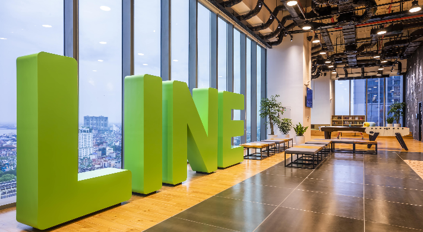
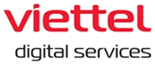
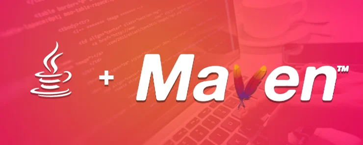
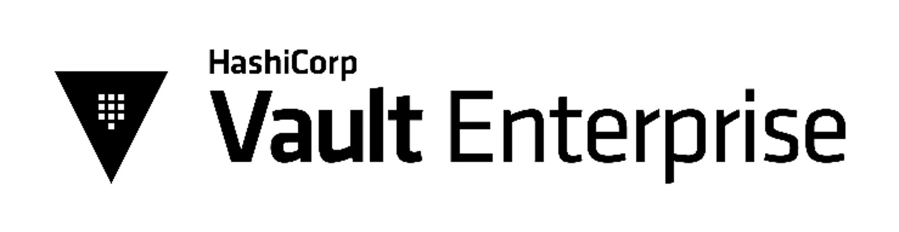
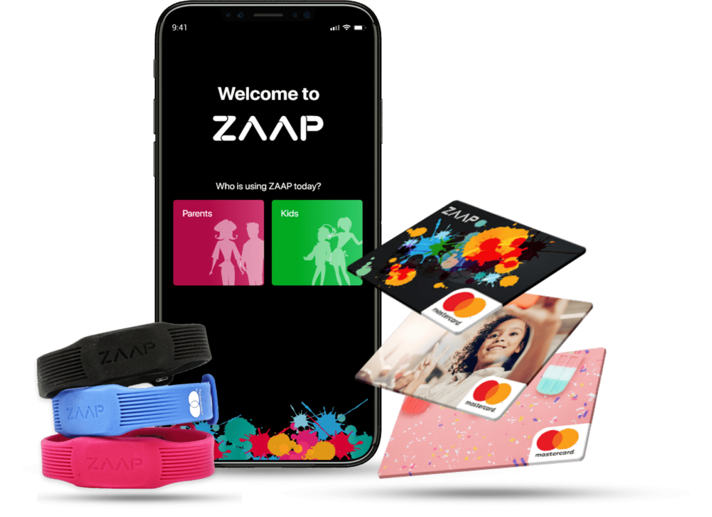
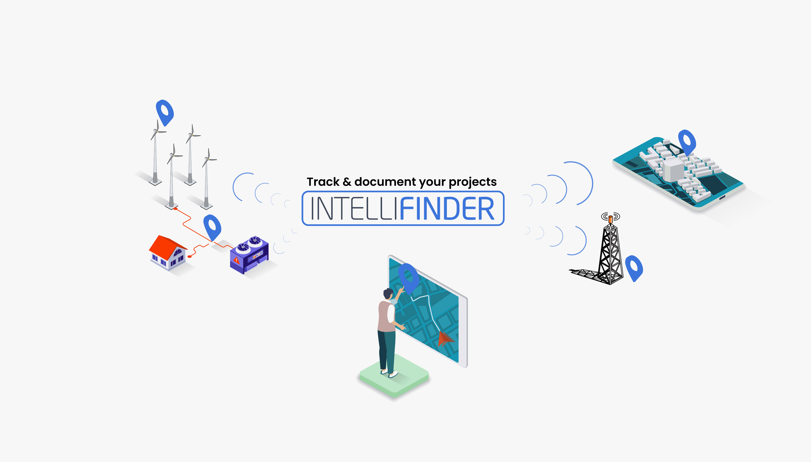
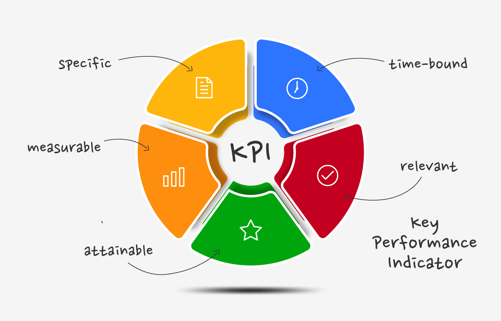
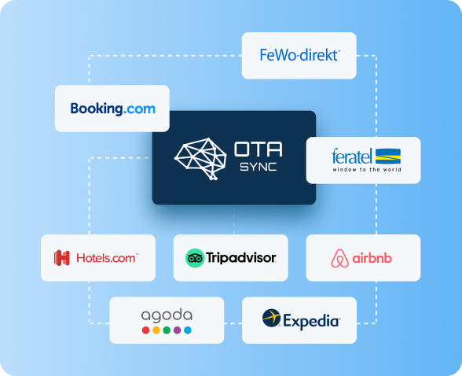
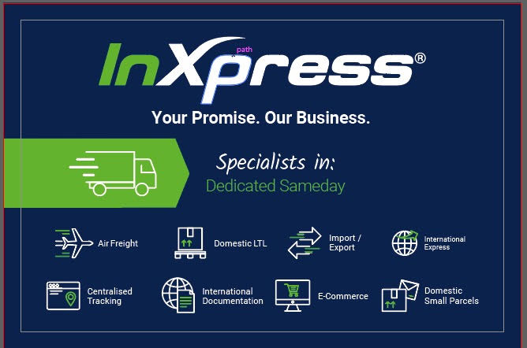

# Lê Văn Thành

      <a target='_blank' class="get-started" href="/thanhlv-vi-cv.pdf">
        Download PDF
        <svg
          class="icon"
          xmlns="http://www.w3.org/2000/svg"
          width="10"
          height="10"
          viewBox="0 0 24 24"
        >
          <path
            d="M13.025 1l-2.847 2.828 6.176 6.176h-16.354v3.992h16.354l-6.176 6.176 2.847 2.828 10.975-11z"
          />
        </svg>
      </a>
    

## Thông tin liên lạc
**Address:** Thôn 3, Song Phưương, Hoài Đức, Hà Nội.  
**Phone:** 096 621 1618  | +84 96 621 1618  
**Email:** lethanh9398@gmail.com  
**LinkedIn:** [linkedin.com/in/thanhlv-com](https://www.linkedin.com/in/thanhlv-com)  
**Facebook:** [www.facebook.com/lethanh9398](https://www.facebook.com/lethanh9398)  
**Website:** [thanhlv.com](https://thanhlv.com)  

## Mục Tiêu Nghề Nghiệp.

1. Là một lập trình viên full-stack đầy nhiệt huyết và có kinh nghiệm 6 năm trong việc phát triển các ứng dụng web đa dạng, sử dụng nhiều công nghệ khác nhau. 
2. Có nền tảng vững chắc trong việc hợp tác chặt chẽ với các bộ phận kinh doanh, từng đảm nhận nhiều vai trò quan trọng trong việc phát triển hệ thống phần mềm cho doanh nghiệp. 
3. Thành thạo Java và luôn tìm tòi, học hỏi. Mong muốn áp dụng các kiến thức và kỹ năng của mình vào dự án sáng tạo tại một công ty năng động.

### Mục Tiêu bản Thân Trong 3 Năm Tới.

1. Nâng cao kỹ năng thiết kế hệ thống.
2. Nâng cao kỹ năng phát triển phần mềm, tối ưu hiệu suất ứng dụng.

## Kinh nghiệm làm việc
Với 6 năm kinh nghiệm phong phú, tôi đã thu thập được một kho tàng kiến thức sâu rộng thông qua việc làm việc trên một loạt các dự án thuộc nhiều lĩnh vực khác nhau.
### [Line Technology VietNam](https://vietnamdevcenter.linecorp.com/en) & [LINE NEXT Inc](https://www.linkedin.com/company/line-us-corporation/mycompany/) | Senior Software Engineer

#### **09-2021 – Hiện tại** | **[Line Explorer Blockchain](https://explorer.blockchain.line.me/finschia)**

Blockchain của Line không chỉ đơn giản là một **Blockchain as a Service** mà còn là một nguồn lực đa dạng với chain được tối ưu hóa để phục vụ các mục đích cụ thể như NFT, Tài Chính, và những mục đích đặc biệt khác. Explorer được tạo ra để giúp người dùng khám phá một cách dễ dàng và chi tiết dữ liệu đang được lưu trữ trên blockchain.
- **Nghiệm vụ** :
  1. Phát triển các API mạnh mẽ cho Explorer, đảm bảo tính tương thích và khả năng mở rộng.
  2. Viết các Unit test và integration test để đảm bảo tính ổn định và độ tin cậy của hệ thống.
  3. Tham gia chặt chẽ trong cuộc thảo luận với các đội sản xuất và kỹ thuật để định hình chi tiết về specification.
  4. Tối ưu code, database để đạt được hiệu suất tối ưu và sự linh hoạt trong triển khai.

- **Công nghệ**: [Kotlin](https://kotlinlang.org/), [Kotlin coroutines](https://kotlinlang.org/docs/coroutines-overview.html), [Spring boot](https://spring.io/projects/spring-boot), [gRPC](https://grpc.io/), [Armeria](https://armeria.dev/)
- **Thành quả**:
  1. Đạt đến 100% coverage code logic, và từ 50 - 70% cấu hình trong dự án, đảm bảo sự toàn vẹn và khả năng tùy chỉnh cao.
  2. Tăng cường hiệu suất ứng dụng để mang lại trải nghiệm người dùng tốt nhất có thể.
  3. Cung cấp một hiểu biết sâu sắc hơn về blockchain, từ đó nâng cao kỹ năng và chuyên môn.
:::info Cảm nhận cá nhân về dự án
1. Một sự kết hợp tuyệt vời giữa khả năng linh hoạt và hiệu suất.
:::

#### **09-2021 – Hiện tại** | **Blockchain framework**

Hệ thống blockchain framework sẽ đóng vai trò quan trọng, là nền tảng chủ lực cho mọi yêu cầu đọc dữ liệu trên blockchain. Ứng dụng này không chỉ giúp đọc và lưu trữ dữ liệu một cách hiệu quả, mà còn tạo điều kiện thuận lợi cho bên thứ ba thực hiện truy vấn với hiệu suất cao mà không làm ảnh hưởng đến blockchain trực tiếp.
- **Nghiệm vụ** :
  1. Thực hiện design proto Grpc để đảm bảo tương tác mạnh mẽ và linh hoạt.
  2. Phát triển các API gRPC, tận dụng sức mạnh của Kotlin, Kotlin Coroutines và Spring Boot.
  3. Phân tích dữ liệu lớn để xây dựng cơ sở dữ liệu đảm bảo hiệu suất và khả năng mở rộng.
  4. Thực hiện các buổi thảo luận chặt chẽ với Production Planner và Spec Team để định hình specification.
  5. Viết và triển khai các Unit test và integration test để đảm bảo tính ổn định và tương thích.

- **Công nghệ**: [Kotlin](https://kotlinlang.org/), [Kotlin coroutines](https://kotlinlang.org/docs/coroutines-overview.html), [Spring boot](https://spring.io/projects/spring-boot), [gRPC](https://grpc.io/), [Armeria](https://armeria.dev/)
- **Thành quả**:
  1. Đạt 100% độ bao phủ code logic trong cả Unit Test và Integration Test, đảm bảo tính đáng tin cậy của hệ thống.
  2. Tối ưu hóa hiệu suất ứng dụng, giúp tăng cường trải nghiệm người dùng.
  3. Thiết kế và tối ưu lại cơ sở dữ liệu để đạt được hiệu suất cao trong môi trường thách thức.
  4. Đánh giá và đề xuất những ý tưởng sáng tạo mới, đóng góp vào sự đổi mới và hiệu quả của dự án.

:::info Cảm nhận cá nhân về dự án
1. Một sự hòa quyện của sức mạnh kỹ thuật và sự sáng tạo.
:::

#### **10-2022 – Hiện tại** | **Dosi APP**

Sau thành công phát triển nền tảng ví giao dịch phi tập trung Dosi Vault, chúng tôi phát triển Dosi App base từ Dosi Vault. Dosi App trở Thành super App, đưa ra trải nghiệm độc đáo và tất cả các dịch vụ đều kết nối thông qua nền tảng này.
- **Nghiệm vụ** :
  1. Fork Dosi Vault, tận dụng và phát triển các tính năng đặc sắc dành riêng cho Dosi Vault.
  2. Chịu trách nhiệm trong việc thiết lập các Job Jenkins đặc biệt cho việc tự động hóa quy trình xây dựng ứng dụng trên cả hai nền tảng Android và iOS.
  3. Chịu trách nghiệm tạo và quản lý Keystore để xây dựng AOS, tạo và quản lý Certificates, Profiles và Identifiers sử dụng để xây dựng IOS.
  4. Đóng góp tích cực và tham gia sâu rộng trong các buổi họp thảo luận cùng Production Planner và Spec Team dưới sự hướng dẫn của CTO, nhằm mục tiêu định hình và đề xuất các tính năng innovative cho ứng dụng Dosi App.
  5. Nâng cấp **React Native** từ phiên bản **0.64.4** lên **0.72.4**, đồng thời giữ được ổn định và hiệu suất cao
  6. Phát triển **code base Webview**, một thành phần then chốt cho cơ chế giao tiếp giữa ứng dụng và các dịch vụ bên ngoài, để cung cấp một trải nghiệm tích hợp và liền mạch cho người dùng.
  7. Thực hiện phát triển các chức năng.
- **Công nghệ**: [React native](https://reactnative.dev/), [CosmosJS](https://github.com/cosmos/cosmjs), [web3auth](https://web3auth.io/), [Tkey](https://github.com/tkey/tkey), [Firebase](https://firebase.google.com/), Webview.
- **Thành quả**:
  1. Mua bán, giao dịch NFT, Coin, Token trên nền tảng Dosi APP.
  2. Thành công trong việc nâng cấp React Native từ phiên bản 0.64.4 lên 0.72.4, đồng thời giữ được ổn định và hiệu suất cao.
- **Ref**:
  1. **IOS**: https://apps.apple.com/us/app/dosi-digital-commerce/id6473919354
  2. **AOS**: https://play.google.com/store/apps/details?id=world.dosi&hl=en_US
:::info Cảm nhận cá nhân về dự án
1. Phát triển nhanh chóng và vẫn đảm bảo chất lượng.
2. Một ý tưởng tuyệt vời về bảo mật.
:::

#### **10-2022 – Hiện tại** | **Dosi Vault**

Một dự án độc đáo, là sự phát triển từ Open Source Keplr Wallet, Dosi Vault đóng vai trò quan trọng trong việc xử lý thanh toán cho hệ thống giao dịch phi tập trung của Line Blockchain.
- **Nghiệm vụ** :
  1. Fork Open Source Keplr Wallet, tận dụng và phát triển các tính năng đặc sắc dành riêng cho Dosi Vault.
  2. Chịu trách nghiệm tạo và quản lý Keystore để xây dựng AOS, tạo và quản lý Certificates, Profiles và Identifiers sử dụng để xây dựng IOS.
  3. Xây dựng Job jenkins dành cho xây dựng AOS và IOS
  4. Tham gia chặt chẽ trong cuộc thảo luận với Production Planner và Spec Team, cùng với sự hướng dẫn của CTO để định hình và phát triển tính năng mới.
  5. Nâng cấp liên tục và triển khai các tính năng mới để nâng cao trải nghiệm người dùng.
- **Công nghệ**: [React native](https://reactnative.dev/), [CosmosJS](https://github.com/cosmos/cosmjs), [web3auth](https://web3auth.io/), [Firebase](https://firebase.google.com/).
- **Thành quả**:
  1. Giao dịch phi tập trung 100%, hỗ trợ thanh toán NFT trên ứng dụng.
  2. Hạnh phúc với việc nhận được bút và áo cảm ơn từ CTO của LINE NEXT, là động lực cho sự đóng góp đội ngũ phát triển.
  3. Nhận đầu tư thêm thành công 140 triệu đô.([LINE NEXT Raises USD140 Million to Expand Web3 Ecosystem](https://www.lycorp.co.jp/en/news/release/001082/))
- **Ref**:
  1. **IOS**: https://apps.apple.com/us/app/dosi-vault/id1664013594
  2. **AOS**: https://play.google.com/store/apps/details?id=world.dosi.vault
:::info Cảm nhận cá nhân về dự án
1. Phát triển nhanh chóng và vẫn đảm bảo chất lượng.
:::

### [Viettel Digital Services](https://viettelmoney.vn/gioi-thieu) | Senior Software Engineer

#### **6-2021 – 8-2021** | **Nghiên cứu công nghệ thanh toán**

Dự án Nghiên Cứu Công Nghệ Thanh Toán Tầm Gần trên Mobile đặt trọng điểm vào việc khám phá và tích hợp các công nghệ tiện tiến như NFC, Bluetooth, QR Code, sóng âm thanh, và giọng nói.
- **Nghiệm vụ** :
  1. Tìm hiểu các khái niệm cơ bản về payment, payment channel, Payment solution, payment technologies, mobile wallets,... sau đó tài liệu hóa để chuẩn hóa khái niệm cho toàn bộ công ty.
  2. Nghiên cứu, thực hiện thử nhiệm công nghệ truyền dữ liệu qua âm thanh (Sóng, tần số, đồ thị dao dộng, phát triển SDK), thực hiện Proof of Concept (POC) để đánh giá khả năng ứng dụng trong thực tế.
  3. Nghiên cứu, thực hiện thử nghiệm Voice, lựa chọn công nghệ, tiến hành demo, Proof of Concept (POC.
  4. Đưa ra đề xuất về các tính năng và ứng dụng có thể tích hợp vào Viettel Pay để mang lại trải nghiệm thanh toán độc đáo và tiện ích cho người dùng.

:::info Cảm nhận cá nhân về dự án
1. Dự án không chỉ tập trung vào việc nghiên cứu mà còn đặt ra những cơ hội đổi mới trong lĩnh vực thanh toán di động, từ đó làm nổi bật Viettel Pay trong thị trường ngày càng cạnh tranh.
:::

#### **10-2020 – 6-2021** | **Development self service**

Development Self-Service là một công cụ tự động phục vụ các nhu cầu cung cấp tài nguyên cho các dự án tại Viettel Digital Services. Hệ thống này không chỉ đơn thuần là một công cụ, mà còn là một chiến lược thiết lập mới, hỗ trợ Dev và Ops trong việc tự động hóa tất cả các yêu cầu cần thiết trong quá trình làm việc.
- Số lượng thành viên trong nhóm: 9 thành viên
- **Nghiệm vụ** :
  1. Chủ động kêu gọi, yêu cầu tiến hành cuộc họp để thu thập yêu cầu chi tiết từ các nhóm phát triển và vận hành.
  2. Xây dựng quy trình mới, định hình lại cách phát triển và vận hành phần mềm tại [Viettel Digital Services](https://viettelmoney.vn/gioi-thieu) để tối ưu hóa hiệu suất.
  3. Phân tích nghiệp vụ để đề xuất và tích hợp các tính năng quan trọng vào dự án.
  4. Lập kế hoạch, tổ chức, quản lý, giám sát, đảm bảo chất lượng và tiến độ của dự án.
  5. Đảm nhiệm vai trò của một Scrum Master, hỗ trợ và đồng đội trong quá trình phát triển.
  6. Tham gia vào việc phát triển cả phần Backend (BE) và Frontend (FE), đồng thời chịu trách nhiệm cho việc triển khai ứng dụng.
- **Công nghệ**: [Spring boot](https://spring.io/projects/spring-boot), [gRPC](https://grpc.io/), [Golang](https://go.dev/), Bitbucket API, Jenkins API và jenkins pipeline, [Openstack](https://www.openstack.org/)
- **Thành quả**:
  1. Thực hiện thay đổi toàn diện về cách phân bổ tài nguyên, cấu trúc code, quy trình triển khai cho các service mới, tạo điều kiện cho các nhà phát triển tự động hóa các khâu quy trình.
  2. Đặc biệt, việc triển khai tự động đã giảm bớt các lỗi liên quan đến môi trường và đồng bộ hóa quy trình triển khai. Điều này giúp tập trung nhiều hơn vào việc phát triển tính năng mới và cải thiện trải nghiệm người dùng.

:::info Cảm nhận cá nhân về dự án
1. Tôi rất hạnh phúc với sự chuyển đổi tích cực và cảm giác **đồng đội** của tôi mạnh mẽ hơn trong quá trình làm việc hàng ngày.
:::

#### **08-2020 – 9-2020** | **Viettel Digital services Archetypes**

Để đáp ứng nhu cầu phát triển nhiều microservice, tôi đã đề xuất và triển khai ý tưởng sử dụng Archetypes như một giải pháp để đảm bảo tính nhất quán của kiến trúc code. Điều này giúp tích hợp một cách dễ dàng các cấu hình liên quan đến CI/CD, log tập trung, và tracing vào hệ thống.
- **Nghiệm vụ** :
  1. Phân tích các kiến trúc dự án được sử dụng cho microservice, xác định các điểm mạnh và yếu.
  2. Đưa ra ý kiến thay đổi và nhận xét về việc sử dụng công nghệ hiện tại trong Viettel Digital.
  3. Phát triển Archetypes để tạo ra một kiến trúc chuẩn và linh hoạt cho việc phát triển microservice.
  4. Lựa chọn cách triển khai Archetypes phù hợp với yêu cầu cụ thể của [Viettel Digital Services](https://viettelmoney.vn/gioi-thieu).
- **Công nghệ**: [Spring boot](https://spring.io/projects/spring-boot), [gRPC](https://grpc.io/), [Maven Archetypes](https://maven.apache.org/guides/introduction/introduction-to-archetypes.html), [Redis](https://redis.io/), [Apache Kafka](https://kafka.apache.org/), [HashiCorp Vault](https://www.vaultproject.io/), [Prometheus](https://prometheus.io/), [Sonarqube](https://www.sonarsource.com/products/sonarqube/?gads_campaign=SQ-Mroi-PMax&gads_ad_group=Global&gads_keyword=&cq_src=google_ads&cq_cmp=20184933017&cq_con=&cq_term=&cq_med=&cq_plac=&cq_net=x&cq_pos=&cq_plt=gp&gad_source=1&gclid=CjwKCAiAq4KuBhA6EiwArMAw1FBeqv7Y3l9svDqrmdY2_9JnT6hWb1yl0oJokO8PY2xi2Smvw16UshoCgfsQAvD_BwE), [Jenkins](https://www.jenkins.io/), [ELK](https://www.elastic.co/elastic-stack)
- **Thành quả**:
  1. Tạo ra một kiến trúc dự án chuẩn cho việc phát triển [microservice](https://en.wikipedia.org/wiki/Microservices) tại [Viettel Digital Services](https://viettelmoney.vn/gioi-thieu), giúp đảm bảo tính nhất quán và dễ bảo trì.
  2. Áp dụng các công nghệ mới như Tracing, Metrics... vào [Viettel Digital Services](https://viettelmoney.vn/gioi-thieu), tăng cường khả năng theo dõi, giám sát và đánh giá hiệu suất.
  3. Archetypes tích hợp sẵn các cấu hình cơ bản để triển khai ứng dụng trên hạ tầng của [Viettel Digital Services](https://viettelmoney.vn/gioi-thieu), bao gồm Log tập trung và Tracing....
  4. Cung cấp tính linh hoạt với khả năng bật/tắt dễ dàng cho các công nghệ trong dự án.
  5. Cung cấp 2 Architecture cho công ty, tuy vào mức đô dự án để lựa chọn.
- **2 Architecture được áp dụng**:
  1. **[MVC](https://en.wikipedia.org/wiki/MVC)**: Xây dựng Archetypes theo kiến trúc [MVC](https://en.wikipedia.org/wiki/MVC) để quản lý hiệu quả các thành phần.
  2. **Hexagonal**: Xây dựng Archetypes theo kiến trúc [Hexagonal](https://en.wikipedia.org/wiki/Hexagonal_architecture_(software)) để tối ưu hóa sự tách biệt giữa logic và các thành phần khác.
:::info Cảm nhận cá nhân về dự án
1. Triển khai Archetypes đã tạo chuẩn mực mới cho [microservice](https://en.wikipedia.org/wiki/Microservices) tại [Viettel Digital Services](https://viettelmoney.vn/gioi-thieu), cải thiện đáng kể tính nhất quán và hiệu quả bảo trì.
:::

#### **06-2020 – 08-2020** | **Vault Enterprise (Nâng cấp open source)**

Đảm nhận trách nhiệm nâng cấp Vault Community bằng cách thêm các tính năng từ phiên bản Enterprise và các tính năng đặc biệt khác.
- **Nghiệm vụ** :
  1. Phân tích và hiểu rõ các tính năng và luồng của Vault Enterprise.
  2. Đánh giá các hạn chế của Vault và đề xuất giải pháp khắc phục.
  3. Nắm vững cách HSM hoạt động và tương tác với Hard Server HSM thông qua PKCS#11, sử dụng Golang.
  4. Phát triển các tính năng mới riêng biệt cho công ty.
- **Công nghệ**: [Redis](https://redis.io/), [HashiCorp Vault](https://www.vaultproject.io/), [Golang](https://go.dev/), PKCS#11
- **Thành quả**:
  1. Đảm bảo rằng sau khi Vault Restart hoặc server restart, Vault tự động khởi động lại và được unseal.
  2. Cải thiện khả năng chạy của Vault community trên nhiều node, thực hiện việc mở rộng theo chiều ngang (Scale up).
  3. Loại bỏ vấn đề liên quan đến việc người dùng lộ master key.
  4. Đạt được một trong các tiêu chuẩn bắt buộc để đạt chứng chỉ FIPS 140-2 Level 4 cho ứng dụng thanh toán tài chính.

:::info Cảm nhận cá nhân về dự án
1. Nâng cấp cho Vault Community không chỉ nắm bắt đúng những ưu điểm từ phiên bản Enterprise mà còn đi tiên phong trong việc tự chủ công nghệ, đảm bảo tính bảo mật và hiệu năng cao cho các ứng dụng tài chính.
:::

#### **02-2020 – 06-2020** | **Viettel Pay - Mobile money**

Mobile money là một tính năng phổ biến trên nhiều quốc gia trên thế giới. Với Mobile money, người dùng có thể sử dụng tài khoản điện thoại để thực hiện thanh toán và giao dịch.
- **Nghiệm vụ** :
  1. Phát triển các tính năng của Mobile money như thanh toán, chuyển tiền, hoàn tiền, và các tính năng khác.
  2. Thực hiện tích hợp với các đối tác như Viettel Telecom, v.v.
  3. Thực hiện phát triển module thanh toán(Giao tiếp với Viettel Telecom)
  4. Thực hiện phát triển module history phục vụ cho đối soát giao dịch.
  5. Triển khai tính năng eKYC.

- **Công nghệ**: [Spring boot](https://spring.io/projects/spring-boot), [microservice](https://en.wikipedia.org/wiki/Microservices), [Redis](https://redis.io/), [Apache Kafka](https://kafka.apache.org/), [HashiCorp Vault](https://www.vaultproject.io/)
- **Video giới thiệu**: https://www.youtube.com/watch?v=JXS2KHWu3do
- **Trang chủ**: https://viettelmoney.vn/

:::info Cảm nhận cá nhân về dự án
1 Thanh toán không cần mạng, một ý tưởng đột phá.
:::

### Onesoft imosys | Server game Engineer

#### **06-2019 – 02-2020** | **Car war**

Game MOBA dành cho điện thoại di động, trong đó người chơi sẽ điều khiển xe để tham gia vào các trận chiến với người chơi khác. Mỗi chiếc xe sẽ được trang bị các kỹ năng và tính năng đặc biệt của chính nó.
- **Nghiệm vụ** :
  1. Phát triển các API cho tính năng của client.
  2. Tiếp nhận và phân tích yêu cầu tính năng mới, đưa ra giải pháp cho các tính năng đó.
  3. Thực hiện triển khai ứng dụng trên các môi trường (Alpha, Staging, Production)
  4. Phân tích dữ liệu người dùng để tạo ra các bảng thống kê.
- **Công nghệ**: Java, Netty, Socket.IO, Apache Kafka, MongoDB,

- **Video giới thiệu**: https://www.youtube.com/watch?v=760UgmHBUVo

### Higgsup | developer

#### **11-2018 – 4-2019** | **ZAAP**

Hệ thống quản lý và chuyển tiền cho các con, nơi mà các phụ huynh có khả năng chọn hình ảnh cho thẻ Mastercard của con cái. Cha mẹ cũng có khả năng chuyển tiền cho con cái bất cứ lúc nào và theo dõi các khoản chi tiêu của các con.
- **Nghiệm vụ** :
  1. Tiếp nhận và phân tích yêu cầu từ khách hàng ở Singapore.
  2. Phát triển API (Backend) và xây dựng giao diện (Frontend).
  3. Hỗ trợ giải quyết các vấn đề kỹ thuật cho các thành viên trong dự án.
  4. Khởi tạo kiến trúc cho cả phần Frontend và Backend của dự án.
- **Công nghệ**: Angualr 6 , Cybersource, Spring boot...

- **Truy cập tại**: https://get.zaap.com.au/parentweb/#/dashboard

#### **10-2018 – 04-2019** | **ReadyRooms**

Hệ thống đặt khách sạn và tour du lịch trên toàn thế giới, với khả năng tính toán trước tất cả các chi phí trên lịch trình du lịch.
- **Nghiệm vụ** :
  1. Tích hợp với các hệ thống OTA (Online Travel Agency).
  2. Thiết kế và phát triển các tính năng theo yêu cầu từ QA.
- **Công nghệ**: Angular 4, Spring Boot...

- **Truy cập tại**: https://www.readyrooms.com.au/

#### **8-2018 – 12-2018** | **Intellifinder**

**Hệ Thống Quản Lý Tài Nguyên Doanh Nghiệp**: Một nền tảng toàn diện giúp doanh nghiệp quản lý hiệu quả các nguồn lực, bao gồm công việc, nhân viên, theo dõi phương tiện và lập kế hoạch hoạt động.
- **Nghiệm vụ** :
  1. Xác định và phân tích yêu cầu cho các tính năng mới, đảm bảo tính đáp ứng với nhu cầu doanh nghiệp.
  2. Tối ưu hóa lại mã nguồn hiện tại trong dự án để đảm bảo hiệu suất và khả năng mở rộng.
- **Công nghệ**: Angular 4, Spring Boot...

- **Truy cập tại**: https://intellifinder.dk/

#### **6-2018 – 11-2018** | **KPI (Key Performance Indicator) Dự án nội bộ**

Hệ thống quản lý, tính toán KPI của nhân viên trong công ty.

Hệ thống giúp hỗ trợ mọi vấn để cho công ty, giao việc, theo dõi việc,theo dõi xe, quản lý nhân viên....

Khen thưởng, danh hiệu, vinh danh, tạo các event cho công ty...

- **Nghiệm vụ** :
  1. Phát triển API bên BE, phát triển FE, hỗ giải quyết vấn đề về về kỹ thuật của các thành viên trong team BE và FE, Review code...
- **Công nghệ**: Spring boot, Angular 6, Restful, Oauth, JWT, Ldap...

#### **1-2018 – 6-2018** | **Hotel OTA SYNC**

[Vntrip](https://www.vntrip.vn/en) ( Công ty ) chuyên cung cấp dịch vụ booking du lịch top 5 Việt Nam.

Hotel OTA SYNC là một dự án được làm cho Vntrip để hệ thống có thể tự động đồng bộ dữ liệu phòng của các Hotel tại Việt Nam và trên thế giới thông qua một hệ thống trung gian OTA.

- **Nghiệm vụ** :
  1. Thiết kế hệ thống.
  2. Thiết kế database.
  3. Thiết kế UI.
  4. Phát triển API.
  5. Phát triển UI bằng Angular.
  6. Tối ưu hóa lại mã nguồn hiện tại trong dự án để đảm bảo hiệu suất và khả năng mở rộng.
- **Công nghệ**: Java, Spring boot, Angular js, Restful, Hibernate, SOAP.

- **Truy cập tại**:  https://www.vntrip.vn/

#### **5-2017 – 1-2018** | **Inxpress**

Một giải pháp Logistics toàn cầu, cung cấp dịch vụ chuyển phát nhanh trong nước, quốc tế,vận chuyển hàng hóa và dịch vụ thư cho khách hàng, tận dụng các thỏa thuận với nhà cung cấp dịch vụ (TNT, DHL…) để nhận mức chiết khấu phần trăm.

Tại thời điểm 2018 nhóm chúng tôi đã triển khai dịch vụ trên 9 quốc gia.

- **Nghiệm vụ** :
  1. Phát triển tính năng mới do QA yêu cầu
  2. Phát triển dự án trên các quốc gia mới
  3. Convert PHP sang Java.
- **Công nghệ**: Infrastructure : AWS, Jenkins , docker

- **Truy cập tại**:  https://www.inxpress.com/

## Kỹ năng
Các kỹ năng tôi đã học tập thông qua các dự án, kinh nghiệm thực chiến.
### Programming language
1. **Java** : Đây là kỹ năng chính của tôi.
2. **Kotlin** : Đã có 2 năm kinh nghiệm thực chiến dự án lớn tại [LINE NEXT Inc](https://www.linkedin.com/company/line-us-corporation/mycompany/)
3. **Typescript**, **Rust(Begin)**, **Go lang (Begin)**, **JS**.
4. **NodeJS** : Tôi và nhóm của tôi sử dụng nó để viết script hoặc các dự án nhỏ gọn dưới 200 Line.
### Framework
1. **Angular** : Thực chiến nhiều dự án với nhiều phiên bản **AngularJs**, **Angular 4**, **Angular 5** và **Angular 6**.
2. **Spring**, **Hibernate** : Framework chính tôi sử dụng trên Java và Kotlin. Tất cả các dự án tôi tham gia đều sử dụng **Spring** và **Hibernate**.
3. **React native** , **Cosmos SDK**, **tKey SDK**: Tôi đã được thực chiến nó tại [LINE NEXT Inc](https://www.linkedin.com/company/line-us-corporation/mycompany/), dự án rất quan trọng trong hệ sinh thái của blockchain tại [LINE NEXT Inc](https://www.linkedin.com/company/line-us-corporation/mycompany/).
4. **Search engine** : 
   1. **Elasticsearch**(begin): Tôi đã sử dụng nó trên 2 dự án, nhưng tôi chưa có thời gian đọc và tìm hiểu kỹ về nó.
   2. **Algolia**(begin): Tất nhiên rồi, Blog của tôi đang sử dụng **Algolia** :)
5. **Vuejs**: Tôi sử dụng để thiết kê blog của tôi.
6. **JUnit**: Một framework cho viết Unit test. Tôi sử dụng nó trong các dự án Java và Kotlin của tôi. Thông thường độ bao phủ sẽ trên 80%
7. **Armeria**: Một framework được phát triển bởi [LINE](https://engineering.linecorp.com/en) và [Trustin](https://github.com/trustin). Tôi sử dụng nó nhiều tại LINE.
### Cloud
- **Google cloud**, **AWS(begin)** và **private cloud** sử dụng **openstack**.
### Architectures
- **Monolithic**, **Microservices**, **MVC**, **Hexagonal**, **Domain driven design**.
### Security
- **HSM Hardware**, **Vault by HashiCorp**., JWT.
### Database
- **MySql**, **MariaDB**, **MongoDB**(begin), **H2**
### Tool
- **Git**, **Github**, **Bitbucket**, **Maven**, **NPM**, **Yarn**, **Pnpm**, **k6**
### Thư viện nổi bật.
- RxJava, Jacoco, **testcontainers**, **openapi generator**
### Cache
- **Caffeine**, **Redis**, Memory :)
### Infrastructure
- **Docker**, **VM**.
### Standard
1. **Open API**: Một đặc tả API, thường được gọi là Swagger
2. **JWT(`JSON Web Token`)**: Thường sử dụng để xác thực cho Client và Server.
### Communicate
1. **Restfull**: FE giao tiếp với BE
2. **Grpc**: Tôi sử dụng nó để giao tiếp nội bộ với các hệ thống.
3. **Socket.IO** : Tôi đã từng sử dụng nó cho game server.
4. **Apache Kafka** : Tôi đã sử dụng nó để gửi các sự kiện của ứng dụng và có các thành phần khác xử lý.
### Data transfer
- **Protobuf**, **Json**, **XML**.
### Khác
  - **SASS/SCSS**, **Jenkin**, **Jenkins pipeline**, **Kibana**, **Firebase**, **Sentry**, **grafana** , **Prometheus**, **Sonarqube**, **Amazon S3**, **Sonatype Nexus**, **Slf4j**.

## Học vấn

**FPT Aptech**  
Chuyên ngành: Lập trình phần mềm | Loại Giỏi  
*8-2016 – 04-2018*

## CHÂM NGÔN CUỘC SỐNG

Đừng thử đi làm điều mà bạn thích, hãy thích điều mà bạn đang làm.

