# HTTP/2 là gì ? Học vê HTTP/2 {#http2-la-gi-hoc-ve-http2}

HTTP/2 là một giao thức mạng được thiết kế để cải thiện hiệu suất của trang web. Nó được phát triển bởi IETF (Internet
Engineering Task Force) và được công bố vào tháng 5 năm 2015. HTTP/2 là phiên bản tiếp theo của HTTP/1.1, được thiết kế
để giảm độ trễ và tăng tốc độ tải trang web.

Mặc dù HTTP/3 đã được công bố vào tháng 8 năm 2021, nhưng HTTP/2 vẫn là một phần quan trọng của cơ sở hạ tầng mạng hiện
đại(Tính đến 28-10-2022). Trong bài viết này, chúng ta sẽ tìm hiểu về HTTP/2, cách nó hoạt động và lợi ích của việc sử
dụng nó.

[[TOC]]

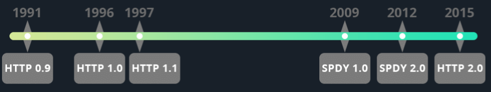

## HTTP là gì ? {#http-la-gi}

HTTP (Hyper Text Transfer Protocol) là giao thứ chuẩn cho World Wide Web ra đời vào năm 1989
bởi [Timothy Berners-Lee](https://vi.wikipedia.org/wiki/Tim_Berners-Lee).

Nếu bạn đang xem một video trên yourube. Bạn gõ đường dẫn trên trình duyệt rồi enter để truy cập. Khi đó browser sẽ thực
hiện một giao thức HTTP để lấy các nội dung trên server. HTTP sử dụng cơ thế Client & server trong đó Client sẽ gửi
Request và Server sẽ trả về Response ( Request & Response )

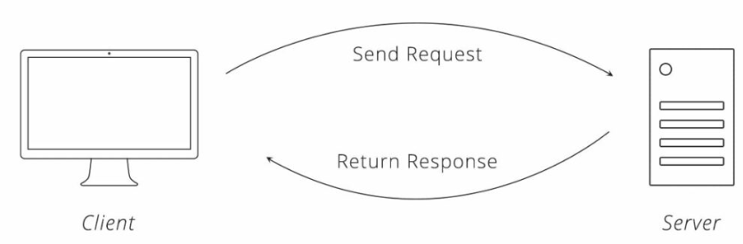

Thời khai sinh của HTTP (0.9), HTTP chỉ hỗ trợ duy nhất một method là GET. HTTP nằm ở Applicatiopn layer
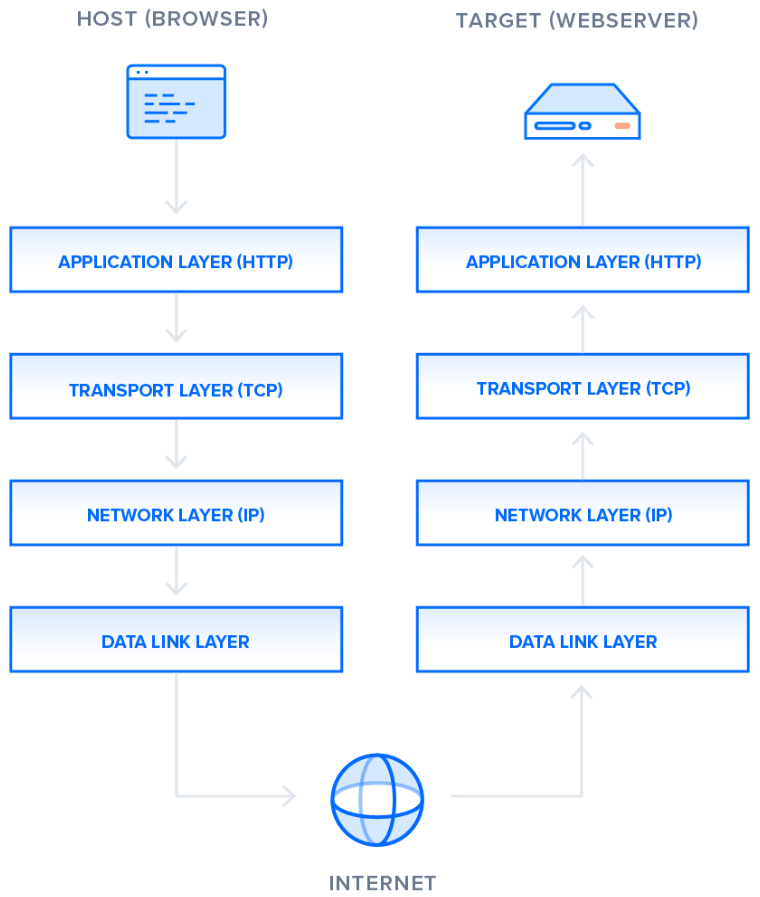

## Hyper Text Transfer Protocol: Hyper Text

- Hyper Text(Siêu văn bản) là các text ( Văn bản ) được hiển thị trên các màn hình máy tính hoặc các thiết bị điện tử
  khác
  có references(Tham chiếu đến [hyperlinks](https://en.wikipedia.org/wiki/Hyperlink)) sang văn bản khác để người dùng có
  thể truy cập.

- Các Hyper text được kết nối đến nhau bởi [hyperlinks](https://en.wikipedia.org/wiki/Hyperlink)  thường sẽ được kích
  hoạt
  bằng cách click (Nhấp chuột), nhấn phím hoặc chạm vào màn hình.

- Ngoài text, thuật ngữ này đôi khi còn được sử dụng để mô tả hình ảnh, video hoặc các định dạng có nội dung để trình
  bày có người xem khác.

- Hyper Text là 1 trong những khái niệm cơ bản của [Word Wide Web](https://en.wikipedia.org/wiki/World_Wide_Web) nơi
  các [web page](https://en.wikipedia.org/wiki/Web_page) được viết bằng
  HTML ( [Hypertext Markup Language](https://en.wikipedia.org/wiki/Hypertext_Markup_Language) ). Khi triển khai trên
  web, Hyper Text cho phép dễ dàng sử dụng để hiển thị thông tin thông qua Internet.

- Các Hyper Text có thể là tĩnh(static) được lưu trữ và chuẩn bị trước hoặc động ( dynamic) liên tục thay đổi nội dung
  để đáp ứng yêu cầu đầu vào của người dùng (web dynamic).

## Một số ngôn ngữ Hyper Text

- HTML ( Hypertext Markup Language )
  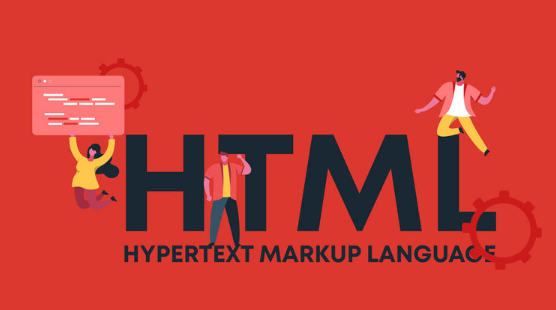
  - Đây là ngôn ngữ được sử dụng cho các web page để hiển thị dữ liệu trên trình duyệt web.
  - Với HTML thì các đánh dấu ( Markup Language ) sẽ được định nghĩa bởi W3C với từng Markup sẽ có ý nghĩa và hoạt động
    ra sao để các trình duyệt IMPl
    - VD: Markup Strong được đánh dấu là các dữ liệu cần nhấn mạnh và có chữ đậm
- XML ( Extensible [Markup Language](https://en.wikipedia.org/wiki/Markup_language) )
  - Đây là ngôn ngữ để sử dụng như một công cụ để truyền tải dữ liệu.
  - Với XML thì các Markup sẽ được định nghĩa bởi chính chúng ta, chúng ta có thể tự xác định các dữ liệu của mình.
  - XML thường được sử dụng làm công cụ truyền tải dữ liệu

## Hyper Text Transfer Protocol: Transfer Protocol

- Transfer Protocol là các giao thức được sử dụng để truyền tải dữ liệu giữa client và server.
- Một số Transfer Protocol là:
  - FTP
  - FTPS
  - SFTP
  - HTTP, HTTPS
  - AS2, AS3, & AS4

## HTTP hoạt động như thế nào?

- Thông thường mỗi HTTP Request sẽ sử dụng 1 kết nối TCP ( TCP Connection ). Các bước sẽ trải qua như sau:
  1. Client khởi tạo một kết nối TCP đến Server
  2. Sau khi tạo kết nối thành công, client sẽ gửi request đến server kèm theo các thông tin ( Body, ..etc.. )
  3. Server tiếp nhận Request, tiến hành xử lý logic và trả lại kết quả cho client thông qua kết nối TCP đang kết nối. (
     Kết nối TCP được tao ở bước 1)
  4. Client tiếp nhận Response từ Server
  5. Client hoặc server thực hiện đóng kết nối.
     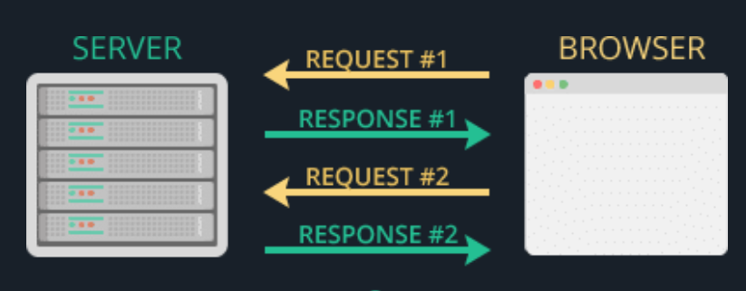

## TCP 3-Way Handshake Process

Để thiếp lập TCP ( Transmission Control Protocol ) connection giữa Client và Server sẽ cần thực hiện 3 bước.

3 bước này được đặt tên là TCP 3-Way Handshake Process. 3 bước này sẽ hoàn thành một flow gửi và xác nhận dữ liệu.

- Threeway-handshake là quá trình trao đổi số thứ tự gói tin bắt đầu để client và server có thể thiếp lập 1 kết nối ổn
  định.
- Hồi xưa sequence number được bắt đầu từ 0. Tuy nhiên vì lý do bảo mật nên hiện tại sequence number đầu tiên sẽ được
  tạo ngẫu nhiên.
  - vì xưa bắt đầu từ 0. Nên nhiều hacker đã tấn cống giả mạo gói tin.
- Sequence number được sử dụng để phân đoạn dữ liệu từ 1 dữ liệu lớn thành các dữ liệu nhỏ để gửi dần dần và tập hợp
  chúng lại ở bên nhận.
  - Sequence number giúp phần mềm TCP ở cả 2 bên có thể theo dõi lượng dữ liệu đã được truyền, sắp xếp dữ liệu đúng thứ
    tự khi dữ liệu được gửi lại. (Khi bị mất gói tin)

### Ví dụ một flow Three-way handshake

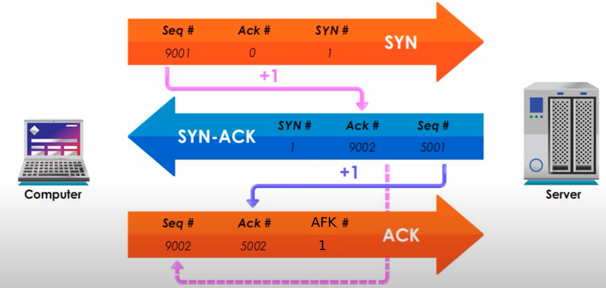
Các lệnh điều khiển trong TCP:

- URG: Urgent Pointer field significant
- ACK : Acknowledgment field significant
- PSH : Push Function
- RST : Reset the connection
- SYN : Synchronize sequence numbers
- FIN : No more data from sender

#### FLow ( [Demo](https://learn.microsoft.com/en-us/troubleshoot/windows-server/networking/three-way-handshake-via-tcpip) ):

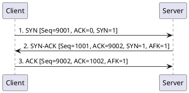

1. 1 (SYN) : Trong bước đầu tiên, khi client muốn thiếp lập kết nối TCP tới server, client sẽ gửi gói SYN yêu cầu kết
   nối tới server kèm theo 1 số ngẫu nhiên (Ví dụ : 9001).
  - Số Seq(9001) là sử dụng để xác minh kết nối có giá trị từ 0 đến 4,294,967,295 (32 bit),
  - Số này do bên Client tự tạo ngẫu nhiên
  - ACK =0 vì đây là request gửi yêu cầu kết nối lần đầu.
  - SYN = 1 : là bit lệnh điều khiển, tượng trưng cho việc gửi SYN để thiếp lập kết nối
2. 2 (SYN, ACK) : Server nhận được gói SYN từ client, server sẽ gửi lại gói SYN, ACK để xác nhận kết nối và thông báo
   với client rằng server đã nhận được yêu cầu kết nối từ client.
  - Số Seq = 1001 : là số ngẫu nhiên do server tạo ra
  - Số ACK = 9002 : là số Seq của client + 1
  - SYN = 1 : là bit lệnh điều khiển, tượng trưng cho việc gửi SYN để thiếp lập kết nối
  - AFK = 1 : là bit lệnh điều khiển, để nói rằng gói này được sử dụng để xác nhận 1 thứ gì đó quan trọng
3. ACK: Client nhận được gói SYN, ACK từ server, client sẽ gửi lại gói ACK để xác nhận kết nối và thông báo với server
   rằng client đã nhận được thông báo kết nối từ server.
  - Số Seq = 9002 : là số Seq của sau khi nhận từ server và + 1
  - Số ACK = 1002 : là số Seq của server + 1
  - AFK = 1 : là bit lệnh điều khiển, để nói rằng gói này được sử dụng để xác nhận 1 thứ gì đó quan trọng

Chính vì cần gửi 3 gói tin để thiếp lập kết nối nên gọi là Three-way handshake.

Đóng kết nối cũng cần 3 bước tương tự như mở kết nối. Tổng cộng mở và đống kết nối sẽ tốn 6 gói tin.

## Giao thức HTTP/1.1 (v1.1)

- Giao thức HTTP/1 (Version 1.1) được phát hành vào năm 1999. HTTP chính thức được sử dụng rộng dãi hơn nhiều.
- HTTP/1.1 hỗ trợ nhiều method hơn ( OPTIONS, GET, HEAD, POST, PUT, DELETE, TRACT, CONNECT )
- 1 tính năng quan trọng của HTTP/1.1 là TCP connection có thể được giữ lại để phục phụ các yêu cầu mới ( Keep-live hoặc
  gọi là Persistent connection)
- Còn nhiều tính năng khác nữa…
  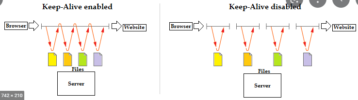

### HTTP Pipelining

- HTTP Pipelining là một kỹ thuật giúp tăng tốc độ tải trang web bằng cách cho phép client gửi nhiều request đến server
  mà không cần phải chờ đợi response từ request trước.
- Client sẽ gửi 1 loạt các request đến server và server sẽ trả về response theo thứ tự request được gửi.
  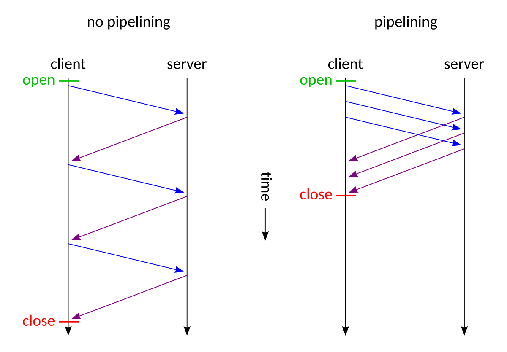
- Tuy nhiên bởi vì cùng sử dụng 1 kết nối vì vậy sẽ không biết response thuộc request nào, vì vậy các response sẽ cần
  trả về theo đúng thứ tự request gửi lên.(FIFO)
- Nếu có một response chậm thì sẽ khiến cho các response sẽ bị chậm nối đuôi theo vì phải theo thứ tự trả về. ( TCP
  Head-of-line blocking (HOL))
- Vì vậy HTTP Pipelining không được sử dụng rộng rãi vì vấn đề về bảo mật và hiệu suất.
- Vào năm 2015, Google đã công bố rằng họ sẽ ngừng hỗ trợ HTTP Pipelining trong Chrome vì vấn đề về bảo mật và hiệu
  suất.
- Vào năm 2016, Firefox cũng đã ngừng hỗ trợ HTTP Pipelining.
- Vào năm 2018, Safari cũng đã ngừng hỗ trợ HTTP Pipelining.
- ....

### HTTP persistent connection (HTTP keep-alive)

- Khác với HTTP Pipelining sẽ gửi 1 loạt các reuqest vào một tcp connection rồi đợi response trả về theo thứ tự. HTTP
  Keep-alive sẽ có các cặp request/response.
- HTTP keep-alive sẽ hỗ trợ tái sử dụng kết nối sau khi đã thực hiện thành công một gặp request/response thì tcp
  connection đó có thể được sử dụng để xử lý cho các request/response mới.
- Sau 1 khoảng thời gian time out không có cặp request/response mới thì TCPconnection đó sẽ được đóng.
  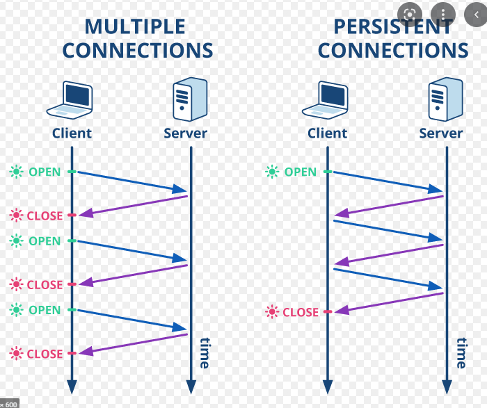
- Việc đóng mở kết nối cho mỗi request khác nhau sẽ tốn rất nhiều chi phí. Vi vậy việc sử dụng lại kết nối là một các
  thức hữu ích.

### Hỗ trợ Compression/Decompression (Encoding)

- Đây là cơ chế cho phép client và server nén dữ liệu trước khi gửi đi cho nhau. Cơ chế này giúp giảm băng thông khi
  trao đổi thông tin.
  - Ví dụ khi file gốc là 10MB, sử dụng thuật toán nén xuống 1mb và gửi đi qua mạng. Sẽ giúp giảm băng thông rất nhiều,
    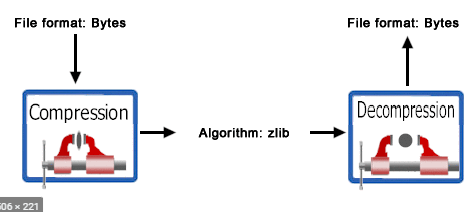
- Các cơ chế nén phổ biến hiện tại là : Gzip, Deflate, BR (Brotli)

### Overview HTTP/1.1

- HTTP là một giao thức truyền tải các siêu văn bản (Hyper Tex)
- HTTP hoạt động theo mô hình client/server.
- Để mở một kết nối TCP sẽ cần thực hiện 3 bước. Kết nối và đóng kết nối sẽ mất tổng cộng 6 gói tin.
- HTTP1.1 hỗ trợ tính năng keep-alive sẽ có thể tái sử dụng TCP connection để gửi request mới.

## HTTP2

### Các tính năng của HTTP1.1 ngăn cải thiện hiệu suất:
- Sẽ chỉ có một request duy nhất cho mỗi TCP connection.
  - HTTP Pipelining giúp gửi nhiều request trên một TCP connection, tuy nhiên bản chất nó vẫn chỉ là 1 hàng đợi (FIFO).
     - Để giải quyết vấn đề này các Browser(Trình duyệt) sử dụng nhiều TCP connection.
     - Từ năm 2008 hầu hết các trình duyệt chuyển từ 2 đến 6 tcp connection cho mỗi domain
  - keep-alive hỗ trợ gửi nhiều request trên một TCP connection, tuy nhiên bản chất nó vẫn đợi request trước đó hoàn thành xong mới gửi request mới.
- Trong HTTP1.1 chỉ có client gửi request đến cho server.
  - Ngay cả khi server biết client cần tài nguyên nhưng server không thể chủ động gửi tài nguyên cho client. Client cần chủ động gọi đến server để lấy tài nguyên (Web socket không phải HTTP)
- Header của request và response không được compression (Nén).
  - Ngay nay chung bình header request và reponse ở vào khoảng 800 bytes (0.8kb). Request 0.8 + reponse 08 = 1.9 KB
- Nhiều header thừa thãi
  - Khi gửi nhiều request trên một TCP connection (HTTP Pipelining,keep-alive ) có nhiều Header được gửi lại giống nhau ( User-Agent, Host, and Accept ,content-encoding….

### SPDY
- SPDY là một protocol thử nghiệm được phát triển bởi google cho mục đích cải tiến hiệu suất website (Thời đó sử dụng HTTP1.1) được công bố năm 2009.
- SPDY không thay thế HTTP, nó sửa đổi cách gửi và phản hồi yêu cầu của HTTP.
  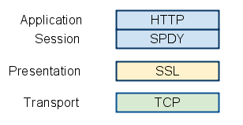
- Ý tưởng của SPDY là header compression(Nén Header), Multiplexed streams, server push và Server hint
  - Header compression: Loại bỏ các header gửi chùng lặp trên các request khác trên cùng một TCP connection
  - Multiplexed streams : SPDY cho phép một connection có thể xử lý được đồng thời nhiều request.
  - Server push: Server có thể chủ động gửi tài nguyên cho client mà không cần client gửi request.
  - Server hint: Server gửi thông tin gợi ý cho client nên tải các tài nguyên. Sau đó client gửi yêu cầu tài nguyên
- Các ý tưởng của SPDY được làm base cho HTTP/2. Sau khi HTTP/2 ra đời SPDY đã dừng phát triển.

## Chi tiết về HTTP/2

### Overview nhanh về HTTP/2
- Các tính năng chính của HTTP/2 giúp tối ưu hoá hiệu suất đó là cho phép xen kẽ nhiều request/response messages có thể gửi đi và nhận về trên cùng 1 TCP connection.
- HTTP/2 sẽ coding(mã hoá) các dữ liệu Header để không phải gửi lại nhiều lần.
- HTTP/2 cho phép ưu tiên các request messages để giúp response nhanh hơn.
- HTTP/2 thân thiện với network hơn bởi vì nó sử dụng ít kết nối hơn (Ít TCP connection).
- HTTP/2 cung cấp tối ưu hoá transport cho HTTP. HTTP/2 hỗ trợ tất cả các tính năng core của HTTP 1.1 nhưng sẽ tăng hiệu suất bằng một số cách.
- HTTP/2 connection là một application-layer protocol chạy trên kết nối TCP, client sẽ là người khởi tạo TCP connection.

### Các thuật ngữ trong HTTP/2
- Client: Điểm bắt đầu kết nối HTTP/2 connection, client gửi request và nhận response trả về.
- Endpoints: Client hoặc server trong một connection
- Connection: một transport-layer connection giữa hai endpoints (Giữa client và server)
- Connection error: Một lỗi ảnh hưởng đến HTTP/2 connection.
- Frame: Đơn bị giao tiếp nhỏ nhất trong HTTP/2. Chứa các thông tin để gửi đi
- Receiver: Một endpoint đang nhận về các Frame.
- Sender: Một endpoint đang gửi đi các Frame.
- Server: Một endpoint chấp nhận kết nối HTTP/2. Server nhận request và gửi trả response.
- Stream: Một luồng 2 chiều gửi và nhận các frames trong HTTP/2 connection.
- Stream error: Đã xảy ra lỗi trên một stream.
- Stream ID: Một số duy nhất để xác định một stream trong một connection.
- Stream state: Trạng thái của một stream.

### Bắt đầu với HTTP/2 ^^
- HTTP/2 là một protocol ở layer application được chạy trên kết nối TCP.
- HTTP/2 sử dụng cùng một schemes URI với HTTP1.1 là “http” và “https”. 
  - HTTP1.1 và HTTP/2 chia sẻ cùng một cổng 80 cho http và 443 cho https. Vì vậy khi truy cập http://127.0.0.1/http hoặc https://127.0.0.1/https client sẽ cần khám phá (Discover, kiểm tra) xem server có hỗ trợ HTTP/2 hay không.
  - Nếu server hỗ trợ HTTP/2 thì client sẽ sử dụng HTTP/2 để giao tiếp với server.
  - Nếu server không hỗ trợ HTTP/2 thì client sẽ sử dụng HTTP1.1 để giao tiếp với server.

### HTTP/2 Version Identification:
- HTTP/2 Có 2 Identification là h2 và h2c.
- h2(viết thường):
  - h2 Identification xác định HTTP/2 sẽ sử dụng Transport Layer Security(TLS)(HTTPS)
  - Giá trị h2 sẽ được sử dụng trong `TLS-ALPN` để xác định kết nối an toàn TLS.
- h2c(viết thường):
  - h2c Identification xác định HTTP/2 sử dụng clearText tcp, không sử dụng TSL để mã hóa (HTTP).
- Hiện tại các browser chỉ hỗ trợ HTTP/2 sử dụng h2. Nếu server sử dụng h2c thì trình duyệt sẽ không sử dụng HTTP, sẽ sử dụng http1.1 hoặc 1 giao thức khác.
- HTTP/2 sử dụng h2c thường sẽ sử dụng cho các ứng dụng nội bộ với nhau (Các ứng dụng trên server gọi với nhau), khi đó chúng ta sẽ không cần TSL nó sẽ giúp tăng hiệu suất. (Không phải thêm bước mã hóa giải mã dữ liệu)

### Bắt đầu HTTP/2 với “http” (h2c)
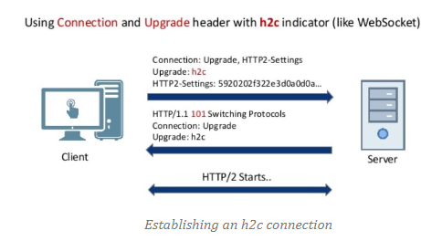
- Khi lần đầu truy cập website tại thời điểm này client chưa biết server liệu có hỗ trợ HTTP/2 không. Vì vậy client sẽ tạo một HTTP1.1 request để yêu cầu nâng cấp lên HTTP2.
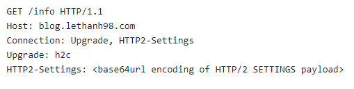
  - Bản chất đây là một HTTP1.1 request, nhưng nó chứa một số header để yêu cầu nâng cấp lên HTTP/2.
  - Nếu Server hỗ trợ HTTP/2 thì server sẽ trả về response client với Status 101 để switching protocol.
  - Sau đó client gửi lại request theo spec của HTTP/2.
  - Nếu Server không hỗ trợ HTTP/2 thì server sẽ xử lý yêu cầu theo HTTP1.1 và trả về data.
    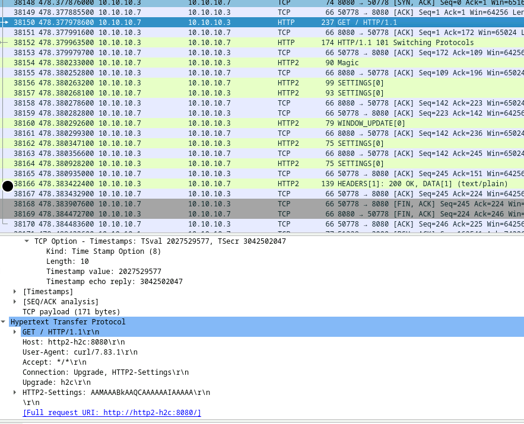
  - 
### Bắt đầu HTTP/2 với “https” (h2)
#### TLS-ALPN:
- TLS-ALPN là một extension của TLS (Transport Layer Security) giúp client và server xác định protocol cụ thể sẽ sử dụng trên kết nối TLS trong quá trình bắt tay ( handshake ).
  - Khác với http sẽ cần một cặp request/response để thiếp lập kết nối, trên https với ALPN sẽ có thể xác định protocol ngay sau khi thiếp lập kết nối tcp với quá trình handshake TLS.
  - Cách này sẽ giảm chi phí network.
- Khi có nhiều protocol trên cùng một port TCP hoặc UDP, ALPN cho phép application layer xác định protocol sẽ được sử dụng trong TLS.

Flow cơ bản:
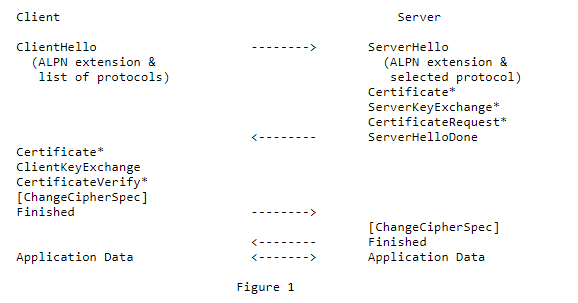
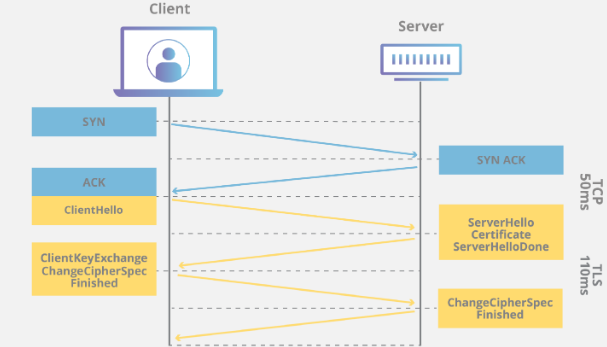
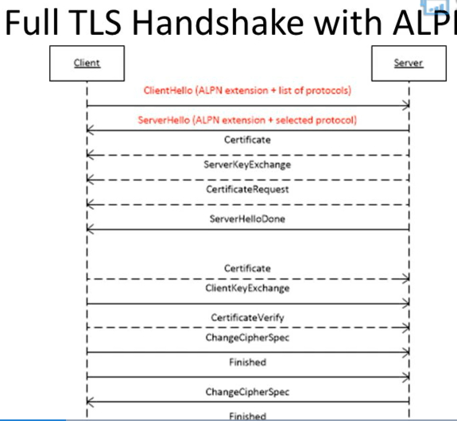
- Với ALPN, client sẽ gửi danh sách protocol hỗ trợ bởi client trong message TLS ClientHello, Server sẽ chọn một protocol thích hợp au đó trả về cho client trong message TLS ServerHello.
  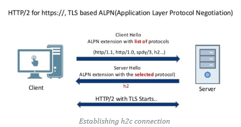
- Trong trường hợp server không hỗ trợ bất kỳ protocol nào, server sẽ trả về lỗi `no_application_protocol`

### Frame trong HTTP/2

