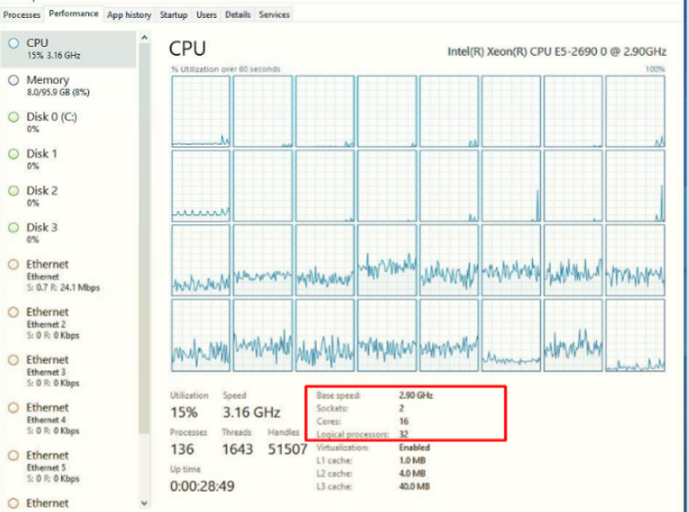
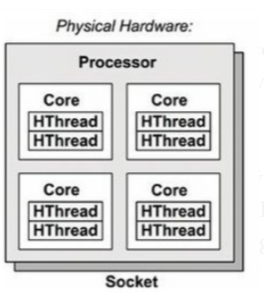
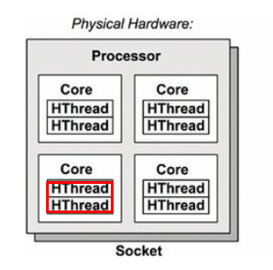

# CPU, CORE và Thread khác gì nhau ? {#cpu-core-va-thread-khac-gi-nhau}

Đối với nhiều lập trình viên, khá nhiều người có thể cảm thấy khó hiểu về CPU, Core và Thread. Trong bài viết này, tôi sẽ giải thích một cách đơn giản và ngắn gọn để giúp mọi người nắm bắt khái niệm về CPU, Core và Thread một cách dễ dàng hơn.

Trước tiên, tôi muốn bày tỏ lòng biết ơn đến mọi người đã dành thời gian để đọc bài viết này. Tôi hoan nghênh mọi đóng góp ý kiến và sự chia sẻ kinh nghiệm của các bạn, vì đó cũng là cách để chúng ta cùng học hỏi và phát triển.

Hãy cùng bắt đầu!

[[TOC]]

## CPU là gì ? {#cpu-la-gi}

CPU là một thành phần chính được tích hợp trên mainboard của máy tính, cũng như trên các thiết bị khác như điện thoại, máy tính bảng, v.v.

Nhiệm vụ chính của CPU là thực hiện hầu hết các xử lý bên trong máy tính, đóng vai trò quan trọng trong việc xử lý logic. Chẳng hạn, nó có thể thực hiện phép tính đơn giản như 1+1=2.

Ngoài ra, CPU cũng đảm nhận vai trò điều khiển giao tiếp giữa các thiết bị khác bên trong máy tính, như RAM, máy in, và các thành phần khác.

Trong một mainboard thông thường, thường chỉ có một CPU được gắn. Tuy nhiên, có một số mainboard được thiết kế để đáp ứng nhu cầu sử dụng đa dạng, từ nghiên cứu khoa học đến làm server, hoặc chơi các game đòi hỏi tài nguyên nặng nề, do đó, chúng có thể hỗ trợ nhiều socket để gắn nhiều CPU.

## Core trong CPU là gì ? {#core-trong-cpu-la-gi}

Core CPU được ra mắt vào ngày 1 tháng 5 năm 2006 và thường được gọi đơn giản là Core. Đây là một phần quan trọng của vi xử lý nằm trong bộ xử lý trung tâm của máy tính.

Mỗi CPU có thể bao gồm nhiều core, ví dụ, CPU với 2 core được gọi là dual-core, 3 core được gọi là triple-core, và cứ như vậy...

Trong hình ảnh trên, chúng ta thấy một CPU với tổng cộng 4 core phần cứng. 

Mỗi core không chỉ thực hiện các thao tác đọc và ghi dữ liệu mà còn cung cấp hướng dẫn cho máy tính để thực hiện các quy trình logic độc lập.

## Thread trong CPU (Logical core) là gì ? {#thread-trong-cpu-logical-core-la-gi}

Thực sự, bên trong CPU, thời trước không có khái niệm về thread. Mỗi core trong CPU chỉ có khả năng xử lý một luồng logic độc lập tại một thời điểm. Tuy nhiên, Intel đã đưa ra một công nghệ được gọi là [**Simultaneous Multithreading (SMT).**](https://en.wikipedia.org/wiki/Simultaneous_multithreading).

Công nghệ [**SMT**](https://en.wikipedia.org/wiki/Simultaneous_multithreading) cho phép mỗi Core thực tế ([**physical core**](https://www.hivelocity.net/blog/what-is-cpu-cores-multithreading-vcpu/#:~:text=A%20Physical%20Core%20is%20a,brain%20to%20process%20commands%20with.)) có thể đóng vai trò như là 2 core ([**Core ảo hay Logical core**](https://www.quora.com/What-is-the-difference-between-a-physical-core-logical-core-and-thread-in-terms-of-processors)), thực hiện đồng thời 2 nhiệm vụ trong cùng một khoảng thời gian. Chính vì vậy mỗi Core ảo này được gọi là Logical Core.

Logical core không tồn tại về mặt vật lý, có nghĩa là nó không được coi là một thành phần phần cứng thực sự và chỉ được hệ điều hành nhìn thấy.

Hiện nay, AMD cũng sử dụng thuật ngữ riêng để chỉ SMT, được gọi là CMT. Tuy nhiên, bài viết này sẽ không đi sâu vào nó, vì ý nghĩa của nó cũng tương tự, và [**Hyperthreading**](https://en.wikipedia.org/wiki/Hyper-threading) vẫn là thuật ngữ phổ biến hơn.

## Tổng kết {#tong-ket}

1. CPU là một thiết bị phần cứng được gắn trong mainboard.  Một mainboard có thể có 1 hoặc nhiều CPU.
2. Core là một phần cứng được tích hợp trong CPU. Một CPU có thể có 1 hoặc nhiều Core
3. Logical core hoặc Thread được giới thiệu đầu tiên bởi Intel  với tên là Simultaneous Multithreading (SMT). Trong CPU Logical core không phải là 1 phần cứng nó được nhìn thấy bởi hệ điều hành, mỗi một Logical sẽ có thể tính toán và xử lý logic độc lập.
