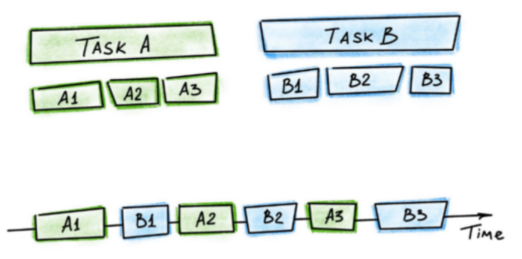
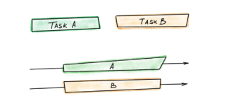

# Concurrency và parallelism. Giải thích Concurrency và parallelism của OS và business khác gì nhau ? {#2024-01-10-concurrency-va-parallelism-giai-thich-concurrency-va-parallelism-cua-os-va-business-khac-gi-nhau}

Concurrency và parallelism là hai khái niệm quan trọng trong lĩnh vực lập trình và công nghệ thông tin. Mặc dù nhiều
người đã nghe về chúng và có thể đã làm việc với chúng, nhưng không phải ai cũng hiểu rõ về ý nghĩa cụ thể của
Concurrency và Parallelism.

Trong bài viết này, tôi sẽ giải thích ý nghĩa của Concurrency và Parallelism trong hệ điều hành nói chung và trong lĩnh
vực kinh doanh. 

Tuy nhiên, cần lưu ý rằng ý nghĩa của chúng có thể thay đổi tùy thuộc vào ngữ cảnh cụ thể, nhưng bản
chất ý tưởng vẫn giữ nguyên.

Hãy cùng bắt đầu!

[[TOC]]

## Concurrency và Parallelism {#concurrency-va-parallelism}

### Concurrency

Concurrency, hay **Đồng thời** khi dịch sang tiếng Việt, là một khái niệm liên quan đến việc xử lý nhiều tác vụ cùng một
lúc trên hệ điều hành.

Trong quá khứ, khi công nghệ chưa phát triển, chúng ta chỉ có thể chạy một ứng dụng tại một thời điểm. Để chạy ứng dụng
khác, người dùng phải tắt ứng dụng hiện tại và mở ứng dụng mới.

Khi mở các ứng dụng, chúng sẽ chạy trên một Core CPU (trong thời kỳ trước đây chỉ có một Core). Mỗi ứng dụng khi được mở
sẽ được CPU xử lý các logic liên quan đến ứng dụng đó, và CPU sẽ tập trung chỉ vào việc xử lý cho ứng dụng đó mà thôi.

Sau đó, với sự phát triển của công nghệ, tại một thời điểm chúng ta có khả năng chạy nhiều ứng dụng trên cùng một máy
tính. 

Tuy nhiên, ở giai đoạn này, mặc dù có thể chạy nhiều ứng dụng, máy tính vẫn chỉ sử dụng một Core CPU để xử lý. Một
Core đơn sẽ đảm nhận việc xử lý logic cho nhiều ứng dụng khác nhau.

??? Nhưng tại sao nó lại làm được ?

Tính năng **Concurrency** giúp CPU thực hiện công việc này. Thay vì một Core của CPU chỉ xử lý một ứng dụng duy nhất, tính
năng Concurrency cho phép Core chuyển đổi giữa việc xử lý các ứng dụng khác nhau liên tục.

#### Ví dụ concurrency

1. Giây thứ 1 : Bắt đầu, Core xử lý logic cho thread A1
2. Giây thứ 2 : Core Switching đến xử lý logic cho thread B1
3. Giây thứ 3 : Core Switching đến xử lý logic cho thread A2
4. Giây thứ 4: Core Switching đến xử lý logic cho thread B2
5. Giây thứ 5: Core Switching đến xử lý logic cho thread A3
6. Giây thứ 6: Core Switching đến xử lý logic cho thread B3
7. Giây thứ 7: Core Switching đến xử lý logic cho thread A1
8. Giây thứ 8: Core Switching đến xử lý logic cho thread A2
9. Giây thứ 9: Core Switching đến xử lý logic cho thread B1

Quá trình chuyển đổi này được gọi là **Switching context**.
 
Mỗi khi chuyển đến một context thread khác để xử lý logic, sẽ có một khoảng thời gian nhỏ được tiêu tốn.
 
Độ trễ của quá trình chuyển đổi phụ thuộc vào nhiều yếu tố, thường dao động từ 50 đến 100 nanoseconds (1 giây = 1 tỷ nanoseconds).

Quá trình chuyển đổi giữa các thread và sau đó xử lý logic cho các thread đó diễn ra rất nhanh, với độ trễ cho việc chuyển đổi và xử lý một phần logic cho thread thường nằm trong khoảng từ 500 đến 1000 nanoseconds. (Lưu ý rằng không phải lúc nào cũng xử lý hết logic mà chỉ xử lý một phần trước khi chuyển sang thread khác).

Với phương thức làm việc thông qua quá trình chuyển đổi context, chúng ta có cảm giác như CPU đang thực hiện các công việc song song. Do đó, nó được gọi là **Concurrency** (Đồng thời).

#### Ví dụ minh họa ngoài đời thực

Ví dụ minh họa trong thực tế:

Thông tin ví dụ:

Một cô thư ký giám đốc có nhiều nhiệm vụ, bao gồm việc nghe điện thoại cho giám đốc, kiểm tra các cuộc hẹn, nhắn tin cho khách hàng, và nhiều công việc khác.

1. Giây thứ 1: Cô thư ký bắt đầu nghe điện thoại của khách hàng.
2. Giây thứ 2: Cô thư ký tạm dừng nghe điện thoại để kiểm tra cuộc hẹn.
3. Giây thứ 3: Cô thư ký dừng lại kiểm tra cuộc hẹn để nhắn tin cho khách hàng.
4. Giây thứ 4: Cô thư ký tạm dừng nhắn tin để tiếp tục nghe điện thoại.
5.  Giây thứ 5: Cô thư ký kết thúc việc nghe điện thoại và tiếp tục kiểm tra cuộc hẹn.
6. Giây thứ 6: Cô thư ký tạm dừng kiểm tra cuộc hẹn để nhắn tin cho khách hàng.
7. Giây thứ 100: Cô thư ký kết thúc công việc nghe điện thoại.
8. Giây thứ 101: Cô thư ký tiếp tục kiểm tra cuộc hẹn.
9. Giây thứ 102: Cô thư ký tạm dừng kiểm tra cuộc hẹn và tiếp tục nhắn tin cho khách hàng.
10. Giây thứ 103: Cô thư ký kết thúc kiểm tra cuộc hẹn.
11. Giây thứ 104: Cô thư ký tiếp tục nhắn tin cho khách hàng.
12. ...và cứ như vậy.

Chỉ có một cô thư ký, và cô ấy sẽ thực hiện mỗi công việc một chút ít cho đến khi hoàn thành tất cả các nhiệm vụ. Nếu cô ấy phải đối mặt với nhiều công việc cùng một lúc, thì thời gian xử lý mỗi công việc sẽ kéo dài. Ngược lại, nếu cô ấy chỉ có một công việc duy nhất, thì thời gian xử lý công việc đó sẽ nhanh hơn.

Các cánh tay ảo được minh họa như việc cô thư ký cần tạm dừng công việc hiện tại để chuyển sang thực hiện một công việc khác tạm thời.

Ví dụ: Trong trường hợp công việc nhắn tin, nếu cô ấy đang thực hiện đồng thời (Concurrency) 10 công việc khác nhau, thì để hoàn thành công việc nhắn tin có thể mất 10 giây.

Tuy nhiên, nếu chỉ tập trung vào công việc nhắn tin đó một cách độc lập, cô ấy có thể chỉ mất 2 giây.

Concurrency giống như việc có một core hoặc một cô thư ký, và cần chuyển đổi giữa các công việc liên tục để đồng thời thực hiện nhiều công việc cùng một lúc.

### Parallelism

Parallelism, hay **Song Song** khi dịch sang tiếng Việt, là một khái niệm liên quan đến việc xử lý nhiều công việc đồng thời trên hệ điều hành.

Trong quá khứ, chúng ta chỉ có một Core hoặc một cô thư ký duy nhất, và mỗi Core hoặc cô thư ký đó sẽ phải thực hiện nhiều công việc đồng thời.

Với sự phát triển của công nghệ, người ta có khả năng tích hợp nhiều Core hơn hoặc nhiều Thread([**Logical core**](2024-01-09-cpu-core-and-thread-khac-gi-nhau.md)) trên một Core, thậm chí tích hợp nhiều task trên một CPU hoặc kết hợp nhiều CPU trên một mainboard. Khi đó, khái niệm Parallelism đã xuất hiện.

Thay vì một thread trong một core phải xử lý toàn bộ công việc, khi có nhiều thread trong một core hoặc nhiều core hơn, các công việc sẽ được phân chia và chia nhẹ ra cho các thread, core khác nhau để cùng xử lý.

Như trong hình ảnh ở trên, khi chúng ta có 2 công việc, mỗi công việc sẽ được giao cho một thread hoặc core để xử lý. Điều này giúp chúng ta có khả năng xử lý hai công việc song song.

Áp dụng lại ví dụ với cô thư ký:

1. Giây thứ 1 : Thư ký 1 : Nghe điện thoại
2. Giây thứ 1 : Thư ký 2 : kiểm tra lịch hẹn
3. Giây thứ 2 : Thư ký 1 : Nghe điện thoại kết thúc
4. Giây thứ 2: Thư ký 2 : kiểm tra cuộc hẹn kết thúc
5. ...

Tương tự như vậy, các cô thư ký có thể song song xử lý nhiều công việc khác nhau, giống như việc chia công việc cho các thread,core để xử lý song song.

Parallelism đơn giản vậy thôi. Trước đây, chỉ có một thread trong một core xử lý một công việc tại một thời điểm. Nhưng bây giờ, chúng ta có thể sử dụng nhiều thread trong một core hoặc nhiều core để xử lý các công việc song song.

## Concurrency kết hợp với parallelism

Sẽ trông giống như trên hình vậy. Trong các thread trong core hoặc trong các core, công việc vẫn được xử lý đồng thời và các nhiệm vụ sẽ được chia sẻ giữa các thread hoặc core khác nhau để cùng thực hiện.
- Mỗi thư ký sẽ xử lý đồng thời nhiều công việc.
- Nhiều cô thư ký để xử lý song song nhiều công việc khác nhau.

#### Ví dụ về 2 cô thư ký:

Có 2 cô thư ký và 4 công việc: Kiểm tra lịch hẹn, nghe điện thoại, nhắn tin cho khách hàng, và pha cafe cho sếp.

Cô thư ký 1 sẽ đảm nghiệm kiểm tra lịch hẹn và nghe điện thoại.

Cô thư ký 2 sẽ đảm nghiệm nhắn tin cho khách hàng và pha cafe cho sếp.

Flow minh họa:
1. Giây thứ 1 : Thư ký 1 kiểm tra lịch hẹn
2. Giây thứ 1 : Thư ký 2 nhắn tin cho khách hàng
3. Giây thứ 2: Thư ký 1 tạm dừng kiểm tra lịch để chuyển sang nghe điện thoại
4. Giây thứ 2: Thư ký 2 tạm dừng nhắn tin cho khách hàng để đi pha cafe
5.  Giây thứ 3: Thư ký 1 tạm dừng nghe điện thoại để kiểm tra lịch
6.  Giây thứ 3: Thư ký 2 tạm từng đi pha cafe để nhắn tin cho khách hàng
7.  Giây thứ 4: Thư ký 1 tạm dừng kiểm tra lịch để nghe điện thoại
8.  Giây thứ 4: Thư ký 2 tạm từng nhắn tin cho khách hàng để pha cafe
9.  Giây thứ 5: Thư ký 1 nghe điện thoại kết thúc.
10.  Giây thứ 5: Thư ký 2 pha cafe kết thúc
11.  Giây thứ 6: Thư ký 1 kiểm tra lịch hẹn
12.  Giây thứ 6: Thư ký 2 nhắn tin cho khách hàng
13.  Giây thứ 7: Thư ký 1 tiếp tục kiểm tra lịch hẹn
14.  Giây thứ 8: Thư ký 2 tiếp tục nhắn tin cho khách hàng
15.  Giây thứ 9: Thư ký 1 kiêm tra lịch hẹn kết thúc
16.  Giây thứ 10: Thư ký 2 tiếp tục nhắn tin cho khách hàng
17.  Giây thứ 11: Thư ký 2 tiếp tục nhắn tin cho khách hàng
18.  Giây thứ 12: Thư ký 2 thúc công việc

Đúng vậy, để tăng tốc độ xử lý, các công việc có thể được chia đều cho cả hai cô thư ký, mỗi cô ôm trách nhiệm về hai công việc. Điều này giúp cả hai cô thư ký có thể xử lý đồng thời hai công việc, từ đó tăng khả năng hoàn thành nhiệm vụ một cách hiệu quả.

### Vậy Concurrency và parallelism của OS và Business khác gì nhau
- **OS** : Như mình nói ở phía trên Concurrency và parallelism trong OS nói đến cách thức CPU xử lý logic để có thể xử lý đồng thời hoặc Song Song các công việc.

- **Business** : Với Business thì sẽ cũng mang ý tưởng xử lý giống OS, nhưng nó sẽ mang vào ứng dụng phần mềm, chúng ta sẽ xử lý các task trong phần mềm 1 cách đồng thời hoặc song song.

#### Concurrency
Concurrency nói đến các logic cần phải xử lý đồng thời nhưng cần phải bảo đảm được tính đúng đắn của dữ liệu.
- Ví dụ trong vấn đề order chỗ ngồi. 2 khách hàng lên ứng dụng cùng đặt một chỗ ngồi. 
Khi đó chúng ta cần phải cho ứng dụng xử lý đồng thời 2 order của người dùng cho chỗ ngồi, nhưng vẫn sẽ cần kiểm tra nếu 2 người đó cùng đặt 1 vị trí thì sẽ báo lỗi đây chính là vấn đề Concurrency Business cần xử lý.
- Tính đồng thời vẫn được sử dụng để tăng hiệu suất. Chúng ta không thể bắt user 2 chờ user 1 đặt xong thì mới cho user 2 đặt.
  - Có 1 số cách để giải quyết ví dụ:
    - Chọn thời điểm kiểm tra trùng ghế có thể tại thời điểm thanh toán. Tại thời điểm thanh toán thì vị trí chỗ ngồi sẽ được lock khi có một giao dịch đang xảy ra.
- Một ví dụ khác trong việc đặt lịch hẹn với bác sĩ online. Nhiều người cùng vào ứng dụng để đặt lịch hẹn. Ứng dụng sẽ đồng thời xử lý tất cả yêu cầu của người dùng cho việc đặt lịch hẹn với bác sĩ. Tuy nhiên, nếu có 2 người dùng lên lịch đặt trùng giờ. Chúng ta sẽ cần báo cho 1 hoặc cả 2 khách hàng biết.

Concurrency trong Business nói đến vấn đề xử lý đồng thời các task , order, tuy nhiên vẫn cần đảm bảo tính đúng đắn của logic dữ liệu.

#### Parallelism 
Parallelism theo mình tìm hiểu thì nó nói đến vấn đề chạy song song nhiều task vụ business độc lập dữ liệu với nhau. Hoặc sẽ liên quan đến nhau ở một task cha to hơn để xác định là thành công hay thất bại. Còn các task nhỏ sẽ chạy song song để tăng hiệu năng.

Ví dụ: Ví dụ trong trong việc lên lịch một cuộc họp có nhiều người vào thứ 2.

Người quản trị sẽ gửi tin nhắn song song cùng lúc đến nhiều người để hỏi là “Thứ 2 giám đốc muốn họp cổ đông, bạn có thể đến hôm đó hay không “ và chờ sự phản hồi có đi được hay không.

- Người quản trị nhận lại được tất cả các response từ các người có quyền tham dự một cách song song, trong khi chờ response, quản trị viên có thể lên kế hoạch về buổi họp….. 
- Sau khi nhận được hết response người quản trị gửi lại thông tin đến giám đốc sau đó giám đốc đánh giá để cho thể họp vào thứ 2 hay không.
- Việc gửi tin nhắn và chờ response có thể làm song song, bạn không cần chờ người 1 trả lời xong mới đến người 2. Việc lên kế hoạch cho buổi họp cũng có thể làm song song mà không cần phải chờ kết quả là có thật sự hợp hay không.

Parallelism sẽ khác với Concurrency trong business đó là mặc dù 2 công việc vẫn cần xử lý đồng thời, nhưng Concurrency sẽ cần kiểm tra 1 số logic để đảm bảo không bị conflict còn parallelism thì sẽ không cần.

Như vậy mình đã giải thích cho mọi người về Concurrency và parallelism. Xử lý Concurrency và parallelism của OS và business khác gì nhau.

Thanks.

## Tổng kết
1. Concurrency, hay **Đồng thời** khi dịch sang tiếng Việt, là một khái niệm liên quan đến việc xử lý nhiều tác vụ cùng một
   lúc trên hệ điều hành kể cả bạn chỉ có duy nhất một core.
2. Tính năng **Concurrency** giúp một core của CPU có thể thực hiện nhiều công việc. Thay vì một Core của CPU chỉ xử lý một ứng dụng duy nhất, tính
   năng Concurrency cho phép Core chuyển đổi giữa việc xử lý các ứng dụng khác nhau liên tục.
3. Parallelism, hay **Song Song** khi dịch sang tiếng Việt, là một khái niệm liên quan đến việc xử lý nhiều công việc đồng thời trên hệ điều hành.
4. Thay vì một thread trong một core phải xử lý toàn bộ công việc, khi có nhiều thread trong một core hoặc nhiều core hơn, các công việc sẽ được phân chia và chia nhẹ ra cho các thread, core khác nhau để cùng xử lý.
