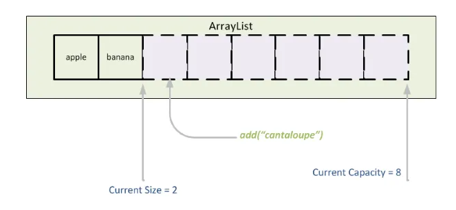
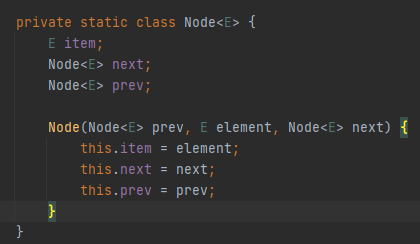
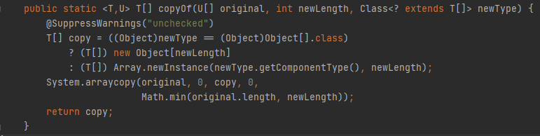
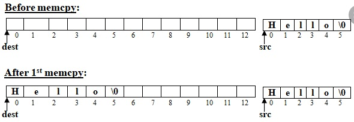
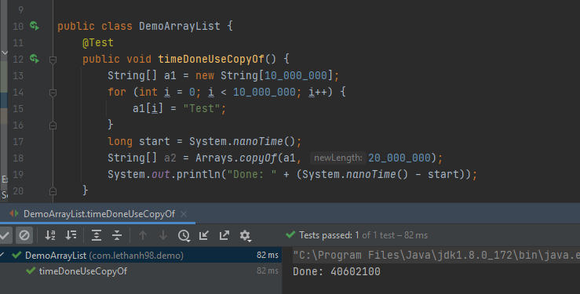
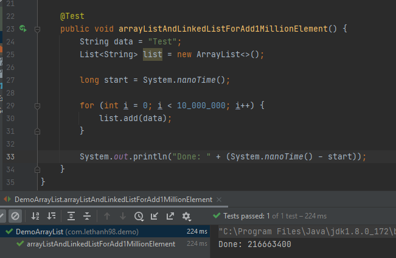
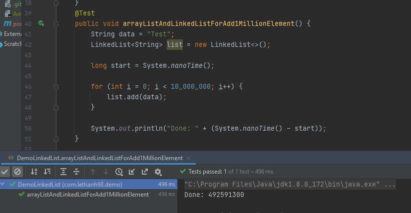

# Thêm 10 triệu data vào cuối list với ArrayList và LinkedList trong java thì dùng cái nào nhanh hơn

Chào mọi người! Một trong những câu hỏi phỏng vấn huyền thoại là so sánh giữa ArrayList và LinkedList. 😊

Về mặt lý thuyết, thuật toán và kiến trúc triển khai, có rất nhiều tài liệu trên sách và blog đã đề cập đến hai loại cấu trúc dữ liệu này. 
 
Tuy nhiên, khi áp dụng vào thực tế, đôi khi chúng ta sẽ thấy rằng thực tế không luôn giống với lý thuyết. Vì vậy, hôm nay mình sẽ so sánh và giải thích để mọi người có cái nhìn cụ thể hơn nhé.

Hãy cùng bắt đầu!

[[TOC]]

## ArrayList

Lý thuyết về ArrayList có vẻ phức tạp với nhiều khía cạnh, nhưng trong bài này, mình chỉ muốn giới thiệu một cách đơn giản thôi nhé. 😊

Arraylist trong java là một collection thuộc List interface trong java. Lõi (Core) của Arraylist sẽ sử dụng 1 Array Object để lưu trữ dữ liệu, mặc định nếu chúng ta khởi tạo với Constructor rỗng thì kích thước của mảng này là 0.
 
. Khi chúng ta thêm dữ liệu lần đầu tiên, ArrayList sẽ tự động mở rộng kích thước của Array Object lên 10.

Khi chúng ta thêm nhiều dữ liệu vào ArrayList, array trong core của ArrayList sẽ bị đầy vì nó là một mảng cố định (fixed size). Do đó, ArrayList sẽ cần mở rộng kích thước của mảng để đảm bảo đủ không gian lưu trữ.

ArrayList mở rộng mảng bằng cách tạo một mảng mới có kích thước cố định lớn hơn so với mảng hiện tại.
 
Tùy thuộc vào logic và cách triển khai cụ thể, nhưng thông thường, kích thước mới sẽ được thiết lập là gấp đôi so với kích thước cũ.
 
Trong Java, thường sử dụng kích thước mới là 1.5 lần kích thước cũ để tối ưu hóa quá trình mở rộng mảng.

Chính vì vậy, thông thường khi chúng ta biết rằng một ArrayList sẽ chứa khoảng 10 triệu dữ liệu, chúng ta có thể tạo sẵn một mảng với kích thước là 10 triệu để tránh việc mở rộng liên tục khi cần thêm dữ liệu.

Có một vấn đề cần lưu ý là vì kích thước của mảng là một số nguyên (int), do đó, chúng ta chỉ có thể lưu trữ dữ liệu với kích thước tối đa bằng giá trị lớn nhất của kiểu dữ liệu int.

## LinkedList

Về lý thuyết, LinkedList cũng tương tự như ArrayList. Có rất nhiều tài liệu trên sách và blog đã đề cập đến chủ đề này nên mình cũng không muốn trình bày thêm nữa. 😊

LinkedList trong java là một collection thuộc List interface trong java. Lõi (Core) của LinkedList sẽ lưu trữ dữ liệu dưới dạng Node nối tiếp nhau.

Mỗi node trong LinkedList sẽ chứa ít nhất một thông tin là mục (item = dữ liệu của Node hiện tại) và nhiều nhất là ba thông tin, bao gồm: dữ liệu của Node hiện tại, địa chỉ tham chiếu của node trước đó, và địa chỉ tham chiếu của node tiếp theo.

Khi chúng ta thêm một dữ liệu mới vào LinkedList, quy trình sẽ cần làm 2 bước.
1. Tạo mới node và gắn giá trị của node vào item, và lấy về tham chiếu node cuối để gắn tham chiếu vào prev
2. Vào node trước đó và gắn tham chiếu của node mới vào next.

LinkedList rất đơn giản khi thêm dữ liệu, chúng ta chỉ cần tạo một đối tượng bao gồm dữ liệu (Node) và thiết lập thông tin liên kết giữa các node là xong.
 
Với LinkedList, không cần lo lắng về việc mảng đầy, do đó chúng ta có thể thêm gần như vô tận dữ liệu (miễn là RAM có đủ dung lượng).

## Thêm 10 triệu data vào cuối list với ArrayList và LinkedList trong java thì dùng cái nào nhanh hơn ?

Ở đây, mình sẽ chỉ giới thiệu hai khía cạnh chính, đó là logic thuật toán (hoặc có thể là kiến trúc) và cách triển khai.

### Câu trả lời với logic thuật toán.

Với câu trả lời này, mình xin lưu ý trước với các bạn là nó áp dụng trong java language và jvm là OpenJDK hoặc của oracle. Với các ngôn ngữ khác, jvm khác hoặc thư viện khác thì có thể triển khác sẽ khác.

#### ArrayList {#ArrayList_2}

ArrayList sẽ tốn rất nhiều chi phí để copy toàn bộ dữ liệu của Array cũ đến Array mới. Tưởng tưởng chút, nếu chúng ta dùng lệnh for để copy 10 triệu data sang, chắc sẽ toang đấy.

Tuy nhiên các anh em viết java và jvm đã kết hợp với nhau rất thông minh.

Tại tầng jvm sử dụng code C++ hoặc 1 số ngôn ngữ bậc thấp khác thường sẽ chạy cực nhanh, anh em đã xây dựng 1 function cho chúng ta tên là `arraycopy`. Như hình ảnh dưới đây là việc java gọi đến code native arraycopy.

##### Arraycopy
Tại tầng code native trong jvm, trong impl của arraycopy, với OpenJDK hoặc của oracle đang sử dụng `memcpy` một function của C sử dụng để copy memory, việc copy này rất là nhanh.

Tương tự ví dụ trong ảnh, nếu chúng ta có 2 array

Array 1 có length = 10.000.000
 
Array 2 có length = 20.000.000
 
Khi chúng ta thực hiện copy tất cả data từ array 1 đến array 2. Memcpy sẽ thực hiện bằng cách bê memory từ array 1 và ghi vào memory  của array 2.

Tốc độ của Memcpy  lên đến vài GB/s, và chúng ta copy cũng chỉ là copy các reference các object thôi, nên rất nhanh.

Trong ví dụ trên với 10 triệu data, mỗi một reference lưu trữ trong index của array là 4 byte. 4 * 10.000.000 = 40.000.000 = 40mb. Vì vậy nếu copy 10 triệu data thì chúng ta sẽ cần copy 40mb trên memory.

Như ảnh ví dụ ở trên, khi copy 10 triệu data đến 1 array mới với 20 triệu data. Chúng ta chỉ mất 40 millis giây (1 millis = 1 triệu nanoseconds). Vì vậy trong java việc copy một array cũ đến một array mới thì tốc độ sẽ được đảm bảo nhanh nhất có thể.

##### KẾT QUẢ TEST CHO THÊM 10 TRIỆU DATA VÀO ARRAYLIST

Tổng thời gian sử dụng là 216 triệu nanoseconds. Vì vậy mất khoảng 216 milliseconds và bằng 0.2 giây 😀

#### LinkedList

LinkedList thì ngon mà nhỉ. Có tốn chi phí nào đâu? không cần mở rộng array chỉ cần thêm ở cuối là xong.
 
Nhưng.
 
Mỗi khi bạn thêm một data vào LinkedList  chúng ta sẽ cần tạo thêm một object trung gian đó là Node.

Có lẽ bạn chưa biết, việc tạo mới một đối tượng và quản lý nó đòi hỏi rất nhiều tài nguyên và thời gian.  
Khi chúng ta thêm 10 triệu dữ liệu vào LinkedList, đồng nghĩa với việc chúng ta sẽ tạo 10 triệu đối tượng Node.

Chưa nói đến dữ liệu, chỉ với 10 triệu đối tượng Node, mỗi đối tượng Node sẽ tốn 24 byte để lưu trữ. Như vậy, chúng ta sẽ có 24 byte * 10 triệu = khoảng 220 MB. Điều này có nghĩa là ít nhất thì Java đã phải tạo thêm 220 MB bộ nhớ và liên tục quản lý nó.

Và một điều rất quan trọng nữa, trong LinkedList, các Node sẽ liên kết với nhau thành một chuỗi (chain), và Java sẽ cần quản lý các tham chiếu cho 10 triệu đối tượng. Điều này cũng là một vấn đề gây tốn tài nguyên rất nhiều.

Ví dụ ở trên là 1 ví dụ đơn giản giả lập cách hoạt động của Node trong LinkedList. Khi mình thêm 10 triệu data thì tốn 0.49 giây.

## Kết luận :
Với hiệu suất cho việc thêm 10 triệu hoặc 100 triệu…. data vào last của ArrayList hoặc LinkedList thì.
 
1. ArrayList  sẽ nhanh hơn.
 
2. Arraylist sẽ tốn ít memory hơn.
