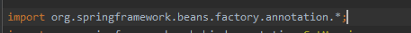
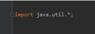
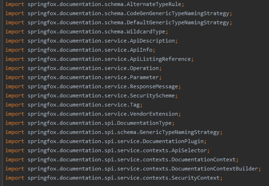
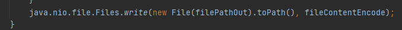

# Sự khác biệt giữa import wildcard và import một class trong java

Trong Java, khi chúng ta muốn sử dụng một class nào đó, thông thường sẽ sử dụng từ khóa **import**.
<br/>
Các công cụ hỗ trợ như IDE thường cung cấp các cài đặt mặc định cho phong cách code khi sử dụng "import".
<br/>
Có hai cách phổ biến để sử dụng import: **import wildcard** và **import trực tiếp một class**.

Hãy cùng bắt đầu tìm hiểu sự khác biệt của hai cách đó nhé!

[[TOC]]

## Import wildcard(One for all package)

Đúng như vậy, One for All chỉ cần import một lần, sau đó chúng ta có thể sử dụng tất cả các class trong package đó.

Dễ nhận diện nhất trong cách import wildcard là khi thấy ký hiệu **\*** ở cuối import. Ký hiệu này đại diện cho tất cả các class trong package, không bao gồm các sub folder.



Ví dụ, nếu bạn sử dụng List, ListResourceBundle, Locale, Random, LongSummaryStatistics, và Map, tất cả đều thuộc package java.util.
<br/>
Chúng ta có thể sử dụng import cho cả package đó và chỉ cần thực hiện import một lần duy nhất trong class mà chúng ta sử dụng.
```
import java.util.*
```

Cách import này thường được gọi trong tài liệu là **Import wildcard**



Sử dụng import wildcard sẽ giúp ngắn gọn và tránh tình trạng import dài và khó nhìn trên một class.
<br/>
Lưu ý: Khi sử dụng import package, chỉ các class trong package đó mới có thể được import. Các sub package sẽ không được import.

## One For One ( import trực tiếp một class )

**Import Class** là **One For One**, nghĩa là mỗi dòng import chỉ áp dụng cho một class.
<br/>
Để import nhiều class từ bên ngoài và sử dụng chúng, chúng ta cần sử dụng nhiều dòng import để đưa từng class vào.

Các import sẽ cần được chỉ định rõ ràng để xác định class nào cần được sử dụng.
<br/>
Kiểu Import trực tiếp một class thì dễ nhận biết nhất là không có ký hiệu * ở cuối. Chúng ta sẽ chỉ rõ trực tiếp đến class nào cần được import.


Việc sử dụng import class giúp chúng ta dễ dàng nhận biết rằng chúng ta đang sử dụng những class nào từ bên ngoài để hỗ trợ cho class hiện tại của chúng ta.
<br/>
Như trong ví dụ trên, ta có thể ngay lập tức nhận biết rằng đang sử dụng Operation và Parameter từ thư viện SpringFox mà không cần phải đọc mã nguồn ở dưới để xác định.

## Ưu và nhược điểm của 2 loại import

### Performance ( Hiệu suất).
**Tại thời điểm Runtime** thì import wildcard và import class sẽ không có sự khác biệt. Cả 2 vẫn sẽ có tốc độ giống nhau, tuy nhiên tại thời điểm compiler thì sẽ có sự khác nhau.

**Import wildcard**: Tại thời điểm compiler, java compiler sẽ tiến hành phân tích code để tìm kiếm các class sử dụng và thay thế import wildcard bằng import class.

**Import Class** : Tại thời điểm compiler, java compiler sẽ không cần phân tích như trường hợp ở Import wildcard.

**Kết quả Performance:** Bởi vì Import wildcard yêu cầu phải phân tích mã nguồn của chúng ta để xác định những class chúng ta đang sử dụng trong các Import wildcard, nó có thể gây một chút độ trễ so với Import Class.

Tuy nhiên với các dự án nhỏ sẽ không quá ảnh hưởng vì nó sẽ chậm hơn không đáng kể. Nhưng với các dự án có lượng code lớn lên tới hàng triệu line code thì sẽ có sự ảnh hưởng lớn.

### Gọn code.

**Import wildcard** sẽ dễ nhìn hơn, nếu chúng ta sử dụng nhiều class trong cùng 1 package ví dụ là 100 class  thì với **Import Class** chúng ta sẽ mất 100 line code cho việc này. Với **Import wildcard** thì đơn giản hơn, chúng ta thì cần 1 import là xong.

**Import class** nếu sử dụng nhiều class trong cùng 1 package và sử dụng rất nhiều thì sẽ gây nhiều dòng trong file code của chúng ta, no sẽ gấy dối và khó chịu.

**Kết quả gọn code:** **Import wildcard** sẽ gọn code hơn

### Khả năng đọc hiểu ( clean code )

**Import wildcard** chúng ta sẽ khó biết class nào được được import, chúng ta chỉ biết rằng mình có sử dụng class trong package này, chúng ta cần đọc code logic để tìm ra chúng ta đang dùng các class nào.

**Import class** đọc các line Import ở đầu class, chúng ta sẽ dễ ràng biết được rằng trong file code java này chúng ta đã sử dụng các class bên ngoài nào.

**Khả năng đọc hiểu:** **Import class** sẽ dễ đọc hiểu hơn

### Xung đột khi đặt tên
**Import wildcard** Khi chúng ta có 2 class cùng tên trong 2 package khác nhau, nếu chúng ta sử dụng **Import wildcard** cả 2 package thì compiler sẽ không biết tại thời điểm nào chúng ta sử dụng class nào.
<br/>
Trong trường hợp này, tại thời điểm compiler java sẽ báo lỗi

**Import class** với import class chúng ta có thể chỉ rõ class path sử dụng tại trong file code của chúng ta.
<br/>
Vì vậy trong trường hợp 2 hoặc nhiều package có cùng tên class thì cũng không có vấn đề gì cả.


## Tổng kết
Vậy là mình đã giải thích cho các bạn ý nghĩa của 2 cách import trong java, mỗi một loại import đều sẽ có ưu và nhược điểm riêng của nó.

Tuy nhiên sau nhiều năm kinh nghiệm của mình, mình nhận thấy rằng

:::tip Gợi ý
Nên ưu tiên sử dụng **Import class**, **Import class** sẽ giúp người đọc file code dễ hiểu các import chúng ta đã sử dụng, làm gì và tránh các lỗi xung đột…
:::
