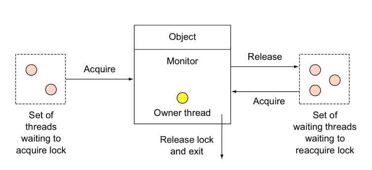
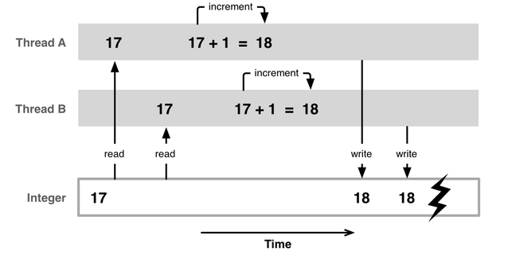
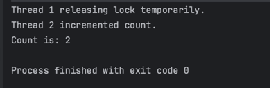

# Thread safe, Lock object là gì ?

Xin chào mọi người,

Hôm nay, tôi đã có dịp tham gia một buổi Seminar thú vị cùng anh Bảo ([Nguyễn Quốc Bảo](https://www.facebook.com/bao.bao.bm)) - một đồng nghiệp cũ từng sát cánh cùng tôi. Anh Bảo đã dành thời gian để chia sẻ kiến thức sâu sắc về Concurrency và Thread, và tôi phải nói rằng có những phần trong bài thuyết trình của anh ấy thật sự là rất bổ ích.
<br/>
Nhờ có buổi seminar này, tôi đã hiểu rõ hơn nhiều về các khái niệm này và cách chúng tác động đến lập trình hiện đại.

Trong seminar, hai khái niệm được nhấn mạnh với mức độ quan trọng cao là Thread safety và Object locks. 
<br/>
Hãy cùng mình khám phá, tìm hiểu về Thread safety và Object locks nhé.


[[TOC]]

## Thread safe là gì ?

**Thread Safe** thật sự là một thuật ngữ gây tò mò, có vẻ như nó đề cập đến một thread không bị **chết**, vận hành nhanh chóng và ổn định. 😀 Tuy nhiên, thực tế không phải như thế.

**Thread Safe** là một khái niệm quan trọng trong lập trình máy tính, nhất là trong bối cảnh mà mã lệnh được thực thi đa luồng (**Multi-threaded**). 

Khi nói đến **Thread Safe**, ta đang nói đến việc đảm bảo rằng các thao tác truy cập và sửa đổi dữ liệu `được chia sẻ giữa các threads` diễn ra một cách chính xác và an toàn, mà không gặp phải các tác động ngoài ý muốn hay sự cạnh tranh tiềm ẩn giữa chúng.

Trong cơ chế Thread Safe, các thao tác này được thiết kế sao cho tuân theo đúng logic và các ý đồ của người lập trình, đề phòng hiện tượng ghi chồng lên nhau hoặc đọc dữ liệu sai lệch - những sự kiện có thể khiến ứng dụng trở nên không ổn định hoặc thậm chí là hỏng hóc.
### Ví dụ


Ảnh trên là một ví dụ điển hình về vấn đề không Thread Safe. 

Trong trường hợp này, hai luồng (Thread A và Thread B) cùng cố gắng thực hiện việc tăng một biến kiểu Integer.

Hai luồng cùng đọc giá trị hiện tại là 17 và đều tính toán giá trị mới sẽ là 18. Mặc dù mỗi thread đều thể hiện hành động **tăng biến số** riêng biệt, do cùng sửa đổi một biến chung mà không có đồng bộ hóa (synchronization), kết quả cuối cùng của biến chỉ tăng lên 1 đơn vị, trở thành 18 thay vì 19 như mong đợi sau hai lần tăng.

Điều này dẫn đến Race Condition, nghĩa là kết quả của việc thực thi mã phụ thuộc vào thứ tự hoặc thời gian mà các threads truy cập dữ liệu chia sẻ.

Để giải quyết sự cố này và **đạt được Thread Safety**, các cơ chế đồng bộ hóa như locks, semaphores hoặc các cơ chế cao cấp hơn như atomic operations hoặc transactional memory có thể được sử dụng để đảm bảo rằng chỉ có một thread có thể sửa đổi biến tại một thời điểm, từ đó đảm bảo tính chính xác và an toàn của các thao tác.

### code demo không Thread Safety
```java
import java.util.concurrent.CountDownLatch;

public class MainTest {
    private int count = 0;

    public static void main(String[] args) throws InterruptedException {
        MainTest test = new MainTest();
        int iMax = 100000;
        CountDownLatch countDownLatch = new CountDownLatch(iMax);
        for (int i = 0; i < iMax; i++) {
            new Thread(() -> {
                test.incrementCount();
                countDownLatch.countDown();
            }).start();
        }
        countDownLatch.await();
        System.out.println(test.count);
    }

    public void incrementCount() {
        count++;
    }
}
```

Trong code demo ở trên, việc tạo 100.000 luồng (Thread) và gọi phương thức `incrementCount` dự kiến sẽ tăng giá trị của biến đếm lên 100.000. Tuy nhiên, vì code này không đảm bảo Thread Safety, kết quả có được sau mỗi lần chạy không nhất quán, đôi khi là chính xác 100.000 nhưng cũng có thể thấp hơn, phản ánh sự không đồng bộ giữa các luồng khi cùng sửa đổi biến chia sẻ.

Nếu chúng ta lần lượt chạy code này 5 lần, do sự không đồng bộ mà kết quả có thể sẽ khác nhau mỗi lần. Đây là một biểu hiện rõ ràng của hiện tượng race condition, khiến cho lập trình viên không thể đoán trước được kết quả chính xác:

1. Lần chạy thứ nhất: 98,123
2. Lần chạy thứ hai: 99,431
3. Lần chạy thứ ba: 98,722
4. Lần chạy thứ tư: 99,003
5. Lần chạy thứ năm: 100,000

Mỗi lần chạy cho ra một kết quả khác nhau, chủ yếu thấp hơn con số mong đợi 100.000, bởi vì những tác động đồng thời không được đồng bộ hóa đúng cách, dẫn đến việc bị **đè** lên giá trị của các luồng trước đó.

Để đảm bảo Thread Safety, có một loạt các cơ chế và phương pháp khác nhau. Trong số đó, việc sử dụng Lock Object là một trong những phương pháp phổ biến nhất.

## Lock object là gì ?

Lock Object hoạt động như một cơ chế bảo vệ hoặc chiếm quyền truy cập(Acquire the Lock), đảm bảo rằng một tài nguyên được sử dụng bởi một thread tại một thời điểm, và ngăn chặn các thread khác truy cập tài nguyên đó cho đến khi lock được giải phóng quyền truy cập(Release the Lock).


Để hiểu một cách đơn giản, hãy tưởng tượng Lock Object như là một chìa khóa cho một căn phòng chứa tài nguyên. 

Chỉ một người (thread) cầm chìa khóa có thể vào phòng và sử dụng tài nguyên tại một thời điểm. Khi họ rời phòng, họ sẽ trả lại chìa khóa để người tiếp theo có thể vào. Điều này ngăn chặn tình trạng **chật chội** trong phòng và đảm bảo rằng mọi người đều có cơ hội sử dụng tài nguyên một cách có trật tự và an toàn.

Sử dụng Lock Object là một phương pháp đồng bộ hóa cho phép các threads luôn có thể đọc được dữ liệu mới nhất, vì một thread chỉ có thể truy cập và thay đổi tài nguyên sau khi thread khác đã hoàn tất công việc của mình và giải phóng quyền truy cập.

Mặc dù phương pháp này đem lại hiệu quả cao ở khía cạnh đồng bộ hóa và khá dễ triển khai, nó cũng đi kèm với một số hạn chế:

## Các hạn chế của Lock object

### Thời gian chờ đợi (Latency): 
Nếu lock được giữ trong thời gian dài, các threads khác phải đợi cho đến khi lock được giải phóng, điều này có thể tạo ra độ trễ (latency) và giảm hiệu suất ứng dụng.

### Deadlocks: 
Khi hai hoặc nhiều threads đợi lẫn nhau giải phóng lock mà mỗi thread đang giữ, không có tiến trình nào có thể tiếp tục, và hệ thống rơi vào trạng thái bế tắc, tức là deadlock.

### Thử tự mới (Priority Inversion): 
Trong một số trường hợp, thread có độ ưu tiên thấp có thể giữ lock trong khi thread có độ ưu tiên cao hơn phải chờ đợi, dẫn đến hiện tượng **priority inversion.**

### Scalability: 
Việc sử dụng quá nhiều locks có thể khiến chương trình khó scale hơn, đặc biệt là trong các hệ thống lớn với nhiều threads cùng hoạt động, do việc quản lý locks trở nên phức tạp.


## Cách thức hoạt động của Lock object trong java


Hình ảnh phía trên là mình họa về Lock Object. Ở ảnh sẽ có 1 số Keywork mà bạn nên lưu ý.

```
- Set of threads waiting to acquire lock (Tập hợp các thread chờ chiếm tài nguyên)
- Acquire
- Object
- Monitor
- Owning thread
- Release
- Set of waiting threads waiting to reacquire lock (Tập hợp các thread đang chờ để tái chiếm lấy lock)
```

### Set of threads waiting to acquire lock (Tập hợp các thread chờ chiếm tài nguyên)
Đây là tập hợp các threads đang đợi quyền truy cập vào tài nguyên và sẽ chờ cho đến khi lock được giải phóng bởi thread hiện tại đang giữ lock.

### Acquire (Chiếm lấy)
Đây là hành động mà thread thực hiện để giành được lock trước khi nó có thể truy cập an toàn vào một tài nguyên chia sẻ.

Khi một thread đến **Monitor** và yêu cầu truy cập, nếu monitor không bị chiếm giữ, thread có thể **acquire** (chiếm lấy hoặc giành lấy) monitor để bắt đầu công việc trên tài nguyên được bảo vệ.

### Object

Trong ngữ cảnh này, **Object** đề cập đến tài nguyên hoặc dữ liệu mà threads cố gắng chiếm quyền truy cập để thực hiện các thao tác.

### Monitor

Monitor trong lập trình đa luồng là một cơ chế đồng bộ hóa cao cấp giúp kiểm soát việc truy cập vào một đối tượng được chia sẻ giữa các threads khác nhau. Mỗi monitor gắn liền với một đối tượng và nó đảm nhiệm việc đồng bộ hóa truy cập đến đối tượng đó.

Monitor bao gồm hai thành phần chính:

1. **Các biến điều kiện (Condition Variables)**: Cho phép các threads đợi cho đến khi một điều kiện cụ thể được thỏa mãn.

2. **Phần thân của Monitor (Monitor**s Body)**: Là đoạn mã mà chỉ có một thread được phép thực thi tại một thời điểm.

Cụ thể hơn, khi một thread muốn truy cập vào tài nguyên được bảo vệ bởi monitor, nó phải trước hết **acquire** monitor cho đối tượng đó. Khi thread đã **acquire** monitor, nó trở thành **owning thread** và có thể thực thi mã trong phần thân của monitor. Nếu trong khi một thread đang sở hữu monitor và một thread khác cũng cố gắng truy cập tài nguyên này, thread đó sẽ phải đợi cho đến khi monitor được giải phóng.

Việc sử dụng monitor đảm bảo tính toàn vẹn của dữ liệu bằng cách ngăn chặn các truy cập đồng thời, giúp tránh được race condition và các vấn đề đồng bộ hóa liên quan đến việc quản lý truy cập vào tài nguyên chia sẻ. Monitor cung cấp một phương thức đồng bộ hóa có cấu trúc rõ ràng, thường được ưa chuộng vì tính an toàn và dễ dàng sử dụng của nó trong quá trình thiết kế và triển khai các phần mềm phức tạp dựa trên mô hình đa luồng.

### Owning thread
Khi một thread đã **acquire the monitor** thành công, nó trở thành **owning thread (thread sở hữu)** và có quyền kiểm soát tài nguyên đó cho đến khi nó hoàn thành. Trong khoảng thời gian này, không có thread khác có thể **acquire monitor** và truy cập vào tài nguyên đó.

### Release the monitor (Giải phóng monitor)

Khi thread sở hữu hoàn thành các thao tác cần thiết của nó với tài nguyên, nó sẽ **release (giải phóng)** monitor. Việc này cho phép các thread khác có cơ hội để **acquire monitor** và bắt đầu sử dụng tài nguyên.

### Set of waiting threads waiting to reacquire lock (Tập hợp các thread đang chờ để tái chiếm lấy lock)

Nó thường đề cập đến một nhóm threads đã từng sở hữu lock trước đó và bây giờ đang chờ đợi cơ hội để cắt lấy lock trở lại sau khi nó được giải phóng bởi thread hiện tại. Các threads trong tập hợp này có thể đã phải giải phóng lock tạm thời do một lý do nào đó, như là sự chờ đợi của một condition variable hoặc do một hệ thống lập lịch đa luồng. Khi điều kiện cho phép, chúng sẽ cố gắng tái chiếm lock để tiếp tục công việc của mình.

## Ví dụ:

Giả sử có một tài nguyên chia sẻ (như một object cụ thể trong mã lập trình) nơi một thread (gọi là Thread A) đang giữ lock và thực hiện một số thao tác. Bởi vì Thread A này cần truy cập vào một tài nguyên khác hoặc chờ một sự kiện nào đó xảy ra để nó có thể tiếp tục thực hiện (ví dụ: chờ một response từ server), nó sẽ tạm thời release lock và đặt mình vào trạng thái **waiting.**

Trong khi đó, các threads khác (Thread B, Thread C, v.v.) đang chờ đợi cơ hội để **acquire** lock đó và sử dụng tài nguyên chia sẻ. Tuy nhiên, vì Thread A vẫn cần hoàn thành công việc của mình và sẽ cần **reacquire** lock sau khi điều kiện cho phép, nên nó không thực sự thoát khỏi hàng đợi mà thay vào đó, nó vẫn là một phần của **set of waiting threads** đang chờ để tái chiếm lock một khi nó có thể tiếp tục công việc.

Khi điều kiện được thỏa mãn chẳng hạn như response từ server được nhận Thread A sẽ cố gắng **reacquire** lock. Nếu nó thành công, nó có thể tiếp tục công việc mà không làm mất tiến trình. Trong trường hợp này, **set of waiting threads waiting to reacquire lock** chính là các threads đã từng giữ lock và cần phải tái chiếm lock để hoàn thành công việc của mình

## Ví dụ code:
Java cung cấp từ khóa synchronized để giúp thực hiện việc đồng bộ hóa:
```java
synchronized(lock) {
    // Mã được bảo vệ bởi lock
}
```
Khi một thread bước vào khối synchronized, nó chiếm lock và các thread khác phải đợi cho đến khi thread hiện tại trả lại lock. Điều này ngăn chặn sự xung đột giữa các threads khi sử dụng tài nguyên chung.


```java
class Counter {
    private int count = 0;
    private final Object lock = new Object();

    public void increment() {
        synchronized (lock) {
            count++;
            // Giả sử có một điều kiện khiến thread này phải chờ
            try {
                System.out.println(Thread.currentThread().getName() + " releasing lock temporarily.");
                lock.wait();
            } catch (InterruptedException e) {
                e.printStackTrace();
            }
        }
    }

    public void incrementByOtherThread() {
        synchronized (lock) {
            count++;
            System.out.println(Thread.currentThread().getName() + " incremented count.");
            // Thông báo cho thread khác rằng nó có thể tiếp tục
            lock.notify();
        }
    }

    public void printCount() {
        System.out.println("Count is: " + count);
    }
}

public class ThreadExample {
    public static void main(String[] args) {
        Counter counter = new Counter();

        Thread thread1 = new Thread(new Runnable() {
            @Override
            public void run() {
                counter.increment();
            }
        }, "Thread 1");

        Thread thread2 = new Thread(new Runnable() {
            @Override
            public void run() {
                // Chờ một chút để đảm bảo thread1 bắt đầu trước.
                try {
                    Thread.sleep(100);
                } catch (InterruptedException e) {
                    e.printStackTrace();
                }
                counter.incrementByOtherThread();
            }
        }, "Thread 2");

        thread1.start();
        thread2.start();

        try {
            thread1.join();
            thread2.join();
        } catch (InterruptedException e) {
            e.printStackTrace();
        }

        counter.printCount(); // Dự kiến là 2 nếu không có xung đột dữ liệu.
    }
}
```
Ở trên là một ví dụ về Java mô phỏng tình huống mà trong khi một thread đang chờ đợi một lock, một thread khác chiếm lấy lock đó và có thể thay đổi dữ liệu. Chúng ta sẽ sử dụng một biến đếm làm tài nguyên chia sẻ và sẽ triển khai lock thông qua hàm synchronized.

Trong ví dụ này, thread1 bắt đầu thực thi và gọi phương thức increment, đồng thời có phần code chiếm lock và sau đó tạm thời wait khiến cho thread giải phóng lock nhưng vẫn ở trạng thái chờ để thực thi tiếp. Trong lúc đó, thread2 có cơ hội bắt đầu và chiếm lấy lock bằng cách gọi phương thức incrementByOtherThread để tăng biến count, sau đó nó gọi notify để thông báo cho các thread đang chờ lock có thể tiếp tục.

Khi thread1 nhận được thông báo này (sau khi thread2 giải phóng lock), nó có thể tiếp tục việc thực thi. Giá trị cuối cùng của count phụ thuộc vào việc đường dẫn của mã có xử lý đúng các hoạt động đồng thời hay không. Như đã đề cập trong ví dụ, nếu không có xung đột dữ liệu, kết quả dự kiến sẽ là 2, bởi vì mỗi thread đều tăng count một lần.



Khi **Set of waiting threads waiting to reacquire lock** không bao giờ Acquire thì một Dealock sẽ xảy ra, nó sẽ chờ mãi mãi.

## Tổng kết
Thread safety và lock objects là các thành phần quan trọng của lập trình đa luồng và giúp các ứng dụng hoạt động một cách ổn định và an toàn hơn trong môi trường đa luồng. 

1. Thread safe, Lock object là gì?
Thread safety và object locks là hai khái niệm quan trọng trong lập trình đa luồng. Thread safety đảm bảo rằng một đoạn mã có thể được thực thi an toàn bởi nhiều threads mà không gây ra xung đột, trong khi object locks là một cơ chế đồng bộ hóa nhằm kiểm soát việc truy cập vào các tài nguyên chia sẻ.

2. Thread safe là gì?
Thread safe là khả năng của một đoạn mã cho phép nhiều threads thực thi mà không ảnh hưởng tới môi trường xung quanh một cách không mong muốn. Điều này bảo vệ dữ liệu khỏi bị sửa đổi một cách không an toàn, giảm thiểu các hiện tượng như race conditions và deadlocks.

3. Lock object là gì?
Lock object là một phương tiện để đảm bảo rằng chỉ một thread có thể truy cập vào một tài nguyên cụ thể tại một thời điểm. Khi một thread muốn sử dụng tài nguyên, nó phải **được cấp quyền** (acquire) truy cập bằng việc **đạt được** (obtain) một lock. Một khi thread hoàn tất việc sử dụng tài nguyên, nó **phải trả lại quyền** (release) lock để các thread khác có thể sử dụng tài nguyên đó.

4. Hạn chế của Lock object
Các hạn chế bao gồm việc gây ra thời gian chờ đợi (latency), nguy cơ xảy ra deadlocks và priority inversions, cũng như vấn đề về scalability, đặc biệt là trong các hệ thống lớn có nhiều threads hoạt động đồng thời.

5. Cách thức hoạt động
Lock object hoạt động theo cơ chế monitor, cho phép các threads lấy và trả lock, và các threads khác phải đợi cho đến khi lock được trả lại trước khi có thể tiếp tục thực thi.

