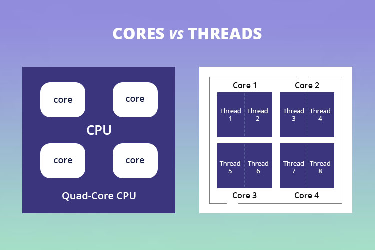

# Thread ứng dụng phần mềm và Thread hardware CPU khác gì nhau

Xin chào mọi người,

Trong cộng đồng lập trình, có một số nhầm lẫn phổ biến xung quanh khái niệm của **Thread**, và điều này trở nên bối rối hơn khi các lập trình viên thường tiếp xúc nhiều với Thread trong ứng dụng, nơi các đoạn mã của chúng ta tạo ra các Thread để xử lý bất đồng bộ công việc.

Bản thân tôi cũng đã từng có một khoảng thời gian bối rối về khái niệm **Thread**

 
Hãy cùng mình khám phá, tìm hiểu về khái niệm Thread trên ứng dụng và Thread trên CPU nhé.

[[TOC]]

## Thread ứng dụng phần mềm (Software Threads)

Thread ứng dụng, thường được biết đến như là thread ở cấp độ phần mềm, là một đơn vị được hệ điều hành tạo, lập lịch trình và quản lý. 

Một ứng dụng có thể chia thành nhiều thread để thực hiện các nhiệm vụ khác nhau đồng thời. Mỗi thread có thể thể hiện một luồng thực thi độc lập trong một chương trình.

### Đặc điểm của Thread ứng dụng (Software Threads)

1. Thread được tạo và quản lý bởi hệ điều hành.
2. Có thể tạo nhiều thread trong cùng một quá trình (process) để thực thi song song.
3. Việc chuyển đổi giữa các thread (context switching) để CPU xử lý logic do hệ điều hành quản lý có thể tạo điều kiện tối ưu hóa việc sử dụng CPU.
4. Phù hợp để thực hiện đa nhiệm cấp ứng dụng và cải thiện hiệu suất khi chạy trên nhiều lõi.

## Thread trên CPU (Hardware Threads)

Trong CPU, khái niệm **thread** thường liên quan đến **hardware threading** nghĩa là khả năng của CPU để xử lý nhiệm vụ. 
Cụ thể hơn, đây là khả năng mà mỗi lõi CPU (core) có thể xử lý một hoặc nhiều luồng thực thi độc lập cùng một thời điểm. Công nghệ này được biết đến với các tên gọi như [Simultaneous Multithreading (SMT)](2024-01-09-cpu-core-and-thread-khac-gi-nhau.md) trong bộ vi xử lý của [AMD](https://www.amd.com) hay [Hyper-Threading (HT)](2024-01-09-cpu-core-and-thread-khac-gi-nhau.md) trong bộ vi xử lý của [Intel](https://www.intel.com/).

Khi một CPU hỗ trợ threading ở cấp độ phần cứng, mỗi lõi CPU (core)  có thể chia sẻ tài nguyên của nó (như unit tính toán, bộ nhớ cache) giữa hai hoặc nhiều thread, cho phép chip xử lý nhiều luồng dữ liệu đồng thời. Mỗi **hardware thread** được hệ điều hành nhìn nhận như một lõi CPU ảo, và có thể được lập lịch để chạy các chương trình hoặc quá trình khác nhau một cách độc lập với nhau.

Sự khác biệt giữa khái niệm thread trong ứng dụng phần mềm và thread trên CPU là một thread phần mềm (software thread) có thể chạy trên bất kỳ thread phần cứng (hardware thread) nào mà hệ điều hành quản lý và lập lịch. Số lượng thread phần mềm thường nhiều hơn nhiều so với số lượng thread phần cứng có thể hỗ trợ.

Vì vậy, có thể kết luận rằng trong CPU, khái niệm *thread* có thật và đề cập đến khả năng của CPU để xử lý nhiều nhiệm vụ cùng một thời điểm ở cấp độ phần cứng. Nhưng nó chỉ có nếu CPU hỗ trợ core ảo tức SMT hoặc HT.

### Đặc điểm của Thread trên CPU (Hardware Threads)

1. **Cải thiện độ đồng thời(Concurrency)**: Hardware threads cho phép một lõi CPU xử lý nhiều thread cùng một lúc, nâng cao khả năng đồng thời trong việc thực thi các tác vụ.

2. **Công nghệ threading cấp phần cứng**: Sử dụng công nghệ như [Simultaneous Multithreading (SMT)](2024-01-09-cpu-core-and-thread-khac-gi-nhau.md) trong bộ vi xử lý của [AMD](https://www.amd.com) hay [Hyper-Threading (HT)](2024-01-09-cpu-core-and-thread-khac-gi-nhau.md) trong bộ vi xử lý của [Intel](https://www.intel.com/) để tạo ra nhiều thread có thể hoạt động trên một lõi vật lý.

3. **Tối ưu hóa hiệu suất CPU**: Bằng cách giảm thời gian rảnh và tăng tỷ lệ sử dụng tài nguyên của CPU, hardware threads giúp tối ưu hóa hiệu suất của CPU, đặc biệt trong các tình huống có nhiều nhiệm vụ phụ thuộc vào I/O hoặc các hoạt động chờ đợi khác.

4. **Nhận biết và quản lý bởi hệ điều hành**: Hệ điều hành nhận biết và quản lý hardware threads như các lõi logic, cho phép chia sẻ tài nguyên và phân phối các nhiệm vụ giữa chúng một cách hiệu quả.

5. **Số lượng giới hạn**: Số lượng hardware threads mà một CPU có thể hỗ trợ phụ thuộc vào thiết kế và kiến trúc cụ thể của CPU đó. Không giống như software threads, bạn không thể tạo nhiều hardware threads bất kỳ, số lượng này cố định và do nhà sản xuất CPU xác định.

## Tổng kết

Thread phần mềm và thread phần cứng là hai khái niệm độc lập; thread phần mềm có thể chạy trên bất kỳ thread phần cứng nào, nhưng số lượng thread phần mềm thường lớn hơn và chỉ thực sự hiệu quả khi CPU hỗ trợ SMT hoặc HT.

1. **Thread ứng dụng phần mềm (Software Threads)**: Được tạo, quản lý và lập lịch điều hành bởi hệ điều hành, cho phép thực thi nhiều luồng thực thi độc lập trong cùng một chương trình.

2. **Đặc điểm của Thread ứng dụng**: Nhiều thread có thể tồn tại trong một quá trình (process), chuyển đổi (context switching) giữa chúng để tăng hiệu suất, đặc biệt khi chạy trên hệ thống nhiều lõi.

3. **Khả năng của CPU khi hỗ trợ hardware threading**: Cho phép chia sẻ tài nguyên giữa các thread phần cứng, với hệ điều hành nhận diện mỗi hardware thread như một lõi CPU ảo.
