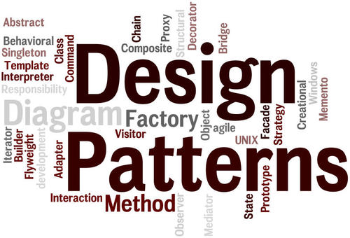

# Tìm hiểu về Design Pattern
Chào mọi người,

Gần đây, mình nhận thấy một số bạn đã gửi câu hỏi liên quan đến các Mẫu thiết kế(**Design Pattern**) và [Kiến trúc Phần mềm(**Architecture**)](2024-02-01-tim-hieu-ve-architecture.md), điều đó cho thấy có một sự nhầm lẫn nhất định giữa hai khái niệm này trong cộng đồng. 

Vì lẽ đó, mình quyết định viết bài viết này nhằm mang lại cái nhìn rõ ràng và chi tiết cho mọi người về những điểm tương đồng và khác biệt giữa **Design Pattern** và [**Architecture( Kiến trúc phần mềm )**](2024-02-01-tim-hieu-ve-architecture.md), hy vọng rằng sau bài viết này, mọi khúc mắc sẽ được giải tỏa.
 

Để không ngợp kiến thức, mình dự định sẽ viết thành 3 bài.
1. Hiểu về **Design Patterns**
2. Hiểu về [**Architecture( Kiến trúc phần mềm )**](2024-02-01-tim-hieu-ve-architecture.md)
2. So sách sự khác biệt

Trước tiên, hãy cùng nhau khám phá ý nghĩa và tầm quan trọng của **Design Pattern** từ đó dẫn dắt đến nhận thức sáng tỏ về sự phân biệt giữa hai.

[[TOC]]

## Design Patterns

### **Design Patterns** là gì ?

**Design Pattern** hay **Mẫu thiết kế phần mềm**, là một giải pháp tiêu chuẩn để giải quyết những vấn đề thường gặp trong thiết kế phần mềm.

**Design Pattern** không phải là một đoạn mã code cụ thể, mà là một mô tả hoặc mẫu mô phỏng cho cách giải quyết một vấn đề, có thể được sử dụng trong nhiều tình huống khác nhau.

Thông thường các Design Pattern là các kinh nghiệm về thiết kế của các tiền bối đi trước đã đúc kết ra cho chúng ta.
Các Design Pattern thường đẩy nhanh quá trình phát triển phần mềm bằng cách cung cấp sẵn các mô hình phát triển đã được test và chứng minh.

Các Design Pattern thường tập trung giải quyết các vấn đề và sự hoạt động và mối quan hệ của các Class, method.

Các mẫu thiết kế thường được phân loại thành ba nhóm chính: Creational (Tạo lập), Structural (Cấu trúc) và Behavioral (Hành vi).

### Đặc điểm của Design Patterns

Design Pattern, hay mẫu thiết kế, đóng vai trò quan trọng trong quá trình phát triển phần mềm bằng cách cung cấp những giải pháp đã được kiểm nghiệm để giải quyết các vấn đề thiết kế thường gặp. Dưới đây là một số đặc điểm cơ bản của Design Pattern:

1. **Tái Sử Dụng**: **Design Patterns** được tạo ra dựa trên các giải pháp đã được sử dụng thành công trong quá khứ. Chúng có thể được tái sử dụng trong nhiều dự án phần mềm khác nhau để giải quyết các vấn đề thiết kế tương tự.

2. **Làm Tăng Khả Năng Bảo Trì**: Bằng cách sử dụng các mẫu thiết kế đã được chuẩn hóa, mã nguồn trở nên dễ hiểu và dễ bảo trì hơn, vì mỗi Design Pattern đều có một cấu trúc rõ ràng và một mục đích xác định.

3. **Giải Pháp Mang Tính Trừu Tượng**: Mẫu thiết kế không phải là mã nguồn cụ thể hay thiết kế chi tiết được áp dụng trực tiếp. Thay vào đó, Design Pattern cung cấp mô tả ở mức độ trừu tượng về cách tiếp cận một vấn đề và giải quyết nó.

4. **Cải Thiện Tính Giao Tiếp**: **Design Patterns** sử dụng một ngôn ngữ chung mà các nhà phát triển có thể sử dụng để mô tả giải pháp cho các vấn đề thiết kế một cách ngắn gọn và đúng đắn.

5. **Phân Loại Theo Mục Đích**: **Design Patterns** được chia thành ba danh mục chính: Creational (tạo lập), Structural (cấu trúc), và Behavioral (hành vi), giúp xác định phạm vi của các vấn đề mà chúng giải quyết.

6. **Mô hình Giải Pháp Tối Ưu**: Các Design Pattern thường đề xuất các giải pháp tốt nhất cho một vấn đề cụ thể, giảm thiểu việc tái phát minh bánh xe và tăng cường hiệu suất phát triển.

7. **Phản ánh Kinh Nghiệm Lập Trình**: Mỗi mẫu thiết kế là kết quả của việc tổng hợp kinh nghiệm lập trình qua nhiều năm, được cộng đồng phát triển phần mềm công nhận và ủng hộ.

8. **Tương Thích Đa Ngữ Cảnh**: **Design Patterns** không bị giới hạn bởi một ngôn ngữ lập trình cụ thể và có thể được áp dụng trong các ngữ cảnh sử dụng các ngôn ngữ khác nhau.

9. **Áp dụng Linh Hoạt**: Mặc dù mỗi Design Pattern cung cấp một khung giải pháp cơ bản, các nhà phát triển vẫn có thể điều chỉnh và thay đổi để phù hợp với yêu cầu và bối cảnh cụ thể của dự án họ đang làm việc.

### Các nhược điểm của Design Patterns

Mặc dù **Design Patterns** mang lại nhiều lợi ích trong quá trình phát triển phần mềm, chúng vẫn tồn tại một số nhược điểm:

1. **Sự Phức Tạp Không Cần Thiết**: Khi sử dụng **Design Patterns** không phù hợp, nó có thể tạo thêm sự phức tạp không cần thiết cho mã nguồn. Điều này đặc biệt đúng nếu vấn đề không đủ phức tạp để biện minh cho việc sử dụng một mẫu thiết kế có cấu trúc nặng nề. Nhiều người bị cuồng các **Design Patterns** bất cứ vấn đề nhỏ họ đều muốn sử dụng **Design Patterns**

2. **Sự Hiểu Biết Sai Lệch**: **Design Patterns** yêu cầu một sự hiểu biết đúng đắn và sâu sắc để được áp dụng đúng cách. Nếu không hiểu đúng bản chất và mục đích sử dụng của chúng, các nhà phát triển có thể áp dụng sai mẫu thiết kế, dẫn đến mã nguồn kém hiệu quả và khó bảo trì.

3. **Khả Năng Áp Dụng Hạn Chế**: Không phải tất cả các **Design Patterns** đều phù hợp với mọi tình huống. Có những trường hợp cụ thể mà việc áp dụng một mẫu thiết kế có thể không mang lại giá trị hoặc thậm chí gây hại.

4. **Tăng Độ Khó Của Mã Nguồn**: Mẫu thiết kế có thể làm tăng độ phức tạp và khó khăn trong việc đọc và hiểu mã nguồn cho những người không quen với mẫu thiết kế đó.

5. **Sự Linh Động Hạn Chế**: Cố định vào một mẫu thiết kế cụ thể có thể hạn chế khả năng thích ứng với những thay đổi trong yêu cầu, khi mẫu thiết kế không dễ dàng cho phép sự thay đổi mà không làm ảnh hưởng đến các phần khác của mã.

6. **Nguy Cơ Sử Dụng Sai Mục Đích**:Mẫu thiết kế được áp dụng không đúng cách có thể dẫn đến vấn đề phức tạp hơn là giải quyết vấn đề. Việc sử dụng mẫu thiết kế không phù hợp với bối cảnh cụ thể của một vấn đề có thể làm cho mã nguồn bị rối rắm và khó bảo trì.

7. **Overengineering** : Giống như điều 1 mình đã nói, **Design Patterns** có thể khiến cho những nhà phát triển có xu hướng **overengineer** các giải pháp của mình, tức là thiết kế các hệ thống phức tạp hơn rất nhiều so với những gì mà vấn đề yêu cầu.

8. **Khó Hiểu cho Người Mới**: Các Design Pattern thường đòi hỏi một sự hiểu biết sâu sắc về nguyên lý thiết kế phần mềm và lập trình hướng đối tượng. Do đó, đôi khi chúng có thể khó hiểu cho những người mới bắt đầu.

9. **Suy Giảm Performance**: Trong một số trường hợp, việc sử dụng **Design Patterns** có thể ảnh hưởng đến hiệu suất của ứng dụng, đặc biệt nếu chúng được sử dụng không cần thiết hoặc quá mức.

10. **Tăng khả Năng Phụ Thuộc**: Các **Design Patterns** có thể tạo ra một loạt các phụ thuộc giữa các class và object, điều này đôi khi làm tăng độ phức tạp của mã.

Những nhược điểm này không thể gạt bỏ tính hữu ích của Design Patterns, nhưng cần được biết để trong bối cảnh thiết kế có sự lựa chọn sáng suốt, đặc biệt trong việc áp dụng chúng cho các tình huống cụ thể.

### Khi nào sử dụng Design Patterns

Dưới đây là một số tình huống mà việc sử dụng Design Patterns có thể mang lại lợi ích đáng kể:

1. **Khi Có Vấn Đề Phổ Quát**:  Sử dụng Design Patterns khi bạn đối mặt với một loại vấn đề đã được nhận diện và hiểu rõ trong cộng đồng phát triển phần mềm là rất phù hợp. Mẫu thiết kế có thể cung cấp một phương pháp chuẩn mực để giải quyết những vấn đề thường gặp như tạo đối tượng, quản lý việc giao tiếp giữa các đối tượng, vv.

2. **Để Thực Hiện Best Practices**: Khi bạn muốn tuân theo các phương pháp tốt nhất (best practices) trong phát triển phần mềm, Design Patterns có thể giúp bạn đạt được điều này. Các mẫu này đã được phát triển và cải thiện qua hàng thập kỷ, và chúng thường đại diện cho các giải pháp đã được cộng đồng kiểm chứng.

3. **Tái Sử Dụng Code Một Cách Có Ý Thức**: Áp dụng một Design Pattern có thể giúp bạn tái sử dụng code một cách hiệu quả và có hệ thống, giảm thiểu việc viết lại code và tăng cường tính nhất quán trong dự án của bạn. Tuy nhiên như từ đã nói, việc tái sử dụng này bạn cần biết trước và nó là chủ động chứ không phải là bị động.

4. **Thúc đẩy Sự Đồng Nhất và Dễ Hiểu**:  Các Design Patterns cung cấp một ngôn ngữ chung cho nhà phát triển giúp họ nhanh chóng giao tiếp và hiểu được kiến trúc tổng thể hoặc các phần của hệ thống.

5. **Khi Đối Mặt với Các Vấn Đề Khó Khăn về Thiết Kế** : Khi bạn bế tắc trong việc làm thế nào để tiếp cận một vấn đề thiết kế phức tạp hoặc mới, việc tham khảo các Design Patterns có thể cung cấp cho bạn cách nhìn mới và có thể hướng dẫn bạn đến một giải pháp hiệu quả.

6. **Đối với Các Điểm Mở rộng Trong Mã**: Nếu bạn biết rằng một phần của ứng dụng sẽ cần được mở rộng hoặc thay đổi trong tương lai, việc sử dụng một Design Pattern (như Strategy hoặc Observer) có thể giúp các phần mã này trở nên linh hoạt hơn và dễ thích nghi với sự thay đổi.

## Tổng kết

1. Design Patterns - hay mẫu thiết kế phần mềm - là giải pháp tiêu chuẩn để giải quyết các vấn đề trong thiết kế phần mềm, không phải là code cụ thể mà là mô hình giải quyết vấn đề có thể tái sử dụng.

2. Có ba loại chính: Creational (Tạo lập), Structural (Cấu trúc), và Behavioral (Hành vi), giúp thúc đẩy quá trình phát triển, dễ bảo trì và sử dụng, cải thiện giao tiếp giữa các lập trình viên, và phản ánh kinh nghiệm lập trình.

3. Mặt khác, Design Patterns có thể tạo sự phức tạp không cần thiết, hiểu sai cách áp dụng, hạn chế khả năng áp dụng, làm tăng khó khăn trong đọc code, giảm sự linh hoạt, và ảnh hưởng đến hiệu suất nếu sử dụng không đúng cách.

4. Nên sử dụng Design Patterns để giải quyết vấn đề đã được hiểu rõ, áp dụng best practices, tái sử dụng code có chủ đích, đồng nhất và dễ hiểu mã nguồn, và đối phó với các vấn đề thiết kế khó khăn hoặc mở rộng mã nguồn.

Trong bài tiếp theo mình sẽ giải thích về [**Architecture( Kiến trúc phần mềm )**](2024-02-01-tim-hieu-ve-architecture.md), cùng chờ đợi nhé.
