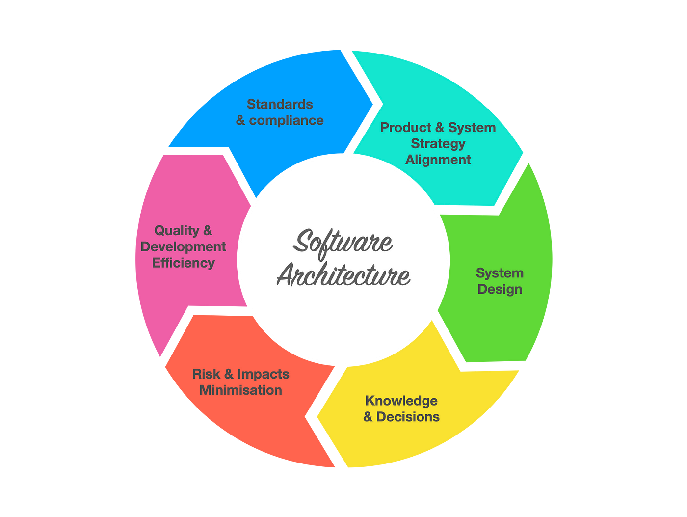
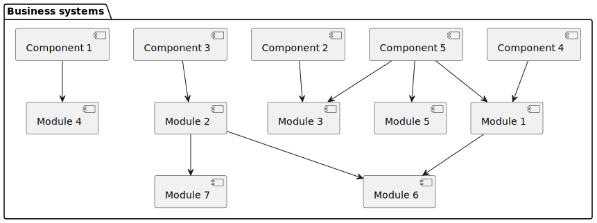

# Tìm hiểu về Architecture ( Kiến trúc phần mềm )
Chào mọi người,

Trong bài [trước đây](2024-01-31-tim-hieu-ve-design-pattern.md) mình đã giải thích cơ bản khái niệm, ưu và nhược điểm của [Design Pattern](2024-01-31-tim-hieu-ve-design-pattern.md).
 
Hôm nay chúng ta sẽ tiếp tục cùng nhau khám phá về ý nghĩa và tầm quan trọng của **Architecture( Kiến trúc phần mềm )** từ đó để hiểu rõ về cả 2 [Design Pattern](2024-01-31-tim-hieu-ve-design-pattern.md) và **Architecture**

[[TOC]]

## Software Architecture

### **Software Architecture(Kiến trúc phần mềm)** là gì ?
Architecture, trong bối cảnh của phần mềm, đề cập đến **Architecture( Kiến trúc phần mềm )**, là một khung khái niệm chung chung cho cách thức tổ chức và xây dựng một hệ thống phần mềm. 

**Architecture( Kiến trúc phần mềm )** định nghĩa ra cấu trúc chính của hệ thống, bao gồm các thành phần của nó, những thuộc tính quan trọng của từng thành phần, và cách các thành phần này tương tác với nhau.

Thông thường các ứng dụng của chúng ta sẽ cần giao tiếp với nhiều ứng dụng nội bộ hoặc các ứng dụng bên thứ 3. 

Architecture đề cập cách tổ chức hệ thống giữa các ứng dụng, cách chúng tương tác với nhau, môi trường hoạt động, các nguyên tắc giữa các ứng dụng thống nhất.

Nó tương tự như một tòa biệt phủ, Software architecture có chức năng như một bản thiết kế cho các tính năng có trong biệt phủ (Nhà tắm, nhà ăn, bể bơi…) hoặc liên kết đến các biệt phụ khác và mối liên quan hệ, liên kết giữa chúng.

Các Software architecture thường tập trung giải quyết các vấn đề liên quan đến các mối quan hệ, cách liên lạc... giữa các ứng dụng trong hệ thống của chúng ta.

### Đặc điểm của Software Architecture
**Architecture( Kiến trúc phần mềm )** là một khuôn khổ tổng quát cho cách thức thiết kế và xây dựng một hệ thống phần mềm. Đây là những đặc điểm chủ chốt của **Architecture( Kiến trúc phần mềm )**:

#### 1. **Xác định các thành phần và mô-đun(Module)**: 
- **Software Architecture** giúp xác định các thành phần hoặc module của phần mềm, cũng như chức năng và giao diện của chúng.
   
   - 1. **Thành phần(Component)**: Architecture giúp xác định các thành phần riêng lẻ như cơ sở dữ liệu, các dịch vụ web, và các lớp logic nghiệp vụ. Mỗi thành phần được thiết kế để thực hiện một nhóm chức năng cụ thể. Trong **Architecture( Kiến trúc phần mềm )**, thành phần (component) là một đơn vị cấu trúc tự chứa có thể bao gồm một hoặc nhiều mô-đun (module) và có những nhiệm vụ cụ thể.
      -  Đặc điểm của Component:
            - 1. Được định nghĩa bởi các chức năng mà nó cung cấp (thường thông qua một giao diện - interface).
            - 2. Có thể tái sử dụng nên được thiết kế để có khả năng kết hợp trong các hệ thống khác nhau.( Có thể sử dụng lại Component này mà không cần viết lại từ đầu )
            - 3. Là độc lập với các thành phần khác: nó có thể được phát triển, thử nghiệm, triển khai và cập nhật một cách độc lập.
            - 4. Như giải thích 2 và 3. Một Component có thể nằm trong một Component khác hoặc được triển khai thành một dịch vụ độc lập.
      -  Ví dụ về thành phần có thể là:
            - 1. **Web Service**: Thành phần có chức năng nhận và xử lý các yêu cầu HTTP.
            - 2. **Thư viện Xử lý Hình ảnh**: Cung cấp các chức năng để chỉnh sửa và biến đổi hình ảnh. (Component này sẽ được sử dụng bởi một Component khác)
            - 3. **Cơ sở dữ liệu**: Được xem xét như là một thành phần độc lập quản lý tất cả các hoạt động liên quan đến lưu trữ và truy xuất dữ liệu. (Được triển khai thành một dịch vụ độc lập)
            - 4. **UI Framework**: Một bộ thư viện hoặc thành phần cung cấp các thành phần giao diện người dùng để xây dựng các màn hình tương tác.
            - 5. **Monitoring**: Thành phần giúp giám sát hệ thống.( Ví dụ : [Prometheus](https://github.com/prometheus/prometheus)) 
            - 6. Hệ Thống Xử Lý Đơn Hàng (Order Processing System).
            - 7. Hệ thống thanh toán.(Payment System).
   - 2. **Mô-đun (Module)**: Module trong hệ thống phần mềm còn có thể được coi là một **phần** của thành phần(**Component**) - là các đơn vị nhỏ hơn cung cấp chức năng cụ thể và thường được nhóm lại theo năng lực, chức năng hoặc tính năng.
      -  Đặc điểm của Module:
           - 1. **Tính cụ thể**: Chứa một tập hợp chức năng liên quan và thường là một phần của ngữ cảnh lập trình.
           - 2. **Tính kết hợp**: Nhiều Module kết hợp với nhau có thể tạo thành một **Component**
           - 3. **Tính độc lập**: Module được thiết kế để có thể phát triển, thử nghiệm, và bảo trì một cách độc lập. Điều này giúp việc quản lý mã nguồn và các công việc bảo trì trở nên đơn giản hơn.
           - 4. **Giao tiếp qua giao diện( Interface )**: Mỗi Module tương tác với phần còn lại của hệ thống thông qua một giao diện rõ ràng (interface). Giao diện này định nghĩa ra những hàm, phương thức hoặc API mà các phần khác của hệ thống có thể sử dụng để tương tác với Module đó.
      -  Tác dụng của Module:
           - 1. **Chia nhỏ phức tạp**: Quy mô lớn của hệ thống có thể gây ra khó khăn trong việc quản lý và hiểu biết. Module giúp chia nhỏ hệ thống thành các phần nhỏ hơn, dễ quản lý và hiểu rõ hơn.
           - 2. **Dễ dàng bảo trì và nâng cấp**: Khi một Module cần được sửa đổi hoặc nâng cấp, việc này có thể được thực hiện mà không ảnh hưởng đến những phần khác của hệ thống, miễn là giao diện của Module vẫn giữ nguyên.
           - 3. **Tái sử dụng mã nguồn**: Module có thể được thiết kế để tái sử dụng trong các dự án khác nhau, giảm thiểu việc viết lại mã cho các chức năng tương tự.
           - 4. **Phát triển song song**: Module giúp phân chia công việc theo chức năng hoặc tính năng, cho phép các nhóm phát triển cùng làm việc một cách hiệu quả mà không can thiệp vào công việc của nhau.
           - 4. **Đảm bảo chất lượng**: Module có thể được kiểm tra và xác minh chất lượng một cách độc lập, giúp đảm bảo rằng mỗi phần của hệ thống đều tuân thủ các tiêu chuẩn kỹ thuật và chất lượng.
     -  Ví dụ về Module có thể là:
           - Module Quản lý Người Dùng (User Management Module) trong một Ứng Dụng Web.
              - Đặc tả chức năng:
                - 1. **Đăng ký**: Cho phép người dùng tạo tài khoản mới.
                - 2. **Đăng nhập**: Xác thực thông tin người dùng và cung cấp quyền truy cập vào ứng dụng.
                - 3. **Quản lý hồ sơ**: Người dùng có thể cập nhật thông tin cá nhân như họ tên, địa chỉ email, ảnh đại diện.
                - 4. **Phân quyền**: Định nghĩa và quản lý nhóm quyền truy cập cho người dùng (ví dụ: admin, người dùng thông thường).
                - 5. **Bảo mật**: Cung cấp chức năng liên quan đến bảo mật, thiếp lập/đổi mật khẩu và các chính sách bảo mật khác (ví dụ: xác thực đa yếu tố).
              - Cấu trúc của module:
                - 1. **Database Schema**: Bảng `Users` để lưu thông tin đăng nhập, bảng `UserProfiles` để lưu thông tin người dùng, bảng `Roles` và `Permissions` để quản lý quyền.
                - 2. **APIs**: Gồm các API cho phép `frontend` gửi yêu cầu và nhận dữ liệu từ server như APIs đăng nhập, đăng ký, cập nhật hồ sơ, etc.
                - 3. **Business Logic**: Mã xử lý logic như xác thực, cấp phiên làm việc (session), và encrypt/decrypt mật khẩu.
                - 4. **Interface**: Các interface cho các module khác để tương tác, ví dụ thông qua một API gateway hoặc grpc...etc...
   - **Component và mô-đun(Module) thay thế cho nhau**: Tùy ngữ cảnh, một Module có thể là một Component hoặc một Component có thể được coi là một Module được sử dụng trong Component khác. Vì vậy khi thiết kế hệ thống, người thiết kế cần xác định rõ đâu là Module đâu là Component để có cùng một ý hiểu.
     - Có thể chia làm 3 level là Business systems, Component và Module.
     
       - Trong đó Business systems là tất cả các chức năng mà business cung cấp cho người dùng.(Nó ở mức trừu tượng cao nhất)
       - Component là chức năng năng cung cấp cho người dùng.
       - Module là các mảnh ghép trong một Component để lắp ghép thành một chức năng hoạt động hoàn chỉnh.
#### 2. **Mô tả các mối quan hệ**: 
Liên quan đến việc xác định và mô tả cách thức các thành phần trong hệ thống tương tác và liên kết với nhau. Các mối quan hệ này có thể bao gồm các khía cạnh như:
   - 1. **Liên kết giữa các thành phần (Component Link):**: Trong **Architecture** sẽ mô tả cách một thành phần phụ thuộc vào một hoặc nhiều thành phần khác để thực hiện chức năng của mình.
   - 2. **Giao tiếp (Communication)**: **Architecture** sẽ chỉ rõ cách giao tiếp giữa các thành phần thông qua restfull APIs, RMI, message queues, service calls, rpc, grpc, v.v.
   - 3. **Giao diện và hợp đồng (Interfaces and Contracts):**: 
      - 1. **Giao diện (Interfaces)**: Định nghĩa các phương thức và thuộc tính mà một thành phần cung cấp hoặc yêu cầu. (Ví dụ: Tên method hoặc url restfull và model gửi lên)
      - 2. **Hợp đồng (Contracts)**: Định nghĩa các quy tắc và điều kiện mà các thành phần phải tuân theo khi tương tác với nhau.(Các trường require, condition)
   - 4. **Kiến trúc kết nối (Connective Architecture)**:
      - 1. **Middleware**: Phần mềm trung gian giúp kết nối các thành phần, thường cung cấp các dịch vụ kết nối đến messaging, authentication, và transaction management...
      - 2. **Service-Oriented Architecture (SOA nhé không phải SOAP)**: Mô hình kiến trúc nơi các component được gọi là service và được định nghĩa và có thể được gọi qua mạng. 
         - 1. Mỗi service cung cấp một business và các service có thể giao tiếp với nhau. Sử dụng SOA để tái sử dụng các service một cách dễ dàng trên các hệ thống khác nhau.(Ví dụ service authentication có thể sử dụng trên nhiều hệ thống) 
#### 3. **Xác định patterns**: 
Là quá trình lựa chọn và áp dụng các mẫu thiết kế đã được chứng minh là hiệu quả để giải quyết các vấn đề cụ thể trong quá trình thiết kế hệ thống phần mềm. Các mẫu thiết kế kiến trúc (architectural patterns) cung cấp một giải pháp tổng quát cho một vấn đề thiết kế thường gặp, giúp định hình cấu trúc cơ bản của hệ thống.
  - 1. **Ý nghĩa của việc Xác định Patterns**:
    - 1. **Tái sử dụng giải pháp đã được chứng minh**: Các mẫu thiết kế kiến trúc là kết quả của kinh nghiệm lâu dài và đã được kiểm chứng qua nhiều dự án khác nhau. Sử dụng chúng giúp tái sử dụng các giải pháp đã được chứng minh là hiệu quả. 
    - 2. **Chuẩn hóa thiết kế và tài liệu**: Các mẫu thiết kế cung cấp một ngôn ngữ chung và một cách tiếp cận chuẩn hóa để mô tả và giao tiếp về cấu trúc của hệ thống. Khi có thành viên mới gia nhập sẽ dễ dàng tiếp cận.
    - 3. **Tối ưu hóa quá trình phát triển**: Áp dụng các mẫu thiết kế giúp giảm thời gian và công sức cần thiết để phát triển hệ thống bằng cách cung cấp một khuôn mẫu sẵn có cho các vấn đề thường gặp.
    - 4. **Giảm rủi ro trong thiết kế**: Sử dụng các mẫu thiết kế giúp tránh được các sai lầm phổ biến trong thiết kế và giảm rủi ro liên quan đến việc tạo ra các giải pháp không hiệu quả.
  - 2.  **Ví dụ về các patterns kiến trúc:**
     - 1. **Model-View-Controller (MVC)**: Mẫu thiết kế này phân chia ứng dụng thành ba thành phần chính: Model (quản lý dữ liệu và logic nghiệp vụ), View (giao diện người dùng), và Controller (xử lý các tương tác giữa Model và View). Đây là một trong các pattern hiện đại nhất của monolithic.
     - 2. **Microservices**: Mẫu thiết kế này chia nhỏ ứng dụng thành các dịch vụ nhỏ, độc lập, có thể triển khai và mở rộng một cách độc lập.
     - 3. **Event-Driven Architecture (EDA)**: EDA là một kiến trúc phần mềm tập trung vào việc phát hiện, tiếp nhận, và phản ứng với các sự kiện hoặc thay đổi trạng thái. Các thành phần trong EDA thường giao tiếp thông qua sự kiện, không phải chủ động thông qua các lời gọi API trực tiếp.
     - 4. **Hexagonal Architecture**: Kiến trúc này nhằm mục đích tạo ra một hệ thống lỏng lẻo, nơi logic nghiệp vụ được tách biệt khỏi các cổng(Port) và bộ điều hợp(adapters) (giao diện người dùng, cơ sở dữ liệu, v.v.) để dễ dàng thay đổi hoặc thay thế các thành phần này mà không ảnh hưởng đến nhau.
     - 5. **Domain-Driven Design (DDD)**: DDD không phải là một kiến trúc phần mềm cụ thể, nhưng nó cung cấp một cách tiếp cận để thiết kế kiến trúc dựa trên nghiệp vụ và logic của ứng dụng. DDD thường được sử dụng cùng với các kiến trúc khác như Microservices,MVC,Hexagonal,EDA SOA... và tập trung vào việc tạo ra một mô hình phần mềm phản ánh mô hình nghiệp vụ. DDD chia ứng dụng thành các "bounded contexts" và "aggregates" để quản lý phức tạp và thúc đẩy sự rõ ràng trong mã nguồn.
     - 6. ......
#### 4. **Quản lý rủi ro kỹ thuật**: 
Là quá trình nhận diện, đánh giá, và giảm thiểu các rủi ro có thể ảnh hưởng đến việc phát triển và vận hành của hệ thống phần mềm. Mục tiêu của quản lý rủi ro kỹ thuật là để đảm bảo rằng dự án có thể tiến triển một cách suôn sẻ và thành công, cũng như để giảm thiểu các tác động tiêu cực có thể xảy ra.

   - 1. **Nhận diện sớm rủi ro**: **Architecture** làm nổi bật các thành phần(Component) và Mô-đun(Module) hệ thống có nguy cơ rủi do cao và giúp nhóm phát triển tập trung vào việc giảm thiểu rủi ro từ sớm.
   - 2. **Đối phó với biến đổi**: Các quyết định **Architecture** giúp hệ thống phần mềm linh hoạt và dễ thích nghi với các thay đổi trong tương lai, như thay đổi công nghệ hoặc yêu cầu kinh doanh.
#### 5. **Đảm bảo chất lượng**:
   - 1. **Chất lượng phần mềm**: **Architecture** phần mềm đặt nền móng cho performance (hiệu suất), security (bảo mật), scalability (khả năng mở rộng), và maintainability (khả năng bảo trì).
   - 2. **Đánh giá và kiểm định**: **Architecture** cho phép tiến hành đánh giá và kiểm định chất lượng dựa trên những chỉ tiêu đã định trước.
#### 6. **Cung cấp một bản kế hoạch**: 
   - 1. **Lập kế hoạch**: **Architecture** cung cấp một kế hoạch toàn diện, giống như một bản vẽ kiến trúc cho một tòa nhà, mô tả cấu trúc, công nghệ và cách thức triển khai của hệ thống phần mềm.
   - 2. **Hỗ trợ quản lý dự án**: Nó giúp các nhà quản lý dự án hiểu được phạm vi công việc, dự đoán nguồn lực cần thiết và lịch trình dự kiến.
#### 7. **Định hình và quyết định công nghệ**
   - 1. **Lựa chọn công nghệ**: **Architecture** xác định các công nghệ cần sử dụng trong dự án, từ ngôn ngữ lập trình, database, middleware, cho đến hạ tầng mạng...
   - 2. **Thích ứng với yêu cầu**: Quyết định kiến trúc bảo đảm rằng các công nghệ được chọn phù hợp với yêu cầu về chức năng và không gian, như khả năng mở rộng hoặc tích hợp.
#### 8. **Khả năng tái sử dụng và tích hợp** 
   - 1. **Tái sử dụng**: **Architecture** tốt thúc đẩy việc thiết kế các thành phần(Component) có thể tái sử dụng trong các dự án khác nhau, giúp tiết kiệm thời gian và nguồn lực.
   - 2. **Tích hợp**: **Architecture**  cung cấp một hướng dẫn để tích hợp các thành phần(Component) mới hay các hệ thống bên ngoài một cách suôn sẻ mà không làm xáo trộn đến cấu trúc cốt lõi của hệ thống hiện tại.
#### 9. **Kiểm soát sự thay đổi**
   - 1. **Kiểm soát phiên bản**:  **Architecture** xác định cách các thay đổi được quản lý thông qua kiểm soát phiên bản, đảm bảo rằng các cập nhật không làm ảnh hưởng đến tính ổn định của hệ thống trên tất cả phiên bản đang hỗ trợ.
   - 2. **Quản lí sự thay đổi**: Nó giúp lập kế hoạch cho việc thay đổi, đảm bảo rằng mọi cải tiến hoặc bảo trì đều diễn ra một cách có tổ chức mà không làm xáo trộn đến hoạt động hiện tại.
#### 10. **Giao tiếp giữa các bên liên quan**
   - 1. **Ngôn ngữ chung**: **Architecture** cung cấp một ngôn ngữ và cấu trúc chung giúp các bên liên quan từ nhiều lĩnh vực khác nhau có thể hiểu và thảo luận về hệ thống.
   - 2. **Rõ ràng và dễ hiểu**: Các biểu đồ kiến trúc như diagram class, sequence diagram và các tài liệu mô tả giúp truyền đạt rõ ràng, đảm bảo mọi người đều hiểu về hướng đi và mục tiêu của dự án.

### Các bước cơ bản khi thực hiện Software Architecture
Khi thực hiện **kiến trúc phần mềm (Software Architecture)**, các bước thường được tuân theo để đảm bảo rằng hệ thống được thiết kế một cách hợp lý và có thể mở rộng. Dưới đây là các bước cơ bản:

Các bước phía dưới không nhất thiết phải tuân theo một trình tự cứng nhắc; chúng có thể được lặp lại, thay đổi thứ tự và thích ứng tùy thuộc vào phương pháp phát triển phần mềm được sử dụng (ví dụ: Agile, Waterfall(Thác nước), DevOps) và đặc điểm cụ thể của dự án.

#### 1. **Xác định yêu cầu và các bên liên quan**:
   - 1. **Thu thập yêu cầu**: Hiểu rõ các yêu cầu kỹ thuật và kinh doanh từ các bên liên quan.
   - 2. **Phân tích bên liên quan**: Xác định ai là người dùng cuối, người quản lý dự án, nhóm phát triển, và các bên liên quan khác.
#### 2. [Phân tích yêu cầu](https://www.geeksforgeeks.org/functional-vs-non-functional-requirements/)
   - 1. **Phân tích chức năng(functional)**: Xác định các chức năng cụ thể mà hệ thống cần thực hiện.
   - 2. **Phân tích phi chức năng(non-functional)**: Xác định các yêu cầu về hiệu suất, bảo mật, khả năng mở rộng, và khả năng duy trì..
#### 3. Xác định kiến trúc hệ thống
   - 1. **Chọn kiểu kiến trúc(Selecting an Architectural Style)**: là quá trình quyết định một mô hình tổng quát mà hệ thống phần mềm sẽ tuân theo. Kiểu kiến trúc là một tập hợp các nguyên tắc hướng dẫn thiết kế, mà khi được áp dụng, xác định cấu trúc cơ bản của hệ thống, bao gồm các thành phần của nó, mối quan hệ giữa các thành phần, và cách thức giao tiếp giữa chúng. (Layered, Event-Driven, Service-Oriented Architecture - SOA, MVC,Hexagonal, Monolithic, microservices, v.v.)
   - 2. **[Thiết kế kiến trúc cao cấp(High-Level Architecture Design)](https://www.geeksforgeeks.org/what-is-high-level-design-learn-system-design/)**: Là quá trình xác định cấu trúc tổng quát của hệ thống phần mềm. Nó bao gồm việc định nghĩa các thành phần chính của hệ thống, cách chúng tương tác với nhau, và cách chúng được sắp xếp để hỗ trợ các yêu cầu kỹ thuật và yêu cầu kinh doanh.
#### 4. Thiết kế chi tiết
   - 1. **Thiết kế thành phần(Component)**: Xác định chi tiết các thành phần, mô-đun, và lớp.
   - 2. **Thiết kế giao diện(Interface)**: Xác định cách các thành phần giao tiếp với nhau thông qua interface.
#### 5. Đánh giá kiến trúc
   - 1. **Đánh giá nội bộ**: Kiểm tra kiến trúc để đảm bảo rằng nó đáp ứng được các yêu cầu và mục tiêu.
   - 2. **Đánh giá bên ngoài**: Sử dụng các bên thứ ba hoặc các công cụ đánh giá để kiểm tra kiến trúc.
#### 6. Tối ưu hóa kiến trúc
   - 1. **Phân tích hiệu suất**: Đánh giá và tối ưu hóa hiệu suất của hệ thống.
   - 2. **Cải thiện khả năng mở rộng**: Đảm bảo rằng hệ thống có thể mở rộng để đáp ứng nhu cầu tăng trưởng.
#### 7. Lập kế hoạch triển khai
   - 1. **Xác định môi trường triển khai**: Chọn phần cứng, hệ điều hành, và các yếu tố môi trường khác.
   - 2. **Lập kế hoạch triển khai**: Xác định cách và thời điểm triển khai các thành phần của hệ thống.
#### 8. Tài liệu hóa
   - 1. **Tạo tài liệu kiến trúc**: Ghi chép chi tiết về kiến trúc, bao gồm các sơ đồ, mô tả thành phần, và quy trình.
   - 2. **Tài liệu cho các bên liên quan**: Chuẩn bị tài liệu hướng dẫn sử dụng, bảo trì, và triển khai cho các bên liên quan khác nhau.
#### 9. Xem xét và cập nhật kiến trúc
   - 1. **Xem xét liên tục**: **Architecture( Kiến trúc phần mềm )** cần được xem xét định kỳ để đảm bảo rằng nó vẫn phù hợp với các yêu cầu thay đổi và công nghệ mới.
   - 2. **Cập nhật kiến trúc**: Khi cần thiết, cập nhật kiến trúc để phản ánh các thay đổi trong yêu cầu, công nghệ, hoặc các bài học kinh nghiệm từ việc triển khai và sử dụng hệ thống.
#### 10. Quản lý rủi ro kiến trúc
   - 1. **Phân tích rủi ro**: Xác định các rủi ro tiềm ẩn liên quan đến kiến trúc, bao gồm sự phụ thuộc vào công nghệ, tính phức tạp, và các vấn đề về hiệu suất.
   - 2. **Lập kế hoạch giảm thiểu rủi ro**: Phát triển các chiến lược để giảm thiểu hoặc quản lý rủi ro, như có kế hoạch dự phòng cho các công nghệ quan trọng.
#### 11. Hợp tác và giao tiếp
   - 1. **Giao tiếp với các bên liên quan**: Đảm bảo rằng tất cả các bên liên quan đều hiểu và đồng thuận với kiến trúc.
   - 2. **Hợp tác với các nhóm**: Làm việc chặt chẽ với các nhóm phát triển, kiểm thử, và vận hành để đảm bảo kiến trúc được triển khai đúng cách.
#### 12. Triển khai và theo dõi
   - 1. **Triển khai kiến trúc**: Hỗ trợ nhóm phát triển trong việc triển khai kiến trúc thông qua các môi trường từ phát triển đến sản xuất.
   - 2. **Theo dõi và đánh giá**: Theo dõi hiệu suất và sử dụng của hệ thống để đánh giá xem kiến trúc có đáp ứng được mục tiêu không và xác định cần cải tiến ở đâu.
#### 13. Bảo trì và cải tiến liên tục
   - 1. **Bảo trì kiến trúc**: Duy trì kiến trúc để đảm bảo rằng nó vẫn hiệu quả và an toàn.
   - 2. **Cải tiến liên tục**: Áp dụng các phương pháp cải tiến liên tục để nâng cao chất lượng và hiệu suất của kiến trúc.
#### 14. Phản hồi và học hỏi
   - 1. **Thu thập phản hồi**: Lắng nghe phản hồi từ người dùng, nhóm phát triển, và các bên liên quan khác để hiểu cách kiến trúc hoạt động trong thực tế.
   - 2. **Học hỏi từ kinh nghiệm**: Sử dụng thông tin thu được để cải thiện quy trình thiết kế kiến trúc trong tương lai.
## Những nhược điểm của Software Architecture
Có 2 kiểu khi phát triển một Business, một là làm tù mù đến đâu thì đến, hai là có sự xác định Software Architecture. Tuy nhiên không phải lúc nào Software Architecture cũng tốt.
Dưới đây là một số nhược điểm tiềm ẩn mà có thể gặp phải:

Những nhược điểm này không nhất thiết phải xuất hiện trong mọi trường hợp, nhưng là những điểm cần lưu ý khi thiết kế và triển khai kiến trúc.

#### 1. Độ phức tạp
   - 1. **Khó hiểu**: Kiến trúc phức tạp có thể khó hiểu cho các nhà phát triển mới tiếp xúc với ngành lập trình hoặc chưa từng tìm hiểu về kiến trúc hoặc các bên liên quan không chuyên môn.
   - 2. **Khó duy trì**: Càng phức tạp, việc bảo trì và cập nhật hệ thống càng trở nên khó khăn.
#### 2. Chi phí
   - 1. **Tốn kém**: Việc thiết kế và thực hiện một kiến trúc tốt đòi hỏi thời gian và nguồn lực, có thể làm tăng chi phí dự án.
      - 1. Các dự án của startup thường có kinh phí thấp, nên đây có thể là một cản trở lớn.
   - 2. **Cần chuyên gia**: Các kiến trúc sư phần mềm có thật sự kinh nghiệm thường có mức lương cao và rất khó tìm kiếm.
#### 3. Khả năng mở rộng và linh hoạt
   - 1. **Giới hạn mở rộng**: Một kiến trúc không được thiết kế tốt có thể hạn chế khả năng mở rộng của hệ thống.
   - 2. **Thiếu linh hoạt**: Kiến trúc cứng nhắc có thể làm giảm khả năng thích ứng của hệ thống với các yêu cầu thay đổi hoặc công nghệ mới.
#### 4. Rủi ro trong quyết định
   - 1. **Quyết định sai lầm trong quá khứ**: Các quyết định kiến trúc trong quá khứ bởi những người không có kinh nghiệm có thể khó thay đổi và có thể dẫn đến rủi ro lớn nếu chúng không phù hợp.
   - 2. **Giả định không chính xác**: Giả định sai về yêu cầu hoặc công nghệ có thể làm hỏng kiến trúc.
     - Giả định không chính xác trong **Architecture( Kiến trúc phần mềm )** thường xuất phát từ việc không hiểu đúng hoặc không đánh giá đúng các yếu tố ảnh hưởng đến hệ thống. Điều này có thể xảy ra ở nhiều khía cạnh khác nhau của dự án, từ yêu cầu kỹ thuật đến hành vi của người dùng cuối. 
     - Ví dụ về 1 số giả định sai:
       - 1. Yêu cầu Người Dùng: Giả định sai về những gì người dùng thực sự cần hoặc muốn từ hệ thống có thể dẫn đến việc thiết kế các tính năng không cần thiết hoặc bỏ qua các chức năng quan trọng.
       - 2. Tải Trọng Hệ Thống: Nếu giả định sai về mức độ tải trọng mà hệ thống sẽ phải xử lý, kiến trúc có thể không được thiết kế để đối phó với lượng người dùng thực tế, dẫn đến vấn đề hiệu suất hoặc sự cố hệ thống.
       - 3. Môi Trường Triển Khai: Giả định không chính xác về môi trường triển khai, như hạ tầng mạng hoặc phần cứng, có thể làm cho hệ thống không tương thích hoặc không hiệu quả khi được triển khai trong môi trường thực tế.
       - 4. Tích Hợp và Tương Thích: Giả sử rằng các hệ thống khác (mà hệ thống mới cần tích hợp) sử dụng các giao thức hoặc API tiêu chuẩn khác, chúng có thể dẫn đến vấn đề tích hợp sau này.
       - 5. Khả năng Mở Rộng và Bảo Trì: Giả định rằng hệ thống hiện tại sẽ dễ dàng mở rộng hoặc bảo trì có thể dẫn đến việc chọn một kiến trúc không thích hợp, khiến việc thêm chức năng mới hoặc cập nhật hệ thống trở nên khó khăn.
       - 6. Công Nghệ và Thư Viện: Giả định công nghệ hoặc thư viện sẽ luôn được hỗ trợ hoặc không lỗi thời có thể tạo ra rủi ro lớn nếu công nghệ đó bị ngừng phát triển hoặc không còn được cộng đồng hỗ trợ.
     - Những giả định không chính xác này có thể dẫn đến việc phải thực hiện các thay đổi lớn về sau, tốn kém thời gian và nguồn lực, và thậm chí có thể yêu cầu phải thiết kế lại toàn bộ kiến trúc. Do đó, việc xác minh các giả định thông qua phân tích kỹ lưỡng, thử nghiệm, và thu thập phản hồi là quan trọng để xây dựng một **Architecture( Kiến trúc phần mềm )** vững chắc và linh hoạt.
#### 5. Đồng bộ hóa và tích hợp
   - 1. **Khó đồng bộ hóa**: Các thành phần kiến trúc độc lập có thể gặp khó khăn trong việc đồng bộ hóa và làm việc cùng nhau một cách hiệu quả.
      - 1. **Đồng bộ hóa dữ liệu**: Trong một hệ thống phân tán hoặc microservices, việc đảm bảo rằng tất cả các dịch vụ có cùng một thông tin mới nhất có thể rất khó khăn. Các vấn đề như độ trễ mạng, thất bại trong việc giao tiếp, và xung đột dữ liệu có thể làm cho việc đồng bộ hóa dữ liệu trở nên phức tạp.
      - 2. **Quản lý trạng thái**: Các hệ thống có nhiều thành phần hoạt động đồng thời cần phải quản lý trạng thái của chúng một cách nhất quán. Việc giữ cho trạng thái này đồng bộ giữa các thành phần có thể là một thách thức lớn, đặc biệt nếu các thành phần được triển khai trên nhiều máy chủ hoặc khu vực địa lý.
      - 3. **Xử lý đồng thời**: Trong một hệ thống đa nhiệm, việc xử lý đồng thời cùng một tài nguyên có thể dẫn đến điều kiện đua ([race conditions](https://en.wikipedia.org/wiki/Race_condition)) và các vấn đề liên quan đến đồng bộ hóa. Việc đảm bảo rằng các tác vụ không ghi đè lên nhau hoặc tạo ra dữ liệu không nhất quán cần có cơ chế đồng bộ hóa chặt chẽ.
      - 4. **Giao dịch và nhất quán**: Các hệ thống cần đảm bảo tính nhất quán của dữ liệu trong suốt quá trình thực hiện giao dịch. Trong một hệ thống phân tán, việc này càng trở nên khó khăn hơn do sự phức tạp của việc quản lý giao dịch qua nhiều dịch vụ và cơ sở dữ liệu.
      - 5. **Cập nhật và triển khai**: Triển khai các cập nhật hoặc bản vá lỗi cho hệ thống mà không gây ra gián đoạn có thể là một thách thức. Việc đồng bộ hóa các phiên bản phần mềm giữa các dịch vụ cần được quản lý cẩn thận. Các chiến lược như triển khai xanh/làm mới (blue-green deployment) hoặc triển khai liên tục (continuous deployment) có thể giúp quản lý quá trình này, nhưng chúng vẫn đòi hỏi sự chú ý đến việc đồng bộ hóa và kiểm soát phiên bản.
      - 6. **Thời gian thực và độ trễ**: Trong các hệ thống yêu cầu xử lý thời gian thực hoặc gần thời gian thực, việc đồng bộ hóa trạng thái giữa các thành phần có thể bị ảnh hưởng bởi độ trễ mạng do mạng hoặc địa lý và thời gian xử lý. Điều này có thể gây khó khăn trong việc đảm bảo rằng tất cả các phần của hệ thống đang hoạt động dựa trên dữ liệu cùng một thời điểm.
      - 7. **Kiểm soát phiên bản dữ liệu(Data Version Control)**: là quá trình quản lý các thay đổi đối với dữ liệu trong hệ thống phần mềm, đặc biệt là trong môi trường phân tán hoặc khi sử dụng kiến trúc dịch vụ vi mô (microservices). Mục tiêu của kiểm soát phiên bản dữ liệu là để theo dõi lịch sử thay đổi, đảm bảo tính nhất quán và giúp phục hồi dữ liệu nếu cần.
         - 1. **Lịch sử thay đổi**: Giống như kiểm soát phiên bản mã nguồn, việc theo dõi lịch sử thay đổi của dữ liệu giúp xác định được ai đã thực hiện thay đổi, thay đổi gì, và khi nào. Điều này hữu ích cho việc phân tích, kiểm tra, và khắc phục sự cố. 
         - 2. **Xung đột dữ liệu**: Khi có nhiều nguồn cập nhật dữ liệu đồng thời, có thể xảy ra xung đột, nơi hai nguồn cố gắng thay đổi cùng một dữ liệu. Kiểm soát phiên bản giúp giải quyết các xung đột này bằng cách sử dụng các quy tắc hoặc thuật toán đặc biệt.
         - 3. **Nhất quán dữ liệu**: Trong các hệ thống phân tán, việc duy trì tính nhất quán của dữ liệu giữa nhiều dịch vụ và cơ sở dữ liệu là quan trọng. Kiểm soát phiên bản dữ liệu giúp đảm bảo rằng mọi thay đổi đều được cập nhật một cách nhất quán trên toàn bộ hệ thống.
         - 4. **Phục hồi dữ liệu**: Nếu dữ liệu bị hỏng hoặc mất mát, kiểm soát phiên bản cho phép hệ thống quay trở lại trạng thái ổn định trước đó. Điều này giúp giảm thiểu rủi ro và hậu quả của sự cố dữ liệu.
         - 5. **Tích hợp và di chuyển**: Khi tích hợp hoặc di chuyển dữ liệu giữa các hệ thống, việc biết phiên bản dữ liệu nào là mới nhất và đáng tin cậy là cần thiết. Kiểm soát phiên bản giúp quá trình này trở nên dễ dàng và an toàn hơn.(1 số DBMS đã hỗ trợ sẵn ví dụ Multiversion Concurrency Control(Tạo mới thay vì cập nhật)) của PostgreSQL, nhưng mysql thì chưa và cần làm tay :( )
         - 6. **Công nghệ và công cụ**: 1 số DBMS đã hỗ trợ sẵn ví dụ Multiversion Concurrency Control(Tạo mới thay vì cập nhật) của PostgreSQL, nhưng mysql thì chưa và cần làm tay :( 
            - Trong thực tiễn, kiểm soát phiên bản dữ liệu có thể thực hiện thông qua việc ghi lại timestamp cho mỗi thay đổi, sử dụng các số phiên bản, hoặc thậm chí là thông qua các hệ thống quản lý phiên bản dữ liệu chuyên dụng. Quan trọng là phải xác định một chiến lược phù hợp.
      - 8. **Recovery and Fault Tolerance**: Trong trường hợp xảy ra lỗi, việc khôi phục và đồng bộ hóa lại trạng thái hệ thống có thể là một thách thức. Hệ thống cần có cơ chế chịu lỗi (fault tolerance) và phục hồi (recovery) để đảm bảo tính nhất quán sau khi lỗi được khắc phục.
   - 2. **Thách thức tích hợp**: Tích hợp các hệ thống và thành phần khác nhau có thể trở nên phức tạp và tốn kém.
#### 6. Tài liệu và truyền đạt
   - 1. **Thiếu tài liệu**: Kiến trúc không được tài liệu hóa đầy đủ có thể gây khó khăn cho việc bảo trì và chuyển giao kiến thức.
   - 2. **Truyền đạt không hiệu quả**: Nếu kiến trúc được truyền đạt không rõ ràng, các nhà phát triển có thể không hiểu hoặc áp dụng sai các nguyên tắc kiến trúc.
#### 7. Công nghệ
   - 1. **Phụ thuộc vào công nghệ**: Kiến trúc có thể trở nên lỗi thời nhanh chóng do sự phát triển không ngừng của công nghệ.
   - 2. **Khó chuyển đổi**: Các hệ thống được xây dựng trên một kiến trúc cụ thể có thể khó chuyển đổi sang công nghệ mới.
#### 8. Quản lý thay đổi
   - 1. **Kháng cự thay đổi**: Kiến trúc có thể tạo ra rào cản đối với sự thay đổi, khiến việc cập nhật hoặc thay đổi hệ thống trở nên khó khăn hơn.
   - 2. **Chi phí thay đổi**: Việc thực hiện các thay đổi lớn trên một hệ thống có kiến trúc đã được xác định có thể rất tốn kém và mất thời gian.
#### 9. Độ trễ trong phát triển
   - 1. **Chậm ra mắt**: Việc xây dựng một kiến trúc phức tạp có thể làm chậm quá trình phát triển và đưa sản phẩm ra thị trường.
   - 2. **Phân tích quá mức**: Dành quá nhiều thời gian cho việc phân tích và thiết kế kiến trúc có thể dẫn đến "[paralysis by analysis](https://en.wikipedia.org/wiki/Analysis_paralysis)" và trì hoãn quá trình phát triển.
#### 10. Sự phù hợp với mục tiêu kinh doanh
   - 1. **Không linh hoạt với mục tiêu kinh doanh**: Kiến trúc có thể không đủ linh hoạt để thích ứng với sự thay đổi nhanh chóng của mục tiêu và chiến lược kinh doanh.
   - 2. **Đầu tư không hiệu quả**: Nếu kiến trúc không cung cấp giá trị thực sự cho doanh nghiệp, việc đầu tư vào nó có thể không mang lại lợi ích mong đợi.
#### 11. Phù hợp với quy mô dự án
   - 1. **Quá mức cho dự án nhỏ**: Đối với các dự án nhỏ, việc xây dựng một kiến trúc phức tạp có thể không cần thiết và tạo ra gánh nặng không cần thiết.
   - 2. **Khó áp dụng cho dự án lớn**: Trong khi đó, kiến trúc quá đơn giản có thể không đáp ứng được yêu cầu của các dự án lớn và phức tạp.
#### 12. Cập nhật và bảo trì
   - 1. **Bảo trì khó khăn**: Các hệ thống có kiến trúc phức tạp có thể khó bảo trì, đặc biệt khi kiến trúc sư ban đầu không còn làm việc trong dự án.
   - 2. **Cập nhật công nghệ**: Việc cập nhật công nghệ có thể trở nên khó khăn nếu kiến trúc không được thiết kế để hỗ trợ tính mở và linh hoạt.
#### 13. Tiêu chuẩn và quy định
   - 1. **Tuân thủ tiêu chuẩn**: Một số kiến trúc có thể không tuân thủ các tiêu chuẩn ngành hoặc quy định pháp luật, gây ra rủi ro pháp lý và tuân thủ.
   - 2. **Tích hợp với hệ thống khác**: Kiến trúc có thể gặp khó khăn trong việc tích hợp với các hệ thống và công nghệ khác, đặc biệt là khi có những tiêu chuẩn giao tiếp khác nhau.

## Tổng kết

- 1. **Kiến trúc phần mềm** đóng vai trò như bản đồ xây dựng(`Giống như là bản vẽ thiết kế một tòa nhà hoặc một sơn trang`), giúp sắp xếp các phần mềm thành một hệ thống gọn gàng và hiệu quả.
- 2. **Chức năng chính** bao gồm việc phân loại các khối xây dựng cơ bản của phần mềm, mô tả cách chúng liên kết và giao tiếp, áp dụng các mẫu thiết kế đã được thử nghiệm, và đảm bảo rằng hệ thống có thể phát triển mà không gặp rủi ro.
- 3. **Quy trình xây dựng** gồm nhiều bước từ việc hiểu rõ yêu cầu đến thiết kế, đánh giá, và cải tiến liên tục, đảm bảo rằng kiến trúc luôn phản ánh mục tiêu và thách thức hiện tại của dự án.
- 4. **Thách thức** có thể gặp phải như việc kiến trúc quá phức tạp hoặc lỗi thời, chi phí cao cho việc thiết kế và duy trì, khó khăn trong việc thích nghi với công nghệ mới, và những rủi ro do quyết định sai lầm trong quá khứ.
- 5. **Kiến trúc phần mềm** cần được thiết kế một cách cân nhắc, không chỉ phục vụ cho hiện tại mà còn có khả năng thích ứng với tương lai, đồng thời phải dễ hiểu và dễ bảo trì để đội ngũ phát triển có thể tiếp tục xây dựng và cải thiện sản phẩm mà không gặp trở ngại.

Trong bài tiếp theo mình sẽ giải thích về sự khác biệt giữa [**Design Patterns**](2024-01-31-tim-hieu-ve-design-pattern.md) và **Architecture( Kiến trúc phần mềm )** , cùng chờ đợi nhé.

