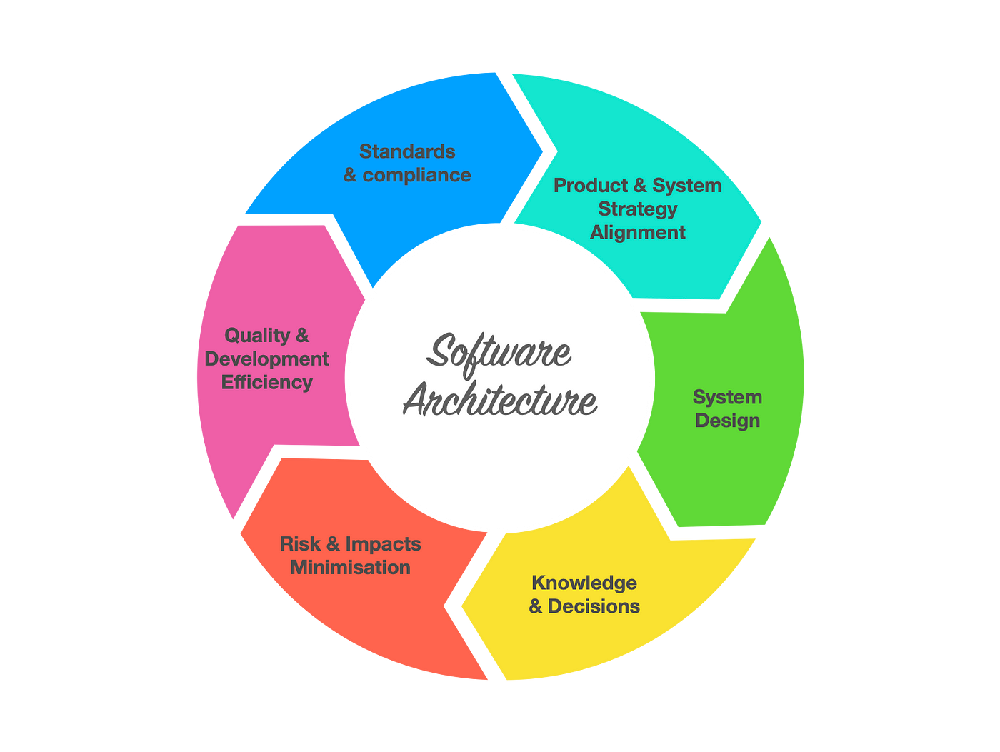

# Sự khác biệt giữa Design Pattern và Software Architecture.
Chào mọi người,

Trong 2 bài trước đây mình đã giải thích cơ bản khái niệm, ưu và nhược điểm của [Design Pattern](2024-01-31-tim-hieu-ve-design-pattern.md) và [Software Architecture](2024-02-01-tim-hieu-ve-architecture.md).
 
Trong bài viết nay mình sẽ thực hiện so sách sự khác biệt giữa [Design Pattern](2024-01-31-tim-hieu-ve-design-pattern.md) và [Software Architecture](2024-02-01-tim-hieu-ve-architecture.md).

[[TOC]]

## Level và Scope trong phát triển phần mềm
Đối với tôi, thông thường một hệ thống phục vụ khách hàng sẽ có 5 Level và Scope chính.

1. **Function-  implementation of a function(Method)**  
   Đây là đơn vị cơ bản nhất của code, thực hiện một tác vụ cụ thể. Một function được định nghĩa trong một ngữ cảnh lập trình để thực hiện một phần nhỏ của nhiệm vụ lớn hơn.   
   - Ví dụ tạo một Function có đầu vào là A và B. Kết quả sẽ trả về tổng của A và B.

2. **Class- implementation of a class (Lớp)**  
   Một class là một khuôn mẫu cho các đối tượng, định nghĩa ra các thuộc tính (dữ liệu) và phương thức (hàm) mà đối tượng của class đó sẽ có. Một class là cấu trúc cơ bản trong lập trình hướng đối tượng.
   - Ví dụ: Tạo một class chưa các thông tin về con người(Tên, năm sinh, giới tính) và có các phương thức để hành động( Đi, ăn, ngồi, nói...)

3. **Project- relations between classes**
   Một dự án phần mềm thường bao gồm nhiều class và files, và quản lý mối quan hệ giữa chúng. Trong một dự án, các class tương tác với nhau thông qua các phương thức và thuộc tính, và cùng nhau tạo nên chức năng của ứng dụng.
    - Ví dụ: Class TinNhan có phương thức send và class TinNhanSMS có phương thức send và class TinNhanEmail có phương thức send.
    - Class TinNhan tùy logic sẽ gọi đến phương thức send của TinNhanSMS hoặc TinNhanEmail để thực hiện gửi tin nhắn đến người dùng.

4. **Solution- relations between projects**
   Trong nhiều trường hợp, một giải pháp phần mềm có thể bao gồm nhiều dự án liên quan đến nhau, như các thư viện, ứng dụng con, và dịch vụ. Mỗi dự án có thể độc lập nhưng khi kết hợp lại tạo nên một hệ thống hoàn chỉnh.
   - Ví dụ về giải pháp quản lý người dùng gồm AuthenProject và UserProject.
   - Khi muốn tạo token cho người dùng, AuthenProject sẽ thực hiện gọi đến UserProject để xác thực thông tin người dùng, sau đó AuthenProject sẽ thực hiện tạo token.
5. **System (Hệ thống)**
   Một hệ thống phần mềm có thể bao gồm nhiều giải pháp và dự án, cùng với các hệ thống bên ngoài hoặc bên thứ ba. Hệ thống là mức độ cao nhất của tổ chức, nơi mà các giải pháp khác nhau tương tác và làm việc cùng nhau để đáp ứng yêu cầu kinh doanh tổng thể.
    - Ví dụ: Hệ thống mua hàng gồm SanPhamSolution, OrderSolution, UserSolution và PaymentSolution
    - Khi muốn thanh toán OrderSolution sẽ gọi đến SanPhamSolution và PaymentSolution để lấy thông tin sản phẩm và thanh toán. PaymentSolution sẽ gọi đến UserSolution để kiểm tra thông tin người dùng, voucher...etc..

## So sánh sự khác biệt giữa Design Pattern và Software Architecture trong Level và Scope

### 1. Design Pattern

- Design Pattern sẽ target `Function`, `Class` và `Project`. Với `Design Pattern` sẽ thực hiện đi sâu vào chi tiết của một `Project`.
- **Ở mức độ Function và Class** Design Patterns cung cấp các giải pháp tái sử dụng cho các vấn đề thiết kế thường gặp ở mức độ này, như cách tạo đối tượng (Factory Pattern), cách tổ chức mã nguồn, hoặc cách các đối tượng tương tác với nhau (Observer Pattern..etc..).
- **Ở mức độ Project** Design Patterns giúp định hình cách các class trong một dự án tương tác với nhau, nhưng không định nghĩa cấu trúc tổng thể của dự án.

### 2. Software Architecture

- Software Architecture sẽ target `Project`, `Solution` và `System`.
- **Ở mức độ Project trong Software Architecture** sẽ định nghĩa cấu trúc tổng thể của một dự án cụ thể, bao gồm cách các class và modules được tổ chức và tương tác với nhau. Kiến trúc sư phần mềm sẽ quyết định sử dụng các mô hình như n-tier, clean architecture, hoặc các mô hình khác để đảm bảo rằng dự án có thể mở rộng, bảo trì và thử nghiệm dễ dàng.
- **Ở mức độ Solution trong Software Architecture**, Software Architecture định nghĩa cách thức các dự án khác nhau (ví dụ: các microservices, thư viện chia sẻ, hoặc các ứng dụng con) được tổ chức và làm việc cùng nhau. Kiến trúc sư phần mềm sẽ xác định các giao diện, hợp đồng(Contract về dữ liệu giao tiếp), và giao thức giao tiếp giữa các dự án để đảm bảo tích hợp và hoạt động mượt mà.
- **Ở mức độ System trong Software Architecture** khi nói đến toàn bộ hệ thống, Software Architecture xem xét cách thức các giải pháp khác nhau tương tác và hợp tác để tạo nên một hệ thống lớn, phức tạp. Điều này bao gồm việc quản lý các mối quan hệ giữa các hệ thống con, các dịch vụ bên ngoài, và các hệ thống bên thứ ba. Kiến trúc sư phần mềm cần phải xem xét đến các yếu tố như khả năng mở rộng, hiệu suất, bảo mật, và khả năng chịu lỗi của hệ thống.

## Bảng so sánh giữa Design Pattern và Software Architecture

| Type     | Design Pattern                                                                                                                      | Software Architecture                                                                                                           |
|----------|-------------------------------------------------------------------------------------------------------------------------------------|---------------------------------------------------------------------------------------------------------------------------------|
| Mục đích | Cung cấp giải pháp tiêu chuẩn được nhiều người kiểm chứng để giải quyết các vấn đề cụ thể trong thiết kế phần mềm                   | Xác định cấu trúc chính của hệ thống, bao gồm các thành phần, thuộc tính của chúng và cách tương tác với nhau.                  |
| Phạm vi  | Tập trung vào cách giải quyết các vấn đề thiết kế ở mức độ lớp (class) và method trong một project.                                 | Tập trung vào cấu trúc tổng thể của hệ thống và mối quan hệ giữa các thành phần lớn như modules, components và external systems |
| Tái sử dụng  | Cung cấp các mô hình có thể tái sử dụng trong nhiều modunl, chức năng và dự án phần mềm khác nhau.                                  | Khuyến khích việc thiết kế các thành phần có thể tái sử dụng và tích hợp trong các dự án khác nhau.                             |
|  Phân loại  | Chia thành ba loại chính là Creational, Structural và Behavioral.                                                                   | Có thể sử dụng nhiều kiểu kiến trúc như Monolithic, Microservices, Event-Driven, Layered, SOA, v.v                              |
|  Trừu tượng  | Không có mã nguồn cụ thể mà là mô tả(Spect) ở mức độ trừu tượng về cách tiếp cận một vấn đề.                                        | Cung cấp một bản kế hoạch tổng quát cho việc xây dựng và triển khai hệ thống phần mềm.                                          |
|  Giao tiếp  | Sử dụng một ngôn ngữ chung để mô tả giải pháp cho các vấn đề thiết kế.                                                              | Cung cấp một ngôn ngữ và cấu trúc chung để các bên liên quan có thể hiểu và thảo luận về hệ thống.                              |
|  Nhược điểm  | Có thể tạo thêm sự phức tạp không cần thiết, yêu cầu sự hiểu biết sâu sắc, và có thể hạn chế khả năng áp dụng với người không hiểu. | Có thể tốn kém, khó hiểu và khó duy trì, có thể hạn chế khả năng mở rộng và linh hoạt, và phụ thuộc vào công nghệ.              |

### Sự Khác Biệt Chính
- **Phạm vi Ứng Dụng:** Design Patterns tập trung vào giải quyết các vấn đề thiết kế cụ thể ở mức độ lớp và đối tượng, trong khi Software Architecture tập trung vào cấu trúc tổng thể và mối quan hệ giữa các thành phần lớn của hệ thống.

- **Tái sử dụng và Trừu tượng:** Cả hai đều khuyến khích tái sử dụng và cung cấp giải pháp ở mức độ trừu tượng, nhưng Design Patterns là các mô hình giải quyết vấn đề cụ thể, trong khi Software Architecture là bản kế hoạch tổng thể cho toàn bộ hệ thống.

## Tổng kết
- 1. **Design Patterns** tập trung vào giải pháp tái sử dụng cho các vấn đề thiết kế cụ thể ở mức độ function, class và project.
- 2. **Software Architecture** định nghĩa cấu trúc tổng thể của hệ thống, từ mức độ project đến solution và system.
- 3. **Design Patterns** giúp định hình cách các class tương tác trong một dự án, không định nghĩa cấu trúc tổng thể.
- 4. **Software Architecture** quyết định cách các class, modules và dự án tương tác, đảm bảo mở rộng, bảo trì và thử nghiệm dễ dàng.
- 5. **Cả hai** khuyến khích tái sử dụng và trừu tượng hóa, nhưng ở hai mức độ khác nhau: 
  - 1. Design Patterns ở mức độ giải pháp cụ thể.
  - 2. Software Architecture ở mức độ kế hoạch tổng thể.
