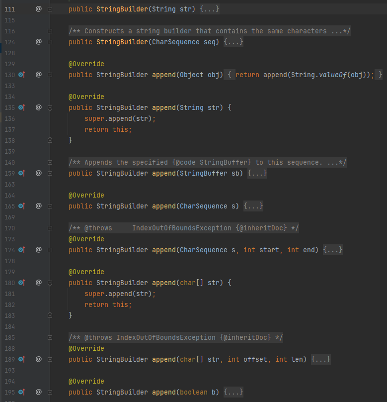

# Các câu hỏi phỏng vấn

## Java
### Java core
###### Nêu 4 tính chất của OOP
1. **Kế thừa** : Class con có thể kế thừa tất cả các thuộc tính cũng như method của class cha, các class con có thể override các method của class cha để nâng cấp và phát triển thêm.
   - Kế thừa cho phép class mở rộng các đặc tính có sẵn mà không cần phải định nghĩa lại.
   - Chúng ta không thể khởi tạo một object cha và tham chiếu đến type của con. Bởi vì khi đó con sẽ không được khởi tạo. ===> `Con c = new Cha();`
::: details Ví dụ
   - Lớp cha động vật(`Animal`) sẽ có tên và hành động ăn và ngủ
   - Các loài động vật khác như `Dog` và `Cat` đều kế thừa từ cha và đều có `hành động ăn và ngủ` nhưng `DOg có thể sủa` và `Cat kêu meo meo`
```
// Lớp cha Animal
class Animal {
    // Thuộc tính của lớp Animal
    protected String name;

    // Constructor của lớp Animal
    public Animal(String name) {
        this.name = name;
    }

    // Phương thức của lớp Animal
    public void eat() {
        System.out.println(name + " is eating.");
    }

    public void sleep() {
        System.out.println(name + " is sleeping.");
    }
}

// Lớp con Dog kế thừa từ lớp Animal
class Dog extends Animal {
    // Constructor của lớp Dog
    public Dog(String name) {
        super(name); // Gọi constructor của lớp cha
    }

    // Phương thức riêng của lớp Dog
    public void bark() {
        System.out.println(name + " is barking.");
    }
}

// Lớp con Cat kế thừa từ lớp Animal
class Cat extends Animal {
    // Constructor của lớp Cat
    public Cat(String name) {
        super(name); // Gọi constructor của lớp cha
    }

    // Phương thức riêng của lớp Cat
    public void meow() {
        System.out.println(name + " is meowing.");
    }
}

// Lớp Main để kiểm tra
public class Main {
    public static void main(String[] args) {
        // Tạo đối tượng Dog
        Dog dog = new Dog("Buddy");
        dog.eat();   // Gọi phương thức từ lớp cha
        dog.sleep(); // Gọi phương thức từ lớp cha
        dog.bark();  // Gọi phương thức riêng của lớp Dog

        // Tạo đối tượng Cat
        Cat cat = new Cat("Whiskers");
        cat.eat();   // Gọi phương thức từ lớp cha
        cat.sleep(); // Gọi phương thức từ lớp cha
        cat.meow();  // Gọi phương thức riêng của lớp Cat
    }
}
```
:::
2. **Đóng gói**: Là việc gói các dữ liệu(thuộc tính) và tạo ra các method hoạt động trên dữ liệu đó.
   - Mục đích của đóng gói che giấu chi tiết về một object và chỉ cho phép tương tác với object thông qua các method.
   - Đóng gói sẽ giúp bảo vệ dữ liệu của đối tượng không bị truy cập hoặc thay đổi bất hợp pháp từ bên ngoài.
   - Tùy ngôn ngữ mà đóng gói sẽ thể hiện khác nhau, tuy nhiên đa phần là `thuộc tính được đặt quyền truy cập private `và có `getter` và `setter`
    ::: details Ví dụ
    Đảm bảo về thay đổi dữ liệu của age phải lớn hơn 0.
    ```
    // Lớp Person với các thuộc tính private
    public class Person {
        // Các thuộc tính private
        private String name;
        private int age;
    
        // Getter cho thuộc tính name
        public String getName() {
            return name;
        }
    
        // Setter cho thuộc tính name
        public void setName(String name) {
            this.name = name;
        }
    
        // Getter cho thuộc tính age
        public int getAge() {
            return age;
        }
    
        // Setter cho thuộc tính age
        public void setAge(int age) {
            if (age > 0) { // Kiểm tra tuổi phải lớn hơn 0
                this.age = age;
            } else {
                System.out.println("Age must be positive.");
            }
        }
    
        // Phương thức hiển thị thông tin của Person
        public void displayInfo() {
            System.out.println("Name: " + name);
            System.out.println("Age: " + age);
        }
    }
    
    // Lớp Main để kiểm tra
    public class Main {
        public static void main(String[] args) {
            // Tạo đối tượng Person
            Person person = new Person("John Doe", 30);
            // Hiển thị thông tin của Person
            person.displayInfo();
            // Thay đổi giá trị của thuộc tính name và age thông qua setter
            person.setName("Jane Doe");
            person.setAge(25);
            // Hiển thị lại thông tin của Person sau khi thay đổi
            person.displayInfo();
        }
    }
    ```
    :::
3. **Đa hình**: Đa hình là các method có cùng tên nhưng tùy vào hoàn cảnh sẽ có cách thức hoạt động khác nhau.
Đa hình có 2 kiểu là `override` và `overloading`  
   - **Override**: Khi một class con kế thừa một class cha, nó khả năng ghi đè hành động của cha để hành động ở con sẽ khác với cha.
      ::: details Ví dụ
            - Nhìn ở ví dụ dưới, có một method ở cha là `makeSound`. Class `Dog` và `Cat` đều kế thừa từ `Animal` với override `makeSound` để với Dog và Cat sẽ kêu khác nhau
      ```
      // Lớp cha Animal
      class Animal {
          // Thuộc tính của lớp Animal
          protected String name;
      
          // Constructor của lớp Animal
          public Animal(String name) {
              this.name = name;
          }
      
          // Phương thức của lớp Animal
          public void makeSound() {
              System.out.println(name + " is making a sound.");
          }
      }
      
      // Lớp con Dog kế thừa từ lớp Animal
      class Dog extends Animal {
          // Constructor của lớp Dog
          public Dog(String name) {
              super(name); // Gọi constructor của lớp cha
          }
      
          // Ghi đè phương thức makeSound của lớp cha
          @Override
          public void makeSound() {
              System.out.println(name + " is barking.");
          }
      }
      
      // Lớp con Cat kế thừa từ lớp Animal
      class Cat extends Animal {
          // Constructor của lớp Cat
          public Cat(String name) {
              super(name); // Gọi constructor của lớp cha
          }
      
          // Ghi đè phương thức makeSound của lớp cha
          @Override
          public void makeSound() {
              System.out.println(name + " is meowing.");
          }
      }
      
      // Lớp Main để kiểm tra
      public class Main {
          public static void main(String[] args) {
              // Tạo đối tượng Dog
              Dog dog = new Dog("Buddy");
              dog.makeSound(); // Gọi phương thức makeSound đã được ghi đè
      
              // Tạo đối tượng Cat
              Cat cat = new Cat("Whiskers");
              cat.makeSound(); // Gọi phương thức makeSound đã được ghi đè
          }
      }
      ```
      :::
   - **Overload method**: Hay dịch tiếng việt là **Nạp chồng phương thức** là một kỹ thuật cho phép một method có nhiều phiên bản(Version) có cùng tên trong một class nhưng khác nhau về param.
     - Các param kể đến là khác nhau về số lượng, kiểu dữ liệu.
     - Mục đích của Overload là để tăng tính linh hoạt và khả năng mở rộng của code, giúp các method có thể sử lý các tính huống khác nhau.
       ::: details Ví dụ 1
         - Ví dụ đầu tiên đơn giản trong Java đó là StringBuilder 
         - Cùng một method tên là `append` nhưng chấp nhận nhiều kiểu dữ liệu.
        
       :::
       ::: details Ví dụ 2
       - Ví dụ thứ 2 là về tính tổng các số.
        ```
        public class MathUtils {
        
            // Phương thức tính tổng hai số nguyên
            public int add(int a, int b) {
                return a + b;
            }
        
            // Phương thức tính tổng ba số nguyên
            public int add(int a, int b, int c) {
                return a + b + c;
            }
        
            // Phương thức tính tổng hai số thực
            public double add(double a, double b) {
                return a + b;
            }
        
            // Phương thức tính tổng ba số thực
            public double add(double a, double b, double c) {
                return a + b + c;
            }
        
            public static void main(String[] args) {
                MathUtils mathUtils = new MathUtils();
                
                // Sử dụng các phương thức nạp chồng
                System.out.println("Sum of 2 and 3: " + mathUtils.add(2, 3)); // Gọi phương thức add(int, int)
                System.out.println("Sum of 2, 3 and 4: " + mathUtils.add(2, 3, 4)); // Gọi phương thức add(int, int, int)
                System.out.println("Sum of 2.5 and 3.5: " + mathUtils.add(2.5, 3.5)); // Gọi phương thức add(double, double)
                System.out.println("Sum of 2.5, 3.5 and 4.5: " + mathUtils.add(2.5, 3.5, 4.5)); // Gọi phương thức add(double, double, double)
            }
        }
        
        ```
       :::
