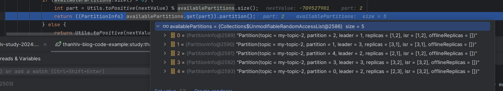

# Kafka producer đã không còn Round Robin Partition với key null.
Chào mọi người,

Sau nhiều ngày được anh Lâm (Leader tại LINE) khuyến khích và động viên viết blog về công nghệ và mình nhận thấy có khá nhiều bạn đã hiểu sai về Kafka trên phiên bản mới nhất. Điều này dẫn đến việc cấu hình partition và consumer bị sai khi sử dụng Kafka.

Vì vậy, bài viết này mình sẽ thực hiện để đạt được hai mục tiêu:
1. Viết một bài chia sẻ về công nghệ trên blog của LINE (Tuy nhiên, do thói quen viết blog, mình vẫn sẽ đăng trên blog cá nhân trước).
2. Giải thích rõ ràng về tiêu đề bài viết `Kafka producer đã không còn Round Robin Partition` và cách Kafka hiện tại đang hoạt động.
[[TOC]]

## Từ phiên bản <=2.3.1 Kafka producer Round Robin Partition
Từ những phiên bản đầu tiên khi Kafka được Open Source đến phiên bản 2.3.1, mặc định Kafka producer khi gửi các Record có key là null sẽ thực hiện Round Robin Partition

Dưới đây là đoạn code ở phiên bản 2.3.1 trên java, phiên bản cuối cùng Kafka Producer mặc định Round Robin Partition

```java
package org.apache.kafka.clients.producer.internals;
.....

public class DefaultPartitioner implements Partitioner {
    // Map ConcurrentMap để lưu trữ bộ đếm count cho từng topic 
    private final ConcurrentMap<String, AtomicInteger> topicCounterMap = new ConcurrentHashMap();

    // Constructor mặc định
    public DefaultPartitioner() {
    }

    // Phương thức cấu hình, hiện tại không làm gì
    public void configure(Map<String, ?> configs) {
    }

    // Phương thức xác định phân vùng cho một bản ghi
    public int partition(String topic, Object key, byte[] keyBytes, Object value, byte[] valueBytes, Cluster cluster) {
        // Lấy danh sách các phân vùng cho chủ đề
        List<PartitionInfo> partitions = cluster.partitionsForTopic(topic);
        int numPartitions = partitions.size();
        
        // Nếu không có khóa, sử dụng bộ đếm tuần tự để chọn phân vùng
        if (keyBytes == null) {
            int nextValue = this.nextValue(topic);
            // lấy về danh sách partition khả dụng để ghi. (Không bao gồm các partition off)
            List<PartitionInfo> availablePartitions = cluster.availablePartitionsForTopic(topic);
            
            // Nếu có phân vùng khả dụng, chọn một trong số chúng
            if (availablePartitions.size() > 0) {
                // Chuyển giá trị bộ đếm thành số dương và lấy phần dư khi chia cho số phân vùng khả dụng
                // Ví dụ topic có 5 partition.
                // part = 2107121300 % 5 ==> 0
                // part = 2107121301 % 5 ==> 1
                // part = 2107121302 % 5 ==> 2
                // part = 2107121303 % 5 ==> 3
                // part = 2107121304 % 5 ==> 4
                int part = Utils.toPositive(nextValue) % availablePartitions.size();
                return ((PartitionInfo)availablePartitions.get(part)).partition();
            } else {
                // Nếu không có phân vùng khả dụng, chọn ngẫu nhiên trong tất cả các phân vùng
                return Utils.toPositive(nextValue) % numPartitions;
            }
        } else {
            // Nếu có khóa, sử dụng hàm băm Murmur2 để chọn phân vùng
            return Utils.toPositive(Utils.murmur2(keyBytes)) % numPartitions;
        }
    }

    // Phương thức lấy giá trị tiếp theo của bộ đếm cho một chủ đề
    private int nextValue(String topic) {
        // Lấy bộ đếm cho chủ đề từ bản đồ
        AtomicInteger counter = (AtomicInteger)this.topicCounterMap.get(topic);
        
        // Nếu bộ đếm chưa tồn tại, khởi tạo nó với giá trị ngẫu nhiên
        if (null == counter) {
            counter = new AtomicInteger(ThreadLocalRandom.current().nextInt());
            AtomicInteger currentCounter = (AtomicInteger)this.topicCounterMap.putIfAbsent(topic, counter);
            if (currentCounter != null) {
                counter = currentCounter;
            }
        }

        // Tăng giá trị bộ đếm và trả về giá trị trước khi tăng
        return counter.getAndIncrement();
    }

    // Phương thức đóng, hiện tại không làm gì
    public void close() {
    }
}

```
Và tất nhiên danh sách ở trong `availablePartitions` không được sort từ 0-N vì vậy đôi khi bạn thấy Record 1 đến Partition 1 nhưng Record 2 đến partition 3, nhưng yên tâm nó vẫn là `Round Robin Partition`



## 2.4.0 đến 3.2.3 Kafka producer stickyPartition
- REF: https://cwiki.apache.org/confluence/display/KAFKA/KIP-794%3A+Strictly+Uniform+Sticky+Partitioner

Từ phiên bản 2.4.0 đến 3.2.3 (2.4.0 >= N <=3.2.3) Kafka Producer thay vì mặc định Round Robin Partition khi key null thì sẽ chuyển sang thuật toán stickyPartition khi key null.

Với `sticky Partition Cache` thì partition sẽ được tính theo `BATCH`, tất cả các `Record` có `key == null` thì tất cả các Record trong cùng `BATCH của cùng 1 topic` được gửi lên cùng nhau sẽ trên cùng một `partition`.
Khi tạo `Batch` mới thì Kafka Producer sẽ random ngẫu nhiên partition.

```java
package org.apache.kafka.clients.producer.internals;
...
public class DefaultPartitioner implements Partitioner {
    private final StickyPartitionCache stickyPartitionCache = new StickyPartitionCache();

    public DefaultPartitioner() {
    }

    public void configure(Map<String, ?> configs) {
    }

    public int partition(String topic, Object key, byte[] keyBytes, Object value, byte[] valueBytes, Cluster cluster) {
        return this.partition(topic, key, keyBytes, value, valueBytes, cluster, cluster.partitionsForTopic(topic).size());
    }

    public int partition(String topic, Object key, byte[] keyBytes, Object value, byte[] valueBytes, Cluster cluster, int numPartitions) {
        return keyBytes == null 
        // nếu key null sử dụng stickyPartitionCache để lấy về partition 
        ? this.stickyPartitionCache.partition(topic, cluster) 
        // nếu key không null, tính hash của key và chia lấy dư cho numPartitions, 
        // trong case này nếu cùng một key thì sẽ luôn trả về cùng một partition
        : Utils.toPositive(Utils.murmur2(keyBytes)) % numPartitions;
    }

    public void close() {
    }

    public void onNewBatch(String topic, Cluster cluster, int prevPartition) {
        // Mỗi khi tạo mới Batch cho topic sẽ thực hiện tính toán lại partition cho batch mới.
        this.stickyPartitionCache.nextPartition(topic, cluster, prevPartition);
    }
}


package org.apache.kafka.clients.producer.internals;
...
// Lớp chịu trách nhiệm quản lý sticky partitioning cho các topic trong Kafka.
public class StickyPartitionCache {
    // Cache để lưu trữ chỉ số partition hiện tại cho mỗi topic.
    private final ConcurrentMap<String, Integer> indexCache = new ConcurrentHashMap<>();

    // Constructor: Khởi tạo một đối tượng StickyPartitionCache mới.
    public StickyPartitionCache() {
    }

    // Phương thức để lấy partition hiện tại cho một topic cụ thể.
    // Nếu partition đã được cache, trả về nó; nếu không, tính toán partition tiếp theo.
    // Đây là method được gọi bởi method partition trong class DefaultPartitioner để lấy về partititon
    public int partition(String topic, Cluster cluster) {
        Integer part = this.indexCache.get(topic);
        return part == null ? this.nextPartition(topic, cluster, -1) : part;
    }

    // Phương thức xác định partition tiếp theo cho một topic cụ thể.
    // Nếu không có partition khả dụng hoặc partition giống như trước, chọn một partition ngẫu nhiên.
    public int nextPartition(String topic, Cluster cluster, int prevPartition) {
        // Lấy danh sách tất cả các partition cho topic.
        List<PartitionInfo> partitions = cluster.partitionsForTopic(topic);
        Integer oldPart = this.indexCache.get(topic);
        Integer newPart = oldPart;

        // Nếu partition cũ(Partition hiện tại trong cache) không phải là partition trước đó, trả về partition cũ từ cache.
        if (oldPart != null && oldPart != prevPartition) {
            return this.indexCache.get(topic);
        } else {
            // Lấy danh sách các partition khả dụng cho topic.(Không bao gồm các partition off)
            List<PartitionInfo> availablePartitions = cluster.availablePartitionsForTopic(topic);

            // Nếu không có partition khả dụng, chọn một partition ngẫu nhiên.
            if (availablePartitions.size() < 1) {
                Integer random = Utils.toPositive(ThreadLocalRandom.current().nextInt());
                newPart = random % partitions.size();
            } 
            // Nếu chỉ có một partition khả dụng, sử dụng partition đó.
            else if (availablePartitions.size() == 1) {
                newPart = availablePartitions.get(0).partition();
            } 
            // Nếu có nhiều partition khả dụng, chọn một partition ngẫu nhiên khác với partition cũ.
            else {
                while(newPart == null || newPart.equals(oldPart)) {
                    int random = Utils.toPositive(ThreadLocalRandom.current().nextInt());
                    newPart = availablePartitions.get(random % availablePartitions.size()).partition();
                }
            }

            // Cập nhật cache với partition mới.
            if (oldPart == null) {
                this.indexCache.putIfAbsent(topic, newPart);
            } else {
                this.indexCache.replace(topic, prevPartition, newPart);
            }

            // Trả về partition mới từ cache.
            return this.indexCache.get(topic);
        }
    }
}


```
Nhìn vào đoạn code ở phía trên bạn có thể thấy, Mỗi khi bắt đầu một batch mới cho topic thì Kafka sẽ tính toán ngẫu nhiên lại Partition cho key  null.


## 3.3.0 đến mới nhất(3.8.0 là phiên bản hiện tại viết Block này )
- Từ phiên bản 3.3.0 đến hiện tại Kafka producer vẫn chọn ngẫu nhiên partition, tuy nhiên thời điểm để chọn lại partition đã thay đổi.
- Tại phiên bản này Kafka producer sẽ sử dụng config `batch.size` để xác định thời điểm lựa chọn lại partition.
- Mỗi khi thêm một Record mới, kafka sẽ tính toán Record tốn bao nhiêu byte( Metadata +data ) sau đó cộng vào một biến count, 
  - Sau đó thay vì ở phiên bản `2.4.0 đến 3.2.3` sẽ ngẫu nhiên lựa chọn lại partition mỗi lần tạo batch thì từ `phiên bản 3.3.0` sẽ thực kiểm tra khi biến count lớn hơn `batch.size` sẽ bắt đầu thực hiện chọn lại partition.

Code lib Kafka, thực tế trong `BuiltInPartitioner` sẽ có nhiều method khác nữa, mình đã bỏ các method khác đi để chỉ tập trung vào `nextPartition` và `updatePartitionInfo` 
```java
package org.apache.kafka.clients.producer.internals;

import ....

public class BuiltInPartitioner {
    private final Logger log;
    private final String topic;
    private final int stickyBatchSize;
    private volatile PartitionLoadStats partitionLoadStats = null;
    private final AtomicReference<StickyPartitionInfo> stickyPartitionInfo 
      = new AtomicReference();
    public static volatile Supplier<Integer> mockRandom = null;

    public BuiltInPartitioner(LogContext logContext, String topic, int stickyBatchSize) {
        this.log = logContext.logger(BuiltInPartitioner.class);
        this.topic = topic;
        if (stickyBatchSize < 1) {
            throw new IllegalArgumentException("stickyBatchSize must be >= 1 but got " + stickyBatchSize);
        } else {
            // được config bởi "batch.size".
            // Giá trị mặc định của "batch.size" là 16384 
            // (https://github.com/apache/kafka/blob/4a485ddb71c844acc8bf241feda1fcbffc5ce9be/clients/src/main/java/org/apache/kafka/clients/producer/ProducerConfig.java#L384)
            this.stickyBatchSize = stickyBatchSize;
        }
    }

    private int nextPartition(Cluster cluster) {
        // mockRandom là test của dev, có thể bỏ qua
        // response của line code này là 1 số ngẫu nhiên
        int random = mockRandom != null ? (Integer)mockRandom.get() : Utils.toPositive(ThreadLocalRandom.current().nextInt());
        PartitionLoadStats partitionLoadStats = this.partitionLoadStats;
        int partition;
        if (partitionLoadStats == null) {
            List<PartitionInfo> availablePartitions = cluster.availablePartitionsForTopic(this.topic);
            if (!availablePartitions.isEmpty()) {
                // từ số random, chia lấy dư cho số lượng availablePartitions
                partition = ((PartitionInfo)availablePartitions.get(random % availablePartitions.size())).partition();
            } else {
                // nếu không có availablePartitions, lấy ngẫu nhiên ở tất cho partition
                List<PartitionInfo> partitions = cluster.partitionsForTopic(this.topic);
                partition = random % partitions.size();
            }
        } else {
            // tính toán dựa trên lượng tải của partition
            assert partitionLoadStats.length > 0;

            int[] cumulativeFrequencyTable = partitionLoadStats.cumulativeFrequencyTable;
            
            // tạo trọng số ngẫu nhiên bằng cách lấy dư của random / cho giá trị cuối cùng trong bảng tần suất tích lũy.
            int weightedRandom = random % cumulativeFrequencyTable[partitionLoadStats.length - 1];
            
            // Sử dụng tìm kiếm nhị phân để tìm chỉ số của partition tương ứng với số ngẫu nhiên có trọng số trong bảng tần suất tích lũy.
            int searchResult = Arrays.binarySearch(cumulativeFrequencyTable, 0, partitionLoadStats.length, weightedRandom);
            int partitionIndex = Math.abs(searchResult + 1);

            assert partitionIndex < partitionLoadStats.length;

            partition = partitionLoadStats.partitionIds[partitionIndex];
        }

        this.log.trace("Switching to partition {} in topic {}", partition, this.topic);
        return partition;
    }

    void updatePartitionInfo(StickyPartitionInfo partitionInfo, int appendedBytes, Cluster cluster, boolean enableSwitch) {
        if (partitionInfo != null) {
            assert partitionInfo == this.stickyPartitionInfo.get();

            int producedBytes = partitionInfo.producedBytes.addAndGet(appendedBytes);
            if (producedBytes >= this.stickyBatchSize * 2) {
                this.log.trace("Produced {} bytes, exceeding twice the batch size of {} bytes, with switching set to {}", new Object[]{producedBytes, this.stickyBatchSize, enableSwitch});
            }

            if (producedBytes >= this.stickyBatchSize && enableSwitch || producedBytes >= this.stickyBatchSize * 2) {
                StickyPartitionInfo newPartitionInfo = new StickyPartitionInfo(this.nextPartition(cluster));
                this.stickyPartitionInfo.set(newPartitionInfo);
            }

        }
    }
}

```
DefaultRecordBatch.estimateBatchSizeUpperBound(key, value, headers);

- REF: https://issues.apache.org/jira/browse/KAFKA-14156
##
Trong nhiều cuộc phỏng vấn và các bài thảo luận mới trên mạng mọi người vẫn nói best nên thiếp lập số lượng partition của topic bằng với số lượng consumer bởi vì nếu Record không có Key thì Kafka sẽ `Round Robin` để phân phối các Record vào các partition.

Đúng, điều này là đúng đối với phiên bản Kafka < v2.4 tức phiên bản 2.3 và các phiên bản nhỏ hơn.

