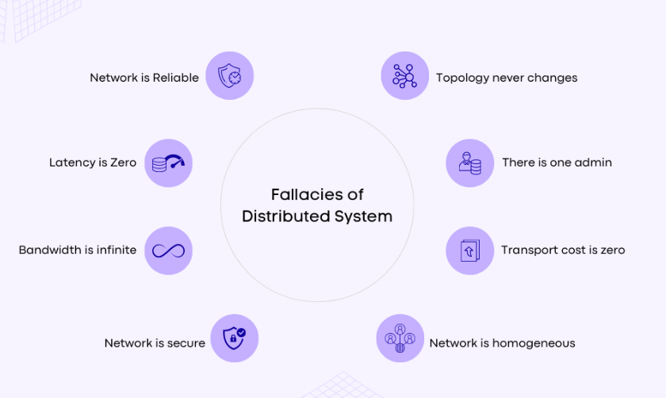
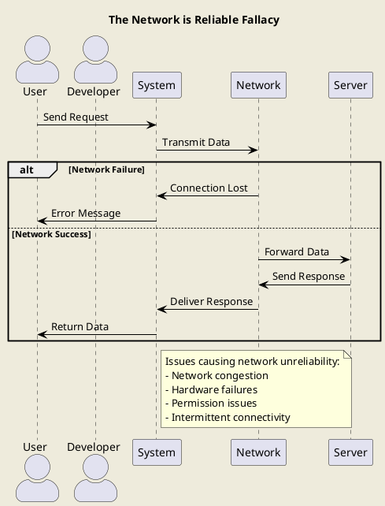
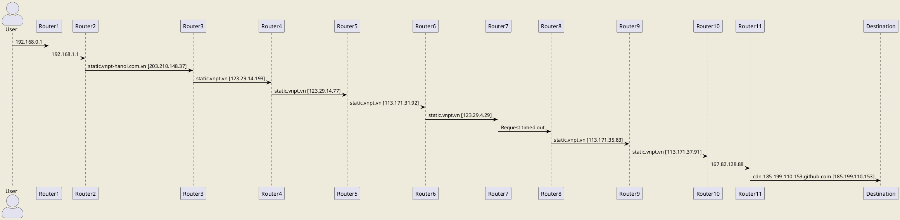
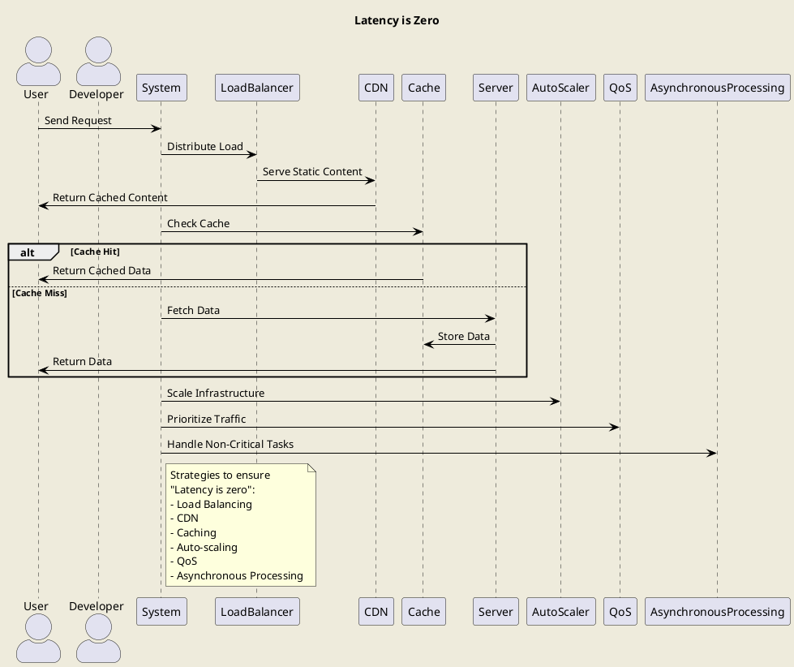
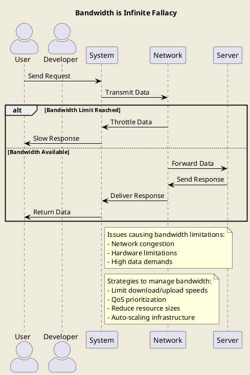
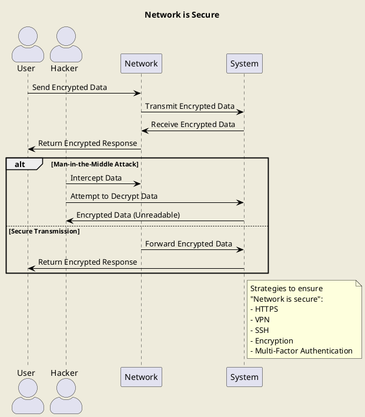
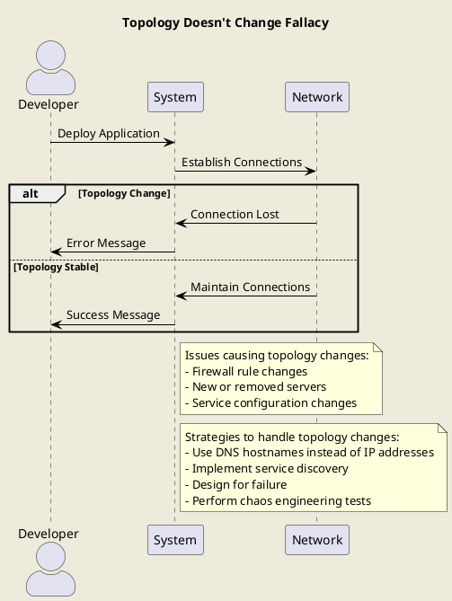
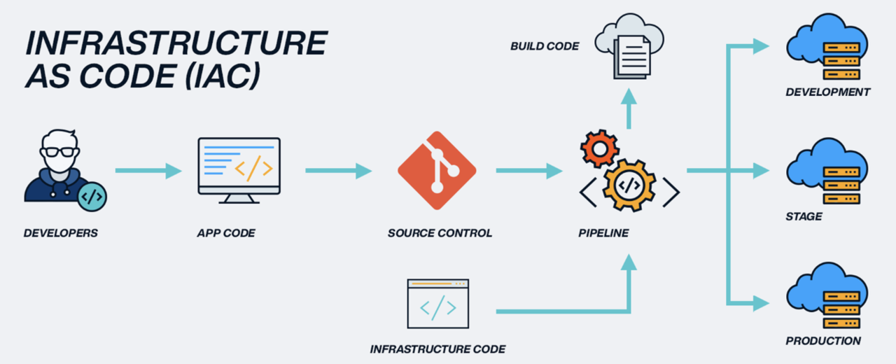
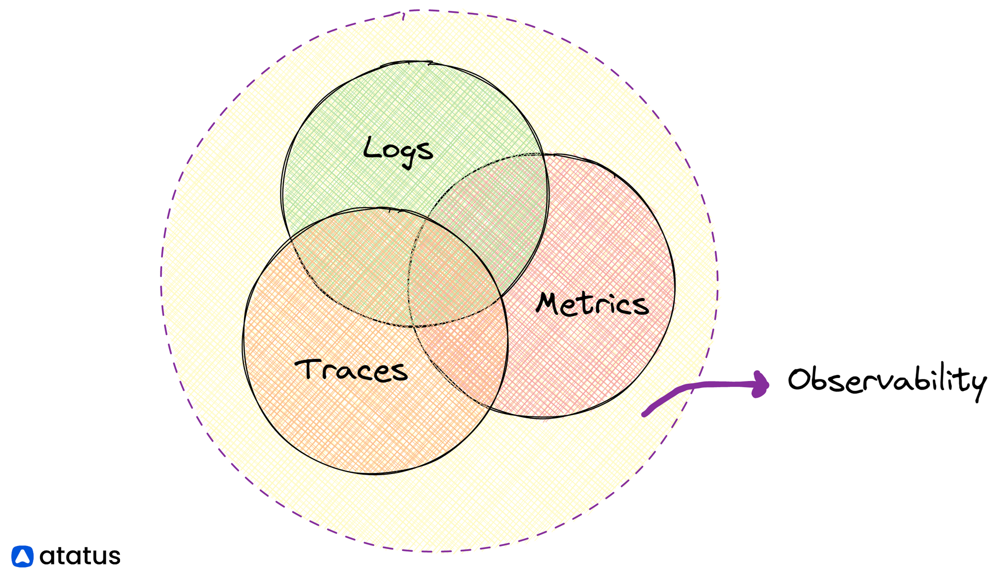

Fallacies of distributed computing là một tập hợp các khẳng định được tập hợp bởi [L. Peter Deutsch](https://en.wikipedia.org/wiki/L._Peter_Deutsch) và một số người tại [Sun Microsystems](https://en.wikipedia.org/wiki/Sun_Microsystems) mô tả về những giả định sai lầm của các lập tình viên đanng làm việc với ứng dụng phân tán.

Tuy nhiên trong bài viết này mình sẽ dựa vào khái niệm Fallacies of distributed computing để mapping nó về phát triển ứng dụng, phần mềm trong hệ thống microservices.

Điều này sẽ giúp các bạn có cái nhìn tổng quan về những sai lầm mà các lập trình viên hay gặp phải khi phát triển và triển khai ứng dụng của mình lên cho người dùng sử dụng.




## Những sai lầm.
### The network is reliable
**The network is reliable**: Dịch tiếng việt là `Mạng lưới đáng tin cậy`. Đây là 1 sai lầm nghiêm trọng nhưng cũng hay xảy ra bởi các lập trình viên mới.

Thông thường, các hệ thống sẽ phụ thuộc vào 1 hoặc N các hệ thống khác để hoạt động. Nghĩa là trong quá trình hoàn thành nghiệm vụ của mình, hệ thống sẽ cần gọi đến 1 hoặc N hệ thống khác để hoàn thành nghiêm vụ của mình.

Câu hỏi đặt ra là: Điều gì sẽ xảy ra khi việc thực hiện gọi đến hệ thống khác không thành công? (Ví dụ timeout hoặc không thể kết nối)

Rất nhiều lập trình viên tin rằng các kết nối các hệ thống khác sẽ hoạt động tốt và luôn không có vấn đề gì xảy ra. Tuy nhiên kết nối mạng rất sẽ bị lỗi bởi nhiều nguyên nhân như:
- Vấn đề phần mềm.
- Vấn đề phần cứng.(Giới hạn phần cứng, hỏng hóc phần cứng)
- Vấn đề bảo mật(Thiếp lập ssl/tls thất bại...etc..)
- Môi trường mạng không ổn định.
- Một diễn biến xấu: Ví dụ hệ thống khác bị tấn công từ chối dịch vụ (DDoS) hoặc bị tấn công bảo mật.


Một hệ thống tốt cần có một cơ chế linh loạt bao gồm đầy đủ các tính năng dự phòng khi mất kết nối đến các hệ thống khác.



#### Giải pháp `The network is reliable`.
::: details Chi tiết
Sẽ có rất nhiều cách để đảm bảo hệ thống của chúng ta là `network is reliable` khi chúng ta là phụ thuộc của các hệ thống khác, dưới đây là một số ví dụ.(Có thể kết hợp nhiều cách để đảm bảo hệ thống của chúng ta là `network is reliable`).

- Cung cấp tính năng Retry Mechanism để thử lại kết nối khi kết nối bị lỗi.
- Sử dụng Queue, Thông thường các hệ thống queue sẽ có tính năng retry mechanism chuyển message đến người nhận lỗi.
  - Nếu 1 tin nhắn không thể gửi(Max retry..etc..) thì nó có thể được chuyển đến một hệ thống khác để xử lý hoặc [Dead letter queue](https://en.wikipedia.org/wiki/Dead_letter_queue)
- Một điều quan trọng đó là ngay khi thiết kế hệ thống hoặc lập trình viên code thì phải có tư tưởng là sẽ có lỗi mạng.
- ...
:::
### Latency is zero
**Latency is zero** : Dịch tiếng việt là độ trễ là 0.

Độ trễ có thể hiểu đơn giản là một sự kích thích và phản ứng tương ứng với kích thích đó.
- Ví dụ: Khi bạn buồn ngủ, bạn uống cafe và sau 5 phút bạn không còn buồn ngủ. Cafe là kích thích, và việc bạn không còn buồn ngủ là phản ứng tương ứng với kích thích đó và 5 phút là độ trễ.

Trong thuật ngữ mạng đó là thời gian để di chuyển data từ vị trí A đến vị trí khác thông qua mạng.
Trong thuật ngữ phần mềm đó là thời gian để xử lý một yêu cầu từ người dùng và trả về kết quả cho người dùng.

Độ trễ có thể gần bằng 0 khi chúng ta chạy ứng dụng ở local và không đáng kể nếu sử dụng trong local area  network(LAN). Tuy nhiên khi chúng ta sử dụng ứng dụng ở global network thì độ trễ sẽ tăng lên.
Bởi vì trong mạng lưới global, dữ liệu phải di chuyển qua nhiều node và đường truyền mạng khác nhau, điều này tạo ra độ trễ.

Ví dụ từ local của tôi truy cập đến Thanhlv.com sử dụng Tracer để kiểm tra các node mà dữ liệu phải đi qua.

```
C:\Users\thanhlv>tracert thanhlv.com

Tracing route to thanhlv.com [185.199.110.153]
over a maximum of 30 hops:

  1    <1 ms    <1 ms    <1 ms  192.168.0.1
  2     1 ms    <1 ms    <1 ms  192.168.1.1
  3     2 ms     5 ms     2 ms  static.vnpt-hanoi.com.vn [203.210.148.37]
  4     4 ms     3 ms     2 ms  static.vnpt.vn [123.29.14.193]
  5     3 ms     3 ms     2 ms  static.vnpt.vn [123.29.14.77]
  6     3 ms     4 ms     3 ms  static.vnpt.vn [113.171.31.92]
  7     3 ms     3 ms     3 ms  static.vnpt.vn [123.29.4.29]
  8     *        *        *     Request timed out.
  9     4 ms     3 ms    23 ms  static.vnpt.vn [113.171.35.83]
 10    21 ms    21 ms    20 ms  static.vnpt.vn [113.171.37.91]
 11    38 ms    38 ms    38 ms  167.82.128.88
 12    22 ms    23 ms    22 ms  cdn-185-199-110-153.github.com [185.199.110.153]
```


Để truy cập website thanhlv.com từ local của tôi, dữ liệu phải đi qua 11 node và mỗi node sẽ tạo ra độ trễ.


Tất cả hành động đều có độ trễ, không có hành động nào có độ trễ là 0. Dù bản thân con người cũng có độ trễ, nhưng nó đủ nhanh để không cảm nhận được độ trễ nhưng nó vẫn tồn tại.

Việc hạn chế có các độ chễ không cần thiết khi phát triển ứng dụng là một điều cần thiết. Có nhiều các độ chễ nhỏ có thể tính bằng mili giây nhưng nếu có quá nhiều độ chễ nhỏ thì nó có thể tính bằng giây hoặc phút.

Khi phát triển ứng dụng, chúng ta cần phải nhớ rằng mọi hành động đều có độ trễ và nó có thể tính bằng phút.


Một ví dụ điển trình của điều này chính là ORM. Khi sử dụng ORM, chúng ta có thể cấu hình Lazy load và Eager Loading.
- Lazy load: Khi cấu hình Lazy load, dữ liệu sẽ chỉ được load khi cần thiết, điều này có thể tạo ra độ trễ khi bắt đầu sử dụng dữ liệu.
  - Tuy nhiên nó cũng có 2 mặt, nếu dữ liệu đó không cần thiết thì nó sẽ không load dữ liệu đó, giúp giảm tải cho hệ thống.
  - Ví dụ: Học sinh Tuấn vào màn hình danh sách lịch học trong tháng: 
    - Nếu cấu hình Lazy load: Dữ liệu sẽ được load khi Tuấn click vào từng ngày, mỗi lần click sẽ có độ trễ khoảng 0.5s, tuy nhiên tại màn hình danh sách chỉ tốn 1s.
- Eager Loading: Khi cấu hình Eager Loading, tất cả dữ liệu sẽ được load ngay khi truy vấn, điều này có thể tạo ra độ trễ khi truy vấn số lượng lớn dữ liệu.
  - Giống với Lazy load, Eager Loading cũng có 2 mặt, nếu dữ liệu đó không được sử dụng thì nó sẽ tạo ra độ trễ không cần thiết.
  - Ví dụ: Học sinh Tuấn vào màn hình danh sách lịch học trong tháng:
    - Nếu cấu hình Eager Loading: Dữ liệu sẽ được load ngay khi vào màn hình và tần tốn 3s để load dữ liệu.


#### Giải pháp `Latency is zero`.

::: details Chi tiết

- Sử dụng Cache để không cần tính toán lại dữ liệu đã được tính toán trước đó.
  - Có thể sử dụng Cache ở nhiều cấp độ, từ cấp độ ứng dụng, cấp độ hệ thống...
  - Có thể cache ở nhiều nơi như Redis, Memcached, CDN, Local Storage...etc...
  ```plantuml
     @startuml
      skinparam backgroundColor #EEEBDC
      skinparam shadowing false
      skinparam arrowColor #000000
      skinparam actorStyle awesome
      
      title Latency is Zero
      
      actor User as U
      actor Developer as D
      
      U -> System: Send Request
      System -> Cache: Check Cache
      alt Cache Hit
      Cache -> U: Return Cached Data
      else Cache Miss
      System -> Database: Fetch Data
      Database -> System: Return Data
      System -> Cache: Store Data
      System -> U: Return Data
      end
      
      note right of System
      Strategies to reduce latency:
      - Use Cache
        - Minimize remote calls
        - Physically closer servers
        end note
      
     @enduml
  ```
- Hạn chế sử dụng các remote call(Call database, rest, rpc...etc..) thừa thãi.
- Về mặt vật lý, nếu dữ liệu hoặc máy chủ ở gần khách hàng thì độ trễ sẽ giảm vì dữ liệu không cần phải di chuyển xa, qua nhiều node.


:::

### Bandwidth is infinite

**Bandwidth is infinite**: Dịch tiếng việt là Băng thông là vô hạn.

Bằng thông hiểu đơn giản là tốc chạy của chúng ta mỗi giây. Trong mạng cũng vậy, băng thông là tốc độ truyền dữ liệu mỗi giây. [Mặc dù băng thông đã tăng rất nhiều trong vài thập kỷ qua nhưng nó không phải là vô hạn.](https://www.nngroup.com/articles/law-of-bandwidth/)

Người dùng có thể không đủ may mắn để trải nghiệm băng thông mạng cao, bởi do nhiều vấn đề. Ví dụ như: Họ dùng mạng di động. [Họ dùng mạng ở Việt Nam chứ không phải ở Singapore.](https://en.wikipedia.org/wiki/List_of_sovereign_states_by_Internet_connection_speeds)

Một điều nữa là do băng thông tăng lên, nên các yêu cầu về dữ liệu lớn cũng tăng lên. Ví dụ như video 4k, 8k, 16k...etc... 

Có lẽ bạn chưa biết, các VPS hoặc cloud ở Việt Nam thường có Bandwidth tối đa là 100 Mb/s. Nếu ứng dụng chúng ta sử dụng Bandwidth vượt quá giới hạn ứng dụng của chúng ta có thể bị tắc nghẽn.

Và tất nhiên chính thiết bị phần cứng của chúng ta cũng có giới hạn. Nếu tốc độ vượt quá giới hạn phần cứng thì hệ thống của chúng ta sẽ bị tắc nghẽn.

- Ví dụ 1: Ứng dụng của chúng ta cung cấp chức năng xem phim, nếu có quá nhiều người xem phim cùng lúc thì hệ thống của chúng ta sẽ bị tắc nghẽn.



#### Các thiệt hại khi đạt giới hạn Bandwidth hoặc lạm dụng Bandwidth.
- Có thể gây tắc nghẽn hệ thống, request người dùng sẽ không thể đáp ứng hoặc đáp ứng chậm.
- Đa số các bên cho thuê VPS và Cloud đều sẽ tính phí mạng, nếu lạm dụng mạng có thể dẫn đến chi phí cao.
- Lạm dụng băng thông có thể làm tăng nguy cơ bị tấn công từ chối dịch vụ (DDoS), làm giảm khả năng bảo mật của hệ thống.
- Khi băng thông bị giới hạn, khả năng mở rộng của hệ thống cũng bị ảnh hưởng, làm giảm khả năng phục vụ số lượng lớn người dùng cùng lúc.
#### Giải pháp `Bandwidth is infinite`.
::: details Chi tiết
- Giới hạn tốc độ download và upload của người dùng.
- QoS: Cấu hình phòng ngừa để ưu tiên các tính năng trọng hơn khi sự cố xảy ra. Để đảm bảo rằng các dịch vụ quan trọng nhất của bạn vẫn hoạt động tốt nhất có thể.
- Giảm kích thước của các tài nguyên như hình ảnh, script và stylesheet để giảm lượng dữ liệu truyền tải.
- Tự động mở rộng hạ tầng dựa trên nhu cầu lưu lượng để xử lý các tải khác nhau một cách hiệu quả.
:::

## Network is secure

Ngày nay(2024) các lập trình viên ở Việt Nam chú trọng nhiều vào việc phát triển chức năng, tối ưu hóa hệ thống, tối ưu hóa tốc độ, tối ưu hóa bộ nhớ, tối ưu hóa cơ sở dữ liệu... nhưng ít chú trọng vào việc bảo mật hệ thống.

Dù lập trình viên có chú ý bảo mật hệ thống trong code của mình rất tốt nhưng khi dữ liệu đi qua mạng thì không bao giờ an toàn.

Hiện tại khi dữ liệu đi qua mạng thì có rất nhiều cách để hacker hoặc các hệ thống trung gian đứng giữa đánh cắp dữ liệu hoặc thay đổi dữ liệu gây ra vấn đề giả mạo yêu cầu hoặc truy cập trái phép.

Ngày này HTTPS đã trở thành chuẩn mực để bảo mật dữ liệu truyền tải giữa người dùng và hệ thống. Tuy nhiên vẫn có rất nhiều cách để tấn công dữ liệu truyền tải giữa các hệ thống.
Ví dụ: Năm 2014 chính bản thân tiêu chuẩn SSL đã có lỗ hổng [Heartbleed](https://heartbleed.com/), một lỗ hổng nghiêm trọng trong mã nguồn mở OpenSSL.

Một trong những khái niệm phổ biến về kiểu tấn công này là man-in-the-middle attack.

Vì vậy hệ thống cần có các cơ chế bảo mật ở tầng mạng để đảm bảo dữ liệu của chúng ta không bị đánh cắp hoặc thay đổi.

Vấn đề không phải là dữ liệu của bạn có bị đánh cắp hay không; mà là khi nào dữ liệu sẽ bị đánh cắp.
::: details Chi tiết
- Dù hệ thống có an toàn đến đâu, bạn có vò đầu bứt tai để bảo mật hệ thống của mình thì vẫn luôn có nguy cơ bị tấn công và bị đánh cắp dữ liệu hoặc thay đổi dữ liệu.
- Vì vậy hệ thống cần có các cơ chế bảo mật ở tầng mạng để đảm bảo dữ liệu của chúng ta không bị đánh cắp hoặc thay đổi.
:::

### Hệ thống của chúng ta Nên làm gì để đảm bảo `Network is secure`.
 ::: details Chi tiết
- Sử dụng HTTPS để mã hóa dữ liệu truyền tải giữa người dùng và hệ thống.
- Sử dụng VPN để mã hóa dữ liệu truyền tải giữa các hệ thống.
- Sử dụng SSH để truy cập an toàn vào hệ thống.
- Sử dụng Rate Limiting để giới hạn tốc độ truy cập của người dùng. Phòng trường hợp hack dò lỗi bảo mật.
- Sử dụng Encryption để mã hóa dữ liệu truyền tải giữa các hệ thống hoặc giữa người dùng và hệ thống.
- Sử dụng Multi-Factor Authentication để bảo vệ tài khoản người dùng.
- Luôn kiểm tra các rủi do bảo mật hàng đầu hiện tại : https://owasp.org/
- ...etc...



 :::

### Topology doesn't change(Các liên kết không thay đổi)
- Các môi trường có thể có các yêu cầu mạng khác nhau, môi trường dev thường yêu cầu start nhanh, môi trường production thường yêu cầu tính sẵn sàng cao, khả năng phục hồi và dự phòng.
- các quy tắc về tường lửa có thể thay đổi để đáp ứng các yêu cầu về bảo mật.
  - Ví dụ: Môi trường dev có thể không cần thiết phải cấu hình tường lửa, nhưng môi trường production cần phải cấu hình tường lửa để bảo vệ hệ thống.
- Nhiều service mới được triển khai, nhiều service cũ bị xóa bỏ, nhiều service bị thay đổi cấu hình.

Việc liên kết mạng giữa các ứng dụng thay đổi thường nằm ngoài tầm kiểm soát của chúng ta, bởi vì có nhiều lý do cho điều này. Các máy chủ có thể được thêm mới hoặc gỡ bỏ. Các service có thể được di chuuyển, nâng cấp hoặc không còn được sử dụng nữa.

#### Solutions

Do việc liên kết mạng là không ổn định, nên có một số giải pháp để giảm thiểu vấn đề này.

1. Abstract network specifics(Trừ tượng về thông tin mạng):
   - Tránh sử dụng trực tiếp từ IP address, thay vào đó hãy sử dụng DNS hostname
   - Cân nhắc sử dụng [service discovery pattern](https://microservices.io/patterns/server-side-discovery.html) cho Microservice architectures.
2. Design for failure( Thiết kế cho thất bại)
   - Thiết kế ứng dụng của chúng ta để phòng ngừa tình trạng không thể thay thế. Khi có lỗi chúng ta sẽ có cách để thay thế hoặc sử lý lỗi.
   - Kiểm tra hỗn loạn ([chaos engineering](https://en.wikipedia.org/wiki/Chaos_engineering)), kiểm tra hành vi của hệ thống trong các lỗi về cơ sở hạ tầng, mạng, application


### There is one administrator
Nếu hệ thống của chúng ta độc lập và được triển khai trong môi trường do chúng ta kiểm soát, hê thống do chúng ta quản lý thì khi đó chỉ có 1 administrator.

Tuy nhiên 99.999% các hệ thống không phải là như vậy, hệ thống của chúng ta sẽ phụ thuộc vào nhiều hệ thống khác, nhiều dịch vụ khác, mỗi hệ thống khác sẽ có một admin khác nhau.

- Ví dụ: 
  - Bạn là CODE OWNERS của project, trong project của bạn có sử dụng dịch vụ của AWS, bạn không phải là admin của AWS, bạn chỉ là người quản lý project của mình.
  - Project của bạn là project nội bộ, được triển khai bởi nhóm devops trên hạ tầng k8s do devops quản lý. Bạn không phải là admin của hạ tầng k8s, bạn chỉ là người quản lý project của mình.

Nhiều nhóm nội bộ hoặc bên ngoài có thể tham gia để triển khai và hỗ trợ hệ thống. Các nhóm đó sẽ hoạt động bên ngoài quy trình của chúng ta, họ có thể thay đổi cấu hình, cài đặt, triển khai, nâng cấp hệ thống của chúng ta.


#### Solutions

##### Infrastructure as Code(IAC)
Nếu có thể chúng ta có thể tự động hóa việc cung cấp các cấu hình nơi các môi trường được triển khai ứng dụng.

Infrastructure as Code là thành phần CORE của Devops, với cơ sở hạ tầng được mô hình hóa như code và được quản lý như quy trình quản lý code.


##### Logging and monitoring

Việc chuẩn đoán lỗi chưa bao giờ là dễ dàng, đặc biệt là với các hệ thống phân tán hoặc microservices.

Để có khả năng nhìn rõ hơn về hành vi của ứng dụng thì centralised logging, metrics, và tracing ([The Three Pillars of Observability](https://www.oreilly.com/library/view/distributed-systems-observability/9781492033431/ch04.html)) được coi là các key chính cần có trong thiết kế hệ thống.


##### Decoupling(Tách rời)
- Đảo bảo khả năng Decouplin giữa cách thành phần trong hệ thống giúp chúng ta dễ dàng thay đổi, nâng cấp, thêm mới, xóa bỏ các thành phần mà không ảnh hưởng đến các thành phần khác. Điều này sẽ giúp khi có một component bị lỗi thì hệ thống có thể chuyển nhanh sang một component khác.

### Transport cost is zero
Chúng ta đã nói đến [latency is zero](#latency-is-zero) ở phía trước liên quan đến thời gian cần để giữ liệu gửi qua mạng. Thì `Transport cost is zero` chính là những thứ cần thiết để thực hiện các điều đó.

#### Marshalling
Marshalling là quá trình trong việc sắp xếp dữ liệu và chuyển dữ liệu từ từ layer Application(Layer 7) sang layer Transport(Layer4) trong `OSI Reference Model` để gửi dữ liệu qua mạng.

#### Infrastructure

Chi phí hạ tầng luôn là một trong những chi phí tốn rất nhiều của các công ty công nghệ.

Đối với private cloud, công ty phải chi trả cho việc mua máy chủ, lưu trữ, mạng, bảo mật, điện, môi trường làm việc, nhân sự quản lý hệ thống.

Đối với public cloud, mặc dù chi phí phần cứng vật lý tất nhiên không phải là yếu tố đáng lo ngại nhưng công ty phải chi trả cho việc sử dụng dịch vụ của public cloud, chi phí này có thể tăng lên nếu công ty sử dụng nhiều dịch vụ của public cloud.

#### Solutions
Thực tế các chi phí này nằm ngoài tầm kiểm soát của chúng ta, nhưng chúng ta có thể tối ưu hóa việc sử dụng hạ tầng của mình.

Ví dụ chúng ta có thể giảm bớt chi phí bằng các tối ưu hóa data gửi qua mạng bằng cách tận dụng định dạng dữ liệu được tối ưu hóa như `Protocol Buffers` thay vì `JSON`, `XML`.

### The network is homogeneous
The network is homogeneous: Dịch tiếng việt là mạng đồng nhất.

Mạng thường phải hỗ trợ nhiều loại máy khách được kết nối — từ máy tính để bàn đến thiết bị di động và thiết bị IoT.

Mỗi loại máy khách có thể sử dụng các giao thức mạng khác nhau, có thể sử dụng các phiên bản giao thức khác nhau, có thể sử dụng các cấu hình mạng khác nhau.

#### Solutions

Khả năng tương tác là chìa khóa để giải quyết vấn đề này.

Nếu có thể, hãy tránh các ứng dụng sử dụng các giao thức mạng cũ hoặc không an toàn, các giao thức độc quyền.

Ưu tiên các giao thức mạng tiêu chuẩn, an toàn và phổ biến như HTTP, HTTPS, TCP, UDP.

Ví dụ sử dụng JSON và RESTfull để tương tác giữa các ứng dụng. Điều này sẽ rất hữu ích để cho các bên thứ 3 có thể tương tác với hệ thống của chúng ta.

## Tổng kết
Những sai lầm này không phải là những lỗi cụ thể mà chúng ta có thể sửa ngay lập tức, mà chúng ta cần phải nhớ rằng chúng tồn tại và cần phải xử lý chúng khi phát triển ứng dụng.

Vì vậy khi phát triển ứng dụng, chúng ta cần phải nhớ rằng mọi hành động đều có độ trễ, băng thông không phải là vô hạn, mạng không phải là an toàn, mạng không phải là đồng nhất, mạng không phải là ổn định, và không phải chỉ có một admin.

Một điều quan trọng nhất là chúng ta cần phải nhớ rằng mọi hệ thống đều có thể bị lỗi, và chúng ta cần phải thiết kế hệ thống của mình để phòng tránh lỗi và xử lý lỗi một cách hiệu quả.

Cảm ơn ban đã đọc bài viết này, hy vọng nó sẽ giúp ích cho bạn trong việc phát triển của mình.

# REF
- https://dereklawless.ie/fallacies-of-distributed-computing-1-the-network-is-reliable/
- https://blogs.oracle.com/developers/post/fallacies-of-distributed-systems
- https://medium.com/geekculture/the-eight-fallacies-of-distributed-computing-44d766345ddb
