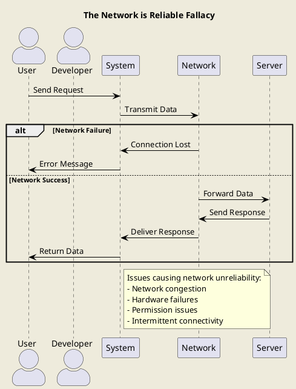
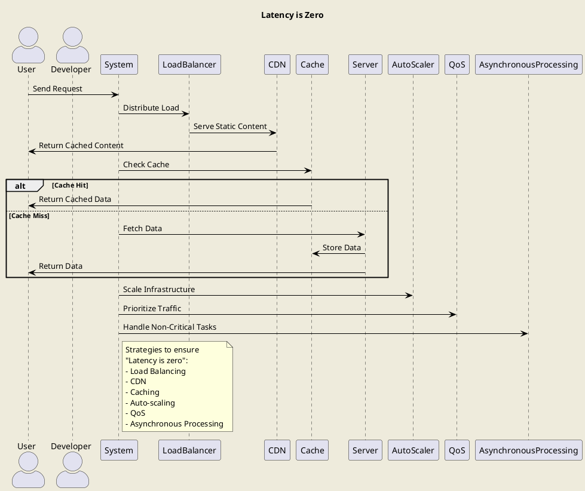

- Fallacies of distributed computing là một tập hợp các khẳng định được tập hợp bởi [L. Peter Deutsch](https://en.wikipedia.org/wiki/L._Peter_Deutsch) và một số người tại [Sun Microsystems](https://en.wikipedia.org/wiki/Sun_Microsystems) mô tả về những giả định sai lầm của các lập tình viên đanng làm việc với ứng dụng phân tán.

## Những sai lầm.
### The network is reliable
**The network is reliable**: Dịch tiếng việt là `Mạng lưới đáng tin cậy`. Đây là 1 sai lầm nghiêm trọng nhưng cũng hay xảy ra nhất. 

Rất nhiều lập trình viên tin rằng các kết nối mạng đến node hoặc hệ thống khác sẽ tốt và luôn không có vấn đề gì xảy ra. Tuy nhiên kết nối mạng rất sẽ bị lỗi bởi nhiều nguyên nhân như mất kết nối, không có quyền, lỗi phần cứng...etc..

Hệ thống cần có một cơ chế linh loạt bao gồm đầy đủ các tính năng dự phòng khi mất kết nối đến các hệ thống khác.



#### Hệ thống của chúng ta Nên làm gì để đảm bảo `The network is reliable`.
Sẽ có rất nhiều cách để đảm bảo hệ thống của chúng ta là `network is reliable` khi chúng ta là phụ thuộc của các hệ thống khác, dưới đây là một số ví dụ.

- Cung cấp load balance để phân tải hệ thống, phòng ngừa hệ thống sập.
- Auto scale để mở rộng quy mô tự động.
- Cung cấp tính năng sử dụng Asynchronous messaging.
- Sử dụng CDN và deploy hệ thống ở nhiều khu vực.
- Một điều quan trọng đó là ngay khi thiết kế hệ thống hoặc lập trình viên code thì phải có tư tưởng là sẽ có lỗi mạng.
- ...

### Latency is zero
**Latency is zero** : Dịch tiếng việt là độ trễ là 0.

Tình huống được kiểm tra phổ biến bởi các lập trình viên là các hệ thống phụ thuộc không hoạt động. Tuy nhiên một trong những trường hợp hay xảy ra nhưng ít lập trình viên nghĩ đến đó là các phụ thuộc hoạt động chậm.

Các hệ thống có thể bị đột ngột tăng lượng người sử dụng đột biến, mạng hệ thống chậm, mạng kết nối chậm... everything.., điều này sẽ tác động đến các hệ thống gửi phản hồi(Response) lại cho người dùng chậm hơn.

Hệ thống cần có các cơ chế để phòng ngừa tình trạng các hệ thống khác phản hồi chậm.


#### Hệ thống của chúng ta Nên làm gì để đảm bảo `Latency is zero`.

::: details Chi tiết

Sẽ có rất nhiều cách để đảm bảo hệ thống của chúng ta là `Latency is zero` khi chúng ta là phụ thuộc của các hệ thống khác, dưới đây là một số ví dụ.
- Cung cấp load balance để phân tải hệ thống, phòng ngừa quá nhiều yêu cầu gây chậm chạp hệ thống.
- Auto scale để mở rộng quy mô tự động.
- Tư duy luôn luôn nhớ rằng gọi đến một phụ thuộc khác thì luôn luôn có độ trễ, và nó có thể tính bằng phút.



:::

### Bandwidth is infinite
Có lẽ bạn chưa biết, các VPS hoặc cloud ở Việt Nam thường có Bandwidth tối đa là 100 Mb/s. Nếu ứng dụng chúng ta sử dụng Bandwidth vượt quá giới hạn ứng dụng của chúng ta có thể bị tắc nghẽn.
Và tất nhiên chính thiết bị phần cứng của chúng ta cũng có giới hạn. Nếu tốc độ vượt quá giới hạn phần cứng thì hệ thống của chúng ta sẽ bị tắc nghẽn.
- Ví dụ 1: Ứng dụng của chúng ta cung cấp chức năng xem phim, nếu có quá nhiều người xem phim cùng lúc thì hệ thống của chúng ta sẽ bị tắc nghẽn.
#### Các thiệt hại khi đạt giới hạn Bandwidth hoặc lạm dụng Bandwidth.
- Có thể gây tắc nghẽn hệ thống, request người dùng sẽ không thể đáp ứng hoặc đáp ứng chậm.
- Đa số các bên cho thuê VPS và Cloud đều sẽ tính phí mạng, nếu lạm dụng mạng có thể dẫn đến chi phí cao.
- Lạm dụng băng thông có thể làm tăng nguy cơ bị tấn công từ chối dịch vụ (DDoS), làm giảm khả năng bảo mật của hệ thống.
- Khi băng thông bị giới hạn, khả năng mở rộng của hệ thống cũng bị ảnh hưởng, làm giảm khả năng phục vụ số lượng lớn người dùng cùng lúc.
#### Hệ thống của chúng ta Nên làm gì để đảm bảo `Bandwidth is infinite`.
::: details Chi tiết

- Cung cấp load balance để phân tải hệ thống.
- Sử dụng CDN để cung cấp tốc độ liên lạc nhanh nhất từ người dùng đến hệ thống.
- Sử dụng CDN cho các file tĩnh như hình ảnh, video, css, js...
- Sử dụng Cache để giảm tải cho hệ thống.
- Giới hạn tốc độ download và upload của người dùng.
- QoS: Cấu hình phòng ngừa để ưu tiên các tính năng trọng hơn khi sự cố xảy ra. Để đảm bảo rằng các dịch vụ quan trọng nhất của bạn vẫn hoạt động tốt nhất có thể.
- Giảm kích thước của các tài nguyên như hình ảnh, script và stylesheet để giảm lượng dữ liệu truyền tải
- Tự động mở rộng hạ tầng dựa trên nhu cầu lưu lượng để xử lý các tải khác nhau một cách hiệu quả.
- Người thiết kế hệ thống và người phát triển phần mềm cần phải có tư duy về việc giới hạn băng thông và tối ưu hóa băng thông.


```plantuml
skinparam backgroundColor #EEEBDC
skinparam shadowing false
skinparam arrowColor #000000
skinparam actorStyle awesome

title Bandwidth is Infinite

actor User as U
actor Developer as D

U -> System: Send Request
System -> LoadBalancer: Distribute Load
LoadBalancer -> CDN: Serve Static Content
CDN -> U: Return Cached Content

System -> Cache: Check Cache
alt Cache Hit
    Cache -> U: Return Cached Data
else Cache Miss
    System -> Server: Fetch Data
    Server -> Cache: Store Data
    Server -> U: Return Data
end

System -> QoS: Prioritize Traffic
System -> AutoScaler: Scale Infrastructure
System -> Compression: Compress Data
System -> RateLimiter: Limit User Requests

note right of System
    Strategies to ensure
    "Bandwidth is infinite":
    - Load Balancing
    - CDN
    - Caching
    - QoS
    - Auto-scaling
    - Compression
    - Rate Limiting
end note
```
:::

## Network is secure
