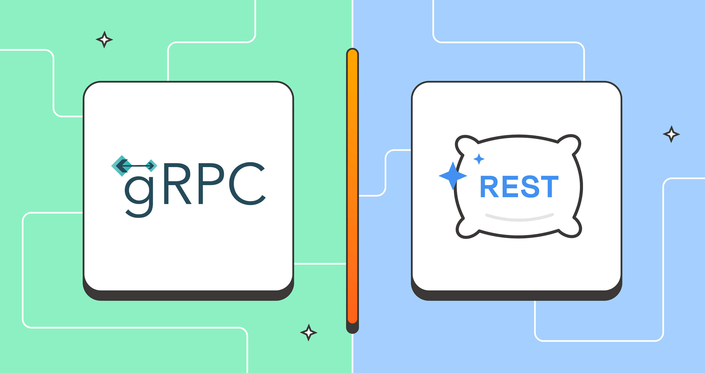

Từ khi công nghệ phát triển bắt đầu từ năm 1990, RESTful API đã trở thành một phần không thể thiếu trong việc phát triển ứng dụng web. Tuy nhiên, gRPC, một công nghệ mới hơn, đang dần trở nên phổ biến và được sử dụng rộng rãi. Vậy, chúng ta nên sử dụng RESTful API hay gRPC? Bài viết này sẽ giúp bạn hiểu rõ hơn về cả hai công nghệ này và khi nào nên sử dụng chúng.

Có lẽ, chúng ta nên có 2 bài viết để nói về RESTful API và gRPC. Tuy nhiên tôi sẽ viết 2 bài đó sau. Bài viết này sẽ so sánh giữa RESTful API và gRPC và khi nào nên sử dụng chúng.

## So sánh RESTful API và gRPC

### Bảng so sánh

| #                                | Restfull API                                              | gRPC                                                                                                      |
|----------------------------------|-----------------------------------------------------------|-----------------------------------------------------------------------------------------------------------|
| Giao thức                        | HTTP hoặc HTTPS (HTTP/1, HTTP/2, HTTP/3)                  | Base on HTTP/2                                                                                            |
| Định dạng dữ liệu có thể sử dụng | Bất kỳ định dạng nào, miễn là 2 bên có contract           | Bất kỳ định dạng nào, miễn là 2 bên có contract                                                           |
| Định dạng dữ liệu thường sử dùng | JSON , XML                                                | Protocol Buffers (Protobuf)                                                                               |
| Hiệu suất truyền tải             | Thấp hơn, do Json thường được sử dụng                     | Cao hơn do Protobuf nhỏ gọn và loại bỏ các dữ liệu thừa                                                   |
| Hỗ trợ cross-platform            | Phổ biến, có thể hỗ trợ gần như tất cả nền tảng           | Các hệ thống cũ sẽ không thể tích hợp, vì nó ra đời năm 2015. Và cần hỗ trợ HTTP/2                        |
| Dễ sử dụng                       | Dễ sử dụng và tích hợp ở bất kỳ đâu                       | Cấu hình và thiếp lập phức tạp hơn. \n Nếu một ngôn ngữ chưa có lib ngỗ trợ, có thể sẽ không thể tích hợp |
| Bảo mật                          | HTTPS, JWT, OAuth,...                                     | TLS và 1 số cơ chế bảo mật khác, nhưng phức tạp hơn                                                       |
| Load balancer                    | Dễ dàng tích hợp Load balancer                            | Cần phải xây dựng 1 cơ chế proxy để có thể Load balancer                                                  |
| Các loại request                 | GET, POST, PUT, DELETE,...                                | Unary, Server-streaming, Client-streaming, Bi-directional streaming                                       |
| Hỗ trợ nhiều định dạng response  | Có thể hỗ trợ nhiều định dạng response.                   | Chỉ hỗ trợ 1 định dạng cố định nào đó                                                                     |
| Contract request                 | Thường dựa trên tài liệu wiki hoặc swagger                | Dựa trên nội dung file Protobuf hoặc tài liệu wiki                                                        |
| Contract response                | Thường dựa trên tài liệu wiki hoặc swagger                | Dựa trên nội dung file Protobuf hoặc tài liệu wiki                                                        |
| Định danh tài nguyên             | Dựa trên URL/URI                                          | Dựa trên service impl với các method                                                                      |
| Hỗ trợ truy cập từ trình duyệt   | Có, rất đơn giản                                          | Không, nếu muốn truy cập qua trình duyệt sẽ cần xây dựng một proxy                                        |
| Hỗ trợ truy cập app to app       | Có, nhưng một số thư viện chỉ hỗ trợ http/1 nên cần lưu ý | Có và đây là cách dùng chủ yếu của gRPC                                                                   |
| Hỗ trợ truy cập từ mobile app    | Có, rất đơn giản                                          | Có, nhưng mình nghĩ sẽ không ai sử dụng gRPC như vậy.                                                     |

Wow, thực ra cũng không có gì đặc biệt cả. Nếu RestFull API sử dụng HTTP/2 thậm chí HTTP/3 thì sẽ cũng nhanh như vậy, vậy tại sao cần dùng gRPC?

### Tại sao không sử dụng HTTP/2 mà sử dụng gRPC?
- Về mặt hiệu suất vì cả 2 đều sử dụng HTTP/2 nên không có gì khác biệt. Tuy nhiên, thồng thường khi sử dụng gRPC chúng ta sẽ sử dụng protobuf để truyền dữ liệu và protobuf nhỏ gọn hơn JSON nên sẽ giúp giảm dung lượng truyền tải.
- Về mặt kết nối. Nhiều thư viện rest chỉ hỗ trợ HTTP/1.1 nên sẽ không thể tận dụng được HTTP/2. Còn gRPC thì sẽ hỗ trợ HTTP/2 từ đầu.
  - Ví dụ Resttemplate chỉ hỗ trợ HTTP/1.1, nếu muốn sử dụng HTTP/2 thì cần phải sử dụng WebClient hoặc OkHttp.
- Về mặt quản lý contract. Với gRPC, chúng ta sẽ sử dụng protobuf để định nghĩa contract chặt chẽ hơn so với RESTful API.
- Về mặt sử dụng. gRPC sẽ khiến cho code của repo trở nên sạch sẽ hơn, dễ đọc hơn. Bởi vì nó giống như là việc gọi một method.

## Khi nào sử dụng RestFull API và gRPC.
Về điều này chúng ta sẽ cần xem xét từng trường hợp cụ thể. Nó giống như là một chai nước tăng lực `monster` và một chai nước suối `lavie`. Mỗi chai nước sẽ phù hợp với một trường hợp cụ thể.

### Khi nào sử dụng RestFull API?
Hmm, một câu hơn đơn giản hơn là tại sao RestFull API lại phát triển? Câu trả lời  là bởi vì sự phát triển mạnh mẽ của các công nghệ web.
RestFull API sử dụng HTTP để hoạt động, vì vậy nó ban đầu được sử dụng để cung cấp API cho các ứng dụng web.
Tuy nhiên, với sự phát triển của công nghệ, các API cần được nhiều bên sử dụng, việc định nghĩa và phát triển song song các giao thức cho từng nền tảng nữa sẽ tốn rất nhiều chi phí. Vì vậy, RestFull API được sử dụng để có thể tích hợp với mọi nền tảng.

- Sử dụng RestFull API khi bạn mong muốn phát triển các API mà có thể tích hợp với mọi nền tảng. Từ web, mobile app, desktop app, server app, hay thậm chí là script shell. 
- Tích hợp được bất kể ngôn ngữ gì. Từ Java, Python, Ruby, PHP, hay thậm chí là C++.
- Nếu API của bạn là Global API, nghĩa là nó sẽ được sử dụng bởi nhiều bên khác nhau, thì RestFull API là lựa chọn tốt nhất để có thể hỗ trợ mọi nền tảng và mọi ngôn ngữ.
- Và tất nhiên rồi, nếu bạn hỗ trợ truy cập từ web browser thì bắt buộc cần sử dụng RestFull API.
  - Trong trường hợp sử dụng RestFull API từ web browser, chúng ta cũng sẽ sử dụng được nhiều service hỗ trợ như Web Browser cache, CDN cache, ... để giúp tăng tốc độ truy cập.
  
### Khi nào có thể chọn sử dụng gRPC?
Thực tế gRPC không sử dụng để giao tiếp với end-user. Mà nó được sử dụng để giao tiếp giữa các system hoặc service với nhau. Việc giao tiếp giữa các system và service cần phải nhanh chóng, chính xác và an toàn. Và gRPC sẽ giúp bạn làm được điều đó.

gRPC sẽ thân thiện với các developer, vì nó giống như là việc gọi một method. Và nó sẽ giúp cho code của bạn trở nên sạch sẽ hơn, dễ đọc hơn.

Vì vậy:
- Sử dụng gRPC khi service của bạn sẽ được các service khác hoặc system khác gọi đến không phải bởi end-user.
  - Ví dụ: Service của bạn cung cấp tính năng core thanh toán. Các service khi thực hiện phát triển tính năng thanh toán đều cần phải gọi đến service của bạn. Việc sử dụng gRPC sẽ giúp cho service của bạn trở nên nhanh chóng và thân thiện với các developer.
- Sử dụng gRPC khi bạn cần một contract chặt chẽ hơn. Vì với gRPC, bạn sẽ sử dụng protobuf để định nghĩa contract. Và nó sẽ giúp cho việc quản lý contract trở nên dễ dàng hơn.
- Khi bạn mong muốn việc giao tiếp giữa các service trở nên nhanh chóng và sytem của bạn trở nên nhanh chóng thì nên sử dụng gRPC.

### Hỗ trợ song song cả gRPC và RestFull API
Đây là một ý tưởng rất hay và đã được một số mạng blockchain sử dụng. Ví dụ như Cosmos.

Cosmos sử dụng gRPC để giao tiếp giữa các node và các service tích hợp thêm. Và sử dụng RestFull API để giao tiếp với end-user. Điều này giúp cho Cosmos trở nên nhanh chóng và dễ dàng tích hợp với mọi nền tảng.

Bởi vì mỗi công nghệ đều có ưu điểm và nhược điểm và sẽ phục vụ tốt cho một trường hợp cụ thể. Vì vậy, việc sử dụng song song cả 2 công nghệ sẽ giúp cho hệ thống của chúng ta trở nên mạnh mẽ và linh hoạt hơn.

Tuy nhiên vấn đề chi phí phát triển, bảo trì và quản lý cũng sẽ tăng lên. Vì vậy, khi sử dụng song song cả 2 công nghệ, chúng ta cần phải cân nhắc kỹ lưỡng.

## Kết luận

- **Lựa chọn công nghệ phù hợp**: RESTful API và gRPC đều có những ưu điểm và nhược điểm riêng. Việc lựa chọn giữa hai công nghệ này phụ thuộc vào nhu cầu cụ thể của dự án và môi trường phát triển.

- **RESTful API**: Thích hợp cho các ứng dụng cần tích hợp đa nền tảng, dễ dàng truy cập từ trình duyệt và có khả năng hỗ trợ nhiều định dạng dữ liệu. Đây là lựa chọn tốt cho các API công khai và cần hỗ trợ rộng rãi.

- **gRPC**: Phù hợp cho các hệ thống cần hiệu suất cao, giao tiếp giữa các service hoặc system, và yêu cầu quản lý contract chặt chẽ. gRPC giúp tối ưu hóa tốc độ và hiệu quả truyền tải dữ liệu nhờ sử dụng Protocol Buffers.

- **Hiệu suất và bảo mật**: gRPC có lợi thế về hiệu suất nhờ sử dụng HTTP/2 và Protocol Buffers, trong khi RESTful API dễ dàng tích hợp các cơ chế bảo mật phổ biến như HTTPS, JWT, và OAuth.

- **Tính dễ sử dụng**: RESTful API dễ dàng triển khai và tích hợp với nhiều ngôn ngữ và nền tảng, trong khi gRPC yêu cầu cấu hình phức tạp hơn và có thể không hỗ trợ đầy đủ trên các hệ thống cũ.

- **Hỗ trợ song song**: Trong một số trường hợp, việc sử dụng song song cả RESTful API và gRPC có thể mang lại lợi ích lớn, tận dụng được ưu điểm của cả hai công nghệ để đáp ứng nhu cầu đa dạng của hệ thống.

- **Chi phí và bảo trì**: Cân nhắc chi phí phát triển và bảo trì khi quyết định sử dụng một hoặc cả hai công nghệ, đặc biệt khi cần hỗ trợ song song.

- **Tương lai của công nghệ**: Cả RESTful API và gRPC đều có tiềm năng phát triển mạnh mẽ trong tương lai, và việc nắm bắt xu hướng công nghệ sẽ giúp bạn đưa ra quyết định sáng suốt cho dự án của mình.
