Ngày nay, mỗi một giây trôi qua, có hàng triệu request HTTP được gửi đi và nhận về trên mạng global hoặc mạng internal. 
HTTP là một phần không thể thiếu trong cuộc sống của chúng ta. Tuy nhiên, chỉ các lập trình viên chúng ta mới quan tâm đến các HTTP Status Code.

Một vấn đề thực tế ở Việt Nam là các lập trình thường chỉ biết đến các Status Code là `200`, `400`, `401`, `403` và `500`. Nhiều status khác như `201`, `204`, `206`, `301`... thì ít khi được sử dụng nên không được biết đến.
Một vấn đề nữa là hiện tại nhiều kiểu thiết kế Wapper Response được sử dụng nên khi trả về lỗi hay thành công đôi khi vẫn là 200 hoặc chỉ có 200 và 400.

Bài viết này mình sẽ chia sẻ với các bạn về ý nghĩa của các HTTP Status Code thông dụng và cách sử dụng chúng.

## HTTP Status code là gì ?
Theo tài liệu rfc của HTTP thì [HTTP code](https://www.rfc-editor.org/rfc/rfc2616.html#page-39) là một số nguyên không âm gồm 3 chữ số, mỗi một số đại diện cho một ý nghĩa cụ thể.

HTTP Status Code được sử dụng để thông báo nhanh cho client về kết quả của request mà nó đã gửi đi. Client sẽ có cái nhìn tổng quan nhanh về kết quả của request chứ chưa cần kiểm tra kỹ content response, ví dụ thành công hay thất bại.


## HTTP Status Code 1xx: Informational
1xx là nhóm status code dùng để thông báo cho client rằng request của nó đã được nhận và xử lý. Client không cần phải làm gì cả.

### 100 Continue
HTTP này thông báo rằng client đã gửi request phần đầu tiên(Header) và server đã chấp nhận request và sẵn sàng body để xử lý dữ liệu, thường điều này xảy ra khi body rất lớn và client có thể gửi phần tiếp theo(Body).

Ví dụ:
Request từ client:
```
POST /upload HTTP/1.1
Host: example.com
Content-Type: application/json
Content-Length: 1024
Expect: 100-continue
```
Trong trường hợp này:

Client đang thông báo rằng yêu cầu của nó có một body với kích thước (1024 bytes) và mong đợi phản hồi 100 Continue từ máy chủ trước khi gửi phần thân dữ liệu.

Server sẽ response :
```
HTTP/1.1 100 Continue
```
Sau đó, client gửi body của yêu cầu, ví dụ:
```
{
  "fileName": "example.txt",
  "fileContent": "Base64 encoded content here..."
}
```
Kết quả cuối cùng:
```
HTTP/1.1 201 Created
Content-Type: application/json

{
  "status": "success",
  "fileId": "12345"
}
```

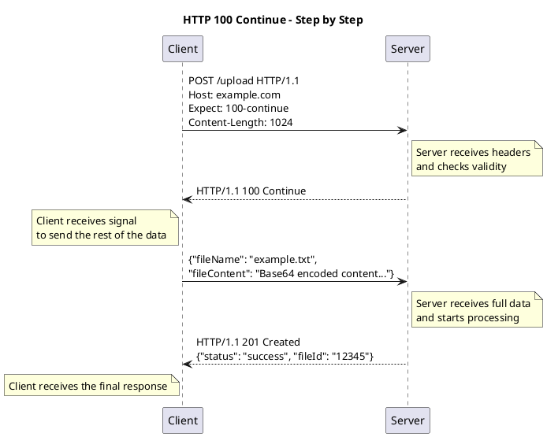
```plantuml
@startuml

title HTTP 100 Continue - Step by Step

participant "Client" as C
participant "Server" as S

C -> S: POST /upload HTTP/1.1\nHost: example.com\nExpect: 100-continue\nContent-Length: 1024
note right of S: Server receives headers\nand checks validity

S --> C: HTTP/1.1 100 Continue
note left of C: Client receives signal\nto send the rest of the data

C -> S: {"fileName": "example.txt",\n"fileContent": "Base64 encoded content..."}
note right of S: Server receives full data\nand starts processing

S --> C: HTTP/1.1 201 Created\n{"status": "success", "fileId": "12345"}
note left of C: Client receives the final response

@enduml

```

### 101 Switching Protocols

Hiện tại HTTP/2 và HTTP/3 đã rất phổ biến và được sử dụng. Tuy nhiên không phải server nào cũng hỗ trợ HTTP/2 hoặc HTTP/3.

Vì vậy mặc định client sẽ request đến server là HTTP/1.1, nếu server hỗ trợ HTTP/2 hoặc HTTP/3 thì server sẽ trả về status code 101 Switching Protocols để thông báo cho client chuyển sang giao thức mới.

Sau đó client sẽ gửi lại request theo giao thức mới.

Thực tế, status code này ít được sử dụng bởi các lập trình viên bình thường, thường các framework sẽ tự động xử lý.(Được handler bởi người viết framework, lib)


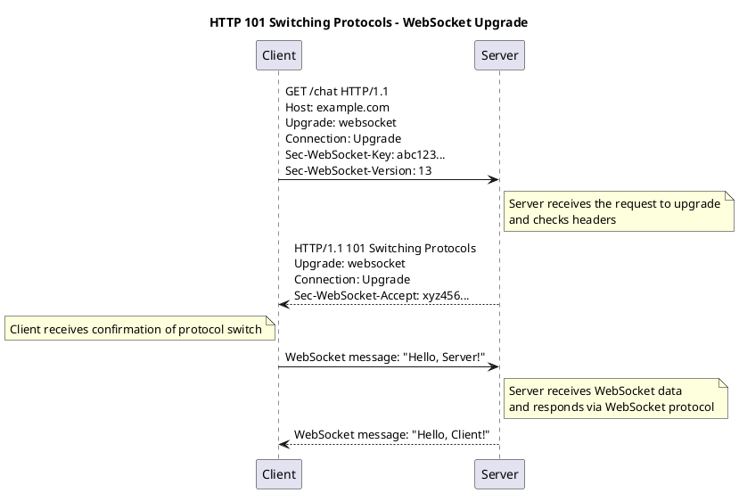
```plantuml
@startuml
title HTTP 101 Switching Protocols - WebSocket Upgrade

participant "Client" as C
participant "Server" as S

C -> S: GET /chat HTTP/1.1\nHost: example.com\nUpgrade: websocket\nConnection: Upgrade\nSec-WebSocket-Key: abc123...\nSec-WebSocket-Version: 13
note right of S: Server receives the request to upgrade\nand checks headers

S --> C: HTTP/1.1 101 Switching Protocols\nUpgrade: websocket\nConnection: Upgrade\nSec-WebSocket-Accept: xyz456...
note left of C: Client receives confirmation of protocol switch

C -> S: WebSocket message: "Hello, Server!"
note right of S: Server receives WebSocket data\nand responds via WebSocket protocol

S --> C: WebSocket message: "Hello, Client!"
@enduml
```

Thực tế, status code này ít được sử dụng.


#### Sử dụng tls để Switching Protocols khi ACK https
Có 1 cách nữa mà đa số được sử dụng là tại thời điểm bắt tay tls handshake, client sẽ gửi lên danh sách protocol mà nó hỗ trợ, server sẽ chọn ra protocol phù hợp và trả về cho client.

### 102 Processing
Status code này thông báo rằng server đang xử lý request nhưng chưa hoàn thành. Client có thể chờ đợi hoặc gửi request khác.

Thực tế, status code này ít được sử dụng.

### 103 Early Hints
Status code này được sử dụng để thông báo cho client rằng client cần tài trước một số thông tin trước khi nhận response chính thức.

Ví dụ: Để hiển thị một HTMl thì client cần tải trước một số file css, js, image... để hiển thị đúng.

Thực tế, status code này ít được sử dụng.

## HTTP Status Code 2xx: Success
HTTP Status Code 2xx là nhóm status code thông báo cho client rằng request của client đã được xử lý thành công.

### 200 OK
Status code này thông báo rằng request của client đã được xử lý thành công và thông tin được trả về trong response( Nếu có ).
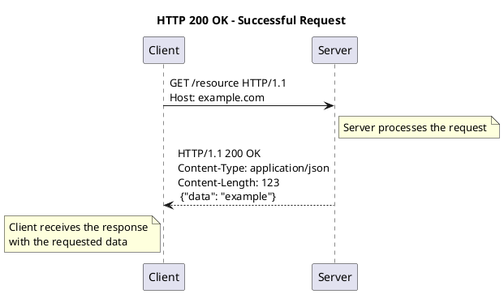
```plantuml
@startuml
title HTTP 200 OK - Successful Request

participant "Client" as C
participant "Server" as S

C -> S: GET /resource HTTP/1.1\nHost: example.com
note right of S: Server processes the request

S --> C: HTTP/1.1 200 OK\nContent-Type: application/json\nContent-Length: 123 \n {"data": "example"}
note left of C: Client receives the response\nwith the requested data
@enduml
```
### 201 Created
Status code này thông báo rằng request của client đã được xử lý thành công và một resource mới đã được tạo ra. Thường được sử dụng khi client gửi request POST để tạo mới một resource.

Response sẽ chứa thông tin về resource mới được tạo ra.

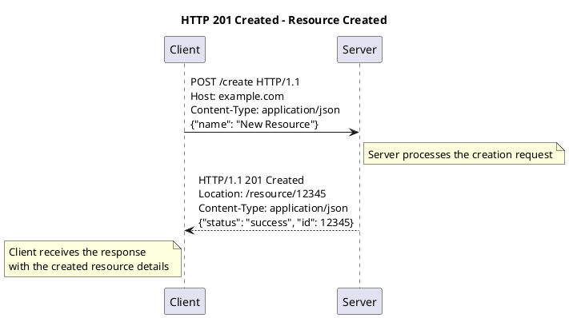
```plantuml
@startuml

title HTTP 201 Created - Resource Created

participant "Client" as C
participant "Server" as S

C -> S: POST /create HTTP/1.1\nHost: example.com\nContent-Type: application/json\n{"name": "New Resource"}
note right of S: Server processes the creation request

S --> C: HTTP/1.1 201 Created\nLocation: /resource/12345\nContent-Type: application/json\n{"status": "success", "id": 12345}
note left of C: Client receives the response\nwith the created resource details

@enduml
```

### 202 Accepted
Status code này thông báo rằng request của client đã được chấp nhận và sẽ được xử lý sau. Thường được sử dụng khi client gửi request để xử lý một công việc nào đó mà không cần phải trả về kết quả ngay lập tức.

Ví dụ: Gửi email, chạy job build, xử lý dữ liệu lớn...

Mục đích của status code này là để thông báo cho client rằng request của nó đã được chấp nhận và sẽ được xử lý sau bởi một worker khác.

Response sẽ không chứa thông tin về kết quả của request nhưng có thể sẽ chứa thông tin về job worker sẽ xử lý request.

Ví dụ bạn gửi request để xử lý một công việc nào đó, server sẽ trả về 202 Accepted và thông tin về id của task sẽ xử lý công việc đó.

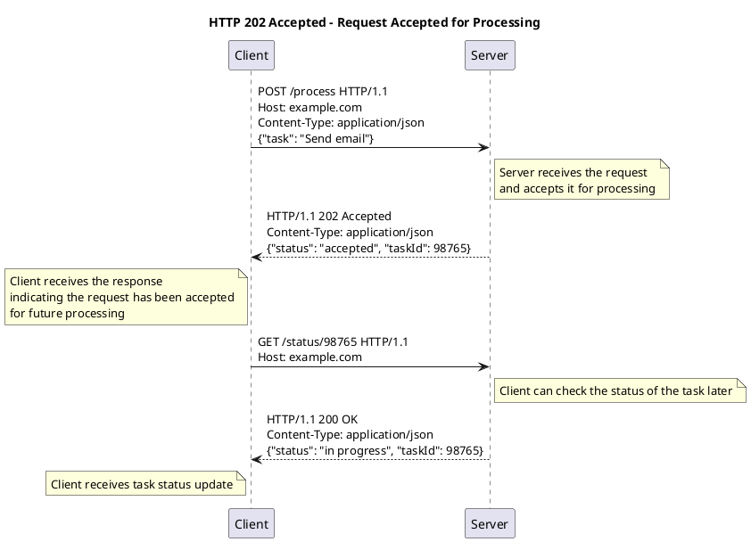
```plantuml
@startuml

title HTTP 202 Accepted - Request Accepted for Processing

participant "Client" as C
participant "Server" as S

C -> S: POST /process HTTP/1.1\nHost: example.com\nContent-Type: application/json\n{"task": "Send email"}
note right of S: Server receives the request\nand accepts it for processing

S --> C: HTTP/1.1 202 Accepted\nContent-Type: application/json\n{"status": "accepted", "taskId": 98765}
note left of C: Client receives the response\nindicating the request has been accepted\nfor future processing

C -> S: GET /status/98765 HTTP/1.1\nHost: example.com
note right of S: Client can check the status of the task later

S --> C: HTTP/1.1 200 OK\nContent-Type: application/json\n{"status": "in progress", "taskId": 98765}
note left of C: Client receives task status update

@enduml
```

### 203 Non-Authoritative Information
HTTP Status code này thông báo rằng request đã được xử lý thành công nhưng thông tin trả về không phải từ server gốc mà từ một server khác.

Các ứng dụng sử dụng các dịch vụ proxy hoặc cache có thể sử dụng mã 203 để chỉ ra rằng thông tin trả về không phải từ nguồn gốc mà từ một nguồn khác.

Thực tế, status code này ít được sử dụng.
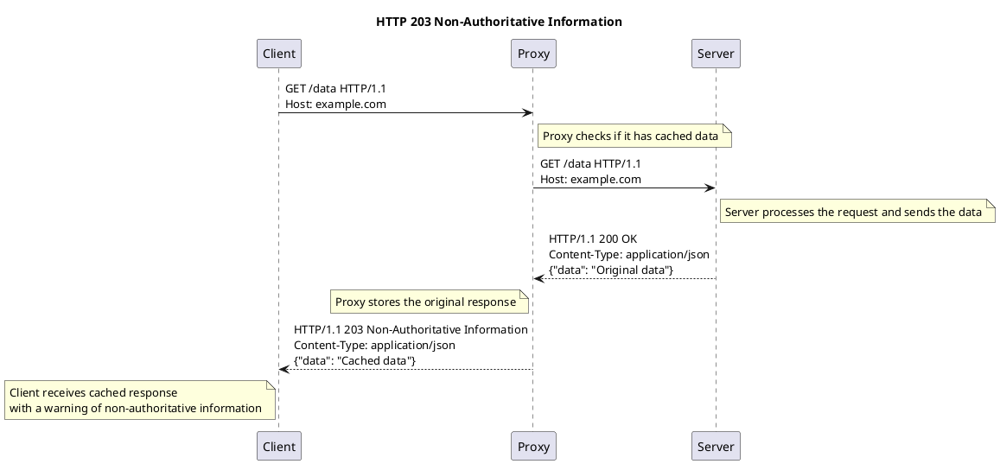
```plantuml
@startuml

title HTTP 203 Non-Authoritative Information

participant "Client" as C
participant "Proxy" as P
participant "Server" as S

C -> P: GET /data HTTP/1.1\nHost: example.com
note right of P: Proxy checks if it has cached data

P -> S: GET /data HTTP/1.1\nHost: example.com
note right of S: Server processes the request and sends the data

S --> P: HTTP/1.1 200 OK\nContent-Type: application/json\n{"data": "Original data"}
note left of P: Proxy stores the original response

P --> C: HTTP/1.1 203 Non-Authoritative Information\nContent-Type: application/json\n{"data": "Cached data"}
note left of C: Client receives cached response\nwith a warning of non-authoritative information

@enduml

```


### 204 No Content
HTTP Status code này thông báo rằng request đã được xử lý thành công nhưng không có thông tin(Body) nào được trả về. 

Tuy nhiên, đầu ra của phản hồi vẫn có thể chứa các thông tin hữu ích trong phần header, ví dụ như thông tin về các tài nguyên tiếp theo có thể được yêu cầu hoặc hướng dẫn về hành động tiếp theo.

Ví dụ với method `put` hoặc `delete` client chỉ cần biết là đã thành công.

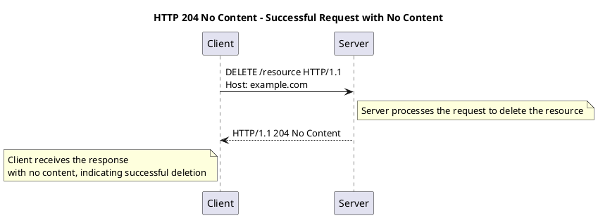
```plantuml
@startuml

title HTTP 204 No Content - Successful Request with No Content

participant "Client" as C
participant "Server" as S

C -> S: DELETE /resource HTTP/1.1\nHost: example.com
note right of S: Server processes the request to delete the resource

S --> C: HTTP/1.1 204 No Content
note left of C: Client receives the response\nwith no content, indicating successful deletion

@enduml
```

### 205 Reset Content
HTTP Status code này thông báo rằng client cần reset lại form mà nó đã gửi đi. Thường được sử dụng trong trường hợp client gửi form và server xử lý thành công và cần client reset lại form submit.

Thực tế, status code này ít được sử dụng.
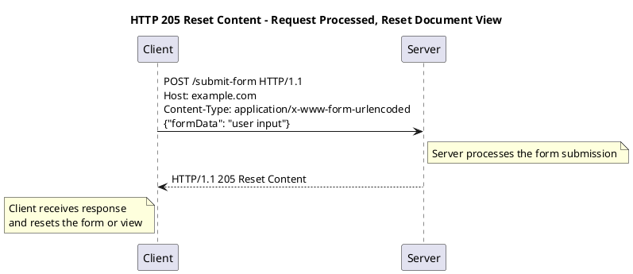
```plantuml
@startuml

title HTTP 205 Reset Content - Request Processed, Reset Document View

participant "Client" as C
participant "Server" as S

C -> S: POST /submit-form HTTP/1.1\nHost: example.com\nContent-Type: application/x-www-form-urlencoded\n{"formData": "user input"}
note right of S: Server processes the form submission

S --> C: HTTP/1.1 205 Reset Content
note left of C: Client receives response\nand resets the form or view

@enduml
```

### 206 Partial Content
HTTP Status code này thông báo rằng server đã trả về một phần dữ liệu của resource mà client yêu cầu. Thường được sử dụng khi client yêu cầu một phần dữ liệu của file lớn.

HTTP code này được sử dụng rất nhiều trong quá khứ, hiện tại 2024 thì nó đã giảm bớt.

Trong quá khứ, khi client yêu cầu một file lớn, server sẽ trả về dữ liệu theo từng phần, client sẽ nhận từng phần và hiển thị dữ liệu.

Ví dụ: Khi xem video trên mạng, client sẽ yêu cầu từng phần dữ liệu của video và hiển thị chứ không cần tải toàn bộ video lên đến vài GB về.

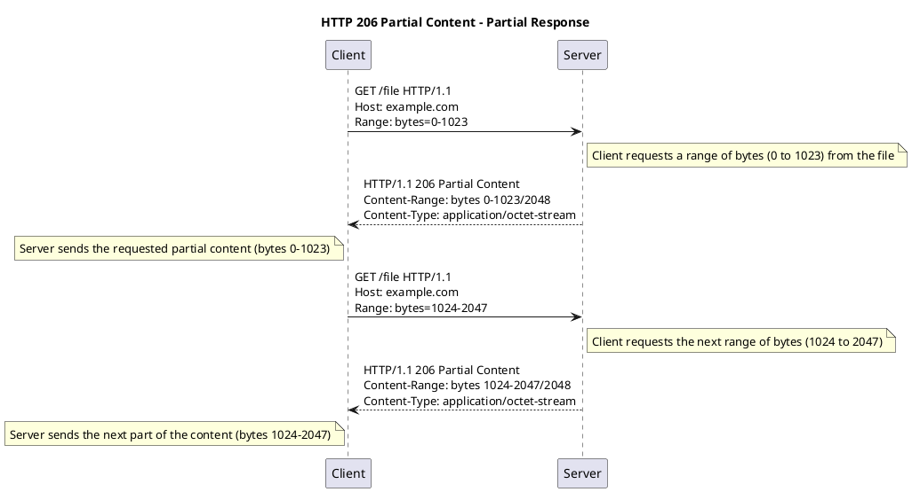
```plantuml
@startuml

title HTTP 206 Partial Content - Partial Response

participant "Client" as C
participant "Server" as S

C -> S: GET /file HTTP/1.1\nHost: example.com\nRange: bytes=0-1023
note right of S: Client requests a range of bytes (0 to 1023) from the file

S --> C: HTTP/1.1 206 Partial Content\nContent-Range: bytes 0-1023/2048\nContent-Type: application/octet-stream
note left of C: Server sends the requested partial content (bytes 0-1023)

C -> S: GET /file HTTP/1.1\nHost: example.com\nRange: bytes=1024-2047
note right of S: Client requests the next range of bytes (1024 to 2047)

S --> C: HTTP/1.1 206 Partial Content\nContent-Range: bytes 1024-2047/2048\nContent-Type: application/octet-stream
note left of C: Server sends the next part of the content (bytes 1024-2047)

@enduml
```
Thực tế bây giờ kỹ thuật HLS, Dash đã phổ biến nên status code này ít được sử dụng.

### 207 Multi-Status
HTTP Status code này thông báo rằng request của client đã được xử lý thành công nhưng response chứa nhiều thông tin về trạng thái của các tài nguyên khác nhau.

Status này được sử dụng khi request của người dùng yêu cầu xử lý nhiều tài nguyên cùng một lúc và mỗi tài nguyên có một trạng thái khác nhau.

Ví dụ: Client gửi request để xóa nhiều file, server sẽ trả về 207 Multi-Status và thông tin về trạng thái của từng file.

Thực tế, status code này ít được sử dụng.

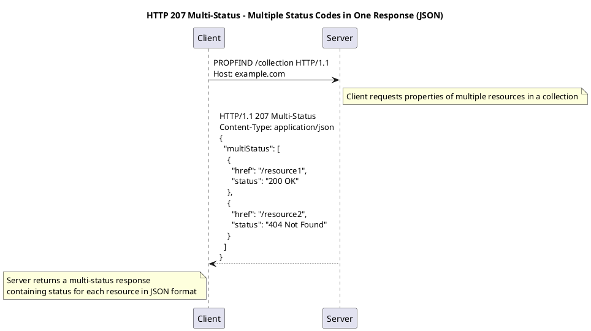
```plantuml
@startuml

title HTTP 207 Multi-Status - Multiple Status Codes in One Response (JSON)

participant "Client" as C
participant "Server" as S

C -> S: PROPFIND /collection HTTP/1.1\nHost: example.com
note right of S: Client requests properties of multiple resources in a collection

S --> C: HTTP/1.1 207 Multi-Status\nContent-Type: application/json\n{\n  "multiStatus": [\n    {\n      "href": "/resource1",\n      "status": "200 OK"\n    },\n    {\n      "href": "/resource2",\n      "status": "404 Not Found"\n    }\n  ]\n}
note left of C: Server returns a multi-status response\ncontaining status for each resource in JSON format

@enduml
```

## HTTP Status Code 3xx: Redirection
Hiểu đơn giản HTTP Status Code 3xx là nhóm status code thông báo cho client rằng client cần thực hiện một hành động khác để hoàn thành request.

### 300 Multiple Choices
HTTP Status code này thông báo rằng request của client có nhiều lựa chọn để chọn. Client cần chọn một trong số các lựa chọn được trả về.
Ví dụ: Client request một resource mà có nhiều phiên bản, client cần chọn một phiên bản để xem.

Thực tế, status code này ít được sử dụng.

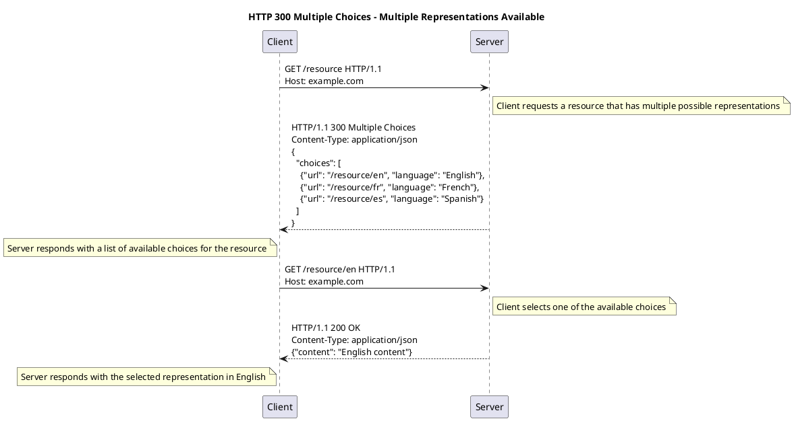
```plantuml
@startuml

title HTTP 300 Multiple Choices - Multiple Representations Available

participant "Client" as C
participant "Server" as S

C -> S: GET /resource HTTP/1.1\nHost: example.com
note right of S: Client requests a resource that has multiple possible representations

S --> C: HTTP/1.1 300 Multiple Choices\nContent-Type: application/json\n{\n  "choices": [\n    {"url": "/resource/en", "language": "English"},\n    {"url": "/resource/fr", "language": "French"},\n    {"url": "/resource/es", "language": "Spanish"}\n  ]\n}
note left of C: Server responds with a list of available choices for the resource

C -> S: GET /resource/en HTTP/1.1\nHost: example.com
note right of S: Client selects one of the available choices

S --> C: HTTP/1.1 200 OK\nContent-Type: application/json\n{"content": "English content"}
note left of C: Server responds with the selected representation in English

@enduml
```

### 301 Moved Permanently
HTTP Status code này thông báo rằng request của client đã được chuyển hướng vĩnh viễn đến một URL khác. 
Hiện tại HTTP Status code này vẫn được sử dụng rất nhiều, nó thường phục vụ cho việc một URL bị thay đổi hoặc một trang web bị chuyển địa chỉ.
