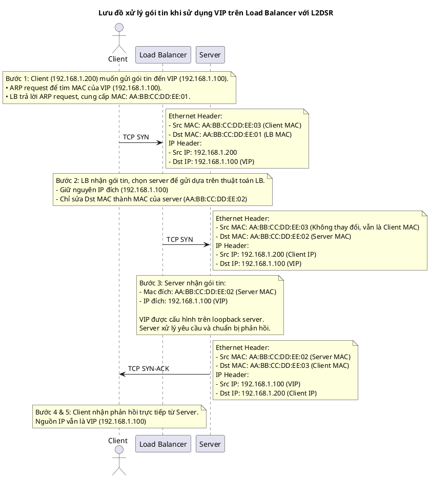
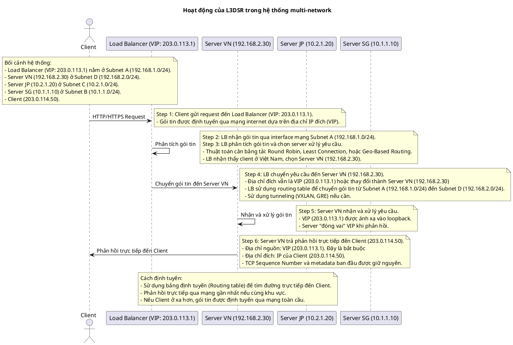

# Direct Server Return là gì? Giải thích về L2DSR và L3DSR
## Giới thiệu về Direct Server Return (DSR)

Trong bối cảnh công nghệ mạng máy tính ngày nay, việc cân bằng tải là một yêu cầu thiết yếu để đảm bảo hiệu suất và khả năng mở rộng của hệ thống. Direct Server Return (DSR) nổi lên như một giải pháp sáng tạo, đặc biệt là để tối ưu hóa luồng dữ liệu mạng và khắc phục những hạn chế của các hệ thống cân bằng tải (Load Balancer - LB) truyền thống.

Các LB thông thường thường(Ví dụ dùng nginx) gặp phải vấn đề về độ trễ khi tất cả lưu lượng truy cập phải đi qua LB cả khi vào và ra khỏi hệ thống. Điều này có thể tạo ra một điểm nghẽn tiềm ẩn trong hệ thống mạng, làm chậm tốc độ truyền tải dữ liệu và gia tăng nguy cơ quá tải cũng như giảm hiệu suất tổng thể. Ngược lại, phương pháp DSR cho phép máy chủ xử lý trực tiếp lưu lượng ra, bỏ qua LB trên đường trở về, nhờ đó tiết kiệm băng thông và giảm đáng kể độ trễ mạng.

L3DSR là một tiến bộ đáng chú ý trong lĩnh vực này, cho phép tích hợp DSR ở lớp 3 của mô hình OSI, mở ra những khả năng mới mẻ và linh hoạt hơn cho việc điều hành lưu lượng dữ liệu một cách hiệu quả hơn.


Hiểu đơn giản: **Direct Server Return (DSR)** là cấu hình mạng được sử dụng trong **load balancer** để chuyển tiếp các yêu cầu **đến máy chủ backend,** sau đó **gửi phản hồi của máy chủ trực tiếp trở lại client**.


### Để hiểu sâu hơn về bài viêt này, bạn nên hiểu cơ bản về OSI model


GIải thích chi tiết về OSI model: https://vi.wikipedia.org/wiki/M%C3%B4_h%C3%ACnh_OSI

## L2DSR( Layer 2 Direct server Return ) và L3DSR( Layer 3 Direct server Return )

### L2DSR( Layer 2 Direct server Return )

Đây là một loại trong **Direct Server Return** hoạt động ở Layer 2 ( Datalink Layer ), dữ liệu được định tuyến dựa trên địa chỉ MAC (Media Access control). Gói tin sẽ giữ nguyên tất cả các cấu trúc ban đầu và không thay đổi địa chỉ IP. Chỉ sử dụng địa chỉ MAC để định tuyến đích đến.

Đối với Layer 2 nơi Load Balancer và Server phải nằm trong cùng một mạng con (subnet).
- Ví dụ: LB 10.10.10.1 và server 10.10.10.2. Nếu server là 10.10.11.2 thì sẽ không được.

Với L2DSR dữ liệu chỉ có thể truyền trong cùng một mạng (broadcast domain)

#### Ví dụ về L2DSR
- **Bối cảnh hệ thống:**
   - **VIP: 192.168.1.100**
     Cả LB và Server đầu cấu hình dùng chung VIP 192.168.1.100
     Tuy nhiên khi client sử dụng ARP để hỏi địa chỉ MAC, thì chỉ LB trả về địa chỉ Mac còn nó còn Server sẽ không trả về
   - **Load Balancer (LB):**
     - IP: 192.168.1.10
     - MAC: AA:BB:CC:DD:EE:01
   - **Server:**
     - IP: 192.168.1.20
     - MAC: AA:BB:CC:DD:EE:02
   - **Client:**
     - IP: 192.168.1.200
     - MAC: AA:BB:CC:DD:EE:03


::: details Step by step cho ví dụ trên
**Bước 1**. Client tạo request đến VIP
- Client tạo một gói tin TCP gửi đến VIP (192.168.1.100)
  - **Source IP**: 192.168.1.200
  - **Destination Ip**: 192.168.1.100
- Tại Layer 2. Client sẽ gửi 1 gói tin APR để tìm kiếm Mac của VIP (192.168.1.100). LB sẽ trả lời APR và cung cấp địa chỉ Mac của LB (**AA:BB:CC:DD:EE:01**)
- **Gói tin rời khỏi client**
  - Ethernet Header:
    - **Source MAC**: AA:BB:CC:DD:EE:03 (Client Mac)
    - **Destination MAC**: AA:BB:CC:DD:EE:01 (Load Balancer Mac)
  - IP Header
    - **Source IP**: 192.168.1.200
    - **Destination Ip**: 192.168.1.100

**Bước 2**. Load Balancer nhận gói tin từ client và định tuyến gói tin đến Backend Server
- Load Balancer thực hiện nhận gói tin. Dựa vào thuật toán của LB để quyết định Backend Server sẽ xử lý yêu cầu.
  - Trong ví dụ hiện tại Server 192.168.1.20 sẽ xử lý yêu cầu
- Một điều quan trọng là khi Load Balancer định tuyến gói tin đến Backend Server sẽ không thay đổi IP nhật yêu cầu, nhưng nó sẽ đổi địa chỉ Mac đích để gửi gói tin đến Server.
- **Gói tin rời khỏi Load Balaner**
  - Ethernet Header:
    - **Source MAC**: AA:BB:CC:DD:EE:03 (Client Mac)
    - **Destination MAC**: AA:BB:CC:DD:EE:02 (Server Mac)
  - IP Header
    - **Source IP**: 192.168.1.200
    - **Destination Ip**: 192.168.1.100
**Bước 3**. Server nhận gói tin từ Load Balancer và xử lý yêu cầu
- Server nhận gói tin từ Load Balacer, thông tin gói tin chỉ bị sửa đổi địa chỉ Destination MAC thành của Backend Server.
- Bởi vì Server Backend đã cấu hình Loopback cho VIP 192.168.1.100 nên backend Server sẽ nhận và xử lý các yêu cầu có Ip đích là 192.168.1.100.
- Sau khi nhận yêu cầu, Backend server tiến hành xử lý và tạo ra response.

**Bước 4**. Server phản hồi trực tiếp đến client
- Sau khi xử lý yêu cầu và tạo response thành công Backend server sẽ tiến hành gửi trực tiếp response về client mà không cần thông qua trung gian Load Balancer.
- **Gói tin rời khỏi backend Server**
  - Ethernet Header:
    - **Source MAC**: AA:BB:CC:DD:EE:03 (Client Mac)
    - **Destination MAC**: AA:BB:CC:DD:EE:02 (Server Mac)
  - IP Header
    - **Source IP**: 192.168.1.100 (VIP)
    - **Destination Ip**: 192.168.1.200

**Bước 5**: Client nhận phản hồi từ Backend Server.
- Client nhận phản hồi trực tiếp từ Backend server nhưng địa chỉ IP nguồn gửi trong gói tin vẫn là VIP (192.168.1.100)
- Bởi vì client đã tạo 1 yêu cầu, nên khi nhận response client sẽ chỉ kiểm tra IP chứ không kiểm tra MAC gửi. Vì vậy Backend server gửi response đến client với MAC của Backend Server nhưng không có lỗi.
:::

#### Câu hỏi
1. Vậy việc thiếp lập kết nối TCP giữa client với Load Balancer hay Backend Server?
    - Việc thiếp lập kết nối TCP sẽ là từ Client với Backend Server. Load balancer chỉ tham gia trong quá trình khởi tạo kết nối. Điều này giúp tối ưu hiệu suất và giảm độ trễ.
2. Điều gì xảy ra nếu Backend Server không tắt phản hồi ARP ?
    - Bởi vì cả Load balancer và Backend Server đều được gán cho ip VIP nên nếu không tắt ARP sẽ bị lỗi xung đột IP.
3. Nếu Load Balancer và Backend Server không cùng 1 mạng subnet thì sao?
    - Với L2DSR thì Balancer và Backend Server không cùng 1 subnet thì Load balancer sẽ không thể định tuyến gói tin đến Backend Server
4. Tại sao cần thay đổi Mac, gửi định tuyến thẳng không được ư ?
    - Bởi vì chúng ta đang định tuyến gói tin ở layer 2(Mac),  đây là định tuyến gói tin trong mạng Lan, vì vầy switch sẽ sử dụng địa chỉ Mac để xác định đích đến của gói tin. Nếu địa chỉ MAC đích không được thay đổi thành địa chỉ MAC của máy chủ backend, gói tin sẽ không thể đến được máy chủ mong muốn.

### Ưu điểm của L2DSR
- **Triển khai đơn giản:** Không cần cấu hình phức tạp, bời vì triển khai ở Layer 2
- **Không thay đổi Ip:** Không cần thay đổi Ip Source và Ip Destination

### Nhược điểm của L2DSR
- Yêu cầu cùng subnet layer 2: Cả Load Balancer và Backend Server đều cần nằm cùng một Subnet layner 2, hạn chế khả năng mở rộng. Không thể triển khai trên nhiều data center.

## L3DSR (Layer 3 Direct Server Return)
Đây là một loại trong Direct Server Return hoạt động ở layer 3(**Network layer**), request được định tuyến thông qua IP để chuyển đến server.

Đối vơi L3DSR, Load Balancer và Backend Server không cần phải nằm trong cùng một mạng subnet.
Load Balancer sẽ thay đổi IP Destination của gói tin để định tuyến đến Backend Server.

Vì không cần phải nằm trong cùng một mạng subnet nên L3DSR có thể triển khai trên nhiều data center, giúp tăng khả năng mở rộng hệ thống.

#### Ví dụ về L3DSR
- **Bối cảnh hệ thống:**
  - Load Balancer:
    - VIP (Virtual Ip): **203.0.113.1**
    - **Nằm ở Subnet A (192.168.1.0/24)**
  - Backend Servers:
    - Server 1 (**Singapore**): Ip **10.1.1.10** trong **Subnet B (10.1.1.0/24)**
    - Server 2 (**Jp**): IP **10.2.1.20** trong **Subnet C (10.2.1.0/24)**
    - Server 3: (**VN**): Ip **192.168.2.30** trong **Subnet D (192.168.2.0/24)**
  -Client:
    - IP: **203.0.114.50**
  - (Các server backend sẽ cấu hình để cấp nhận các gói tin có địa chỉ đích là VIP (203.0.113.1)) bằng cách ánh xạ VIP (203.0.113.1) vào một interface mạng trên Server (hoặc thông qua loopback). Server "đóng vai" VIP (Virtual Server) khi phản hồi, vì vậy Client không bao giờ biết rằng yêu cầu được xử lý bởi một Server cụ thể trong mạng backend.

```

          +-----------------+
          |     Client      |
          |  203.0.114.50   |
          +--------+--------+
                   |
                   | ①
                   |
          +--------v--------+
          |      LB         |
          | VIP 203.0.113.3 |
          +--------+--------+
                   |
      +------------+------------+
      |                         |
      |                         |
 ② VXLAN, GRE             ② VXLAN, GRE
      |                         |
      |                         |
+-----v-----+            +------v------+
| Singapore |            |     Japan   |
|  Backend Server        |  Backend Server
| loopback(203.0.113.3)  |  loopback(203.0.113.3)
|  IP: 10.1.1.10         |  IP: 10.2.1.20
|  Subnet B              |  Subnet C
|  (10.1.1.0/24)         |  (10.2.1.0/24)
+-----------+            +-------------+
      |                         |
      ③                        ③
      |                         |
  Response client           Response client
```


::: details Step by step cho ví dụ trên
- **Bước 1**: CLient gửi request đến Load Balancer
   - Một Client với IP **203.0.113.50** gửi gói tin HTTP/HTTPS **đến VIP (Virtual IP) 203.0.113.1** – đây chính là địa chỉ của Load Balancer.
   - Gói tin được định tuyến qua mạng Internet dựa trên địa chỉ IP đích (VIP) và tới Load Balancer.

- **Bước 2**: Load Balancer nhận gói tin qua một interface mạng
   - Load Balancer tiếp nhận gói tin thông qua interface **thuộc subnet A (192.168.1.0/24)**
- **Bước 3**: LB phân tích gói tin và chọn Server xử lý yêu cầu
   - Dựa trên thuật toán cân bằng tải (ví dụ: Round Robin, Least Connection, hoặc Geo-Based Routing), Load Balancer phân tích gói tin để chọn Server phù hợp.
   - Trong trường hợp này, LB xác định Client ở Việt Nam và quyết định chuyển yêu cầu đến một Server tại Việt Nam với địa chỉ IP 192.168.2.30 trong subnet D.

- **Bước 4**: LB chuyển yêu cầu đến Server VN Ip 192.168.2.30

  - Gói tin được LB chuyển đến Server Việt Nam với IP 192.168.2.30.

  - Địa chỉ đích của gói tin có thể giữ nguyên là VIP 203.0.113.1 hoặc thay đổi thành Ip Server VN 192.168.2.30
  - LB định tuyến gói tin qua L3 dựa trên bảng định tuyến (routing table), từ subnet A (192.168.1.0/24) đến subnet D (192.168.2.0/24).

  - **Encapsulation**: Nếu subnet D nằm trong một mạng khác, LB sẽ sử dụng giao thức tunneling (ví dụ: VXLAN, GRE) để đóng gói gói tin và gửi qua mạng Internet hoặc mạng VPN liên kết.
Server backend trong subnet D sẽ nhận gói tin với địa chỉ đích là VIP 203.0.113.1 hoặc địa chỉ IP thực của nó (192.168.2.30).

- **Bước 5**: Backend nhận các gói tin và xử lý yêu cầu

  - Nhờ cấu hình loopback, Server nhận các gói tin có địa chỉ đích là VIP **203.0.113.1** và tiến hành xử lý yêu cầu từ Client.

- **Bước 6**: Backend Server trả phản hồi trực tiếp đến Client (Egress Traffic)

  - Sau khi hoàn tất xử lý, Server backend gửi gói tin phản hồi trực tiếp đến Client với IP 203.0.113.50, bỏ qua trung gian là LB.

  - Địa chỉ nguồn (Source IP) của gói tin phản hồi là VIP 203.0.113.1, đảm bảo Client nhận phản hồi từ địa chỉ quen thuộc của LB.
  - Nếu là IP khác thì client coi đây là 1 IP lạ hoặc thuộc yêu cầu khác, khi đó sẽ không thể phản hồi
  - Địa chỉ đích (Destination IP) là IP của Client 203.0.113.50.

**Cách định tuyến phản hồi:**

  - Server backend sử dụng bảng định tuyến để tìm đường trực tiếp đến Client.
  - Nếu Client ở cùng khu vực, gói phản hồi được gửi qua mạng gần nhất.
  - Nếu Client ở xa (ví dụ: Mỹ), gói tin được định tuyến qua mạng toàn cầu.

Lưu ý: TCP Sequence Number và các thông tin phiên kết nối ban đầu giữa Client và LB được Server backend giữ nguyên để đảm bảo tính chính xác, tránh bị Client coi là gói tin giả mạo.
:::

### Ưu điểm  L3DSR  :
- **Hỗ trợ hệ thống mạng rộng hơn**: Không yêu cầu LB và server cùng một subnet, vì vậy sẽ có khả năng mở rộng cao với các môi trường phức tạp hoặc nhiều trung tâm dữ liệu
- **Không giới hạn về subnet**:  L3DSR hoạt động với các cơ chế định tuyến, giúp dễ dàng tích hợp trong các mạng lớn hoặc môi trường hybrid cloud(Kết hợp public cloud và private cloud)
- **Độc lập về mặt topology**: Các 'Server' không cần chia sẻ cùng một lớp Layer 2 với 'Load Balancer', giảm phụ thuộc vào hạ tầng vật lý

### Nhược điểm L3DSR:
- **Cần định tuyến phức tạp hơn**: Yêu cầu cấu hình route (hoặc policy routing) trên 'Load Balancer' và các 'Server', tăng độ phức tạp khi triển khai.
- **Tăng độ trễ**: Layer 3 routing có thể làm tăng độ trễ trong các môi trường yêu cầu độ trễ thấp.

## So sánh L2DSR và L3DSR.

| Tiêu chí          | L2DSR                                    | L3DSR                                                                        |
|-------------------|------------------------------------------|------------------------------------------------------------------------------|
| Phạm vi hoạt động | Cùng subnet trên layer 2                 | Mở rộng trên nhiều subnet, Layner 3. Có thể hoạt động trên nhiều data center |
| Hiệu suất         | Tối ưu hơn vì không cần routing phức tạp | Có thể tăng độ trễ do routing                                                |
| Khả năng mở rộng  | Hạn chế vì phụ thuộc Layer 2             | ở rộng linh hoạt nhờ routing                                                 |
| Độ phức tạp       | Đơn giản hơn                             | Phức tạp hơn do cấu hình định tuyến                                          |
| Triển khai        | Phù hợp với network nhỏ, đơn giản        | Phù hơp với network l, đa trung tâm dữ liệu                                  |

## Khi nào sử dụng
### L2DSR
- Khi hệ thống nhỏ, các server và load balancer cùng một mạng subnet layer 2
- Mục tiêu là tối ưu hiệu suất và giảm độ trễ không cần có những rule định tuyến phức tạp
- Không yêu cầu khả năng mở rộng mạng lớn, không sử dụng nhiều data center

### L3DSR
- Khi các server và load balancer có thể nằm ở nhiều subnet khác nhau, mạng khác nhau hoặc nhiều data center
- Cần thiết cho các môi trường mạng lớn, phức tạp, hoặc hybrid cloud. Yêu cầu cao về khả năng mở rộng
- Triển khai trong môi trường hybrid cloud, kết hợp public cloud và private cloud.

## Kết luận
**Direct Server Return (DSR)** là một cấu hình mạng được sử dụng trong cân bằng tải để chuyển tiếp các yêu cầu đến máy chủ backend, sau đó gửi phản hồi của máy chủ trực tiếp trở lại client.
- **L2DSR (Layer 2 Direct Server Return**) hoạt động ở Layer 2 (Datalink Layer), dữ liệu được định tuyến dựa trên địa chỉ MAC. L2DSR yêu cầu Load Balancer và Server phải nằm trong cùng một mạng con (subnet). Với L2DSR, dữ liệu chỉ có thể truyền trong cùng một mạng (broadcast domain).
- **L3DSR (Layer 3 Direct Server Return)** hoạt động ở layer 3 (Network layer), request được định tuyến thông qua IP để chuyển đến server. Với L3DSR, Load Balancer và Backend Server không cần phải nằm trong cùng một mạng subnet. Vì không cần phải nằm trong cùng một mạng subnet nên L3DSR có thể triển khai trên nhiều data center, giúp tăng khả năng mở rộng hệ thống.
