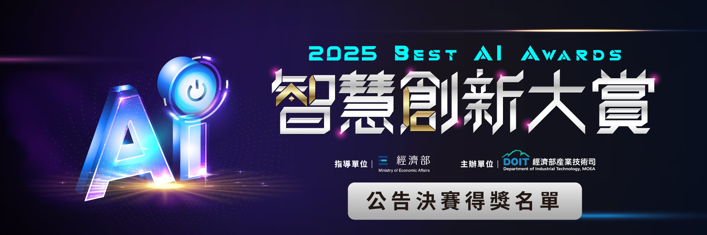

# Chia sẻ về sự kiện BestAIAwards 2025

Sự kiện trao giải thưởng BestAIAwards 2025 đã diễn ra vào ngày 3 tháng 5 năm 2025 tại Đài Bắc, Đài Loan. Đây là một sự kiện lớn trong ngành công nghiệp AI, quy tụ nhiều chuyên gia, nhà nghiên cứu và doanh nhân hàng đầu trong lĩnh vực này. Sự kiện không chỉ là nơi trao giải thưởng cho những sản phẩm và dịch vụ AI xuất sắc nhất mà còn là cơ hội để các chuyên gia chia sẻ kiến thức và kinh nghiệm của mình.

Tôi và Đạt đã vinh dự được tham gia vòng chung kết của sự kiện này với sản phẩm AI của mình. Chúng tôi đã có cơ hội gặp gỡ và trao đổi với nhiều chuyên gia trong ngành. Sự kiện đã mang lại cho chúng tôi nhiều kiến thức bổ ích và cảm hứng và mở rộng mối quan hệ trong ngành công nghiệp AI. 

Chúng tôi đã có cơ hội học hỏi từ những người đi trước và chia sẻ ý tưởng của mình với những người có cùng đam mê. Đó là một trải nghiệm tuyệt vời mà chúng tôi sẽ không bao giờ quên.

Tôi cũng muốn gửi lời cảm ơn đến tất cả những người đã hỗ trợ chúng tôi trong hành trình này. Đặc biệt là những người đã tin tưởng và ủng hộ chúng tôi từ những ngày đầu. Chúng tôi sẽ tiếp tục nỗ lực để phát triển sản phẩm của mình và đóng góp cho cộng đồng AI.

Hôm nay, tôi muốn chia sẻ về một số điều thú vị mà tôi đã học được từ sự kiện này. Một sự kiện lớn như BestAIAwards không chỉ là nơi để trao giải thưởng mà còn là nơi để học hỏi và chia sẻ kiến thức.

## 1. Tại sao chúng tôi tham gia sự kiện này?

Làm tại LINE technology vietnam chúng tôi thường xuyên được biết các thông tin về công nghệ mới và các tin tức mới về công nghệ. Ngay khi [Taipei Computer Association (TCA)](https://www.tca.org.tw/en/) thông báo về sự kiện BestAIAwards 2025, LINE technology vietnam đã nhận được thông tin và đã gửi thông báo đến tất cả các nhân viên. 

Sau một thời gian tìm hiểu về sự kiện, tôi đã quyết định tham gia với sản phẩm AI của mình. Tôi đã gửi đơn đăng ký tham gia và phiên bản demo + video giới thiệu sản phẩm của chúng tôi. Sau một thời gian chờ đợi, chúng tôi đã nhận được thông báo rằng sản phẩm của chúng tôi đã được chọn vào vòng chung kết của sự kiện này. Đây là một niềm vui lớn đối với chúng tôi.

## 2. Các thông tin được đăng công khai.

Tất cả các thông tin về sự kiện đều được đăng công khai trên [trang web của sự kiện.](https://bestaiawards.com.tw/), điều này đảm bảo rằng tất cả mọi người đều có thể theo dõi và cập nhật thông tin về sự kiện. Cũng đảm bảo rằng tất cả các thông tin đều được công khai và minh bạch. Các thông tin về các sản phẩm tham gia, các giải thưởng, các diễn giả, các hoạt động trong sự kiện đều được đăng công khai trên trang web của sự kiện. Điều này giúp cho mọi người có thể theo dõi và cập nhật thông tin về sự kiện một cách dễ dàng.

## 3. Tổng quan quy trình tham gia sự kiện này.
1. Khoảng tháng 4, [có 1,253 đội ở 36 quốc gia tương đương 1,253](https://www.moea.gov.tw/Mns/doit_e/news/News_En.aspx?kind=6&menu_id=5673&news_id=119252) ý tưởng cùng tham gia vào sự kiện này. Tất cả các đội sẽ cùng chuẩn bị các tài liệu chi tiết của dự án và một video demo sản phẩm. Sau đó sẽ gửi đến ban tổ chức để đánh giá. 

2. Ban tổ chức đánh giá và chọn ra 233 đội vào vòng chung kết. Các đội sẽ được thông báo qua email và sẽ được yêu cầu chuẩn bị một video demo sản phẩm và một bài thuyết trình về sản phẩm của mình.

3. Một người hỗ trợ sự kiện sẽ liên hệ với các đội để hướng dẫn và hỗ trợ các đội trong việc chuẩn bị cho sự kiện. Với tôi và Đạt, chúng tôi đã được hỗ trợ rất nhiệt tình từ ban tổ chức. Bởi vì chúng tôi là đội tuyển nước ngoài, vì vậy có rất nhiều điều mà chúng tôi không biết. Ban tổ chức đã hỗ trợ chúng tôi rất nhiều trong việc chuẩn bị cho sự kiện. Họ đã giúp chúng tôi tìm hiểu về các quy định của sự kiện, cách thức trình bày sản phẩm và cách thức thuyết trình. Họ cũng đã giúp chúng tôi chuẩn bị các tài liệu cần thiết cho sự kiện.

4. Tất cả các đội lọt vào vòng chung kết cùng nhau đến Đài Bắc, Đài Loan vào ngày 2 tháng 5 năm 2025 để tham gia sự kiện và trình bày sản phẩm của mình. Tất cả các đội sẽ có 5 phút để trình bày sản phẩm của mình và 5 phút để trả lời câu hỏi từ ban giám khảo. Ban giám khảo sẽ đánh giá sản phẩm dựa trên các tiêu chí như tính sáng tạo, tính khả thi, tính ứng dụng và tính thương mại hóa của sản phẩm.

5. Sau khi tất cả các đội đã trình bày sản phẩm của mình, ban giám khảo sẽ họp để đánh giá và chọn ra các đội đạt giải thưởng. Các giải thưởng sẽ được công bố trong buổi lễ trao giải vào cuối sự kiện.

6. Sau khi sự kiện kết thúc, ban tổ chức sẽ gửi email cho tất cả các đội để thông báo về kết quả của sự kiện. Các đội đạt giải thưởng sẽ được công bố trên trang web của sự kiện và sẽ nhận được chứng nhận và giải thưởng từ ban tổ chức.

## 4. 2 hạng mục giải của sự kiện
Sự kiện BestAIAwards 2025 có 2 hạng mục giải thưởng chính là AI Application và IC Design.
### 4.1. AI Application
Đây là các sản phẩm sử dụng AI để giải quyết các vấn đề trong cuộc sống hàng ngày. Các sản phẩm này có thể là các ứng dụng di động, các dịch vụ trực tuyến hoặc các sản phẩm phần mềm. 

### 4.2. IC Design
Đây là các sản phẩm sử dụng AI để thiết kế các mạch tích hợp (IC). Với hạng mục này, sản phẩm sẽ cần có phần cứng. Các sản phẩm này có thể là các mạch tích hợp, các bo mạch hoặc các thiết bị điện tử.

## 5. Các sản phẩm tham gia sự kiện
Tất cả các sản phẩm tham gia sự kiện đều rất chất lượng và sáng tạo. Các sản phẩm này đều có tính ứng dụng cao và có thể giải quyết được các vấn đề trong cuộc sống hàng ngày. Một số sản phẩm nổi bật mà tôi đã thấy trong sự kiện này là:
- **Phần mềm dịch tức thời**: Tôi có cơ hội thử nghiệm sản phẩm này và thấy rằng nó có thể dịch gần như tức thời các ngôn ngữ, AI sẽ tự động phân tích câu nói để xác định ngôn ngữ của người nói. Ví dụ 1 người nói tiếng Anh và 1 người nói tiếng Việt, AI sẽ tự động nhận diện ngôn ngữ của người nói và dịch tức thời. Không cần phải chọn ngôn ngữ.
    - Tốc độ dịch rất nhanh, gần như tức thời. Tôi cảm nhận độ trễ chỉ khoảng 1s.
    - Chất lượng dịch rất tốt, gần như không có lỗi ngữ pháp. Tôi đã thử nghiệm với nhiều câu khác nhau và thấy rằng sản phẩm này có thể dịch rất chính xác. 
- **Thiết bị đánh giá sức khỏe 