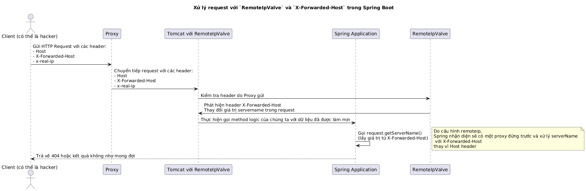

Xin chào mọi người, đây là bài đầu tiên của Short Blog. Thực tế sau sự kiện này xảy ra thì tôi đã nghĩ đến ý tưởng viết Short blog :v.

## Thời điểm bị tấn công

Ứng dụng của chúng tôi là một ứng dụng lớn có nhiều người truy cập hàng ngày với hơn 4 tỉ bản ghi dữ liệu chính(Core Dataset). Vào một ngày khi mọi người đang ngủ ngon, hệ thống của chúng tôi bị tấn công DDoS và bảo mật.

Cụ thể là vào khoản từ **1h sáng đến 5h sáng**, hệ thống của chúng tôi bị tấn công DDoS và bảo mật. Tuy nhiên, các thành viên trong team đã nhận được cảnh báo số lượng request tăng đột biến và những param,header lạ và đã thức dậy để giám sát hệ thống.

## Họ đã tấn công chúng tôi như thế nào ?

Trong quá trình giám sát chúng tôi, chúng tôi đã xác định nhóm hacker đã thực hiện tấn công DDoS và bảo mật. Họ đã sử dụng một số kỹ thuật sau:
- **DDoS**: Sử dụng nhiều máy chủ, gửi nhiều request spam để tấn công hệ thống của chúng tôi.
- **Bảo mật**: Sử dụng các kỹ thuật injection để tìm lỗ hổng trong hệ thống của chúng tôi.
  - Hacker đã inject một số param vào request để tìm lỗ hổng.
  - Hacker đã sử dụng một số header lạ để tìm lỗ hổng.
  - Hacker đã sử dụng 1 số header dành cho token để dò lỗ hổng.
    - Header bị dò nhiều nhất là `Authorization`, `x-fowarded-for`, `x-real-ip`, `x-forwarded-host` và `x-api-key`.
- **SQL Injection**: Hacker đã sử dụng SQL Injection để tìm lỗ hổng trong hệ thống của chúng tôi.

## Phòng thủ

Với tư duy **Không phải hệ thống của chúng ta có bị tấn công hay không, mà là khi nào hệ thống của chúng ta bị tấn công**. Chúng tôi đã chuẩn bị rất nhiều kế hoạch phòng thủ cho trường hợp này.

Bởi vì là một dịch vụ lớn nên không thể bị gián đoạn khi bị tấn công, vì vậy ngay từ đầu các đoạn code từ team đã được viết tối ưu nhất để đảo bảo hiệu suất. Các đoạn code đều được viết với tư duy `Security by design` và `Security by default`.

Chúng tôi liên tục kiểm tra các log, biểu đồ Grafana để đánh giá hiệu suất và bảo mật của hệ thống. Đồng thời, chúng tôi cũng đã chuẩn bị một số kịch bản phòng thủ cho trường hợp này.

Rất may hệ thống vẫn chạy ổn và các service không bị gián đoạn.

## Status đặc biệt cần điều tra
Hệ thống vẫn chạy rất tốt, tuy nhiên dữ liệu đã dược cache nhưng vẫn query vào database quá nhiều lần. Điều này khiến cho hệ thống chúng tôi bị giảm hiệu suất. Và có 2 status trả về rất nhiều là 404 và 403.

Chúng tôi cần phải điều tra nguyên nhân và giải quyết vấn đề này. Nhất là tại sao bị 404 và không sử dụng từ cache.

### Quá trình điều tra status 404.
Chúng tôi lấy 2 giá trị để cache và query database.
- Giá trị `request.getServerName()`: để lấy về domain name.
- Giá trị path: để lấy về path của request.

Chúng tôi đã tự điều tra song song và không kết quả. Sau đó chúng tôi đã tham gia một cuộc họp cùng nhau nhưng chưa không có kết quả.

Chúng tôi thấy path vẫn chính xác và vẫn có dữ liệu trong database, nhưng không hiểu tại sao dữ liệu không được cache và query từ database và vẫn trả về 404.

Điểm lỗi của chúng tôi là chúng tôi có log giá trị path nên chúng tôi biết path vẫn chính xác, nhưng chúng tôi không log giá trị serviceName.

Chúng tôi đã đặt ra nghi vấn là dữ liệu trả về từ `request.getServerName()` đang không chính xác. 

Nhưng rất khổ là chúng tôi chỉ log giá trị host ở nginx(Giá trị host vẫn đúng), nhưng không log giá trị serviceName. Điều này khiến cho chúng tôi không thể xác định giá trị serviceName sử dụng để query database và cache.

Quá trình đi vào bế tắc, bởi vì tại thời điểm này hacker đã từng cuộc tấn công, chúng tôi không thể xác định được giá trị serviceName nữa.

#### Tìm ra nguyên nhân đầu tiên.
Sau 5 6 tiếng dò tìm chúng tôi đã tìm ra nguyên nhân đầu tiên là do hacker đã thay đổi giá trị trong header `x-forwarded-host` bằng 1 số domain hoặc data random.

Ứng dụng của chúng tôi sẽ ưu tiên giá trị trong header `x-forwarded-host` để lấy giá trị serviceName. Điều này khiến cho giá trị serviceName không chính xác và không thể query từ cache và database.

Vì vậy mặc dù giá trị host đúng nhưng giá trị `request.getServerName()` không chính xác do lấy dữ liệu từ header `x-forwarded-host` chứ không phải từ host.

##### Điều tra thêm

Sau đó tôi đã đi điều tra thêm nguyên nhân tại sao giá trị `request.getServerName()` lại lấy từ header `x-forwarded-host` mà không phải từ host.

Sau hơn 1 tiếng debug tôi đã tìm ra nguyên nhân là chúng tôi đang cấu hình spring auto config `remoteip.remote-ip-header=x-real-ip`.

Cấu hình này sẽ được spring auto-config tomcat nhận diện là phía trước ứng dụng của chúng ta có một Proxy nằm trên, vì vậy Spring sẽ tạo instance của class `RemoteIpValve` và thêm vào danh sách pipeline của `Engine that handles requests for all Connectors` để làm mịn dữ liệu trước khi đến code logic của chúng ta.
https://github.com/spring-projects/spring-boot/blob/8f6aabc15b3860af08b5c19153ca0a1bd5402cbd/spring-boot-project/spring-boot-autoconfigure/src/main/java/org/springframework/boot/autoconfigure/web/embedded/TomcatWebServerFactoryCustomizer.java#L231

Vì vậy khi chúng ta cấu hình `remoteip.remote-ip-header=x-real-ip` tức chỉ mong muốn lấy về ip thực của người dùng nhưng các luồng làm mịn khác ở trong class `RemoteIpValve` cũng vẫn được kích hoạt. Chính xác hơn là logic lấy về host Header.
https://github.com/apache/tomcat/blob/92eb9a4a9f8cf47bfc1df87f8cd493624c518d51/java/org/apache/catalina/valves/RemoteIpValve.java#L669
Với Line 679 sẽ thực hiện ghi đè `serverName` từ `X-Forwarded-Host`.

Vì vậy đã tạo ra vấn đề khi sử dụng `request.getServerName()` sẽ lấy về dữ liệu ở `Header X-Forwarded-Host` chứ không phải Header Host

Đây là 1 ví dụ puml luồng

### Quá trình điều tra status 403
Từ kinh nghiệm điều tra 404, việc điều tra 403 đã dễ dàng hơn rất nhiều. Chúng tôi đã thử các header và nhận ra rằng hacker đã sử dụng header `Origin` để tấn công.
Hacker đã truyền các domain khác vào header `Origin` để tìm lỗ hổng trong hệ thống của chúng tôi. Vì vậy chúng tôi đã trả về 403 cho client.

## Giải pháp khắc phục.
Chúng tôi đã đưa và đang đánh giá các giải pháp khắc phục. sẽ chia sẻ sau khi chốt và áp dụng nó.
