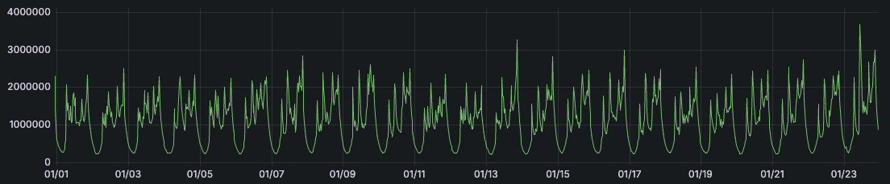
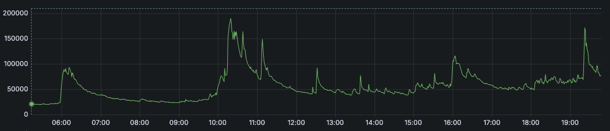
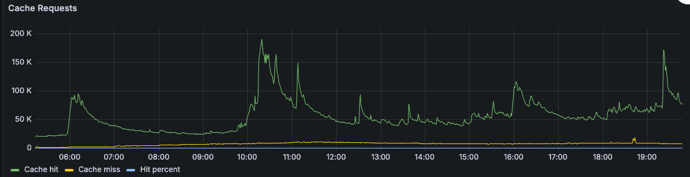
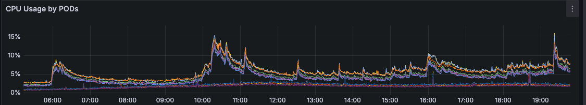
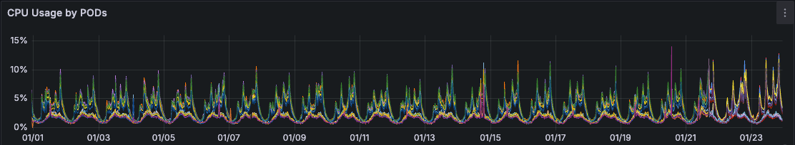

# Hệ thống của bạn đã sẵn sàng xử lý request đột ngột từ 2.000 request/s đến 5.000 request/s 2 phút chưa ?

Chào các bạn, trong các hệ thống lớn thì hệ thống Backend luôn luôn chịu áp lực lớn từ lượng request đến từ người dùng.

Trung bình [google search](https://vnexpress.net/google-facebook-dang-luu-tru-du-lieu-the-nao-3756695.html) của google nhận khoảng từ 40.000 request/s đến 60.000 request/s.

Lượng request này không phải là lượng request cố định mà nó có thể tăng hoặc giảm tùy thuộc vào thời gian, sự kiện, ...

Vì vậy, việc chuẩn bị cho hệ thống của bạn sẵn sàng xử lý request đột ngột là một điều cần thiết.

Tuy nhiên, nếu luôn luôn chạy hệ thống ở mức 5.000 request/s thì sẽ là một lãng phí tài nguyên không cần thiết và làm tăng chi phí vận hành.

## Hệ thống hiện tại của chúng tôi.

Hiện tại hệ thống của chúng tôi vào ban đêm xử lý khoảng 600 request/s và vào ban ngày khoảng 2.000 request/s.

Tuy nhiên, bởi vì hệ thống của chúng tôi cung cấp dịch vụ cho nhiều hệ thống khác sử dụng nên có thể sẽ có những lúc hệ thống nhận được lượng request từ hàng ngàn user cùng lúc bởi nhiều hệ thống khác nhau đã sử dụng dịch vụ của chúng tôi.

Đỉnh điểm trong tháng 1-2025 hệ thống của chúng tôi nhận được lượng request lớn từ 2.000 request/s đến 5.000 request/s chỉ trong vòng 2 phút.

Dưới đây là ảnh thống kê lượng request trong tháng 1-2025.

Còn dưới đây là ảnh thống kê lượng request trong ngày 23-01-2025.

Bạn có thể thấy các bước sóng tăng đột ngột một khoảng thời gian sau đó giảm dần trong khoảng 10h và 19h30.

## Chúng tôi đã làm như nào ?
Tất nhiên, chúng tôi đã chuẩn bị cho trường hợp này từ trước bởi vì hệ thống của chúng tôi cung cấp dịch vụ cho nhiều hệ thống khác sử dụng. Vì vậy, việc chuẩn bị cho trường hợp này là điều cần thiết.

Chúng tôi đã sử dụng 2 kỹ thuật chính và 1 thủ thuật nhỏ để giúp hệ thống của chúng tôi sẵn sàng xử lý lượng request đột ngột.

### Kỹ thuật 1: Cache và cache chủ động dữ liệu mới
Kỹ thuật 1 chúng tôi sử dụng là cache dữ liệu.

Tất cả dữ liêu mà hệ thống đã tạo và được người dùng truy cập, sử dụng sẽ được chúng tôi cache lại trong 1 ngày.

Chúng tôi chủ động cache dữ liệu mới khi được tạo và cache lại dữ liệu khi có request sử dụng. Điều này giúp gần như tất cả request đều được trả về từ cache và hệ thống truy cập dữ liệu trên database ít nhất có thể.

Nhìn vào ảnh biểu đồ trên, bạn có thể thấy lượng request đến hệ thống của chúng tôi vào ngày 23-01-2025 và lượng request trả về từ cache rất là nhiều và tỉ lê cache miss rất ít.

Tất nhiên điều này cũng sẽ còn tuỳ vào logic của hệ thống và dữ liệu mà hệ thống cung cấp để làm được điều này.

### Kỹ thuật 2
Kỹ thuật 2 chúng tôi sử dụng là **Load Balancer** + **Auto Scaling**.

Tất nhiên rồi đây là 1 kỹ thuật cơ bản nhưng nó rất hiệu quả.

Load Balancer giúp chúng tôi phân phối lượng request đến các instance khác nhau mà chúng tôi đã cấu hình.

Auto Scaling giúp chúng tôi tự động tăng hoặc giảm số lượng instance dựa vào lượng request đến.

### Một thủ thuật nhỏ :p
Chúng tôi cũng sử dụng một thủ thuật nhỏ chúng tôi đặt ngưỡng % CPU để auto scaling thấp.

Chúng tôi đặt min số lượng instance là 8 và khi % CPU của các instance lớn hơn 5% thì chúng tôi sẽ tăng số lượng instance lên.

Chúng tôi luôn cố gắng giữ ổn định % CPU sử dụng dưới 20%. Điều này giúp chúng tôi đảm bảo hệ thống luôn sẵn sàng xử lý lượng request đột ngột cho bất kỳ hoàn cảnh nào.

CPU trong ngày hôm nay viết blog 23-01-2025.

Đây là ảnh CPU trong tháng 1-2025. Bạn có thể thấy CPU luôn ổn định dưới 20%.

Tất nhiên điều này cũng phụ thuộc vào nhiều yếu tố khác như logic của hệ thống, dữ liệu, ...

## Hihi

Đó là 2 kỹ thuật và một thủ thuật nhỏ mà chúng tôi đã sử dụng để giúp hệ thống của chúng tôi sẵn sàng xử lý lượng request đột ngột từ 2.000 request/s đến 5.000 request/s trong 2 phút.

Chúng tôi ước tính nếu request có tăng đột ngột lên từ 2.000 request/s đến 20.000 request/s trong 2 phút thì hệ thống của chúng tôi vẫn sẽ ổn định và không có vấn đề gì xảy ra.

## Kết luận
- Hãy chuẩn bị cho hệ thống của bạn sẵn sàng xử lý lượng request đột ngột.
- Sử dụng cache dữ liệu và cache chủ động dữ liệu mới.
- Sử dụng Load Balancer và Auto Scaling.
- Đặt ngưỡng % CPU để auto scaling thấp.
- Hãy luôn cố gắng giữ CPU sử dụng dưới 20% để đảm bảo hệ thống luôn sẵn sàng xử lý lượng request đột ngột.
