# Khắc phục lỗi “error in libcrypto” khi sử dụng SSH key trên Windows để kết nối GitHub

Trong quá trình làm việc với GitHub, tôi đã sử dụng **openssh** để tạo cặp **private key** và **public key** trên máy macOS nhằm kết nối và thực hiện pull/push code. Trên máy Mac, mọi thứ đều hoạt động ổn định. Tuy nhiên, khi copy private key đó sang máy Windows, tôi gặp phải lỗi:

```bash
git@github.com: Permission denied (publickey)
```

Cụ thể, khi chạy lệnh:
```bash
D:\>git clone git@github.com:lethanh9398/curl-self-test.git
Cloning into 'curl-self-test'...
Warning: Permanently added 'github.com' (ED25519) to the list of known hosts.
Load key "/c/Users/solit/.ssh/data/github/lethanh9398/id_ed25519": error in libcrypto
git@github.com: Permission denied (publickey).
fatal: Could not read from remote repository.
```
Sau khi đọc tài liệu [trên GitHub](https://docs.github.com/en/authentication/troubleshooting-ssh/error-permission-denied-publickey) và thử một số cách khắc phục, tôi vẫn không thể giải quyết được vấn đề.

## Nguyên nhân
Qua quá trình nghiên cứu, tôi nhận ra rằng openssh trên Windows và macOS có sự khác nhau về cách hoạt động và phiên bản. Sự khác biệt này đôi khi dẫn đến lỗi khi Windows cố gắng đọc private key được tạo trên macOS, cụ thể là `lỗi error in libcrypto`.

```plantuml
@startuml
title ❌ Lỗi "error in libcrypto" trên Windows

participant "Windows\nGit Client" as Win
participant "OpenSSH\non Windows" as OpenSSH_Win
participant "Private Key\n(macOS Format)" as PrivateKey
participant "GitHub" as GitHub

Win -> OpenSSH_Win: Load private key (macOS format)
OpenSSH_Win -> PrivateKey: Read key
PrivateKey -> OpenSSH_Win: ❌ error in libcrypto
OpenSSH_Win -> Win: ❌ Permission denied (publickey)
Win -[#red]> GitHub: ❌ Could not authenticate

note right of Win
Lỗi xảy ra do private key 
được tạo trên macOS không 
tương thích với Windows
end note

@enduml

```



## Giải pháp: Tái tạo lại private key trên Windows

Để khắc phục lỗi, bạn có thể sử dụng lệnh sau trên Windows để thay đổi (tái tạo) passphrase của private key:

```plantuml
@startuml
title 🔄 Khắc phục lỗi bằng cách tái tạo passphrase

participant "Windows\nGit Client" as Win
participant "OpenSSH\non Windows" as OpenSSH_Win
participant "Private Key" as PrivateKey

Win -> OpenSSH_Win: ssh-keygen -p -f {private_key_path}
OpenSSH_Win -> Win: Nhập passphrase cũ
Win -> OpenSSH_Win: Nhập passphrase mới hoặc giữ nguyên
OpenSSH_Win -> PrivateKey: 🔄 Regenerate key in Windows-compatible format
OpenSSH_Win -> Win: ✅ Private key updated

note right of Win
Private key được tái tạo 
theo định dạng Windows 
giúp khắc phục lỗi
end note

@enduml

```



```bash 
ssh-keygen -p -f {đường_dẫn_tới_private_key}
```

Trong đó:
- -p dùng để thay đổi passphrase.
- -f chỉ định đường dẫn tới file private key của bạn.
Lệnh này sẽ yêu cầu bạn nhập passphrase cũ, sau đó cho phép bạn nhập passphrase mới. Bạn có thể nhập lại passphrase cũ nếu muốn. Quá trình này sẽ tái tạo lại file private key theo định dạng phù hợp với openssh trên Windows, giúp khắc phục lỗi `error in libcrypto`.

## Các bước thực hiện

1. Backup private key:
Trước khi tiến hành thay đổi, bạn nên sao lưu file private key để tránh mất dữ liệu nếu có sự cố xảy ra.

2. Chạy lệnh thay đổi passphrase:
Mở terminal hoặc Command Prompt trên Windows và chạy lệnh:

```bash
ssh-keygen -p -f /c/Users/solit/.ssh/data/github/lethanh9398/id_ed25519
```

3. Nhập passphrase:

- Nhập passphrase cũ khi được yêu cầu.
- Khi được yêu cầu nhập passphrase mới, bạn có thể nhập lại passphrase cũ hoặc nhập passphrase mới theo ý bạn

::: tip điền mật khẩu cũ và mới trong câu lệnh luôn
```bash
ssh-keygen -p -f "C:\Users\solit\.ssh\data\github\solitarysp\id_ed25519.key" -P "old_pass" -N "new_pass"
```

:::
4. Kiểm tra lại kết nối:
Sau khi tái tạo lại private key, thử chạy lại lệnh `git clone`, `git pull` hoặc `git push` để kiểm tra kết nối đến GitHub.

```plantuml
@startuml
title ✅ Kết nối GitHub thành công sau khi sửa lỗi

participant "Windows\nGit Client" as Win
participant "OpenSSH\non Windows" as OpenSSH_Win
participant "Private Key\n(Windows Format)" as PrivateKey
participant "GitHub" as GitHub

Win -> OpenSSH_Win: Load private key (Windows format)
OpenSSH_Win -> PrivateKey: Read key
PrivateKey -> OpenSSH_Win: ✅ Success
OpenSSH_Win -> Win: ✅ Key loaded successfully
Win -> GitHub: 🔑 Authenticate via SSH
GitHub -> Win: ✅ Access granted!

note right of Win
Lỗi đã được khắc phục, 
có thể pull/push code bình thường
end note

@enduml

```


## Kết quả
Sau khi thực hiện các bước trên, tôi đã pull và push code lên GitHub thành công mà không gặp lỗi

## Lưu ý

- **Sao lưu private key**: Luôn luôn backup private key trước khi thay đổi để tránh mất mát dữ liệu quan trọng.
- **Đồng bộ môi trường**: Khi chuyển đổi giữa các hệ điều hành, hãy lưu ý rằng các phiên bản và cách thức hoạt động của openssh có thể khác nhau. Việc tái tạo lại key theo định dạng phù hợp với từng hệ điều hành sẽ giúp tránh được các lỗi không mong muốn.
