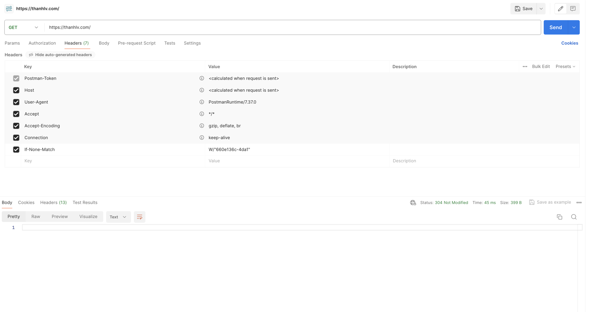
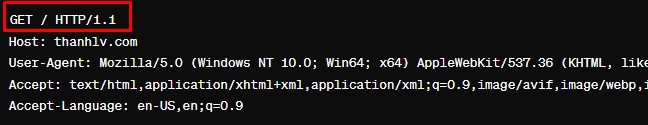

rong bối cảnh sự phát triển mạnh mẽ của [WWW( World Wide Web )](2024-03-18-world-wide-web-la-gi), một trong những yếu tố không thể phủ nhận là vai trò quan trọng của HTTP (Hypertext Transfer Protocol). Được sử dụng rộng rãi không chỉ trên [WWW( World Wide Web )](2024-03-18-world-wide-web-la-gi) mà còn trên nhiều hệ thống mạng khác, HTTP đóng vai trò chìa khóa trong việc truyền tải thông tin trên internet.

Hãy cùng khám phá thêm về giao thức HTTP trong bài viết này.

[[TOC]]

## Giới thiệu về HTTP
Hypertext Transfer Protocol (HTTP) là một Application-level protocol. HTTP đã được sử dụng bởi WWW ở năm 1990.

Phiên bản đầu tiên của HTTP là HTTP/0.9. Một giao thức đơn giản cho phép truyền raw data trên Internet. 

Phiên bản HTTP/1.0 được định nghĩa bởi [RFC 1945](https://datatracker.ietf.org/doc/html/rfc1945) cho phép không chỉ raw data mà còn có thể gửi nhận các đa phương tiện như hình ảnh, âm thanh và video. Phiên bản 1.0 cũng  đưa ra các Method tiêu chuẩn như  GET, POST và HEAD để thực hiện các tương tác phức tạp hơn. (Phiên bản 0.9 chỉ có một Method duy nhất là GET)

Trong bài viết này mình sẽ giới thiệu và học tập nhiều về HTTP.1.1
Một trong những phiên bản được sử dụng lâu đời và rộng dãi trước khi HTTP 2.0 và 3.0 ra đời.
## Overview cách hoạt động tổng thể về HTTP.
HTTP protocol là một request/response protocol. Một máy khách gửi một request đến máy chủ dưới dạng một request method, URI, header, protocol version, data, data type và client info. Máy chủ nhận được yêu cầu từ máy khách, xử lý yêu cầu và phàn hồi bằng một status bao gồm thông tin máy chủ, data trả về, data type, HEADER.

Hầu hết giao tiếp HTTP được khởi tạo bởi một tác nhân người dùng thường gọi là client, một yêu cầu được tạo bởi client(User agent) và gửi đến máy chủ(Server). Máy chủ xử lý yêu cầu và trả lại data. Trong trường hợp đơn giản nhất, quá trình này được thực hiện thông qua một kết nối duy nhất.

``` Diagram
          request chain ------------------------>
   Client --------single connection------------ Server
          <----------------------- response chain
```

Một tình huống phức tạp hơn là một hoặc nhiều người trung gian đứng ở giữa Client và Server trong  request/response chain.
Các người trung gian này có thể là proxy, gateway, tunnel.

Proxy là một `forwarding agent`sử dụng bởi client. Client gửi một request đến proxy sau đó proxy có thể viết lại 1 phần hoặc toàn bộ message và chuyển tiếp request này đến máy chủ URI được xác định bởi client hoặc proxy.

Gateway là một `receiving agent(Đại lý tiếp nhận)` được sử dụng bởi máy chủ. Nó sẽ được trước máy chủ nhận tất cả yêu cầu của client cũng có thể làm các bước như proxy sau đó chuyển yêu cấu đến áy chủ.

Tunnel là một hoạt động ngầm đứng giữa và nó sẽ không làm thay đổi message (Không mã hóa, chỉnh sửa ..etc..), Tunnel được xử dụng khi việc giao tiếp giữa client và server cần phải qua một trung gian(tường lửa) ngay cả khi người trung gian này không cần hiểu về message của request(Không cần giải mã..etc..) đó.

``` Diagram
single connection(SC)
        request chain ------------------------------------------->
 Client -----SC----- A -----SC----- B -----SC----- C -----SC------  Server
        <------------A--------------B--------------C---- response chain
```
Trong HTTP/1.0 mỗi yêu cầu client gửi đến máy chủ(request/response) sẽ tạo một kết nối mới. Ở phiên bản 1.1 đã có thể sử dụng 1 kết nối cho nhiều yêu cầu.

## 1. Protocol Parameters(Các thông số trong giao thức)
### 1.1 [HTTP Version](https://datatracker.ietf.org/doc/html/rfc2145)
Đối với HTTP sẽ sử dụng format version là `"<major>.<minor>"` numbering scheme để chỉ ra các phiên bản của HTTP protocol.
`minor`: được thay đổi khi phiên bản này sẽ thay đổi, thêm tính năng nhưng không thay đổ message parsing algorithm(Thuật toán parsing tin nhắn ).
`major`: được thay đổi khi định dạng của message trong protocol thay đổi
```Format
HTTP-Version   = "HTTP" "/" 1*DIGIT "." 1*DIGIT
```
Lưu ý: Đối với HTTP version, bởi vì sử dụng cấu chúc 1*digit vì vậy phiên bản 2.4 sẽ thấp hơn phiên bản 2.13. Vì 13 sẽ lớn hơn 4.

### 1.2 Uniform Resource Identifiers
URIs còn được biết đến với nhiều tên như là WWW addresses, Universal Document Identifiers(UDI), [Uniform Resource Locators(URL)](https://datatracker.ietf.org/doc/html/rfc1808) hoặc Uniform Resource Name(URN).
### 1.2.1 General Syntax
URis trong HTTP có thể được biểu diễn dưới dạng tuyệt đối hoặc tương đối tùy thuộc vào cách sử dụng. URis luôn luôn bắt đầu với scheme name và sau đó là dấu hai chấm
```Format
${scheme}:
```
```Example
http:
```
Mặc định HTTP không đặt bất kỳ giới hạn vào về độ dài của URI, máy chủ cần được thiếp lập để xử lý một URI có độ dài không giới hạn.

### 1.2.2 HTTP URL
HTTP schme được sử dụng để định vị tài nguyên trên internet thông qua HTTP protocol.
Dưới đây là scheme-specific syntax của HTTP URLs.
```HTTP_URL_FORMAT
http_URL = "http:" "//" host [ ":" port ] [ abs_path [ "?" query ]]
```
HTTP protocol sẽ sử dụng port mặc định là 80. Vì vậy nếu trong HTTP URL không xác định port thì mặc định sẽ sử dụng port 80

### 1.3 Date format
HTTP cho phép 3 định dạng khác nhau về date/time format gồm:
```
      Sun, 06 Nov 1994 08:49:37 GMT  ; RFC 822, updated by RFC 1123
      Sunday, 06-Nov-94 08:49:37 GMT ; RFC 850, obsoleted by RFC 1036
      Sun Nov  6 08:49:37 1994       ; ANSI C's asctime() forma
```
Trong đó định dạng đầu tiên `RFC 822`được sử dụng nhiều nhất vì nó xác định rõ năm 4 chữ số và múi giờ GMT.
Theo spec của HTTP, tất cả ngày giờ trên HTTP sẽ bắt buộc yêu cầu sử dụng giờ GMT.(UTC-0)

### 1.3.2 định vị thời gian bằng giây.
Một số HTTP Header cho phep time value được định nghĩa bằng một số number bằng giây.
```
delta-seconds  = 1*DIGIT
```
### 1.4 Character Sets
Trong HTTP để xác định kiểu dữ liệu gửi chúng ta có thể sử dụng `Content-Type` header.
Nếu `Content-Type` không được set, người nhận sẽ cần phải đoán `Content-Type`
Ví dụ về `Content-Type` json
```HTTP_HEADER
Content-Type: application/json
```
### 1.5 Content Codings
Trong HTTP, content(body) có thể được encoding trước khi gửi, encoding ở HTTP chủ yếu phục vụ cho việc nén dữ liệu.

Khi client gửi yêu cầu lên máy chủ sẽ cần kèm theo HEADER `Accept-Encoding` để xác định các thuật toán encoding có thể được sử dụng bởi client.

Sau đó client sẽ encoding và gửi kèm HEADER `Content-Encoding` để xác định thuật tó encoding.

Tương tự với client, server sau khi nhận được data sẽ dựa vào `Content-Encoding` do client gửi lên để xác định thuật toán decoding sau đó decoding.
ßß
Sau khi xử lý dữ liệu xong, server sẽ encoding sau đó cũng trả về dữ liệu ở `Content-Encoding` để xác định thuật tó encoding.
#### 1 số thuật toán encoding
- gzip
- compress(Lỗi thời, giờ ít dùng)
- brotli (Thuật toán mới được sử dụng nhiều hiện tại)
``` List_DEMO
Accept-Encoding: compress, gzip
       Accept-Encoding:
       Accept-Encoding: *
       Accept-Encoding: compress;q=0.5, gzip;q=1.0
       Accept-Encoding: gzip;q=1.0, identity; q=0.5, *;q=0
```
### 1.6 Chunked Transfer Encoding
Cho phép gửi dữ liệu theo từng phần, dữ liệu sẽ được chia nhỏ và gửi.
### 1.7 Media type.
HTTP 1.1 hỗ trợ các Media type như ảnh, video, nhạc. Việc xác định dữ liệu thuộc loại media type nào được xác định trong HEAD `Content-Type`.
Ví dụ: `image/webp`

``` Format
    media-type     = type "/" subtype *( ";" parameter )
       type           = token
       subtype        = token
```

### 1.8 Product Tokens
Product Tokens được sử dụng để các ứng dụng phần mềm giao tiếp với nhau xác định theo tên và phiên bản phần mềm.
Example:
```
 User-Agent: CERN-LineMode/2.15 libwww/2.17b3
 Server: Apache/0.8.4
```
### 1.9 Quality Values
Quality Values là một giá trị có số từ 0-1. Nếu 1 loại data có nhiều lựa chọn thì chúng ta có thể sử dụng Quality Values để xác định mức độ ưu tiên.

Ví dụ : `Accept-Encoding: gzip;q=1.0, identity; q=0.5, *;q=0`
Trong ví dụ trên gzip được đặt là `1` và identity là `0.5`. 

Vì vậy `gzip` được đặt mức độ ưu tiên cao nhất, nếu máy chủ hoặc client có thể hỗ trợ gzip thì sẽ ưu tiên gzip, nếu không hỗ trợ gzip hoặc vì một lý do gì đó không thể sử dụng gzip thì sẽ sử dụng identity.

`*` được đặt là 0, vì vậy nếu có cả gzip và identity đều không hỗ trợ thì sẽ báo lỗi chứ không nên sử dụng bất kỳ loại khác.

### 1.10 Language Tags
Đây là giá trị để xác định các ngôn ngữ hỗ trợ và muốn sử dụng theo mức độ ưu tiên
Ví dụ: `Accept-Language: en-US,en;q=0.9,vi;q=0.8`

### 1.11 Entity Tags
Entity Tags thường được viết tắt là Etag, sử dụng để nhận dạng phiên bản cụ thể của một tài nguyên. ETag thường được sử dụng trong HTTP để kiểm tra xem liệu một tài nguyên đã thay đổi kể từ lần truy cập trước của client hay không.
```
   entity-tag = [ weak ] opaque-tag
      weak       = "W/"
      opaque-tag = quoted-string
```
Lần đầu client gửi yêu cầu tài nguyên, server trả về tài nguyên kèm theo Etag của tài nguyên ở Header.
```
Etag:
W/"660e136c-4da1"
```

Khi client gửi yêu cầu lại tài nguyên, client sẽ gửi kèm với Etag trong yêu cầu ở Header với tên Header là `If-None-Match`, máy chủ sẽ kiểm tra ETag xem có phiên bản mới của tài nguyên so với ETag đó không.

Nếu có, máy chủ sẽ gửi về tài nguyên mới cho client, nếu chưa có thay đổi, máy chủ sẽ trả về status 304 Not Modified để thông báo không có thay đổi và client sẽ sử dụng từ cache.


Như ảnh ở trên, khi giá trị trả về 304 thì body sẽ rỗng.

### 1.12 Range Units
HTTP/1.1 cho phép client gửi request một phần của tài nguyên cụ thể. 

Ví dụ tài nguyên video cho tổng dung lượng 9000 byte với 1 byte là 1s của video, client có thể gửi yêu cầu lấy byte từ 10-100 để lấy byte 10 đến 100 cho giây từ 10 đến 100 của video.
```
Content-Range: bytes 10-100/9000
```
giá trị các number ở đây là luôn luôn là byte.

## 2. HTTP Message
HTTP message bao gồm các request từ client đến server và response từ server đến client.
```
HTTP-message   = Request | Response     ; HTTP/1.1 messages
```
#### 2.1.1 Message Headers
Bao gồm các Header fields được kèm theo trên request hoặc response.
Format của header là `message-header = field-name ":" [ field-value ]`

#### 2.1.2 Request Message(Tin nhắn yêu cầu)
Được gửi từ client đến server để yêu cầu một tài nguyên cụ thể, ví dụ một trang web html hoặc một file.

#### 2.1.3 Response Message(Tin nhắn phản hồi)
Được gửi từ server đến client, chứa thông tin và nội dung mà client đã yêu cầu.

#### 2.1.4 Message Body
Phần body(Có thể có hoặc không ) chứa tin nhắn sử dụng để gửi các thông tin đến server khi yêu cầu hoặc trả về phản hồi cho client.

## 3 Request
Một request gửi đến server sẽ có format sau:
```
     Request       = Request-Line              ; 
                        *(( general-header        ; 
                         | request-header         ; 
                         | entity-header ) CRLF)  ; 
                        CRLF
                        [ message-body ]          ; 
```
### 3.1 Request-Line
Request Line bắt đầu bằng loại Method(GEt,POST..etc..) url và phiên bản của protocol và được kết thúc bằng (CRLF)
```
Request-Line   = Method SP Request-URI SP HTTP-Version CRLF
```

`GET / HTTP/1.1`: Là dòng đầu tiên của yêu cầu HTTP, cho biết phương thức là GET (yêu cầu dữ liệu từ máy chủ), đường dẫn yêu cầu là `/` (tức là trang chính của trang web), và phiên bản giao thức HTTP là 1.1.

### 3.1.1 Method
Method cho biết cách thức thực hiện trên tài nguyên được xác định bởi URI request, Method sẽ phân biệt chữ hoa và thường.
- Các loại method:
  - **OPTIONS**: Method này được sử dụng để yêu cầu các thông tin liên lạc request/response của một URI. Method này cho phép client xác đinh các optional hoặc các requirements đến máy chủ và không yêu cầu lấy tài nguyên.
    - Response của method này không được cache.
    - Ví dụ: Sử dụng OPTIONS để lấy về danh sách method hỗ trợ bởi URI, kiểm tra tài nguyên có tồn tại không....
  - **GET**: Method sử dụng để lấy về tài nguyên trên máy chủ được xác định bởi URI request.
    - Response của method này có thể cache.
    - Ví dụ: Lấy về tài nguyên âm nhạc, video, html.
  - **HEAD**: Method **HEAD** được sử dụng để lấy thông tin về HEAD của tài nguyên nhưng không lấy về tài nguyên.
    - Method **HEAD** giống với **GET** nhưng server sẽ không cần trả về nội dung trong response. Thông tin header response của **HEAD** nên trả về giống hệt với **GET**.
    - Ví dụ: Sử dụng HEAD để kiểm tra cập nhật version tài nguyên sử dụng header `Last-Modified`, `Content-MD5`, `ETag`
  - **POST**: Method **POST** được sử dụng để gửi dữ liệu đến máy chủ để tạo mới tài nguyên trên máy chủ hoặc gửi dữ liệu đến máy chủ xử lý.(Tạo tài nguyên hoặc thực hiện 1 hành động trên các tài nguyên)
    - Cập nhật dữ liệu: Nếu Method POST này không thực sự tạo ra một dữ liệu mới là nó chỉ đơn giản là thay đổi trạng thái, hoặc cập nhật hoặc thực hiện hành động.
      - Nên trả về 200 để thông báo thực hiện thành công và response của POST có nội dung mô tả kết quả của hành động
      - Nên trả về 204 để thông báo thực hiện thành công và response của POST không có nội dung trả về cùng response.
    - Nếu Method **POST** thực hiện tạo ra một dữ liệu mới, response nên trả về 201(Created) và nên có nội dung ở response để mô tả đến tài nguyên mới.
    - Response của POST không nên được lưu vào cache
  - **PUT**: **PUT** được sử dụng để gửi dữ liệu đến máy chủ để tạo mới hoặc cập nhật một tài nguyên với dữ liệu cụ thể trong yêu cầu.
    - Nếu là tạo mới dữ liệu thành công, nên trả về 201(Created) status.
    - Nếu tài nguyên được sử đổi thì nên trả về 200 kèm theo nội dung mô tả hoặc 204 khi không cần nội dung mô tả.
    - **POST** có thể thực hiện trên các tài nguyên không cụ thể, nhưng với **PUT** sẽ chỉ thực hiện trên 1 tài nguyên cụ thể, nếu yêu cầu cần thực hiện cho một tài nguyên khác trạng thái 301 sẽ được trả về.
  - **DELETE**: Yêu cầu máy chủ xóa tài nguyên. Tuy nhiên máy chủ có thể cho phép hoặc không cho phép xóa.
    - Trả về 200 nếu xóa thành công và bao gồm trạng thái ở response nếu là xóa mềm
    - Trả về 202 khi máy chủ đã tiếp nhận yêu cầu nhưng chưa được release hiện tại(Xóa ở tương lai)
    - Trả về 204 nếu thực tài nguyên đã bị xóa hoặc trạng thái 202 ở lần gọi trước để được thực hiện.(Thường xóa cứng sẽ trả về)
## REF:
- https://www.rfc-editor.org/rfc/rfc2616.html
