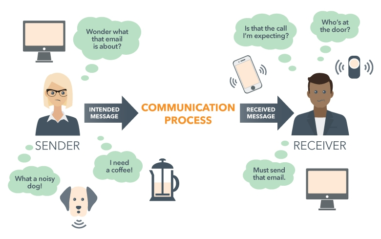

Mở đầu học về `Message and event stream` thì mình sẽ giải thích các kiến thức cơ bản trước. Kiến thức đầu tiên là hiểu về **Message**.

**Message** không chỉ là một khái niệm đơn giản; nó là trung tâm của hệ thống, là phương tiện mà dữ liệu di chuyển thông qua giữa các thành phần trong hệ thống.

**Message** không chỉ là một dòng văn bản hay một chuỗi dữ liệu vô nghĩa. Nó mang trên mình một giá trị, một ý nghĩa, và một mục đích. Và điều quan trọng là, nó là cầu nối kết nối giữa các thành phần trong hệ thống, tạo ra một luồng thông tin liên tục và không gián đoạn.

Hãy cùng mình khám phá sâu hơn về bản chất và ý nghĩa thực sự của Message, và cách nó đóng vai trò quan trọng trong việc xây dựng các hệ thống phân phối hiệu quả. Hãy bắt đầu cuộc hành trình này và khám phá cùng nhau!

[[TOC]]

## Message là gì ?
- **Đầu tiên**, **Message** là một yêu cầu có chứa một lượng dữ liệu được gửi từ A đến B(Từ hệ thống A đến hệ thống B) và được B nhận và xử lý theo yêu cầu.

- **Thứ hai**, **Message** thường đi kèm với metadata, tức là các thông tin mô tả về Message. Metadata này có thể gồm nhiều thông tin, người gửi, thời gian gửi, người nhận...

- **Thứ ba**, Format của dữ liệu **Message** sẽ là một hợp đồng giữa A và B. hợp đồng này gồm nhiều thứ ví dụ: Định dạng tin nhắn(Json), thuật toán mã hóa, các dữ liệu require trong Json....
  - Thông thường Format này sẽ được hệ thống nhận tin nhắn, tức B xác định. Tuy nhiên nhiều trường hợp có thể A xác định và B sẽ làm theo.

- **Thứ tư**, **Message** được mang ý nghĩa giả định người gửi sẽ gửi dữ liệu và sẽ có một người nhận yêu cầu và xử lý yêu cầu. Nếu hành động không được thực hiện tức là đã bi phạm một **business rule** nào đó.
  - Thông thường, đây là bước đầu tiên của một quá trình dẫn đến, A nhận được dữ liệu của B(HTML), B thay đổi dữ liệu....
    
  
### **Tóm gọn Message là gì**
- Message là một yêu cầu thường chứa một khối lượng dữ liệu được chuyển từ một hệ thống sang hệ thống khác để thực hiện các hành động xử lý hoặc trao đổi thông tin. 

## Đặc điểm của Message
- **Đóng gói thông tin**: Message chứ dữ liệu hoặc thông tin được đóng gói. Thông tin này có thể bảo gồm tin nhắn, câu lệnh, dữ liệu cần truyền đạt...

- **Có cấu trúc**: Message thường có một cấu trúc xác định, bảo gồm các metadata và nội dung(body). Metadata có thể chứa các thông tin về loại message, người gửi, người nhận và nhiều thuộc tính khác. Phần body chứa dữ liệu thực sự cần gửi đi.

- **Đồng bộ hoặc không đồng bộ:** :Message có thể được gửi một cách đồng bộ, người gửi sẽ chờ đợi phản hồi của người nhận trước khi tiếp tục, hoặc không đồng bộ nơi người gửi tiếp tục công việc mà không cần chờ phản hồi.

- **Độc lập với giao thức**: Message có thể được gửi qua nhiều giao thức khác nhau, HTTP, HTTPS, FTP, SMTP, MIME...

- **Bảo mật**: Message có thể được mã hóa và ký để đảm bảo tính bảo mật, toàn vẹn và xác thực nguồn gốc giúp bảo vệ khỏi sự nghe, nhìn lén và thay đổi hoặc giả mạo.

- **Giao tiếp giữa các chệ thống**: Message là phương tiện chính hiện tại sử dụng để giao tiếp giữa các hệ thống, dịch vụ và ứng dụng. Message cho phép chúng ta trao đổi dữ liệu linh hoạt và hiệu quả.

- **Định hướng người nhận(Recipient Orientation)**: Mỗi message được tạo ra sẽ gửi đi sẽ xác định đến 1 hoặc N người nhận message để đảm bảo rằng message đến đúng người hoặc hệ thống cần nó.

## Ví dụ về Message
### **Ví dụ 1**
Application **A** gửi Message đến Application **B** yêu cầu lấy về danh sách học sinh(Tin nhắn được gửi thông qua giao thức **HTTP**).
  - 1. **A** gửi **Message** đến B yều cầu lấy danh sách học sinh thông qua giao thức **HTTP**
  - 2. **B** nhận được yêu cầu và kiểm tra đúng các định dạng format của **HTTP** và đúng **business rule**(User ở **A** có quyền đọc...)
    - Nếu **A** gửi sai format hoặc vi phạm business rule thì B sẽ từ chối yêu cầu.
  - 3. **B** sử lý yêu cầu và gửi trả lại phản hồi cho **A**.

### **Ví dụ 2**
Gửi thư từ nhà của **A** ở **Hà Nội** đến **B** ở **Đà Nẵng** yêu cầu vay 500k VND
  - 1. **A** thực hiện viết Message vào giấy để giở thư đến cho **B**.

  - 2. **A** sẽ sử dụng giao thức gửi thư qua bưu điện vì vậy cần sử dụng **format bao thư** kèm theo **Metadata** người gửi và người nhận.

  - 3. Sau khi hoàn thành đầy đủ, giao thức bưu điện sẽ gửi thư đến **B** ở **Đà Nẵng**.

  - 4. Sau khi B nhận thư, tiến hành đọc và xử lý các yêu cầu dựa trên **business rule**( Chơi thân không? Mình có 500k VND không ...)

  - 5. Nếu thỏa mãn **business rule** B sẽ gửi Message lại đến B với 500K VND họặc không thỏa mãn sẽ gửi lại Message từ chối yêu cầu đến A thông qua giao thức bưu điện.

## Tổng kết
- **Message** là một yêu cầu chứa dữ liệu được gửi từ hệ thống này sang hệ thống khác, có mục đích xử lý hoặc trao đổi thông tin.

- **Không chỉ là dữ liệu**, Message mang giá trị, ý nghĩa và mục đích, đóng vai trò là cầu nối giữa các thành phần trong hệ thống, tạo luồng thông tin liên tục.

- **Metadata đi kèm với Message** mô tả thông tin về người gửi, thời gian gửi, người nhận, giúp quản lý và xử lý Message hiệu quả.

- **Format dữ liệu của Message** thường được xác định bởi hợp đồng giữa hệ thống gửi và hệ thống nhận, thường là JSON, bao gồm cả thuật toán mã hóa và dữ liệu cần thiết.

- **Mục đích** của việc gửi Message là để truyền đạt thông tin hoặc yêu cầu thực hiện một công việc cụ thể giữa các thành phần trong hệ thống.
