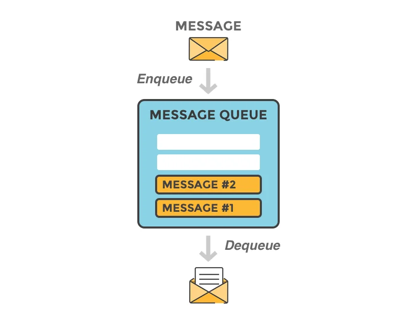
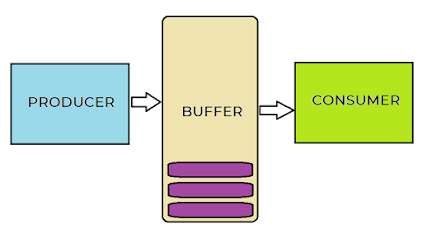
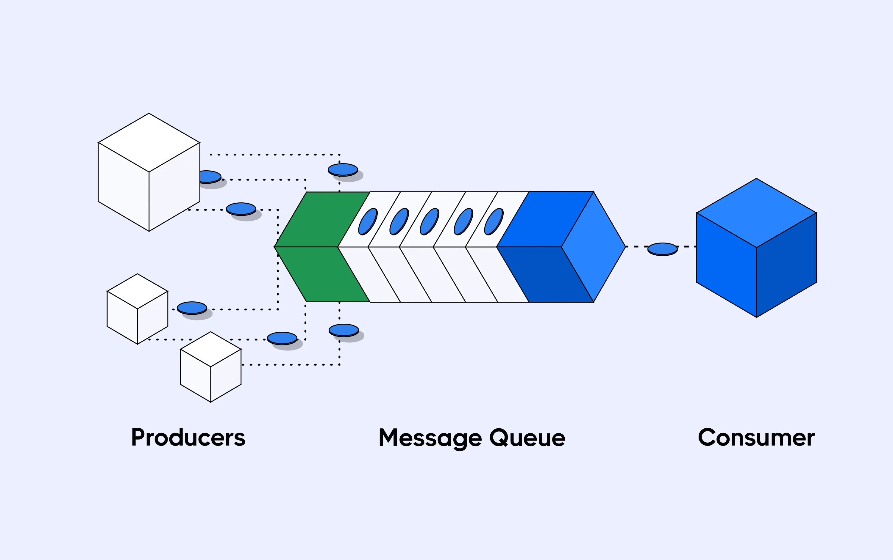

# Message queue là gì ?

Kiến thức đầu tiên chúng ta đã cùng học với nhau là [**Message**](2024-04-15-message-la-gi.md), trong bài viết này chúng ta sẽ cùng nhau tìm hiểu về [**Message queue**](2024-04-15-message-queue-la-gi.md), một khái niệm quan trọng mà các hệ thống lớn thường sử dụng để gửi và nhận các tin nhắn giữa các thành phần của chúng.

[[TOC]]

## Vậy Message queue là gì ?

[**Message queue (Hàng đợi tin nhấn)**](2024-04-15-message-queue-la-gi.md) là một component trong [system's architecture](../../blog/2024-02-01-tim-hieu-ve-architecture.md#đac-điem-cua-software-architecture) hỗ trợ buffer và phân phối các request bất đồng bộ.  

Cơ chế của [**Message queue (Hàng đợi tin nhấn)**](2024-04-15-message-queue-la-gi.md) là lưu trữ các tin nhắn ([**Message**](2024-04-15-message-la-gi.md)) trong một hàng đợi(Queue) theo thứ tự tuần tự hoặc ưu tiên và sẽ được chuyển đến một đích(Thành phần nhận, Consumer ) đã chỉ định.

Những [**Message**](2024-04-15-message-la-gi.md) chưa thể gửi đến Consumer đã chỉ định sẽ tiếp tục ở trong Queue cho đến khi Consumer sẵn sàng để xử lý Message.

Trong một hệ thống có [**Message queue (Hàng đợi tin nhấn)**](2024-04-15-message-queue-la-gi.md), các tin nhắn được gửi từ một ứng dụng **A** đến ứng dụng **B** sẽ được tạm thời lưu trữ trong hàng đợi(Queue) trước khi được ứng dụng B lấy ra và xử lý. Điều này sẽ cho phép các ứng dụng làm việc độc lập với nhau, không cần kết nối trực tiếp và hoạt động trên process riêng biệt.

## Các thành phần chính của Message queue.

- **Producer**: Là (bộ phận/thành phần) tạo ra [**Message**](2024-04-15-message-la-gi.md) chứa các thông tin để tương tác với thành phần khác. [**Message**](2024-04-15-message-la-gi.md) này sẽ được truyền vào [**Message queue (Hàng đợi tin nhấn)**](2024-04-15-message-queue-la-gi.md).
- **Consumer**: Là (bộ phận/thành phần) trong hệ thống nhận [**Message**](2024-04-15-message-la-gi.md) từ Producer thông qua [**Message queue (Hàng đợi tin nhấn)**](2024-04-15-message-queue-la-gi.md) để xử lý tin nhắn.
- [**Message**](2024-04-15-message-la-gi.md): Thông tin(Thông điệp) thường được tạo dạng text hoặc JSON, tuy nhiên nó có thể là Binary hoặc bất kỳ dạng nào. [**Message**](2024-04-15-message-la-gi.md) sẽ do Producer tạo ra.
- **Message Queue**: Nơi lưu trữ tạm thời các [**Message**](2024-04-15-message-la-gi.md) cho tới khi Consumer lấy ra và xử lý.
- **Broker**: Xử lý Message và quản lý [**Message**](2024-04-15-message-la-gi.md) để đảm bảo Producer và Consumer sẽ truyền thông tin được cho nhau, Broker giúp định tuyến Message đến đúng queue, quản lý trạng thái của Queue, và đảm bảo [**Message**](2024-04-15-message-la-gi.md) được chuyển đến đúng Consumer và không bị mất message.
  - thành phần EXCHANGES sẽ nằm trong Broker, EXCHANGES sẽ giúp định tuyến Message đến đúng queue.
- **Channel** : là cơ chế truyền thông tin giữa Producer và Consumer thông qua Message Queue. Channel đóng vai trò như là một cầu nối để truyền Message qua lại giữa các bên. Mỗi channel là một kết nối riêng biệt giữa thành phần đến Broker.

## Producers và consumers

### Message producers
Producer là một thành phần thực hiện tạo ra [**Message**](2024-04-15-message-la-gi.md) và gửi [**Message**](2024-04-15-message-la-gi.md) đó đến Queue. 

Các Producer thường đóng vai trò là nguồn cung cấp, tạo [**Message**](2024-04-15-message-la-gi.md) hoặc [**Event**](2024-04-16-event-la-gi.md) để cung cấp cho các hệ thống ví dụ [**Message queue (Hàng đợi tin nhấn)**](2024-04-15-message-queue-la-gi.md) hoặc [Event Stream](2024-04-21-event-stream-va-event-stream-platform-la-gi.md) hoặc các hệ thống khác.

### Message Consumers
Consumer là một thành phần thực hiện nhận [**Message**](2024-04-15-message-la-gi.md) từ [**Message queue (Hàng đợi tin nhấn)**](2024-04-15-message-queue-la-gi.md) và xử lý yêu cầu đó theo logic nghiệp vụ.

Các Consumer đóng vai trò là thành phần nhận Message từ Message Queue và thực hiện xử lý yêu cầu.
### Ví dụ Message queue
- Bạn và bạn bè(**producer**) vào 1 nhà hàng và thực hiện yêu cầu gọi món ăn(**Message request**) và giao nó cho người phục vụ(**Message Queue**), người phục vụ sẽ giữ và giao tất cả các yêu cầu món ăn(**Message Order**) đến nhà bếp(**Consumer**) nơi thực hiện phục vụ yêu cầu.

- Sau khi đầu bếp (**producer**) hoàn thành nấu tất cả món ăn trong yêu cầu(**Xử lý yêu cầu hoàn tất**), đầu bếp sẽ thực yêu cầu gửi món ăn cho khách hàng(**Message request**) bằng cách giao nó cho người phục vụ(**Message Queue**), người phục vụ sẽ giữ và giao tất cả món ăn(**Message Order**) cho khách hàng(**Consumer**).

### Hợp động giữa producers và Consumers

Producers và Consumers hoạt động trên các process hoặc hệ thống độc lập, hợp đồng duy nhất tồn tại giữa Producers và Consumers là [Format Message](2024-04-15-message-la-gi.md#message-la-gi-1) thứ mà họ sử dụng để giao tiếp và hiểu yêu cầu của nhau.

Format Message có thể ở nhiều trạng: Json, XML, Text, Byte,...etc..

:::warning Lưu ý:
Đối với Message Queue, Message Queue sẽ không được thực hiện **Message transformation**. Hiểu đơn giản là không được thay đổi thông điệp gốc sang thông điệp mới.

Vì vậy các Message có thể được mã hóa bởi **producer**, miễn là trong hợp đồng [Format Message](2024-04-15-message-la-gi.md#message-la-gi-1) có điều này.

:::

### Thông tin thêm
Hầu hết và best nhất là Consumers là các thành phần độc lập và thường sẽ chỉ thực hiện làm các nghiệm vụ duy nhất: Mail Service nhận yêu cầu gửi email và trách nghiệm duy nhất của nó là gửi Email.

Một hệ thống tách rời tốt là Consumer không nên biết và có bất cứ thông tin gì về Producer mà chỉ phụ thuộc vào các Message hợp lệ nhận được từ Message Queue.

## Mô tả đơn giản các thức hoạt động của Message Queue.
1. Producer tạo ra Message cần truyền đi. Message này sẽ được truyền vào Message Queue thông qua Channel và được lưu trữ tạm thời tại đây.
2. Consumer lấy(Chủ động lấy) hoặc nhận Message(Queue chủ động gửi đến) từ Message Queue. Thông tin thường được lấy theo cơ chế FIFO(First in - First out), tuy nhiên vẫn có thể can thiệp vào cơ chế này thông qua định ra mức độ ưu tiên của Message.
   - Tùy cách triển khai của Message Queue mà Consumer sẽ chủ động lấy dữ liệu hoặc bị động hoặc có thể hỗ trợ cả 2. 
3. Sau khi Consumer nhận được Message sẽ xử lý Message và thực hiện các hành động tùy vào logic nghiệp vụ của hệ thống.

## Ưu điểm của Message Queue
1. **Tăng cường khả năng mở rộng**: Bởi vì Producer và Consumer được deploy trên các process hoặc máy chủ riêng biệt và giao tiếp thông qua trung gian Message Queue nên có thể dễ ràng mở rộng quy mô của Consumer để tăng tốc độ xử lý.
2. **Ngôn ngữ đáp ứng yêu cầu**: Bởi vì Producer và Consumer là các thành phần độc lập nên có thể lựa chọn ngôn ngữ phát triển riêng cho từng thành phần để tối ưu chi phí, hiệu suất....
3. **Đồng bộ hoặc không đồng bộ:** :Message có thể được gửi một cách đồng bộ, Producer sẽ chờ đợi phản hồi của Consumer trước khi tiếp tục, hoặc không đồng bộ nơi Producer tiếp tục công việc mà không cần chờ phản hồi.
4. **Tăng mức độ tin cậy**: Đảm bảo Message chắc chắn sẽ được gửi đến Consumer. Ngay cả khi thời điểm Producer gửi Message Consumer không sẵn sàng thì sau khi sẵn sàng Consumer sẽ xử lý yêu cầu.
   - Message được lưu trữ trong Queue cho đến khi thành phần Consumer sẵn sàng nhận.
   - Giảm duy cơ mất Message và yêu cầu không được thực hiện, đảm bảo chắc chắn luôn nhận được tin nhắn ngay lập tức hoặc tương lai.
5. **Loại bỏ giao tiếp giữa các ứng dụng**:  Loại bỏ giao tiếp giữa các ứng dụng, các giao tiếp sẽ thực hiện thông qua Message Queue, với cách thông thường Ứng dụng có thể sẽ cần kết nối đến hàng chục, trăm thành phần khác, nhưng nếu sử dụng Message Queue thì chỉ cần kết nối đến Message Queue.
6. **Căn bằng lưu lượng**: Bởi vì tin nhắn thường được gửi từ Message Queue đến Consumer, vì vậy Message Queue có thể cân bằng lưu lượng truy cập đột biến, đảm bảo hệ thống không bị quá tải và sập khi có yêu cầu tăng đột biến.

## REF:
- https://hookdeck.com/blog/introduction-message-queue
- https://hookdeck.com/blog/message-queues-deep-dive
