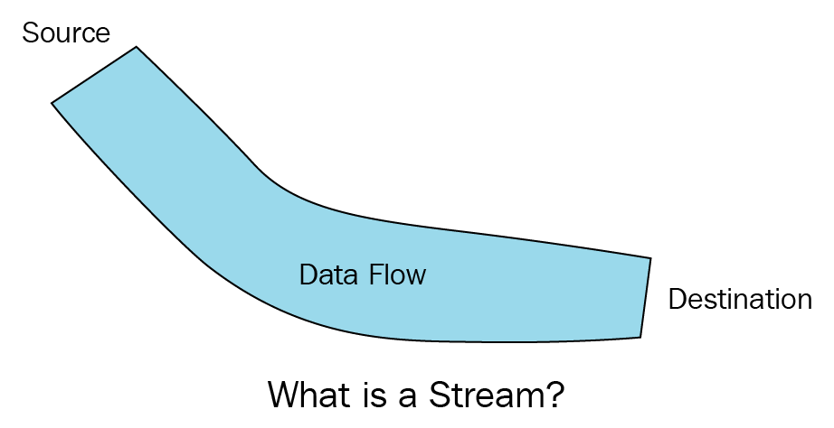

Hiểu biết về **[Message](2024-04-15-message-la-gi.md)** và [**Event**](2024-04-16-event-la-gi.md) là cơ sở quan trọng cho việc làm việc với dữ liệu trong ứng dụng của bạn.

Tuy nhiên, để thực sự tận dụng hết khả năng của hệ thống, chúng ta cần khám phá thêm về **Stream**.

Stream không chỉ là cách để xử lý dữ liệu một cách liên tục và hiệu quả, mà còn mở ra cơ hội cho việc xây dựng ứng dụng đa nền tảng, có khả năng mở rộng và linh hoạt.

Hãy cùng nhau khám phá sâu hơn về **Stream** và cách nó có thể tối ưu hóa hiệu suất và trải nghiệm người dùng của ứng dụng!"

[[TOC]]

## Stream là gì ?
Stream là một khái niệm phổ biến trong lĩnh vực công nghệ và truyền thông. Trong bài viết này mình sẽ nói Stream ở ngữ cảnh công nghệ.

Theo [Wikipedia](https://en.wikipedia.org/wiki/Stream_(computing)#:~:text=In%20computer%20science%2C%20a%20stream,rather%20than%20in%20large%20batches.), Stream là một chuỗi các phần tử dữ liệu được cung cấp theo thời gian. Trên một Stream, từng dữ liệu sẽ được xử lý thay vì xử lý một lô lớn( Batch data ).

Với cách hiểu của mình thì Stream đề cập đến việc truyền dữ liệu từ một nguồn đến một đích một cách liên tục và có tổ chức. Nó tương tự như dòng nước chảy từ một nguồn đến một đích.

Các loại **Stream** thường được chia thành hai loại chính là **input stream (dữ liệu đầu vào)** và **output stream (dữ liệu đầu ra**). 

Sử dụng stream giúp cho việc xử lý dữ liệu trở nên linh hoạt và hiệu quả, đặc biệt là khi làm việc với dữ liệu lớn hoặc khi cần xử lý dữ liệu một cách tuần tự.

## Đặc điểm của event.
1. **Truyền dữ liệu liên tục**: Stream cho phép truyền dữ liệu liên tục từ nguồn đến đích.

2. **Xử lý dữ liệu liên tục**: Stream cho phép xử lý dữ liệu ngay khi dữ liệu đến đích.(Mỗi dữ liệu gửi đến đích là dữ liệu có thể được được xử lý được)

3. **Thòi gian thực**: Dữ liệu được truyền từ nguồn đến đích gần như là ngay lập tức, giúp đích nhận tiếp cận nội dung nhanh chóng và hiệu quả. Thích hợp cho các ứng dụng yêu cầu xử lý dữ liệu real-time như phân tích dữ liệu, hay hệ thống điều khiển.

4. **Đa dạng trong xử lý:** Stream có thể xử lý nhiều loại dữ liệu khác nhau, bao gồm dữ liệu có cấu trúc hoặc dữ liệu không cấu trúc, đa phương tiện(Video, âm thanh...)

5. **Tính mở rộng**: Các hệ thống Stream thường có khả năng mở rộng dễ dàng để xử lý lượng dữ liệu lớn hoặc tăng hiệu suất.

## Một số nghiệp vụ sử dụng Stream.
1. **Xử lý dữ liệu real-time:** Stream cho phép hệ thống phản ứng ngay lập tức với dữ liệu khi nhận được từ nguồn. Giúp cải thiện khả năng phản hồi và tương tác với người dùng.

2. **Giám sát và điều khiển hệ thống**: Stream cho phép giám sát và điều khiển hệ thống trong thời gian thực, giúp phát hiện và ứng phó kịp thời với các xự cố xảy ra.

3. **Xử lý log và Event**: Stream được sử dụng để xử lý và phân tích log và Event từ hệ thống, ứng dụng web... giúp cải thiện hệ thống.

4. **Cung cấp dịch vụ và sản phẩm cá nhân hóa**: Bằng cách phân tích và xử lý dữ liệu theo thời gian thực, stream giúp cung cấp dịch vụ và sản phẩm cá nhân hóa dựa trên hành vi và sở thích của người dùng.

## Tổng kết
- **Stream** là việc truyền dữ liên tục từ nguồn đến đích ngay khi có dữ liệu.

- Stream giúp truyền dữ liệu liên tục và xử lý dữ liệu ngay khi đến đích, thích hợp với các ứng dụng real-time và khả năng mở rộng.

- Các nghiệp vụ có thể sử dụng steam bao gồm, real-time- giám sát hệ thống, xử lý log và event, cung cấp các dịch vụ cá nhận hóa...
