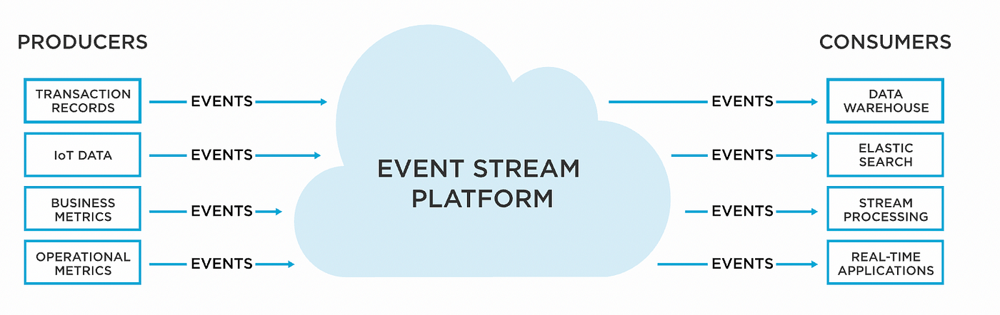

# Event Stream là gì ?

Chúng ta đã cùng nhau tìm hiểu về **[Message](2024-04-15-message-la-gi.md)** và [**Event**](2024-04-16-event-la-gi.md)  là 2 khái niệm về dữ liệu và **[Stream](2024-04-19-stream-la-gi.md)** là khái niệm về dữ liệu truyền liên tục.

Nhưng có một khái niệm khác nữa về dữ liệu mà chúng ta chưa khám phá sâu hơn đó là **Event Stream**. 

Trong bài viết này, chúng ta sẽ cùng nhau khám phá về **Event Stream**, và tại sao nó là một phần quan trọng của hệ thống phần mềm hiện đại.

[[TOC]]

## Vậy Event Stream là gì ?
- Event Stream là một luồng dữ liệu được tạo ra bởi các sự kiện(Event) xảy ra trong hệ thống theo thời gian. 
- Mỗi Event thường đại diện cho một hành động cụ thể đã xảy ra hoặc thay đổi trạng thái trong ứng dụng hoặc hệ thống.
- Các Event này có thể là mọi thứ đã xảy ra như thao tác người dùng chạm vào button, thậm chí là từ các thiết bị IoT.
- Event Stream tương tự như hệ thống dây thần kinh của chúng ta. Xử lý hàng triệu, tỉ sự kiện và gửi tín hiệu đến các bộ phận trên cơ thể chúng ta.
  - Một số tín hiệu được tạo ra bởi hành động của chúng ta (Lấy một quả táo) và cũng có các tín hiệu tạo ra một cách vô thức(Tăng nhịp tin khi bị mẹ mắng :D)

**Ví dụ**:
- Người dùng nhấp vào nút mua hàng.
- Các tương các của người dùng trên website.
- Nhiệt độ phòng thay đổi.
- Tin nhắn mới được gửi đến từ telegram, slack...
- 

### Đặc điểm của Event Stream.
Thực thế các đặc điểm này là sự kết hợp của các đặc điểm Event + Stream.

1. **Tức thời**: 
   - Event Stream là một chuỗi liên tục các sự kiện được tạo ra và gửi đi trong thời gian thực hoặc gần thời gian thực. Các Event sẽ được gửi đi ngay khi xảy ra.
   - Các Event sẽ được sắp xếp và gửi đi theo đúng thứ tự bởi thời gian chúng được tạo ra.(Thời gian tạo Event A trước B thì A sẽ được gửi trước)
2. **Thời gian thực**:
   - Event stream cho phép xử lý các Event ngay lập tức giúp hệ thống phản ứng nhanh chóng và linh hoạt vơi các Event xảy ra trong môi trường real-time.
3. **Phân tán và đa nguồn**:
   - Các Event có thể được gửi đi đến 0 hoặc N người nhận.
   - Các Event stream có thể được tạo ra từ nhiều nguồn khác nhau.
     - Ứng dụng, Server, thiết bị IoT.
4. **Đa dạng dữ liệu**:
   - Event Stream không giới hạn định dạng dữ liệu, nó có thể là JSon, text thuần, byte, video...
5. **Linh hoạt và dễ mở rộng**:
   - Dễ mở rộng bởi đặc điểm **Phân tán và đa nguồn**.

### Có thể sử dụng Event Stream trong những bài toán nào ?

Event Stream thường được sử dụng để theo dõi và phản ứng với các sự kiện trong thời gian thực(Real-time) giúp hệ thống phản hồi nhanh chóng.

Các ứng dụng của Event Stream có thể là:

1. **Hệ thống giám sát các hệ thống khác.**
   - Theo dõi và giám sát hệ thống khác bằng cách thu thập và phân tích các Event từ các service và server. Điều này sẽ giúp phát hiển sớm và xử lý các sự cố hệ thống một cách nhanh chóng và hiệu quả.
2. **Phân tích dữ liệu real-time.**
   - Sử dụng để thu thập dữ liệu từ nhiều nguồn khác nhau như website, Mobile app, thiết bị IoT... Các Event này có thể được sử dụng để phân tích các nguy cơ, dự đoán xu hướng, dự đoán nhu cầu khách hàng...
   - **Ví dụ:** Khách hàng vừa xuống máy bay. Hệ thống gửi thông báo đặt xe grab đến khách hàng với giá rẻ.
3. Xây dựng các hệ thống tương tác thông qua Event.(Một phần quan trọng được sử dụng nhiều trong kiến trúc microservices )
   - Giúp hệ thống dễ dàng mở rộng và linh hoạt hơn.+
4. Ứng dụng IoT:
   - Sử dụng rộng dãi trong các ứng dụng IoT để thu thập, xử lý và phản hồi dữ liệu từ các thiết bị IoT. Điều này giúp tổ chức quản lý và điều khiển xác hệ thống IoT dễ dàng, nhanh chóng và hiệu quả.
5. Xây dựng các ứng dụng real-time,
   - Các ứng dụng real-time như video stream, chat real-time, game trực tuyến...
6. Gian lận thẻ tín dụng: Chủ thẻ có thể không biết thẻ bị sử dụng, sử dụng Event stream để phân tích thói quen sử dụng, địa chỉ hay sử dụng...etc..
7. Ngành tài chính:
   - Phân tích xu hướng tài chính để các nhà đầu tư và môi giới sử dụng.
## Event stream platform là gì ?
Event stream platform là một hệ thống phần mềm được thiết kế để thu thập, lưu trữ, xử lý và phân phối các event stream trong thời gian thực hoặc gần thời gian thực.

### Các tính năng chính thường có của event streaming platform:
- **Thu thập và lưu trữ Event:** Thu thập dữ liệu từ nhiều nguồn  và lưu trữ chúng một cách an toàn và dễ truy cập.

- **Xử lý dữ liệu Event :** Hỗ trợ xử lý các Event Stream theo thời gian thực hoặc theo batch-data, bao gồm filter, transform...

- **Phân phối dữ liệu Event:** Gửi các Event đến 1 học N người nhận(Đích nhận), có thể là các ứng dụng, hệ thống lưu trữ khác hoặc thậm chí là một hệ thống Event stream platform khác.

- **Đảm bảo độ tin cậy và khả năng mở rộng:** Cung cấp khả năng chịu lỗi, độ trễ thấp, khả năng mở rộng để xử lý lượng dữ liệu lớn từ nhiều nguồn.

## Các Event stream platform phổ biến hiện tại
- Apache Kafka.
- Amazon Kinesis
- Google Pub/Sub
- Microsoft Azure Event Hubs

## Tổng kết
1. Event Stream là một luồng dữ liệu liên tục được tạo ra bởi các Event xảy ra trong hệ thống, đại diện cho các hành động và trạng thái thay đổi đã xảy ra.

2. Đặc điểm chinh của Event Stream là sự tức thời và thời gian thực hoặc gần thực trong việc xử lý Event, khả năng phân tán, đa nguồn dữ liệu và đa dạng định dạng.

3. Cho phép xử lý các Event ngay lập tức giúp hệ thống phản ứng nhanh chóng và linh hoạt.

4. Dễ dàng mở rộng nhờ tính linh hoạt và khả năng phân tán, đa nguồn.

5. Event Stream được sử dụng trong nhiều lĩnh vực khác nhau như giám sát hệ thống, phân tích dữ liệu, xây dựng hệ thống tương tác qua Event, ứng dụng IoT hoặc các ứng dụng real-time.
