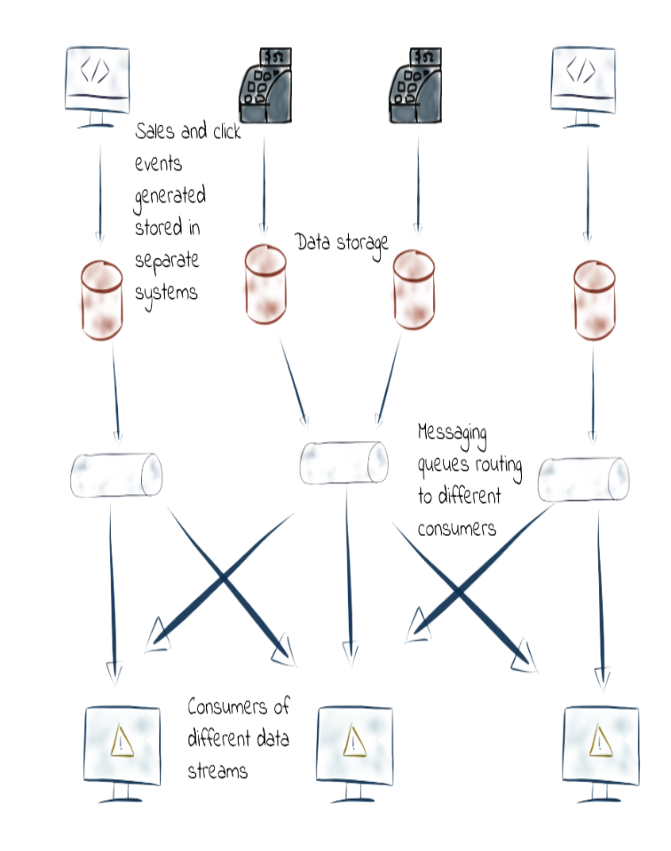

Chúng ta đã cùng nhau tìm hiểu về **[Message](2024-04-15-message-la-gi.md)** và [**Event**](2024-04-16-event-la-gi.md) 2 khái niệm và cũng thường là 2 kiểu dữ liệu chính trong ứng dụng của bạn.

Có thể bạn vẫn còn thắc mắc về điểm giống và khác biệt giữa chúng. Trong bài viết này, chúng ta sẽ cùng nhau làm sáng tỏ vấn đề này.

[[TOC]]

## Giống nhau giữa Message và Event
Các điểm giống nhau này sẽ tùy thuộc vào bài toán và cách triển khai mà chúng sẽ giống hoặc không giống.

Tuy nhiên ở high level thì Message và Event đều có vẻ giống nhau vì cả 2 đều tập trung vào giao tiếp giữa các thành phần khác nhau của hệ thống.

- **Mục đích Giao tiếp**: Cả Message và Event đều được sử dụng như một phương tiện giao tiếp trong hệ thống phần mềm. Chúng cho phép các thành phần, dịch vụ hoặc ứng dụng trao đổi thông tin một cách linh hoạt.

- **Dùng kích hoạt hành động**: Cả 2 đều có thể được sử dụng để kích hoạt một hành động hoặc một process.

  - **Message**: Hệ thống **"Quản lý trạng thái Service"** gửi Message thông báo HTTP đến Hệ thống B để kích hoạt hành động chuyển trạng thái của hệ thống B sang **maintain**.
  
  - **Event**: Hệ thống **"Quản lý trạng thái Service"** thực hiện phát Event đã **"Đã chuyển trạng thái"**, hệ thống B,C,D lắng nghẹ event phát ra từ Hệ thống **"Quản lý trạng thái Service"** và phản ứng lại bằng cách chuyển trạng thái sang **maintain**.

- **Độc lập**: Với nhiều loại thiết kế, cả Message và Event đều có thể thiết kế để hỗ trợ tính độc lập trong hệ thống, các thành phần hoạt động mà không cần biết đến sự tồn tại của nhau.
  - **Các tính độc lập** 

    - **Độc lập về phát triển*: Các dev có thể phát triển các dịch vụ khác nhau một cách độc lập, miễn là **định dạng Message** và thông tin **Event** sử dụng để giao tiếp không thay đổi.
  
    - **Độc lập về triển khai**: Các dev có thể triển khai dịch vụ độc lập, không lo lắng thay đổi code sẽ ảnh hưởng đến hệ thống khác,(Ví dụ cập nhật dịch vụ A sẽ không cần dừng hoặc cập nhật dịch vụ B)
    
    - **Độc lập về quy mô**: Chúng ta có thể mở rộng quy mô của mỗi service một cách độc lập tùy thuộc vòa nhu cầu. Ví dụ dịch vụ A cần nhiều tài nguyên phần cứng hơn dịch vụ B.
    
  - **Ví dụ triển khai**
    - **Message**: Ví dụ về microservice, các dịch vụ giao tiếp với nhau thông qua gửi và nhận message sử dụng Message Queue.
  
    - **Event**: Cũng ví dụ về microservice, các dịch vụ giao tiếp với nhau thông qua phát và lắng nghe Event sử dụng Event stream.
    
- **Khả năng Mở rộng** : Sử dụng Message và Event giúp hệ thống có khả năng mở rộng cao hơn, có thể thêm các thành phần vào hệ thống mà không làm ảnh hưởng đến hệ thống cũ.

- **Tính ổn định**: Nếu một hệ thống gặp sự cố, nó sẽ không làm gián đoạn các hệ thống khác, hệ thống sẽ xử lý bù các message hoặc event khi khởi động lại.
  - Ví dụ: 2 Service **Đặt hàng** và **Xử lý đơn hàng**. Nếu service **Xử lý đơn hàng** lỗi thì service **Đặt hàng** vẫn hoạt động tốt.

- **Linh Hoạt trong Quy mô**: Dễ dàng điều triển quy mô của dịch vụ hoặc cả một hệ thống để đáp ứng nhu cầu.

## Khác nhau giữa Message và Event.

- **Định nghĩa mục đích**:
  - **Message**: 
    - Là một gói dữ liệu được gửi từ một thành phần này đến thành phần khác, thường chứa các thông tin cần được xử lý hoặc hành động cần thực hiện.
    
    - Message thường được sử dụng trong trong mô hình Request/Response, hoặc trong các hệ thống Message Queue, nơi 1 message được gửi và sau đó được xử lý bởi 1 hoặc nhiều người nhận.
    
    - Như đã nói ở trên, Message là một tin nhắn hoặc yêu cầu thực hiện hành động. Vì vậy các hành động lúc gửi message là chưa xảy ra hoặc sẽ không bao giờ xảy ra.(Gửi không đến, vi phạm rule...)
    - Ví dụ:
      - Service **Đặt Hàng** gửi message đến Service **Xử lý đơn hàng**, yêu cầu xử lý đơn hàng đã đặt.
      
  - **Event**: 
    - Là một thông báo về một sự kiện đã xảy ra trên hệ thống và không chứa yêu cầu cụ thể nào cả. Các hệ thống khác sẽ phản ứng lại với sự kiện đó.
    
    - Ví dụ:
      - Service **Đặt Hàng** phát một Event "Đã đặt hàng thành công", Service **Xử lý đơn hàng** đăng ký lắng nghe sự kiện "Đã đặt hàng thành công" và phản ứng lại bằng cách xử lý đơn hàng đã đặt.
      
  - **Hướng Giao tiếp**:
    - Message: Thường có hướng giao tiếp 1 chiều hoặc 2 chiều(Trong mô hình Request/Response) . Một message được gửi từ người gửi đến một người nhận, đôi khi sẽ nhận lại 1 phản hồi từ người nhận.
      - Message thì thường biết rõ người nhận là ai.
    - Event: Dạng giao tiếp 1 chiều. Hệ thống tạo ra event chỉ có nghiệm vụ phát ra Event. 
      - Các hệ thống khác có thể đăng ký lắng nghe và phản ứng lại với Event.
      
      - Hệ thống đăng ký lắng nghe event sẽ không quan nguồn gốc nơi phát ra Event
      
      - Hệ thống tạo ra Event sẽ không quan tâm đến có hoặc không có hoặc có bao nhiêu hệ thống đăng ký lắng nghe event.
      
      - Không biết người nhận là ai.
      
  - **Mô hình Giao tiếp**:
    - Message: Được sử dụng trong các mô hình giao tiếp dựa trên Message, như Message queue... Nơi Message được đặt vào một hàng đợi và sau đó được xử lý bởi một họặc nhiều dịch vụ.
      - Đối với Message, khi đã tạo ra Event thì mong muốn của hệ thống là sẽ có một người nào đó nhận và xử lý Message.
      
    - Evennt: Được sử dụng trong mô hình giao tiếp dựa trên sự kiện(Event driven),
      - Các thành phần sẽ phản ứng lại với sự kiện nhận được mà không cần biết nguồn gốc của sự kiện.
      - Đối với Event, khi tạo ra người tạo ra Event không quan tâm có ai phản ứng với sự kiện đó hay không.
      
  - **Kiểu giao tiếp**:
      - **Message**: là một loại giao tiếp kiểu **one-to-one** hoặc **one-to-many**,
      - **Event**: Là một loại giao tiếp kiểu **One-to-many** hoặc **many-to-many**.
        - **One-to-Many**: Một Event được phát ra có thể được lắng nghe và xử lý bởi 0 hoặc N thành phần.
        - **Many-to-Many**:  Nhiều nguồn có thể phát ra sự kiện giống nhau và có thể được lắng nghe và xử lý bởi 0 hoặc N thành phần.
          - Ví dụ: Các kênh bán hàng khác nhau(Web, ứng dụng di động, đối tác thứ 3, cò trực tiếp) có thể phát ra sự kiện **"Tạo đơn hàng mới"** (Nhiều nguồn cùng 1 sự kiện phát ra)
          - Các hệ thống như quản lý kho, xử lý thành toán, dịch vụ giao hàng sẽ đăng ký lắng nghe sự kiện **"Tạo đơn hàng mới"** để thực hiện các nghiệp vụ của mình
          
  - **Tần suất gửi và kiểm soát gửi**.
    - **Message**:
      - **Tần suất**: Tần suất gửi message thường phụ thuộc vào nhu cầu giao tiếp cụ thể giữa người gửi và nhận tin nhắn. 
      - **Kiểm soát gửi**: Tần suất gửi và xử lý message thường được kiểm soát chặt chẽ để đảm bảo người nhận có đủ khả năng xử lý.
        - Ví dụ: Ngân hàng chỉ có thể nhận và xử lý 200-400 TPS/s, nếu gửi message lên đến 1k hoặc 2k thì có thể khiến bị treo.
    - **Event**:
        - **Tần suất**: Tần suất phát event thường phản ánh tần suất xảy ra của sự kiện trong hệ thống.
          - Ví dụ: có 500 đơn hàng tạo trong 1s thì sẽ có 500 sự kiện được phát ra.
        - **Kiểm soát gửi**: Tần suất phát event ít được kiểm soát hơn so với Message vì event chỉ thông báo có sự kiện và không yêu cầu người nhận phải xử lý ngay.
          - Ví dụ: Ngân hàng chỉ có thể nhận và xử lý 200-400 TPS/s. 5k Event vẫn được phát ra và ngân hàng sẽ lắng nghe và xử lý các event dần dần.
  - **Loại Thông tin**:
    - **Message**: Thường chứa dữ liệu cụ thể và hướng dẫn xử lý hoặc yêu cầu một hành động cụ thể hoặc phản hồi.
    - **Event**: Chỉ thông báo rằng có một sự kiện nào đó đã xảy ra, không yêu cầu hành động cụ thể tiếp theo.
    
  - **Mục đích sử dụng**:
    - **Message**: Thường sử dụng để thực hiện một giao tiếp hoặc trao đổi dữ liệu giữa các service hoặc thành phần 1 cách rõ ràng.(Gửi tạo message biết ai sẽ nhận message, và người nhận biết ai gửi)
    - **Event**: Thường sử dụng để thông báo cho các thành phần khác là đã có một sự kiện xảy ra(Thay đổi trạng thái, đã làm một gì đó) cho phép các thành phần khác có thể phản ứng với sự kiện đó.

## Khác nhau về nhu cầu sử dụng
Lựa chọn giữa Message và Event trong hệ thống phần mềm phụ thuộc vào nhiều yếu tố, kiến trúc, cách quản lý trạng thái, cách hệ thống tương tác với nhau,mức độ chặt chẽ...

### Message

- **Giao tiếp request/response** : 
  - Khi cần một mô hình giao tiếp rõ ràng giữa người gửi và người nhận, nơi người gửi mong đợi một phản hồi cụ thể từ người nhận.
    - Ví dụ: Trong một hệ thống giao dịch, một yêu cầu thanh toán có thể được gửi dưới dạng message và người gửi mong đợi một phản hồi về việc thanh toán thành công hoặc thất bại.
- **Xử lý đồng bộ hoặc Bất đồng bộ Cần Phản hồi**: 
  - Khi chúng ta cần kiểm soát chặt chẽ quy trình xử lý, đảm bảo các task được thực hiện theo một trình tự nhất định.
  - Khi chúng ta có task vụ xử lý bất đồng bộ như cần có phản hồi sau khi hoàn thành.
    - Ví dụ tải lên video(Ví dụ này có thể thực hiện cả trên message và event):
      - 1. Tải video lên máy chủ(Đồng bộ)
      - 2. Xử lý video (Bất đồng bộ)
        - Hệ thống đưa video vào hàng đợi để xử lý bất đồng bộ (ví dụ: mã hóa lại, tối ưu hóa cho web). Quá trình này có thể mất vài phút và được thực hiện mà không cản trở người dùng tiếp tục sử dụng ứng dụng.
      - 3. Phản hồi lại người dùng thông báo đã thành công xử lý video (Đồng bộ có phản hồi)
- **Quản lý trạng thái phức tạp**:
  - Khi có các nghiệp vụ phức tạp yêu cầu quản lý trạng thái một cách rõ ràng qua từng bước, Message cho phép theo dõi và đảm bảo nhất quán của dữ liệu ở các service khác nhau.
  - Ví dụ: Khi có một yêu cầu từ client và hệ thống cần call nhiều hệ thống và các hệ thống khác cũng call nhiều hệ thống khác. Các tin nhắn sẽ gửi tuần tự(Sequence) và duy trì trạng thái giữa các tin nhắn.
    
- **Tích hợp hệ thống bên thứ 3**:
  - Khi tích hợp với các hệ thống bên thứ 3, message cho phép định nghĩa cách thức giao tiếp chặt chẽ, đảm bảo dữ liệu được gửi chính xác giữa các hệ thống bên ngoài khác.
### Event

- **Thông báo về Sự kiện**: Khi muốn thông báo một sự kiện đã xảy ra và không yêu cầu một hành động cụ thể hoặc phản hồi từ người nhận hoặc không yêu cầu người nhận xử lý ngay lập tức khi phát sự kiện.
- **Lập trình Hướng sự kiện (Event-driven):**: Việc sử dụng Event giúp giảm sự phụ thuộc giữa các thành phần, cho phép linh phản ứng linh hoạt với các thay đổi.
- **Mở rộng**: Các dịch vụ mới sẽ dễ dàng tích hợp vào hệ thống mà không cần sửa code.
  - Tất nhiên là cùng nghiệp vụ, nếu cần thêm hoặc sửa nghiệp vụ thì vẫn cần sửa code.
- **Giảm phụ thuộc giữa các thành phần**: Event cho phép các thành phần phản ứng với sự kiện mà không cần thiết đến nguồn gốc của Event. Các thành phần không trực tiếp giao tiếp với nhau.
  - Giao tiếp qua Event Stream platform
- **Xử lý xong xong và hiệu suất**: Trong các hệ thống cần xử lý song song và tối ưu hiệu suất, event cho phép phân tán xử lý và giảm độ trễ bằng cách cho phép các thành phần xử lý độc lập và song song với nhau.

## Các tiêu chí đánh giá lựa chọn giữa việc sử dụng message và event trong hệ thống

1. **Mục Tiêu Giao Tiếp**
   - **Message**: Sử dụng khi cần giao tiếp mục đích cụ thể giữa các thành phần, đặc biệt là khi cần một phản hồi hoặc xử lý dữ liệu cụ thể.
   - **Event**: Sử dụng khi muốn thông báo về sự kiện hoặc thay đổi trạng thái mà không yêu cầu phản hồi cụ thể từ người nhận.
2. **Quản Lý Trạng Thái**
   - **Message**: Phù hợp khi cần quản lý trạng thái của giao dịch hoặc quy trình một cách chặt chẽ.
   - **Event**: Hợp lý khi muốn giảm bớt sự phức tạp trong việc quản lý trạng thái.
3. **Độ Phụ Thuộc và Coupling**
   - **Message**: Thường tạo ra mức độ coupling cao hơn giữa người gửi và người nhận.
   - **Event**: Giảm coupling giữa người phát và người nhận, tăng tính độc lập giữa các thành phần.
4. **Tính Mềm Dẻo và Mở Rộng**
   - **Message**: Có thể hạn chế tính mềm dẻo do yêu cầu giao thức giao tiếp chặt chẽ.
   - **Event**: Tăng tính mềm dẻo và khả năng mở rộng của hệ thống, cho phép dễ dàng thêm hoặc sửa đổi thành phần mà không ảnh hưởng đến các thành phần khác.
5. **Đảm Bảo Giao Dịch**
   - **Message**: Thích hợp cho các giao dịch cần đảm bảo tính đáng tin cậy và nhất quán, như trong các hệ thống tài chính hoặc đặt hàng.
   - **Event**: Có thể không đảm bảo giao dịch một cách chặt chẽ như message, nhưng phù hợp cho việc thông báo về sự kiện mà không cần xử lý ngay lập tức.
6. **Xử Lý Song Song và Hiệu Suất**
   - **Message**: Cần cân nhắc cách xử lý và quản lý hàng đợi message để tối ưu hiệu suất.
   - **Event**: Có thể tối ưu hóa xử lý song song và giảm độ trễ, nhất là trong các hệ thống phân tán lớn.
7. **Tích hợp Hệ thống**
   - **Message**: Phù hợp khi tích hợp với các hệ thống ngoại vi hoặc bên thứ ba yêu cầu giao thức giao tiếp chặt chẽ.
   - **Event**: Hữu ích trong việc tích hợp lỏng lẻo, nơi các hệ thống có thể phản ứng với sự kiện mà không cần biết chi tiết về nguồn phát.
   
## Kết Luận
Lựa chọn giữa Message và Event phụ thuộc vào nhiều yêu cầu cụ thể của hệ thống, trong nhiều trường hợp việc sử dụng cả 2 trong hệ thống và kết hợp cả 2 phương pháp sẽ mang lại lợi ích tối ưu, tận dụng được các ưu điểm của cả message và event.

## REF:
- https://www.linkedin.com/pulse/differences-between-message-queue-event-stream-frank-lieu/
- https://devdog.co/sniffs/scalability-vs-responsiveness-the-pros-and-cons-of-event-driven-and-message#whats-the-difference-then
