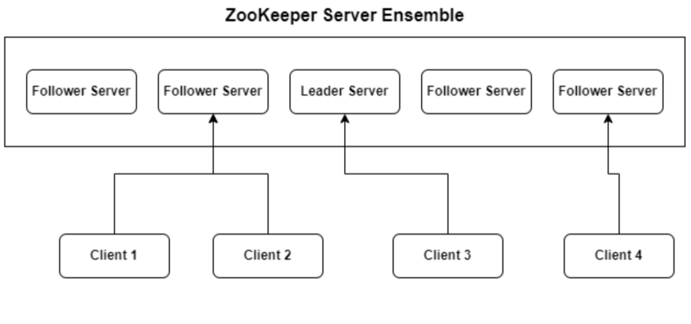
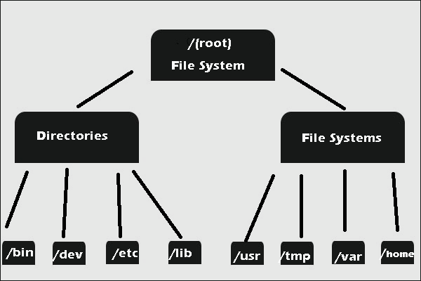

# Cài đặt Kafka với Zookeeper và Kraft

Trong bài viết này, chúng ta sẽ cùng nhau bước vào hành trình khám phá Kafka đầu tiên khám phá Kafka bằng việc tìm hiểu các thành phần cần thiết để cài đặt kafka cũng như cách cài đặt kafka.
[[TOC]]

## Zookeeper là gì ?

Zookeeper là một open source cho centralized service để duy trì thông tin cấu hình, đặt tên và cung cấp đồng bộ hóa cho các ứng dụng phân tán.

Zookeeper Cho phép các process phân tán phối hợp với nhau thông qua một Share hierarchical namespace(Chia sẽ hệ thống tệp phân cấp), nó giống như một [File system](https://vi.wikipedia.org/wiki/H%E1%BB%87_th%E1%BB%91ng_t%E1%BA%ADp_tin)

Trong đó mỗi một folder trong Share hierarchical namespace được gọi là Znodes. Mỗi Znodes trong Zookeeper name space được xác định bởi một path. Và mọi Znodes đều có cha mẹ có đường dẫn là prefix của Znodes hiện tại. Ngoại lệ duy nhaast là Root("/") sẽ không có cha mẹ.

::: details Ví dụ về Znodes
```
/opt/containerd/lib/
```

Nhìn vào đường dẫn ở trên chúng ta có thể nhận thấy là đang có 4 Znodes.
1. Znode Root chính là "/" đầu tiên từ trái qua phải, Znodes đầu tiên chứa các con là "opt"
 và có thể có nhiều con khác nữa.
2. Znode thứ 2 trong phân cấp có cha là **Root** là **Opt**
3. Znode thứ 3 trong phân cấp có cha là **opt** là **containerd**
4. Znode thứ 4 trong phân cấp có cha là **containerd** là **lib**
:::

Và giống như các [File system](https://vi.wikipedia.org/wiki/H%E1%BB%87_th%E1%BB%91ng_t%E1%BA%ADp_tin) khác,Znode cha không thể bị xóa nếu có các Znode con. Vì vậy muốn xóa Znode cha thì tất cả các Znode con cũng sẽ bị xóa.

Và Zookeeper để duy trì thông tin cấu hình, vì vậy các data trong Znode thường đo bằng kilobyte, thậm chí là byte.

::: details REF
https://cwiki.apache.org/confluence/display/ZOOKEEPER/ProjectDescription
:::

### Các tính năng chính của ZooKeeper bao gồm.
- **Đồng bộ hóa**: Zookeeper giúp đồng bộ hóa trạng thái giữa các node trong hệ thống phân tán, đảm bảo tất cả các node đều có dữ liệu nhất quán.
- **Đặt tên và cấu hình service**: ZooKeeper cung cấp một không gian tên phân cấp (giống như cấu trúc thư mục trong hệ thống tập tin) để lưu trữ và quản lý thông tin cấu hình, giúp các ứng dụng truy cập và quản lý cấu hình một cách dễ dàng.
- **Service discovery**:  Zookeeper có thể đụược sử dụng để theo dõi các node trong một cụm và quản lý thông tin về các service đang chạy trên các node đó, giúp các ứng dụng khác tìm và sử dụng các service này một cách hiệu quả.
- **Session Management**: Zookeeper quản lý các session cho các client kết nối đến nó. Mỗi client sẽ có một session làm việc riêng với Zookeeper và Zookeeper đảm bảo rằng trạng thái được duy trì liên tục vào Session đó.
  - Nếu một client mất kết nối, Zookeeper có thể phát hiện và xử lý tình huống đó và đồng thời thông báo cho các client khác về sự thay đổi trạng thái.
- **Nhất quán dữ liệu giữa các node**:
  - Zookeeper đảm bảo tính nhất quán của dữ liệu thông qua một thuật toán tên là : Zab (ZooKeeper Atomic Broadcast) thuật toán này đảm bảo rằng tất cả các thay đổi đối với cấu trúc dữ liệu của Zookeeper được áp dụng một cách đồng bộ trên tất cả các Node trong cụm.
- **Cơ chế Watchers**: Cơ chế này cho phép các client đăng ký nhận thông báo khi có sự thay đổi đối với dữ liệu mà họ quan tâm. Khi có dữ liệu tại một znode thay đổi, các client đăng ký watcher sẽ nhận đưược thông báo, điều này giúp các ứng dụng phản ứng nhanh chóng với các thay đổi trong cấu hình hoặc trạng thái của hệ thống

### Cách thức hoạt động của Zookeeper.

Zookeeper duy trì một cấu chúc dữ liệu phân cấp và lưu trữ các dữ liệu trong các Node gọi là Znodes. Mỗi Znodes có thể chứa dữ liệu và có thể có các Znode con. Zookeeper đảm bảo rằng tất cả các bản sao của cơ sở dữ liệu các nó trên các node khác nhau đều được cập nhật với trạng thái nhất quán.

### 
