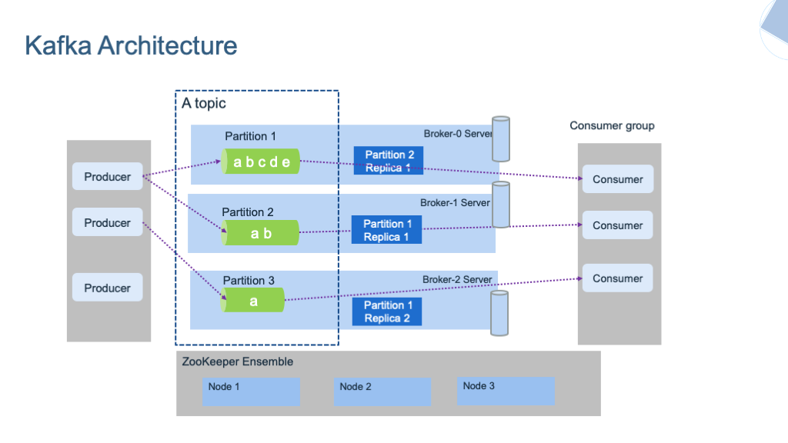
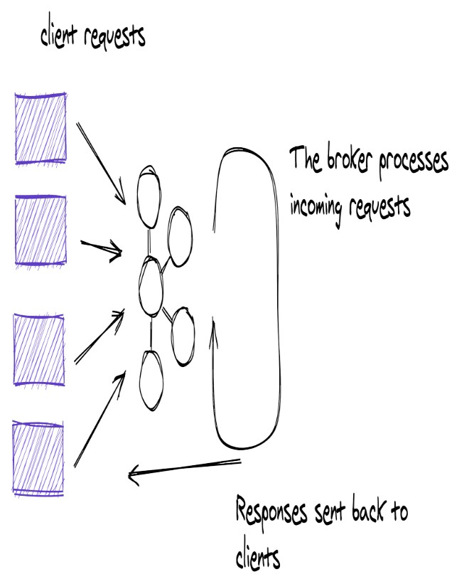
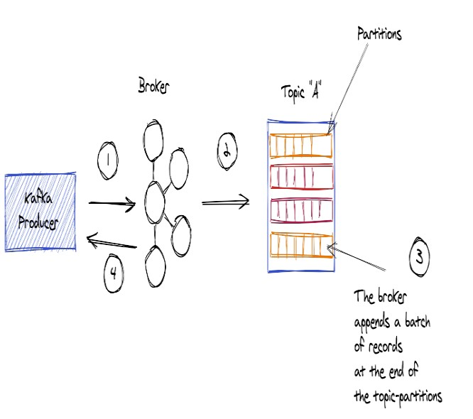
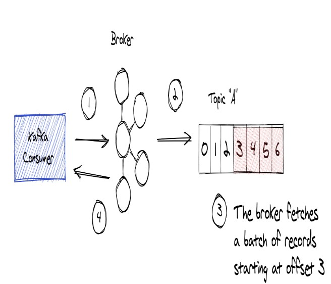
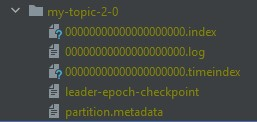
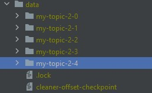
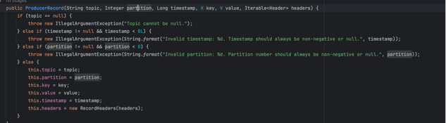
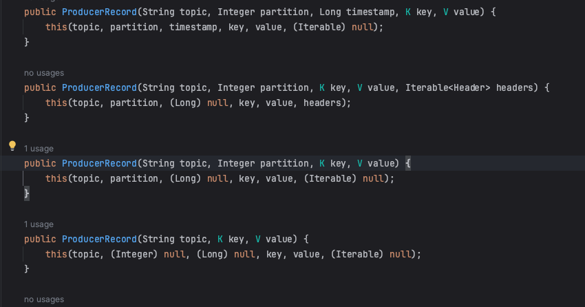
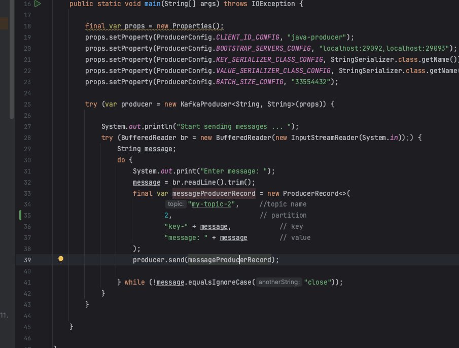

[[TOC]]

# Overview bài viết về Kafka Brokers là gì ?

- Bài này sẽ giải thích cách kafka Broker hoạt động và lưu trữ trong Kafka event streaming platform
- Mô tả cách Kafka Brokers xử lý các yêu cầu từ client cho việc ghi và đọc records.
- Hiểu về Topic và Partitions
- Sử dụng JMX metrics để kiểm tra Brokers 

## Kafka Brokers là gì ?
- Kafka Brokers hay có thể gọi là Kafka server trong Kafka architecture và nó sẽ đóng vai trò lưu trữ dữ liệu(Storage layer) và nó có thể chạy thành một cluster và nó có thể mở rộng ra nhiều data centers.

- Kafka Brokers chịu trách nghiệm quản lý dữ liệu( Bao gồm lưu trữ, đọc và replication(Tạo bản sao để sao lưu) ), quản lý topic và partition và quản lý offset.
- Tất nhiên, Kafka Brokers cũng nhận và xử lý trực tiếp các request từ client.
  

## Vai trò của Kafka Brokers với Produce khi Produce gửi record đến Brokers
- Khi Produce muốn gửi Record đến Broker, Client Produce gửi records đến Broker đeer lưu trữ và consumer client có thể đọc các record đó sau.
  
Hình ảnh phía trên mô tả Produce gửi record đến Brokers, trong thực tế, nhiều Client Produce sẽ giao tiếp với 1 số các Brokers trong cụm.

## Vai trò của Kafka Brokers với Consumer khi Consumer nhận record từ Brokers
Sau khi nói về yêu cầu của Produce chúng ta sẽ nói đến Consumer.
- Consumer client đưa ra yêu cầu đến Broker để đọc(Sử dụng) các Record từ một topic được các Produce gửi trước đó đên Broker.
  
- Một điều quan trọng là sử dụng Record sẽ không làm ảnh hưởng đến việc lưu dữ liệu(Không bị mất sau khi đọc) hoặc việc sử dụng Record bởi các Consumer khác(Các consumer khác vẫn có thể đọc)

## Topics và partitions
### Topics
- Kafka brokers sử dụng File system để lưu trữ bằng cách nối thêm các Record đến cuối cùng file trong một topic.
- Một topic đại diện cho tên của Folder chưa tệp Kafka nối thêm các Record
  
- Kafka Brokers sẽ nhận key-value message dưới dạng raw byte, lưu trữ và phục vụ các yêu cầu đọc với cùng định dạng(Raw data).
  - Kafka Brokers không biết về data type của Record(Chỉ nhận được các byte), bằng cách làm việc với raw byte, Brokers không mất thời gian deserializing hoặc serializing dữ liệu nên mạng lại hiệu suất cao hơn.
### partitions
- Các topic sẽ đươc partition, một Partition là một số nguyên(number) bắt đầu từ 0. Vì vậy nếu một topic có 3 partition thì sẽ có số partition là 0, 1, 2.
- Kafka brokers gắn số partition và đuôi của folder topic với format `{Topic name}-{partition number}`.
  - Ví dụ một Topic tên `my-topic-2` có `5` partition thì tên sẽ như sau : `my-topic-2-0`, `my-topic-2-1`, `my-topic-2-2`, `my-topic-2-3`, , `my-topic-2-4`,
    
```
│   ....
│   recovery-point-offset-checkpoint
│   replication-offset-checkpoint
│
├───my-topic-2-0
│       00000000000000000000.index
│       00000000000000000000.log
│       00000000000000000000.timeindex
│       leader-epoch-checkpoint
│       partition.metadata
│
├───my-topic-2-1
│       00000000000000000000.index
│       00000000000000000000.log
│       00000000000000000000.timeindex
│       leader-epoch-checkpoint
│       partition.metadata
│
├───my-topic-2-2
│       00000000000000000000.index
│       00000000000000000000.log
│       00000000000000000000.timeindex
│       leader-epoch-checkpoint
│       partition.metadata
│
├───my-topic-2-3
│       00000000000000000000.index
│       00000000000000000000.log
│       00000000000000000000.timeindex
│       leader-epoch-checkpoint
│       partition.metadata
│
├───my-topic-2-4
│      00000000000000000000.index
│      00000000000000000000.log
│      00000000000000000000.timeindex
│      leader-epoch-checkpoint
│      partition.metadata
```
- Nhìn vào folder chúng ta có thể dễ hiểu được với tên topic là một nhóm dữ liệu và partititon là các đơn vị lưu trữ.
- Trong hầu hết các case, số lượng của Partition càng cao thì throughput(Thông lượng) sẽ càng cao.
#### Cách Kafka Broker map record đến partition.
- Producer client sẽ xác định Topic và partition cho record trước khi gửi nó đến Broker.

- Thực tế xác định partition chúng ta có thể chia ra làm 2 cách như sau:
##### Cách 1: Xác định partition tại thời điểm tạo object ProducerRecord
Khi xây dựng ProducerRecord object, bạn set partition cho ProducerRecord thì producer sẽ sử dụng partition đó và gửi lên Broker.
::: details Xác định partition tại thời điểm tạo object ProducerRecord



:::


- Đối với java, thư viện sẽ sử dụng class `org.apache.kafka.clients.producer.internals.DefaultPartitioner` để xác định partition trước khi gửi đến.
```
public class DefaultPartitioner implements Partitioner {
    private final StickyPartitionCache stickyPartitionCache = new StickyPartitionCache();

    public DefaultPartitioner() {
    }

    public void configure(Map<String, ?> configs) {
    }

    public int partition(String topic, Object key, byte[] keyBytes, Object value, byte[] valueBytes, Cluster cluster) {
        return this.partition(topic, key, keyBytes, value, valueBytes, cluster, cluster.partitionsForTopic(topic).size());
    }

    public int partition(String topic, Object key, byte[] keyBytes, Object value, byte[] valueBytes, Cluster cluster, int numPartitions) {
        return keyBytes == null ? this.stickyPartitionCache.partition(topic, cluster) : Utils.toPositive(Utils.murmur2(keyBytes)) % numPartitions;
    }

    public void close() {
    }

    public void onNewBatch(String topic, Cluster cluster, int prevPartition) {
        this.stickyPartitionCache.nextPartition(topic, cluster, prevPartition);
    }
}
```
Trong đoạn mã trên:
1. partition Method:
   - Method `partition` là nơi logic xác định `partition` được thực hiện.
   - `Cluster` chứa thông tin về `cluster` cũng như các thông tin về `partition` của `topic`.
   - `keyBytes` là mảng byte của khóa (nếu có).
   - `valueBytes` là mảng byte của giá trị(data).
2. Key-based Partitioning
   - Nếu `keyBytes !== null` thì key-bash partition sẽ được thực hiện.
   - method `partition` sẽ sử dụng hàm băm `murmur2` để tính toán giá trị băm của key.
     - Method `toPositive` sẽ giúp dữ liệu trả về luôn là số dương
   - Giá trị hash sẽ được chia cho số lượng `partition(numPartitions)` để xác định `partition` sẽ được lưu trữ.
     ::: details Cùng 1 key sẽ được lưu vào cùng một partition
      Vì sử dụng key tính ra mã băm sau đó chia cho số lượng partition, vì vậy các `record` có cùng 1 key sẽ được lưu trên cùng một partition.

      Điều này đảm bảo rằng các bản ghi có cũng key sẽ được lưu trữ trong  cùng một partition, giúp duy trì order của các Record có cùng key.
     :::
3. sticky Partition Cache
 - Thực tế, với kafka phiên bản trước `2.4` thì với trường hợp `key == null` thì partition sẽ sử dụng `Round-robin` bằng cách có 1 biến `count` theo `topic` và chia cho số lượng partition để được `Round-robin`
 
```
package org.apache.kafka.clients.producer.internals;

import ...

public class StickyPartitionCache {
    private final ConcurrentMap<String, Integer> indexCache = new ConcurrentHashMap();

    public StickyPartitionCache() {
    }

    public int partition(String topic, Cluster cluster) {
        Integer part = (Integer)this.indexCache.get(topic);
        return part == null ? this.nextPartition(topic, cluster, -1) : part;
    }

    public int nextPartition(String topic, Cluster cluster, int prevPartition) {
        List<PartitionInfo> partitions = cluster.partitionsForTopic(topic);
        Integer oldPart = (Integer)this.indexCache.get(topic);
        Integer newPart = oldPart;
        if (oldPart != null && oldPart != prevPartition) {
            return (Integer)this.indexCache.get(topic);
        } else {
            List<PartitionInfo> availablePartitions = cluster.availablePartitionsForTopic(topic);
            if (availablePartitions.size() < 1) {
                Integer random = Utils.toPositive(ThreadLocalRandom.current().nextInt());
                newPart = random % partitions.size();
            } else if (availablePartitions.size() == 1) {
                newPart = ((PartitionInfo)availablePartitions.get(0)).partition();
            } else {
                while(newPart == null || newPart.equals(oldPart)) {
                    int random = Utils.toPositive(ThreadLocalRandom.current().nextInt());
                    newPart = ((PartitionInfo)availablePartitions.get(random % availablePartitions.size())).partition();
                }
            }

            if (oldPart == null) {
                this.indexCache.putIfAbsent(topic, newPart);
            } else {
                this.indexCache.replace(topic, prevPartition, newPart);
            }

            return (Integer)this.indexCache.get(topic);
        }
    }
}

```
  - Nếu `keyBytes == null` thì sticky Partition Cache sẽ được thực hiện.
  - `sticky Partition Cache` đơn giản như sau, Nếu có `oldPart` hiện trả về `oldPart` ====> `return part == null ? this.nextPartition(topic, cluster, -1) : part;`
  - Sẽ có 2 trường hợp để lấy về partition mới(Gọi method `nextPartition`)
    - 1. Nếu `oldPart == null` tức chưa xác định partition thì sẽ lấy và partition mới ==> trong method `partition` ở StickyPartitionCache
    - 2. Khi đã đến ngưỡng của `BATCH_SIZE_CONFIG` trong flow thực hiện tạo lại batch thì sẽ xác định lại partition  ==> trong method `onNewBatch` ở `DefaultPartitioner`
  - Chốt lại đơn giản là với sticky Partition Cache thì partition sẽ được tính theo `BATCH`, tất cả các `Record` có `key == null` thì tất cả các Record trong cùng `BATCH của cùng 1 topic` đó sẽ trên cùng một `partition`
## Một số lưu ý về Kafka Brokers
- Nếu tạo một Cluster kafka thì độ trễ của network nên ở mức dưới 15ms, vì việc liên lạc giữa các Kafka brokers là rất nhiều (Cả zookeeper nếu sử dụng zookeeper )


# REF:
- https://ibm-cloud-architecture.github.io/refarch-eda/technology/kafka-overview/
- **Kafka book**: [Kafka Event Streaming Platform In Action.pdf](/study/thanhlv-study-2024/static/Kafka%20Event%20Streaming%20Platform%20In%20Action.pdf)
