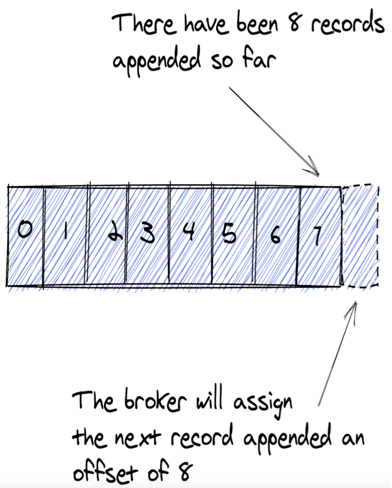
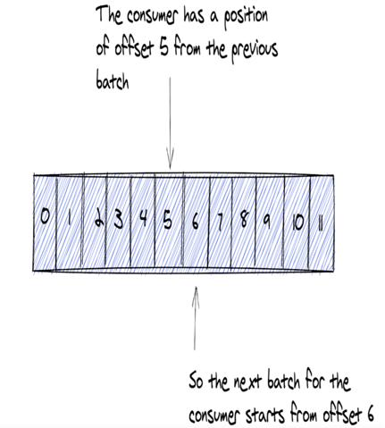
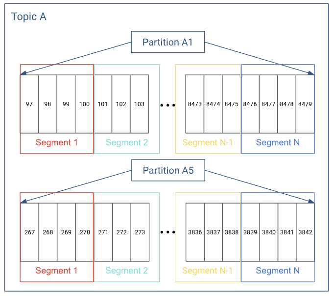
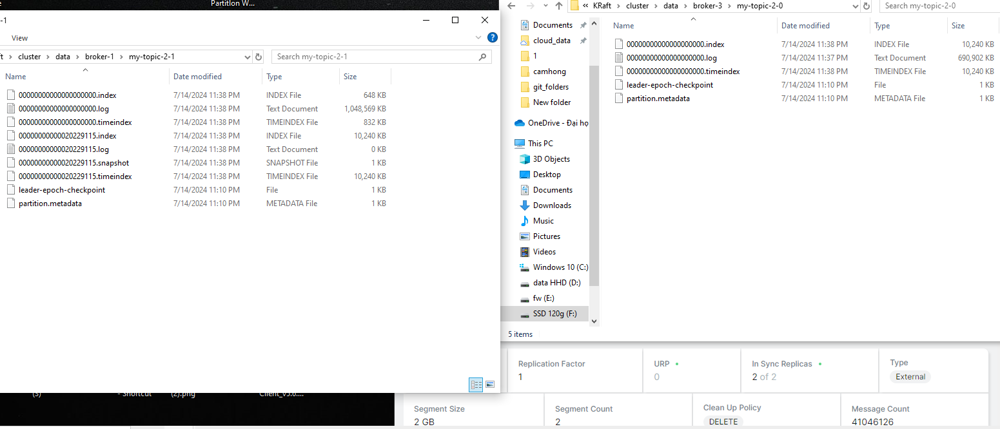

[[TOC]]

# Overview bài viết về Kafka Brokers là gì ?

- Bài này sẽ giải thích cách kafka Broker hoạt động và lưu trữ trong Kafka event streaming platform
- Mô tả cách Kafka Brokers xử lý các yêu cầu từ client cho việc ghi và đọc records.
- Hiểu về Topic và Partitions
- Sử dụng JMX metrics để kiểm tra Brokers 

## Kafka Brokers là gì ?
- Kafka Brokers hay có thể gọi là Kafka server trong Kafka architecture và nó sẽ đóng vai trò lưu trữ dữ liệu(Storage layer) và nó có thể chạy thành một cluster và nó có thể mở rộng ra nhiều data centers.

- Kafka Brokers chịu trách nghiệm quản lý dữ liệu( Bao gồm lưu trữ, đọc và replication(Tạo bản sao để sao lưu) ), quản lý topic và partition và quản lý offset.
- Tất nhiên, Kafka Brokers cũng nhận và xử lý trực tiếp các request từ client.
  

## Vai trò của Kafka Brokers với Produce khi Produce gửi record đến Brokers
- Khi Produce muốn gửi Record đến Broker, Client Produce gửi records đến Broker đeer lưu trữ và consumer client có thể đọc các record đó sau.
  
Hình ảnh phía trên mô tả Produce gửi record đến Brokers, trong thực tế, nhiều Client Produce sẽ giao tiếp với 1 số các Brokers trong cụm.

## Vai trò của Kafka Brokers với Consumer khi Consumer nhận record từ Brokers
Sau khi nói về yêu cầu của Produce chúng ta sẽ nói đến Consumer.
- Consumer client đưa ra yêu cầu đến Broker để đọc(Sử dụng) các Record từ một topic được các Produce gửi trước đó đên Broker.
  
- Một điều quan trọng là sử dụng Record sẽ không làm ảnh hưởng đến việc lưu dữ liệu(Không bị mất sau khi đọc) hoặc việc sử dụng Record bởi các Consumer khác(Các consumer khác vẫn có thể đọc)

## Topics và partitions
### Topics
- Kafka brokers sử dụng File system để lưu trữ bằng cách nối thêm các Record đến cuối cùng file trong một topic.
- Một topic đại diện cho tên của Folder chưa tệp Kafka nối thêm các Record
  
- Kafka Brokers sẽ nhận key-value message dưới dạng raw byte, lưu trữ và phục vụ các yêu cầu đọc với cùng định dạng(Raw data).
  - Kafka Brokers không biết về data type của Record(Chỉ nhận được các byte), bằng cách làm việc với raw byte, Brokers không mất thời gian deserializing hoặc serializing dữ liệu nên mạng lại hiệu suất cao hơn.
### partitions
- Các topic sẽ đươc partition, một Partition là một số nguyên(number) bắt đầu từ 0. Vì vậy nếu một topic có 3 partition thì sẽ có số partition là 0, 1, 2.
- Kafka brokers gắn số partition và đuôi của folder topic với format `{Topic name}-{partition number}`.
  - Ví dụ một Topic tên `my-topic-2` có `5` partition thì tên sẽ như sau : `my-topic-2-0`, `my-topic-2-1`, `my-topic-2-2`, `my-topic-2-3`, , `my-topic-2-4`,
    
```
│   ....
│   recovery-point-offset-checkpoint
│   replication-offset-checkpoint
│
├───my-topic-2-0
│       00000000000000000000.index
│       00000000000000000000.log
│       00000000000000000000.timeindex
│       leader-epoch-checkpoint
│       partition.metadata
│
├───my-topic-2-1
│       00000000000000000000.index
│       00000000000000000000.log
│       00000000000000000000.timeindex
│       leader-epoch-checkpoint
│       partition.metadata
│
├───my-topic-2-2
│       00000000000000000000.index
│       00000000000000000000.log
│       00000000000000000000.timeindex
│       leader-epoch-checkpoint
│       partition.metadata
│
├───my-topic-2-3
│       00000000000000000000.index
│       00000000000000000000.log
│       00000000000000000000.timeindex
│       leader-epoch-checkpoint
│       partition.metadata
│
├───my-topic-2-4
│      00000000000000000000.index
│      00000000000000000000.log
│      00000000000000000000.timeindex
│      leader-epoch-checkpoint
│      partition.metadata
```
- Nhìn vào folder chúng ta có thể dễ hiểu được với tên topic là một nhóm dữ liệu và partititon là các đơn vị lưu trữ.
- Trong hầu hết các case, số lượng của Partition càng cao thì throughput(Thông lượng) sẽ càng cao.
#### Cách Kafka Broker map record đến partition.
Thực tế việc xác định partition sẽ được lầm ở bên Client.
- Đã có 1 blog viết chi tiết ở đây : [Click vào đây để xem](../../blog/2024-08-07-Kafka-producer-da-khong-con-Round-Robin-Partition-voi-key-null)

### Offsets
- Khi broker thêm một Record nó sẽ thêm một `id` được gọi là `offset`. Một `offset` sẽ bắt đầu từ `0` và là number, nó sẽ tặng lên 1 mỗi khi thêm một Record.
  
- Vì các Record mới luôn được thêm ở cuối của file, nên nó được sắp xếp theo offset.
- Kafka đảm bảo Record order được sẵp xếp theo thứ tự trên cùng một partition chứ không phải trên các partition khác.
::: details Ví dụ
Có một topic với  partition và có 10 Record.
- Partition 1: R1 (Offset 0) , R3(Offset 2) , R6(Offset 5), R7(Offset 6)
- Partition 2:, R2(Offset 1), R4(Offset 3), R5(Offset 4), R8(Offset 7), R9(Offset 8), R10(Offset 9)

Partition 1 và 2 sẽ có thứ tự offset tăng dần.
:::
 
Consumer sử dụng `offset` để xác định vị trí của Record họ đã sử dụng, bằng cách này Consumer sẽ tìm các Record có `offset` cao hơn đã được Consumer đọc.


### Xác định số lượng partition sử dụng
- Việc chọn số lượng partition khi tạo một topic là một điều khó khắn, nó là cả một nghệ thuật.
- Một trong nhưng cân nhắc quan trọng là đầu tiên là **lượng dữ liệu chạy chảy vào topic đó**. Nhiều data thì chúng ta có thể có nhiều partition hơn để throughput(Thông lượng) cao hơn, tuy nhiên nhiều partition chúng ta cũng sẽ có những đánh đổi nhất định.
  - Tăng số lượng partition sẽ tăng số lượng TCP connect và open file. Và thời gian để Consumer xử lý một Record cũng là một điều ảnh hưởng đến throughput. Nếu thời gian xử lý cần rất nhiều thì việc thêm partition có thể hữu ích nhưng việc xử lý chậm vẫn làm hiệu xuất không được tốt.
- Bắt đầu tốt nhất chúng ta nên sử dụng càng ít partition càng tốt. Bởi vì chúng ta có thể tăng số lượng partition nhưng không thể giảm partition.
- Nếu khi tạo topic chúng ta có thể xác định số lượng Consumer thì chúng ta nên cài đặt partition bằng với số lượng của consumer. Điều này là best cho phiên bản kafk < 2.4 bởi vì các phiên bản cũ sẽ `Round-robin` các partition nhưng ở phiên bản >= 2.4 thì đã random partiton cho mỗi batch của topic.
- Nếu topic này có thẻ
Chúng ta sẽ có 1 chủ đề chi tiết hơn về điều này.

### Tạo một topic
- Để tạo một topic mới chúng ta có thể sử dụng cmd `kafka-topics` với param `--create`.
```
kafka-topics --create --if-not-exists --topic first-topic\ #1
--bootstrap-server localhost:9092\ #2 
--replication-factor 1\ #3  
--partitions 1 #4
```
- `#1` 
  - Với `kafka-topics` là câu lệnh để khởi chạy một `cmd`
  - `--create` là param để mong muốn tạo mới một topic với và `--if-not-exists` là param tạo nếu topic chưa tồn tại, còn đã tồn tại sẽ bỏ qua. (Nếu không có cờ này, nếu đã tồn tại sẽ trả về lỗi ngoại lệ `Error while executing topic command : Topic 'first-topic' already exists.` )
  - `--topic` là param để xác định tên topic
  - `first-topic` là tên topic
- `#2` với `--bootstrap-serve` là danh sách server kafka để `cmd` thực hiện kết nối để gửi request tạo topic
- `#3` với `--replication-factor` là số lượng replication để mỗi partition sễ được nhận rộng lên bao nhiêu.
  - Là trị là số và phải ở giữa `1 và 32767`
  - Số lượng phải nhỏ hơn hoặc bằng với số lượng Broker
  - Nếu không có parma này, default sẽ được lấy ở config trong Broker `default.replication.factor`
- `#4` với `--partitions 1` là số lượng partition cho topic này. Với số lượng cần lớn hơn `0`
  - Nếu không có parm này thì default sẽ được lấy trong `num.partitions`

### Segments
- Như chúng ta đã biết Broker sẽ thêm các Record vào các partition. Tuy nhiên Broker sẽ không thêm vào một tập partition duy nhất, nếu làm vậy tệp partition này sẽ khổng lồ.
- Broker sẽ chia thành các tệp nhỏ thành các phần riêng biệt và được gọi là segments.


- Việc sử dụng Segments sẽ giúp thực hiện push Record mới và thực hiện truy suất bản ghi bằng offset trở lên dễ dàng hơn.
- Mặc định kafka Broker sẽ để mỗi segment là một [1G](https://docs.confluent.io/platform/current/installation/configuration/topic-configs.html#segment-bytes) hoặc chúng ta có thể chỉ định ở `segment.bytes`. Khi đến ngưỡng segment sẽ được close và một segment mới được tạo.
  - Kích thước segment nhỏ hơn có nghĩa là các tệp phải được đóng và phân bổ thường xuyên hơn, điều này làm giảm hiệu quả chung của việc ghi đĩa.
- Khi một segment bị close nó có thể được coi là expire(Hết hạn, bởi vì dữ liệu đã tồn tại quá lâu), việc điều chỉnh kích thước của các segment cũng rất quan trọng.
- Chúng ta cũng có 1 config nữa đó là `segment.ms`, đây là thời gian nếu `segment` chưa đến ngưỡng giới hạn dung lượng thì kafka cũng sẽ close segment và tạo ra một segment mới. Default là 1 tuần.
- Lưu ý : `segment.ms` và `segment.bytes` là config của từng topic
- [Danh sách biến topic config](https://kafka.apache.org/30/generated/topic_config.html)
## Một số lưu ý về Kafka Brokers
- Nếu tạo một Cluster kafka thì độ trễ của network nên ở mức dưới 15ms, vì việc liên lạc giữa các Kafka brokers là rất nhiều (Cả zookeeper nếu sử dụng zookeeper )


# REF:
- https://ibm-cloud-architecture.github.io/refarch-eda/technology/kafka-overview/
- **Kafka book**: [Kafka Event Streaming Platform In Action.pdf](/study/thanhlv-study-2024/static/Kafka%20Event%20Streaming%20Platform%20In%20Action.pdf)
