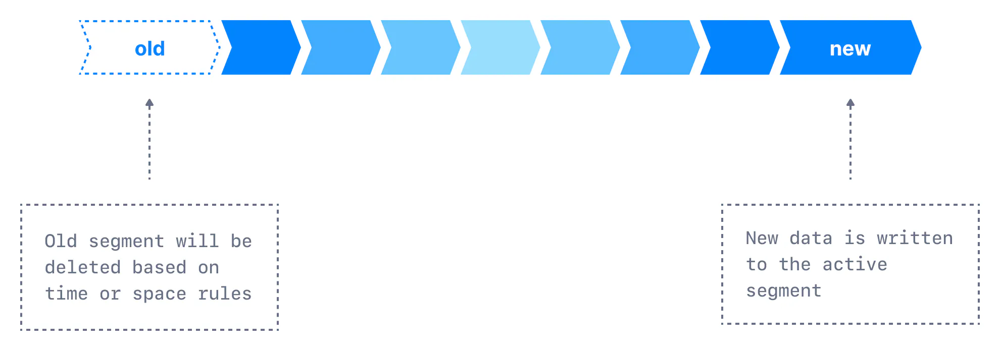
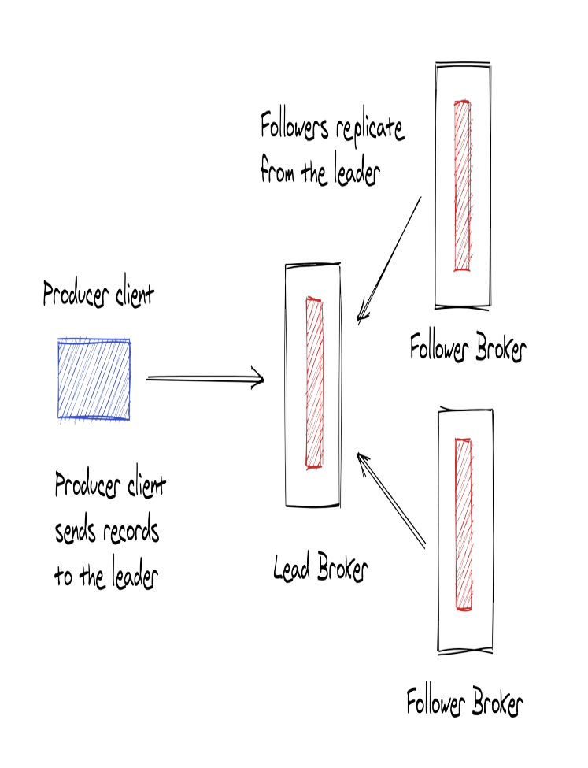
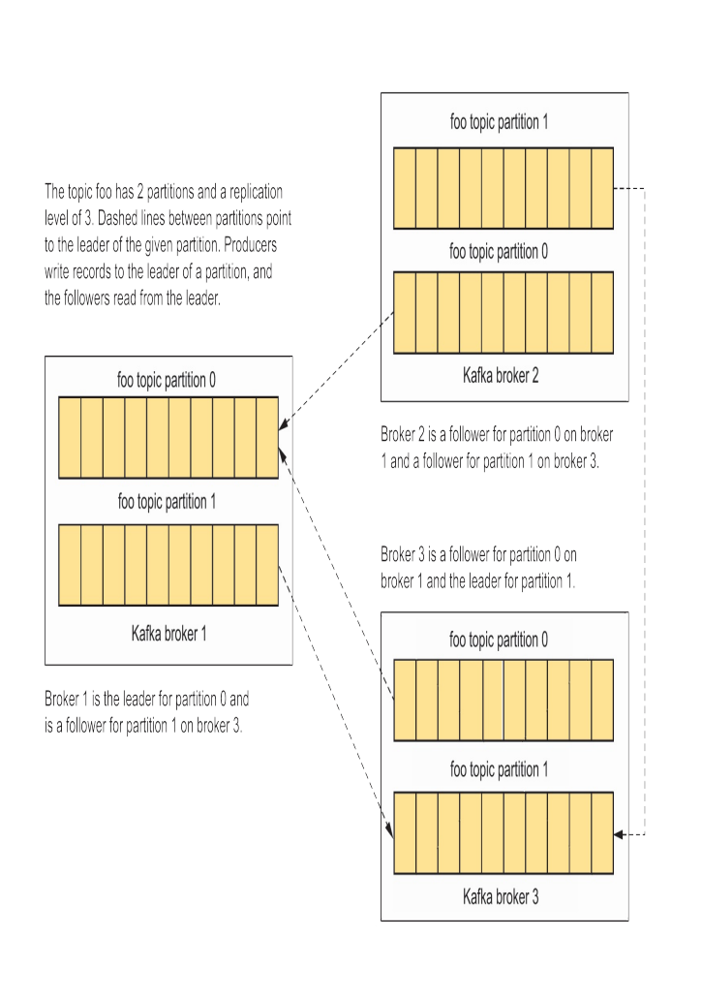
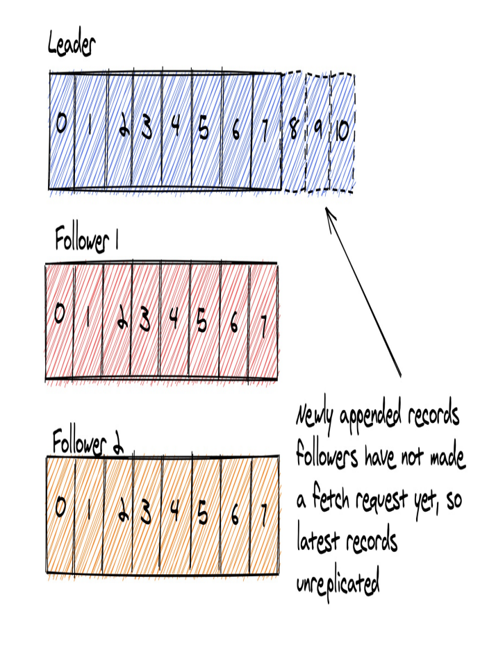

[[TOC]]

# Overview bài viết về Kafka Brokers là gì ?

- Bài này sẽ giải thích cách kafka Broker hoạt động và lưu trữ trong Kafka event streaming platform
- Mô tả cách Kafka Brokers xử lý các yêu cầu từ client cho việc ghi và đọc records.
- Hiểu về Topic và Partitions
- Sử dụng JMX metrics để kiểm tra Brokers 

## Kafka Brokers là gì ?
- Kafka Brokers hay có thể gọi là Kafka server trong Kafka architecture và nó sẽ đóng vai trò lưu trữ dữ liệu(Storage layer) và nó có thể chạy thành một cluster và nó có thể mở rộng ra nhiều data centers.

- Kafka Brokers chịu trách nghiệm quản lý dữ liệu( Bao gồm lưu trữ, đọc và replication(Tạo bản sao để sao lưu) ), quản lý topic và partition và quản lý offset.
- Tất nhiên, Kafka Brokers cũng nhận và xử lý trực tiếp các request từ client.
  

## Vai trò của Kafka Brokers với Produce khi Produce gửi record đến Brokers
- Khi Produce muốn gửi Record đến Broker, Client Produce gửi records đến Broker đeer lưu trữ và consumer client có thể đọc các record đó sau.
  
Hình ảnh phía trên mô tả Produce gửi record đến Brokers, trong thực tế, nhiều Client Produce sẽ giao tiếp với 1 số các Brokers trong cụm.

## Vai trò của Kafka Brokers với Consumer khi Consumer nhận record từ Brokers
Sau khi nói về yêu cầu của Produce chúng ta sẽ nói đến Consumer.
- Consumer client đưa ra yêu cầu đến Broker để đọc(Sử dụng) các Record từ một topic được các Produce gửi trước đó đên Broker.
  
- Một điều quan trọng là sử dụng Record sẽ không làm ảnh hưởng đến việc lưu dữ liệu(Không bị mất sau khi đọc) hoặc việc sử dụng Record bởi các Consumer khác(Các consumer khác vẫn có thể đọc)

## Topics và partitions
### Topics
- Kafka brokers sử dụng File system để lưu trữ bằng cách nối thêm các Record đến cuối cùng file trong một topic.
- Một topic đại diện cho tên của Folder chưa tệp Kafka nối thêm các Record
  
- Kafka Brokers sẽ nhận key-value message dưới dạng raw byte, lưu trữ và phục vụ các yêu cầu đọc với cùng định dạng(Raw data).
  - Kafka Brokers không biết về data type của Record(Chỉ nhận được các byte), bằng cách làm việc với raw byte, Brokers không mất thời gian deserializing hoặc serializing dữ liệu nên mạng lại hiệu suất cao hơn.
### partitions
- Các topic sẽ đươc partition, một Partition là một số nguyên(number) bắt đầu từ 0. Vì vậy nếu một topic có 3 partition thì sẽ có số partition là 0, 1, 2.
- Kafka brokers gắn số partition và đuôi của folder topic với format `{Topic name}-{partition number}`.
  - Ví dụ một Topic tên `my-topic-2` có `5` partition thì tên sẽ như sau : `my-topic-2-0`, `my-topic-2-1`, `my-topic-2-2`, `my-topic-2-3`, , `my-topic-2-4`,
    
```
│   ....
│   recovery-point-offset-checkpoint
│   replication-offset-checkpoint
│
├───my-topic-2-0
│       00000000000000000000.index
│       00000000000000000000.log
│       00000000000000000000.timeindex
│       leader-epoch-checkpoint
│       partition.metadata
│
├───my-topic-2-1
│       00000000000000000000.index
│       00000000000000000000.log
│       00000000000000000000.timeindex
│       leader-epoch-checkpoint
│       partition.metadata
│
├───my-topic-2-2
│       00000000000000000000.index
│       00000000000000000000.log
│       00000000000000000000.timeindex
│       leader-epoch-checkpoint
│       partition.metadata
│
├───my-topic-2-3
│       00000000000000000000.index
│       00000000000000000000.log
│       00000000000000000000.timeindex
│       leader-epoch-checkpoint
│       partition.metadata
│
├───my-topic-2-4
│      00000000000000000000.index
│      00000000000000000000.log
│      00000000000000000000.timeindex
│      leader-epoch-checkpoint
│      partition.metadata
```
- Nhìn vào folder chúng ta có thể dễ hiểu được với tên topic là một nhóm dữ liệu và partititon là các đơn vị lưu trữ.
- Trong hầu hết các case, số lượng của Partition càng cao thì throughput(Thông lượng) sẽ càng cao.
#### Cách Kafka Broker map record đến partition.
Thực tế việc xác định partition sẽ được lầm ở bên Client.
- Đã có 1 blog viết chi tiết ở đây : [Click vào đây để xem](../../blog/2024-08-07-Kafka-producer-da-khong-con-Round-Robin-Partition-voi-key-null)

### Offsets
- Khi broker thêm một Record nó sẽ thêm một `id` được gọi là `offset`. Một `offset` sẽ bắt đầu từ `0` và là number, nó sẽ tặng lên 1 mỗi khi thêm một Record.
  
- Vì các Record mới luôn được thêm ở cuối của file, nên nó được sắp xếp theo offset.
- Kafka đảm bảo Record order được sẵp xếp theo thứ tự trên cùng một partition chứ không phải trên các partition khác.
::: details Ví dụ
Có một topic với  partition và có 10 Record.
- Partition 1: R1 (Offset 0) , R3(Offset 2) , R6(Offset 5), R7(Offset 6)
- Partition 2:, R2(Offset 1), R4(Offset 3), R5(Offset 4), R8(Offset 7), R9(Offset 8), R10(Offset 9)

Partition 1 và 2 sẽ có thứ tự offset tăng dần.
:::

Consumer sử dụng `offset` để xác định vị trí của Record họ đã sử dụng, bằng cách này Consumer sẽ tìm các Record có `offset` cao hơn đã được Consumer đọc.


### Xác định số lượng partition sử dụng
- Việc chọn số lượng partition khi tạo một topic là một điều khó khắn, nó là cả một nghệ thuật.
- Một trong nhưng cân nhắc quan trọng là đầu tiên là **lượng dữ liệu chạy chảy vào topic đó**. Nhiều data thì chúng ta có thể có nhiều partition hơn để throughput(Thông lượng) cao hơn, tuy nhiên nhiều partition chúng ta cũng sẽ có những đánh đổi nhất định.
  - Tăng số lượng partition sẽ tăng số lượng TCP connect và open file. Và thời gian để Consumer xử lý một Record cũng là một điều ảnh hưởng đến throughput. Nếu thời gian xử lý cần rất nhiều thì việc thêm partition có thể hữu ích nhưng việc xử lý chậm vẫn làm hiệu xuất không được tốt.
- Bắt đầu tốt nhất chúng ta nên sử dụng càng ít partition càng tốt. Bởi vì chúng ta có thể tăng số lượng partition nhưng không thể giảm partition.
- Nếu khi tạo topic chúng ta có thể xác định số lượng Consumer thì chúng ta nên cài đặt partition bằng với số lượng của consumer. Điều này là best cho phiên bản kafk < 2.4 bởi vì các phiên bản cũ sẽ `Round-robin` các partition nhưng ở phiên bản >= 2.4 thì đã random partiton cho mỗi batch của topic.
- Nếu topic này có thẻ
Chúng ta sẽ có 1 chủ đề chi tiết hơn về điều này.

### Tạo một topic
- Để tạo một topic mới chúng ta có thể sử dụng cmd `kafka-topics` với param `--create`.
```
kafka-topics --create --if-not-exists --topic first-topic\ #1
--bootstrap-server localhost:9092\ #2 
--replication-factor 1\ #3  
--partitions 1 #4
```
- `#1` 
  - Với `kafka-topics` là câu lệnh để khởi chạy một `cmd`
  - `--create` là param để mong muốn tạo mới một topic với và `--if-not-exists` là param tạo nếu topic chưa tồn tại, còn đã tồn tại sẽ bỏ qua. (Nếu không có cờ này, nếu đã tồn tại sẽ trả về lỗi ngoại lệ `Error while executing topic command : Topic 'first-topic' already exists.` )
  - `--topic` là param để xác định tên topic
  - `first-topic` là tên topic
- `#2` với `--bootstrap-server` là danh sách server kafka để `cmd` thực hiện kết nối để gửi request tạo topic
- `#3` với `--replication-factor` là số lượng replication để mỗi partition sễ được nhận rộng lên bao nhiêu.
  - Là trị là số và phải ở giữa `1 và 32767`
  - Số lượng phải nhỏ hơn hoặc bằng với số lượng Broker
  - Nếu không có parma này, default sẽ được lấy ở config trong Broker `default.replication.factor`
- `#4` với `--partitions 1` là số lượng partition cho topic này. Với số lượng cần lớn hơn `0`
  - Nếu không có parm này thì default sẽ được lấy trong `num.partitions`
### Segments
- Như chúng ta đã biết Broker sẽ thêm các Record vào các partition. Tuy nhiên Broker sẽ không thêm vào một tập partition duy nhất, nếu làm vậy tệp partition này sẽ khổng lồ.
- Broker sẽ chia thành các tệp nhỏ thành các phần riêng biệt và được gọi là segments.
  
  
- Việc sử dụng Segments sẽ giúp thực hiện push Record mới và thực hiện truy suất Record bằng offset trở lên dễ dàng hơn.
- Mặc định kafka Broker sẽ để mỗi segment là một [1G](https://docs.confluent.io/platform/current/installation/configuration/topic-configs.html#segment-bytes) hoặc chúng ta có thể chỉ định ở `segment.bytes`. Khi đến ngưỡng segment sẽ được close và một segment mới được tạo.
  - Kích thước segment nhỏ hơn có nghĩa là các tệp phải được đóng và phân bổ thường xuyên hơn, điều này làm giảm hiệu quả chung của việc ghi đĩa.
- Khi một segment bị close nó có thể được coi là expire(Hết hạn, bởi vì dữ liệu đã tồn tại quá lâu), việc điều chỉnh kích thước của các segment cũng rất quan trọng.
- Chúng ta cũng có 1 config nữa đó là `segment.ms`, đây là thời gian nếu `segment` chưa đến ngưỡng giới hạn dung lượng thì kafka cũng sẽ close segment và tạo ra một segment mới. Default là 1 tuần.
- Lưu ý : `segment.ms` và `segment.bytes` là config của từng topic
- [Danh sách biến topic config](https://kafka.apache.org/30/generated/topic_config.html)
#### Ví dụ về segments của một partition index.
```
- kafka-topics --bootstrap-server kafka1:19091 --create --if-not-exists --topic topicName --replication-factor 1 --partitions 4  --config segment.bytes=1048576 # 1MB

topic-rep-1-partition-10-7
├── 00000000000000000000.index
├── 00000000000000000000.log
├── 00000000000000000000.timeindex
├── 00000000000000023576.index
├── 00000000000000023576.log
├── 00000000000000023576.snapshot
├── 00000000000000023576.timeindex
├── 00000000000000046988.index
├── 00000000000000046988.log
├── 00000000000000046988.snapshot
├── 00000000000000046988.timeindex
├── leader-epoch-checkpoint
└── partition.metadata
```
###### Các file Segment
- Nhìn vào ví dụ trên chúng ta có thể thấy đây là Segment cho partition index `7` của topic `topic-rep-1-partition-10`.
- Hiện có 3 Segment, `Segment 1` bắt đầu từ `0`, `Segment 2` bắt đầu từ `23576` và `Segment 3` bắt đầu từ `46988`.
###### File leader-epoch-checkpoint
- File `leader-epoch-checkpoint` sẽ lưu lại lịch sử chuyển đổi leader của một partition.
- Ví dụ:
```
1 0
2 150
3 300
```
Có 2 giá trị mỗi Line.
  - Giá trị đầu tiên là "leader epoch" tương ứng với một khoảng thời gian mà một broker giữ vai trò leader của phân vùng.
  - Giá trị thứ 2 là `start-offset` cho biết offset bắt đầu cho leader mới quản lý dữ liệu trong partition
###### File partition.metadata
- File `partition.metadata` sẽ lưu lại một số thông tin của partition
- Ví dụ:
```
version: 0
topic_id: X6KL_lg2R4a7JkuZYScQxg
```
##### Segments position index
- Kafka cho phép chúng ta tìm kiếm theo 2 cách: `offset` và `timestamp` tương ứng dụng file `.index` và `.timeindex`
  - File `.index` phục vụ cho tìm kiếm nhanh chóng Record bằng `offset` trong file `.log` của Segment.
  - File `.timeindex` phục vụ cho tìm kiếm nhanh chóng Record bằng `timestamp` trong file `.log` của Segment.

### Cấu hình `cleanup.policy`
- Khi có Record mới, Producer vẫn tiếp tục được gửi đến Broker, Broker sẽ cần xóa các Record cũ hơn để giải phóng dung lượng trên hệ thống.
- `cleanup.policy` là cấu hình cách thức Kafka quản lý và dọn dẹp các Record cũ của topic sau khi đã được ghi vào. 
- Cấu hình này ảnh hưởng trực tiếp đến cách Kafka xử lý việc lưu trữ và duy trì các Record trong các partition.
#### Các giá trị của `cleanup.policy`
- `cleanup.policy=delete`: Đây là giá trị mặc định nếu không cấu hình.
  - Cấu hình này được thiết lập, Kafka sẽ xóa các Record khỏi log sau khi chúng vượt qua giới hạn thời gian lưu trữ hoặc dung lượng lưu trữ được quy định bởi các cấu hình như `retention.ms (thời gian lưu trữ)` hoặc `retention.bytes (kích thước lưu trữ)`.
  - `cleanup.policy=delete` phù hợp với các topic cần giữ dữ liệu tạm thời hoặc chỉ trong một khoảng thời gian nhất định.
    ::: details ví dụ thực tế
    Record ghi lại hành động của người dùng. Hành động của người dùng là data quá khứ và nó có thể lưu ở các hệ thống Big data chứ không cần lưu mãi mãi trên Kafka.
    :::
- `cleanup.policy=compact`
  - Cấu hình này Kafka sẽ xóa các dữ liệu cũ bằng cách nén(`compact`) các Record, chỉ các Record có giá trị mới nhất cho mỗi key. Những Record cũ hơn có cùng Key sẽ bị loại bỏ.
  - Hiểu đơn giản chỉ giữ lại các Record cuối cùng của các Key.
  - `compact` rất hữu ích với các Topic có dữ liệu dạng Key/Value với yêu cầu chỉ giữ lại Record cuối cùng cho mỗi Key.
  - Các Record không có key sẽ không được nén, vì vậy nếu sử dụng `compact` thì các Record không có Key sẽ được lưu vĩnh viễn.
    ::: details ví dụ thực tế
    Record update thông tin người dùng. Mỗi người dùng có định danh duy nhất bởi `user_id`.
    Kafka sẽ giữ lại Record mới nhất cho mõi `user_id` vì đây là dữ liệu mới nhất, các Record cũ sẽ bị xóa.
    :::
- Kết hợp cả `compact` và `delete` bằng cách `cleanup.policy=compact,delete`.
  - Khi cấu hình cả `compact` và `delete`. Kafka sẽ thực hiện cả 2 quá trình : Nén Record dựa trên key và xóa các Record cũ sau một khoảng thời gian nhất định(`Time-Based Policy`) hoặc đạt Size-Based Policy.
  - Đây là sự kết hợp giữa việc giữ lại Record mới nhất theo Key và xóa các Record không cần thiết sau khi chúng vượt quá giới hạn lưu trữ.
    ::: details ví dụ thực tế Kết hợp cả compact và delete
    - Ví dụ: `Một hệ thống quản lý state của người dùng` và `cần lưu trữ state mới nhất của mỗi user`(Dựa trên user_id) là key. Đồng thời để tiết kiệm dung lượng ổ cứng chúng ta sẽ xóa các Record sau 1 khoảng thời gian nhất định.
    - Kịch bản:
      - Mỗi lần người dùng thực hiện 1 action thay đổi state, hệ thoống sẽ ghi một Record vào kafka với `user_id` là key và state mới là giá trị.
      - Khi cần truy vấn thông tin người dùng, luôn lấy được trạng thái mới nhất của người dùng(`user_id`) nên cần giữ state mới nhất của user.(sử dụng cơ chế compaction)
      - Tuy nhiên, cũng muốn giới hạn dung lượng log Kafka và xóa những Record không có key hoặc không cần thiết sau một khoảng thời gian nhất định (sử dụng cơ chế delete).
    - Cấu hình `cleanup.policy=compact,delete`
      ```
      kafka-topics.sh --create --topic user-status --bootstrap-server localhost:9092 \
        --config cleanup.policy=compact,delete \
        --config retention.ms=604800000 \ # 7 ngày
        --config retention.bytes=1073741824 \ # 1GB
        --config min.cleanable.dirty.ratio=0.5
      ```
    - Giải thích cấu hình:
      - `cleanup.policy=compact,delete`: Kết hợp cả hai chính sách.
         - `compact`: Kafka sẽ nén log, giữ lại Record mới nhất cho mỗi user_id.
         - `delete`: Kafka sẽ xóa các Record cũ khi chúng vượt quá thời gian lưu trữ (7 ngày) hoặc khi dung lượng log đạt đến 1GB.
      - `retention.ms=604800000`: Các Record sẽ được giữ trong 7 ngày, sau đó Kafka sẽ xóa chúng.
      - `retention.bytes=1073741824`: Khi kích thước của log đạt 1GB, Kafka sẽ bắt đầu xóa các Record cũ để giải phóng không gian lưu trữ.
      - `min.cleanable.dirty.ratio=0.5`: Kafka sẽ bắt đầu quá trình compaction khi log bẩn (dirty) chiếm ít nhất 50% dung lượng log.
    - Lợi ích của việc kết hợp `compact và delete:`
      - `Nén log (compaction)`: Kafka sẽ chỉ giữ lại Record mới nhất cho mỗi `user_id`, giúp tiết kiệm dung lượng log và dễ dàng lấy được trạng thái mới nhất của người dùng.
      - `Xóa log (delete)`: Những Record không có key, hoặc các Record cũ hơn 7 ngày hoặc vượt quá dung lượng 1GB sẽ bị xóa, giúp giảm thiểu việc tiêu tốn dung lượng lưu trữ không cần thiết.
      - Điều này đảm bảo Kafka không lưu trữ những dữ liệu cũ hoặc không cần thiết quá lâu, nhưng vẫn duy trì tính toàn vẹn của dữ liệu trạng thái mới nhất qua cơ chế compaction.
    :::
#### 2 cách thức quản lý Record `cleanup.policy=delete`
- Với cách này trong kafka sẽ gọi chung là `Retention` bởi vì Kafka quản lý điều này thông qua cơ chế `Retention policy(Chính sách lưu trữ)`
##### Retention Time-Based Policy (Chính sách dựa trên thời gian lưu trữ)
- Kafka cho phép chúng ta cấu hình thời gian lưu trữ Record(`(retention time`) thông qua cấu hình `retention.ms`
- Khi dữ liệu (Record) đã được lưu trong Kafka vượt quá thời gian quy định, nó sẽ được xóa trong quá trình dọn dẹp dữ liệu (log cleanup).
  Ví dụ:
```properties
retention.ms=604800000 # 7 ngày (đơn vị ms) ==> Sau 7 ngày, Kafka sẽ xóa các record cũ.
```
- Default giá trị `retention.ms` là `retention.ms` = 168 giờ.

##### Retention Size-Based Policy (Chính sách dựa trên kích thước dữ liệu)
- Kafka cho phép chúng ta cấu hình Kafka để xóa các record cũ khi tổng kích thước của log segment vượt quá một ngưỡng nhất định.
- Cấu hình `retention.bytes` quy định dung lượng tối đa mà Kafka lưu trữ cho mỗi partition.
```properties
retention.bytes=1073741824 # 1 GB ==> Nếu partition vượt quá 1 GB, Kafka sẽ xóa các record cũ.
```
- Default giá trị `retention.bytes` là `-1` tức không có giới hạn dung lượng, chỉ có giới hạn thời gian.

##### Kết hợp cả Time-Based Policy và Size-Based Policy
- Chúng ta có thể kết hợp cả `Time-Based Policy và Size-Based Policy` để đảm bảo Record có thể xóa bởi cả 2 Policy.
- Kết hợp cả `Time-Based Policy và Size-Based Policy` đảm bảo Record cũ sau một khoảng thời gian nhất định hoặc khi đến ngưỡng dung lượng sẽ bị xóa.



##### Lưu trữ dữ liệu mãi mãi.
- Nếu bạn muốn dữ liệu kafka được lưu mãi mãi bạn có thể cấu hình giá trị `-1` cho `retention.ms` và `retention.bytes`.

## [Tiered storage](https://cwiki.apache.org/confluence/display/KAFKA/KIP-405%3A+Kafka+Tiered+Storage)
Mặc định Kafka sẽ lưu trữ dữ liệu trên ổ cứng, điều này giúp kafka nhanh chóng và hiệu quả trong việc ghi và đọc dữ liệu. Tuy nhiên, việc lưu trữ dữ liệu trên ổ cứng cũng tạo ra một số vấn đề như dung lượng lưu trữ, chi phí lưu trữ, v.v.

`Tiered storage` là một cơ chế cho phép Kafka lưu trữ dữ liệu trên remote storage như Amazon S3, HDFS. Giúp dữ liệu của Kafka có thể lưu trữ lâu dài hơn.

Thực tế Kafka thường đọc dữ liệu ở cuối log segment([Tail reads](https://en.wikipedia.org/wiki/Page_cache)), hiếm khi chúng ta thực hiện đọc lại dữ liệu ở giữa hoặc đầu log segment. Ngoại trừ trường hợp có lỗi xảy ra và cần phải đọc lại dữ liệu.

Tail reads sẽ tận dụng tốt được sự hỗ trợ của OS bằng việc co thể đọc từ cache thay vì từ DISK. Dữ liệu cũ hơn sẽ được đọc ở DISK.

Tiered storage sẽ giúp Kafka lưu trữ dữ liệu ở 2 tires, local và remote.
- Local tier: Dữ liệu mới nhất và chưa được sử dụng sẽ được lưu trữ ở local tier, giúp Kafka đọc và ghi dữ liệu nhanh chóng.
- Remote tier: Dữ liệu cũ hơn và đã được sử dụng sẽ được lưu trữ ở remote tier, giúp giảm chi phí lưu trữ và dung lượng ổ cứng.

Khi bật tiered storage, retention policy sẽ được áp dụng riêng cho local và remote tier.
Ví dụ ở local thời gian lưu trữ là 7 ngày, còn ở remote tier thời gian lưu trữ là 90 ngày.

## Cluster Metadata
KAFKA là một hệ thống phân tán, mọi hoạt động và state trong cluster đều yêu cầu metadata, Kafka sử dụng Zookeeper để lưu trữ metadata và các phiên bản mới hơn hỗ trợ thêm KR (Kafka Raft) để lưu trữ metadata.

Zookeeper hoặc Kafka Raft sẽ cho phép các Broker Kafka cùng tham gia vào một cluster, để  cùng quản lý các topic, partition, offset, v.v.

Các metadata trong một cluster Kafka có thể bao gồm:
- Cluster Membership: Tham gia vào cluster và duy trì tư cách thành viên trong cluster. Nếu một broker không khả dụng(unavailable) Zookeeper hoặc Kafka Raft sẽ xóa broker đó khỏi thành viên trong cluster.


## Leaders and followers

Thực tế các partition không nằm trên một broker, Partition sẽ được chải ra trên các broker khác nhau trong cluster. Mỗi partition sẽ có một broker đóng vai trò là leader và các broker khác sẽ đóng vai trò là follower. (replication)



Partition leader sẽ sử lý tất cả các yêu cầu ghi và đọc từ client, các follower sẽ sao chép dữ liệu từ leader. Kafk sử dụng cơ chế `Leader-based Replication` để sao chép dữ liệu từ leader đến follower để đảm bảo tính toàn vẹn và đồng bộ dữ liệu.

Hãy nhớ rằng, một Topic sẽ có nhiều partition và mỗi partition sẽ có một leader và một số follower. Một Kafka Broker có thể đóng vai trò là leader cho một partition và follower cho partition khác.(Cùng hoặc khác topic)

Và một điều quan trọng là các Leader và Follower sẽ được chuyển đổi khi Leader không khả dụng hoặc cấu hình thủ công chuyển đổi.

## Replication

Kafka sử dụng cơ chế `Leader-based Replication` để sao chép dữ liệu từ leader đến follower để đảm bảo tính toàn vẹn và đồng bộ dữ liệu.

Khi một Record được ghi vào leader, leader sẽ gửi Record đó đến tất cả các follower. Khi tất cả các follower đã xác nhận đã nhận được Record, leader sẽ gửi ACK cho producer.

Khi một Broker Leader không khả dụng, Kafka sẽ chuyển đổi một follower khác trở thành leader, bởi vì các follower đều có dữ liệu đồng bộ với leader nên việc chuyển đổi sẽ không ảnh hưởng đến tính toàn vẹn dữ liệu



Tuy nhiên việc đồng bộ luôn sẽ có độ trễ. Nhìn minh họa dưới đây.



Trong thực tế, một độ chễ nhỏ khoảng vài bản khi không phải là vấn đề, nhưng nếu độ chễ quá lớn có thể dẫn đến mất dữ liệu.=========

Khi dữ liệu ở followers bắt kịp với Leaders thì nó được coi là ISR [(In-Sync Replicas) ](https://www.geeksforgeeks.org/understanding-in-sync-replicas-isr-in-apache-kafka/). Hiểu đơn giản ISR là các follower đã đồng bộ đầy đủ dữ liệu với leader.
### Mức độ replication
Replication factor được cấu hình để xác định số lượng các bản sao của mỗi partition. Ví dụ, nếu replication factor là 3, mỗi partition sẽ có 3 bản sao, một leader và hai follower.
Để đảm bảo an toàn dữ liệu, kafka khuyến nghị replication factor ít nhất là 3, nếu một broker không khả dụng, dữ liệu vẫn còn ở các broker khác.

### Phân bổ
Các partition không nằm trên một broker duy nhất mà được trải rộng trên các broker trong cluster. Không có broker nào là leader cho tất cả các phân vùng của một topic nhất định.

## acknowledgments
Replication và acknowledgments là 2 khái niệm quan trọng trong Kafka, liên quan đến việc đảm bảo tính toàn vẹn và đồng bộ dữ liệu.

Mục đích của acknowledgments là đảm bảo rằng dữ liệu đã được ghi vào tất cả các follower đảm bảo tính toàn vẹn và bền vững của dữ liệu.

Kafka hỗ trợ 3 cấp độ acknowledgments:
- `acks=0`: Producer không chờ ACK từ broker nào, Producer coi như là thành công khi đã gửi dữ liệu thành công đến Broker. Đây là cấp độ nhanh nhất nhưng không đảm bảo tính toàn vẹn dữ liệu.
- `acks=1`: Producer chờ ACK từ leader, dữ liệu được ghi vào leader và producer sẽ nhận ACK từ leader. Đây là cấp độ mặc định và đảm bảo tính toàn vẹn dữ liệu ở mức thấp nhất là leader đã ghi thành công.
- `acks=all` hoặc `acks=-1`: Producer chờ ACK từ tất cả các follower, dữ liệu được ghi vào leader và tất cả các follower. Đây là cấp độ đảm bảo tính toàn vẹn dữ liệu cao nhất nhưng tốn nhiều thời gian nhất.


## Một số lưu ý về Kafka Brokers
- Nếu tạo một Cluster kafka thì độ trễ của network nên ở mức dưới 15ms, vì việc liên lạc giữa các Kafka brokers là rất nhiều (Cả zookeeper nếu sử dụng zookeeper )

## Summary
- Kafka Broker là một Storage layer và cũng xử lý các yêu cu từ Producer(Viết thêm Record) và Consumer(Đọc Record)
- Kafka Broker nhận Record từ Producer là các dữ liệu byte và lưu trữ trực tiếp các byte này vào disk chứ không thay đổi dữ liệu. Tất nhiên khi Kafka gửi dữ liệu cho Consumer thì cũng là byte được đọc trực tiếp từ disk.
- Kafka Broker lưu trữ dữ liệu theo partition, mỗi partition sẽ có một leader và một số follower. Mỗi partition sẽ được chia thành các segment.
- Kafka Broker sử dụng cơ chế `Leader-based Replication` để sao chép dữ liệu từ leader đến follower để đảm bảo tính toàn vẹn và đồng bộ dữ liệu.
- Kafka Broker sử dụng Zookeeper hoặc Kafka Raft để lưu trữ metadata và quản lý cluster.
- Kafka Broker sao chép dữ liệu giữa các broker để đảm bảo tính toàn vẹn và đồng bộ dữ liệu.


# Câu hỏi và trả lời
::: details Câu hỏi và trả lời
- **Kafka Broker là gì?**
  - Kafka Broker là một Kafka server đóng vai trò lưu trữ dữ liệu (storage layer) trong kiến trúc Kafka.
  - Nó có thể chạy thành một cluster và mở rộng ra nhiều data centers. Kafka Brokers chịu trách nhiệm quản lý dữ liệu (lưu trữ, đọc, replication), quản lý topic và partition, và xử lý các request từ client.
- **Vai trò của Kafka Brokers đối với Producers và Consumers là gì?**
  - Với Producers: Kafka Brokers nhận các records từ Producers để lưu trữ.
  - Với Consumers: Kafka Brokers cung cấp các records từ topic mà Consumers yêu cầu. Việc sử dụng Record sẽ không làm ảnh hưởng đến việc lưu dữ liệu hoặc việc sử dụng Record bởi các Consumer khác.
- **Topic trong Kafka là gì?**
  - Topic về mặt kiến trúc là tên của folder chứa các file Kafka, nơi các Record được thêm vào cuối file. Kafka Brokers nhận key-value message dưới dạng raw byte, lưu trữ và phục vụ các yêu cầu đọc với cùng định dạng.
  - Topic về mặt logic là một cách để phân loại các Record, mỗi Record sẽ được gửi đến một topic cụ thể và mỗi topic sẽ được chia thành các partition.
- **Partition trong Kafka là gì?**
  - Các topic được chia nhỏ thành các partition, mỗi partition là một số nguyên bắt đầu từ 0. Kafka brokers gắn số partition vào đuôi của folder topic với định dạng {Topic name}-{partition number} 
  - Các Record được Producer gửi đến sẽ được lưu vào partition, mỗi partition sẽ có một leader và một số follower.
  - Partition giúp Kafka mở rộng dữ liệu trên nhiều broker và cung cấp khả năng chịu lỗi.
  - Mỗi partition sẽ được chia thành các segment để quản lý dữ liệu.
- **Offset trong Kafka là gì?**
  - Khi broker thêm một Record, nó sẽ thêm một ID được gọi là offset. Offset bắt đầu từ 0 và tăng lên 1 mỗi khi thêm một Record. Consumer sử dụng offset để xác định vị trí của Record đã sử dụng và sử dụng để tìm kiếm Record bởi offset.
- **Kafka lưu trữ dữ liệu như thế nào?**
  - Kafka sử dụng file system để lưu trữ dữ liệu bằng cách nối thêm các Record vào cuối file trong một topic. Kafka Brokers nhận key-value message dưới dạng raw byte, lưu trữ và phục vụ các yêu cầu đọc với cùng định dạng (raw data).
- **Segment trong Kafka là gì?**
  - Broker sẽ chia partition thành các tệp nhỏ hơn gọi là segments. Việc sử dụng Segments giúp thực hiện push Record mới và truy xuất Record bằng offset dễ dàng hơn. Kafka Broker mặc định để mỗi segment là 1GB hoặc có thể chỉ định ở segment.bytes.
- **cleanup.policy trong Kafka là gì và có những giá trị nào?**
  - cleanup.policy là cấu hình cách thức Kafka quản lý và dọn dẹp các Record cũ của topic sau khi đã được ghi vào.
    - Các giá trị bao gồm:
      - delete: Kafka sẽ xóa các Record sau khi chúng vượt qua giới hạn thời gian lưu trữ hoặc dung lượng lưu trữ.
      - compact: Kafka sẽ nén các Record, chỉ giữ lại Record có giá trị mới nhất cho mỗi key.
      - compact,delete: Kết hợp cả hai chính sách trên.
- **Các mức độ acknowledgments (acks) trong Kafka là gì?**
  - acks=0: Producer không chờ ACK từ broker.
  - acks=1: Producer chờ ACK từ leader.
  - acks=all hoặc acks=-1: Producer chờ ACK từ tất cả các follower
- **Replication trong Kafka là gì và tại sao nó quan trọng?**
  - Replication là cơ chế sao chép dữ liệu từ leader sang follower để đảm bảo tính toàn vẹn và đồng bộ dữ liệu. Khi một Broker Leader không khả dụng, Kafka sẽ chuyển đổi một follower khác trở thành leader.
- **Tiered storage trong Kafka là gì và lợi ích của nó?**
  - Tiered storage là một cơ chế cho phép Kafka lưu trữ dữ liệu trên remote storage như Amazon S3, HDFS. Giúp dữ liệu của Kafka có thể lưu trữ lâu dài hơn, giảm chi phí lưu trữ và dung lượng ổ cứng
- **Dùng Tiered storage có làm tăng độ trễ không ?**
  - Với Tiered storage, dữ liệu mới nhất và sẽ được lưu trữ ở local tier, giúp Kafka đọc và ghi dữ liệu nhanh chóng. Dữ liệu cũ hơn sẽ được lưu trữ ở remote tier, giúp giảm chi phí lưu trữ và dung lượng ổ cứng.
  - Nếu Comsumer cần đọc dữ liệu cũ hơn, Kafka sẽ đọc từ remote tier, điều này có thể làm tăng độ trễ.
- **Khi nào Kafka chuyển log Segment lên tiered storage?**
  - Kafka sẽ dựa theo cấu hình `log.segment.tier.upgrade.delay.ms` để chờ đẩy dữ liệu lên. Không có dữ liệu default, default Kafka sẽ không đẩy dữ liệu.
  - Khi một segment đóng lại (Đầy hoặc quá thời gian), Kafka sẽ bắt đầu chờ `log.segment.tier.upgrade.delay.ms` trước khi đẩy dữ liệu lên tiered storage.
- **Khi nào một log segment được đóng lại?**
  - Khi chạm ngưỡng cấu hình size `segment.bytes (Default 1G)` hoặc hết thời gian của một segment `segment.ms (Default 7 ngày)`.
- **Kafka sử dụng Zookeeper hoặc Kafka Raft (KR) để làm gì?**
  - Kafka sử dụng Zookeeper hoặc Kafka Raft để lưu trữ metadata của cluster. Các metadata bao gồm: Cluster Membership, quản lý các topic, partition, offset
-  **Leader và Follower trong Kafka là gì và vai trò của chúng**
  - Mỗi partition sẽ có một broker đóng vai trò là leader và các broker khác sẽ đóng vai trò là follower. Partition leader sẽ xử lý tất cả các yêu cầu ghi và đọc từ client, các follower sẽ sao chép dữ liệu từ leader
  - Khi node Kafka leader không khả dụng, Kafka sẽ chuyển đổi một follower khác trở thành leader.
:::

# REF:
- https://ibm-cloud-architecture.github.io/refarch-eda/technology/kafka-overview/
- **Kafka book**: [Kafka Event Streaming Platform In Action.pdf](/study/thanhlv-study-2024/static/Kafka%20Event%20Streaming%20Platform%20In%20Action.pdf)
