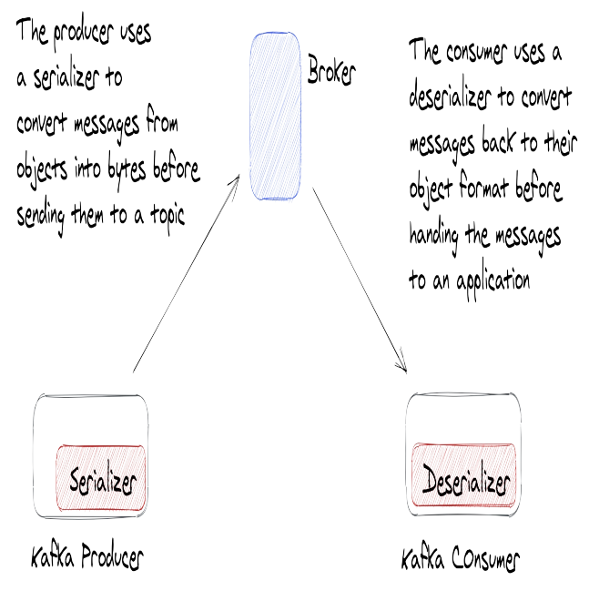
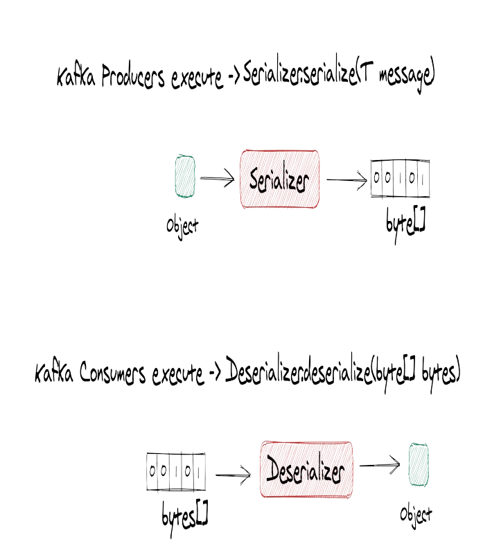
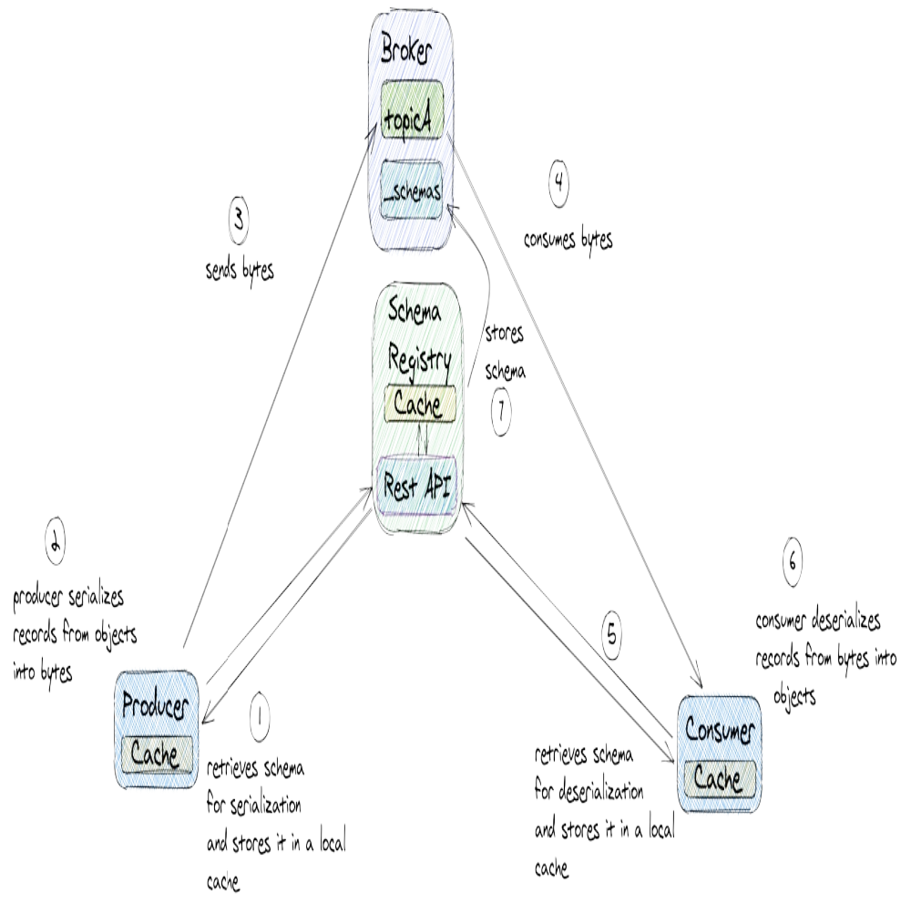

[[TOC]]

## Vấn đề khi serialize dữ liệu thành byte array.

Vì producer gửi tin nhắn qua network nên dữ liệu cần được serialize thành byte array trước khi gửi đi. Kafka Broker không thay đổi dữ liệu, nó chỉ lưu trữ nó lưu trữ chúng dưới dạng byte array.

Điều này cũng tương tự khi Broker response dữ liệu cho consumer, kafka broker lất các byte array từ disk và trả về cho consumer( Dữ liệu đã được serialized ).

Bởi vì chỉ làm việc với byte array nên Kafka không biết dữ liệu đó là gì, nó không biết dữ liệu đó là một chuỗi, một số nguyên, một object, ... Điều này rất tốt bởi vì nó giúp bất kỳ ứng dụng(Bất kỳ ngôn ngữ, chỉ cần triển khai giao thức giao tiếp với kafka) nào cũng có thể gửi và đọc dữ liệu Kafka.

Byte rất linh hoạt, nhưng nó cũng có nhược điểm, các nhà phát triển thường làm việc ở mức độ trừu tượng hóa cao hơn, họ muốn gửi dữ liệu dưới dạng object, struct, ... chứ không phải là byte array.

Vì vậy chuyển đổi dữ liệu từ object sang byte array là một bước được xảy ra ở đâu đó trong luồng hoạt động. (serialize ở producer và deserialize ở consumer).

## Schema Registry là gì?
 
Bởi vì cần serialize và deserialize dữ liệu nên cần một cơ chế để đảm bảo rằng producer và consumer đều serialize và deserialize dữ liệu theo cùng một cách.

Schema Registry là một component lưu trữ và quản lý schema và kiểm soát các schema của dữ liệu được gửi qua Kafka. Nó giúp đảm bảo tính tương thích giữa các phiên bản schema khác nhau khi dữ liệu được serialize và deserialize.

Schema Registry hỗ trợ serialization frameworks như AvRo, Protobuf, JSON, ...

### Cách Schema Registry hoạt động

Chúng ta sẽ nhanh chóng tìm hiểu cách hoạt động của Schema Registry thông qua ví dụ minh hoạ sau:

1. Khi producer thực hiện serialize dữ liệu, nó sẽ truy suất schema từ Schema Registry(Thông quá HTTP) và lưu nó vào cache

# REF:
- https://ibm-cloud-architecture.github.io/refarch-eda/technology/kafka-overview/
- **Kafka book**: [Kafka Event Streaming Platform In Action.pdf](/study/thanhlv-study-2024/static/Kafka%20Event%20Streaming%20Platform%20In%20Action.pdf)
